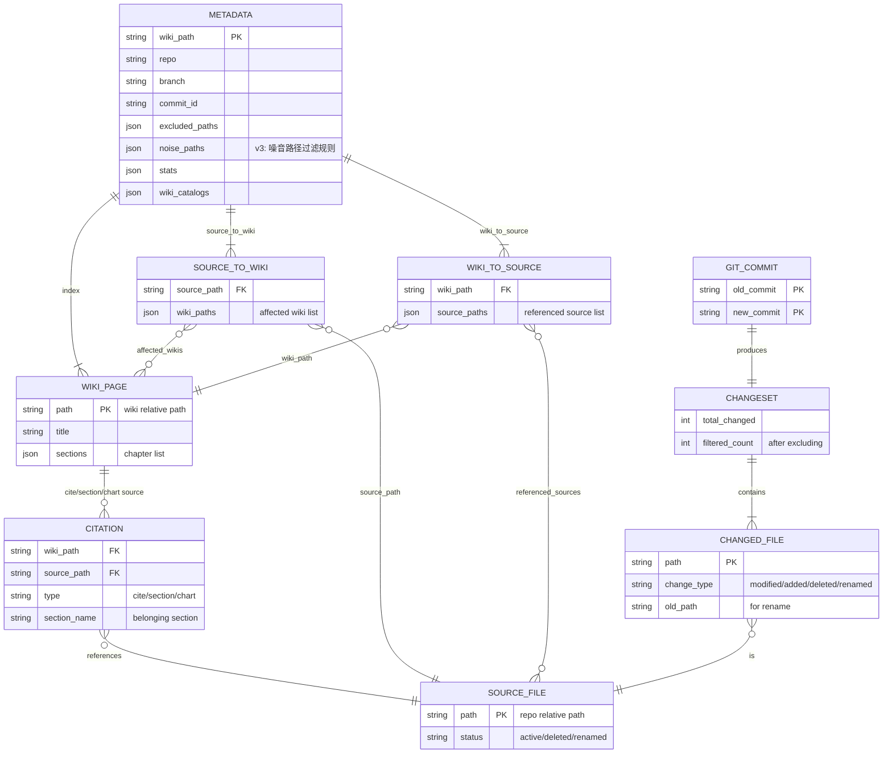
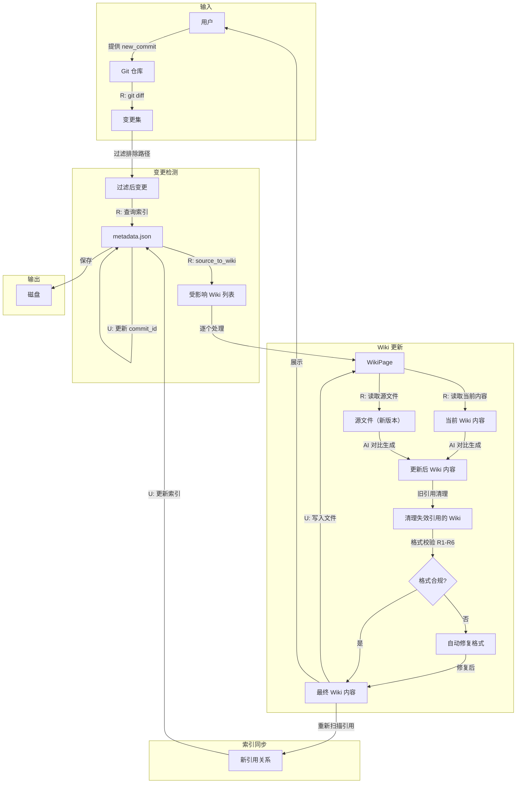
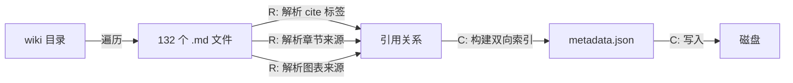
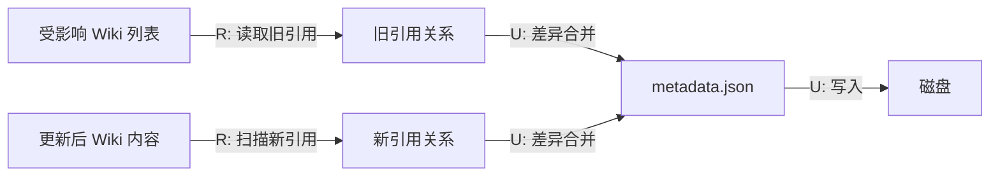
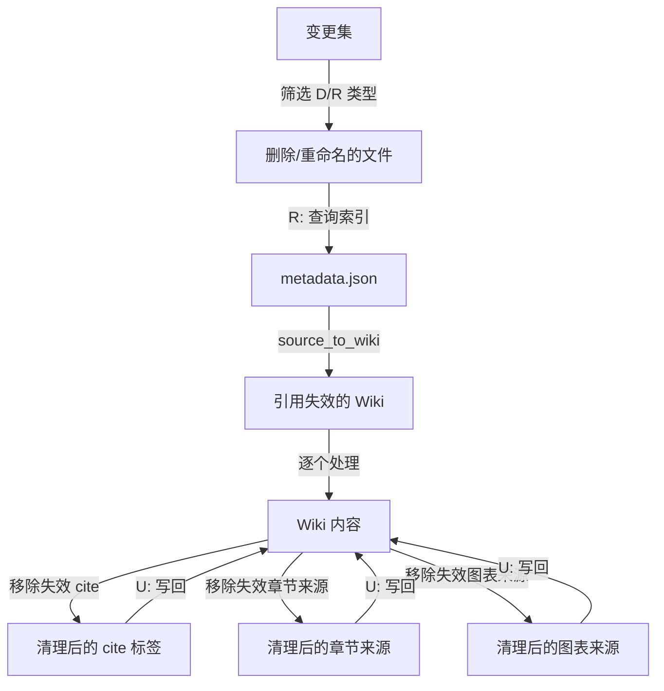
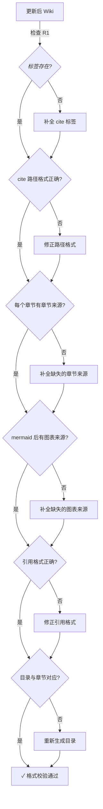
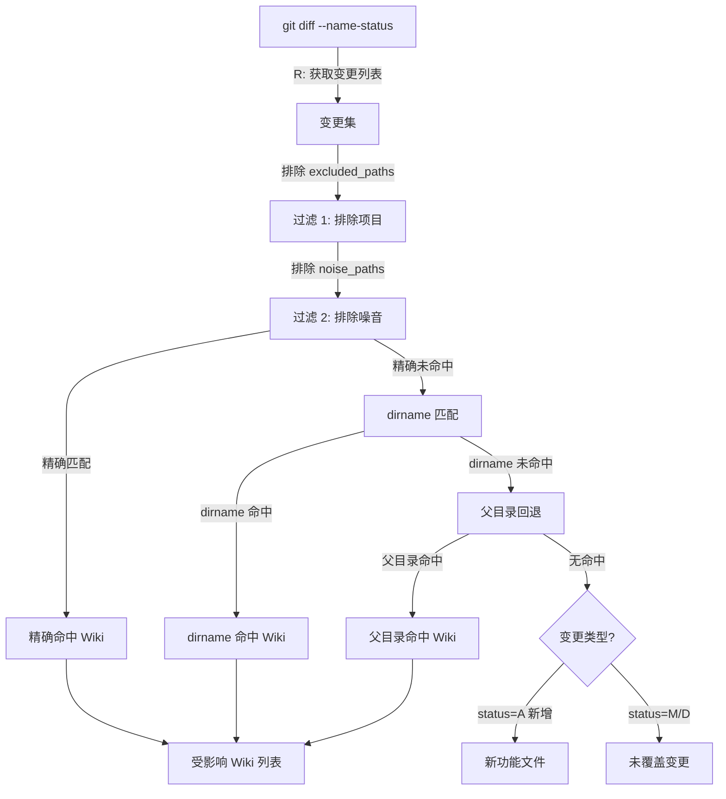

# 数据模型：Wiki增量更新Skill

> 场景类型：批处理 + 简单 CRUD（混合）
> 状态：已确认（v3 - 经评审修正：前缀回退算法精确化、noise_paths 语义明确化、格式校验与旧引用清理流程补全）

## 1. 场景分析

### 1.1 场景类型

| 操作 | 数据实体 | 场景类型 | 说明 |
|------|----------|----------|------|
| 索引构建 | metadata.json（双向索引） | 批处理 | 扫描 132 个 wiki 文件，提取引用关系 |
| 变更检测 | git diff 输出 + 索引 | 简单 CRUD | 读取 diff，查询索引，定位受影响 wiki |
| Wiki 增量更新 | wiki 页面 | 批处理 | 逐个处理受影响 wiki，AI 生成更新内容 |
| 索引同步 | metadata.json | 简单 CRUD | 更新 commit_id + 受影响 wiki 的引用关系 |

### 1.2 场景特征

- **单机运行**：同一时间只有一个 AI 在执行更新
- **低数据量**：392KB JSON + 132 个 md 文件
- **无并发冲突**：批处理串行执行
- **快速通道**：满足简单 CRUD + 批处理混合条件，跳过场景特定分析

## 2. 实体清单

| 实体 | 说明 | 来源 | 场景类型 |
|------|------|------|----------|
| **Metadata** | 中心索引文件（metadata.json），存储双向映射 + 元信息 | 需求描述 | 简单 CRUD |
| **WikiPage** | wiki 目录下的单个 .md 文件，含 `<cite>`、章节来源、图表来源 | 需求描述 | 批处理 |
| **SourceFile** | bk-monitor 仓库中的源代码文件（被 wiki 引用的） | 操作反推 | 批处理 |
| **GitCommit** | 用户指定的提交，包含 old_commit 和 new_commit | 需求描述 | 简单 CRUD |
| **ChangeSet** | 两次提交之间的变更文件集合（git diff 输出） | 操作反推 | 简单 CRUD |
| **Citation** | wiki 页面与源文件之间的引用关系（`<cite>`/章节来源/图表来源） | 事件溯源 | 批处理 |

## 3. ER 图



### 3.1 字段说明

| 实体 | 字段 | 类型 | 约束 | 说明 |
|------|------|------|------|------|
| METADATA | wiki_path | string | PK | wiki 目录路径 |
| METADATA | commit_id | string | 必填 | 当前索引对应的 commit |
| METADATA | excluded_paths | json | 必填 | 排除的目录列表（前缀匹配，如 `bklog/`） |
| METADATA | noise_paths | json | 必填 | v3: 噪音路径过滤规则（支持前缀 `^`、通配 `*/`、后缀 `*.` 语法） |
| METADATA | source_to_wiki | json | 必填 | 反向索引：源文件 -> wiki 列表 |
| METADATA | wiki_to_source | json | 必填 | 正向索引：wiki -> 源文件列表 |
| WIKI_PAGE | path | string | PK | wiki 相对路径，如 `告警系统设计/告警系统设计.md` |
| SOURCE_FILE | path | string | PK | 仓库相对路径，如 `bkmonitor/alarm_backends/README.md` |
| SOURCE_FILE | status | string | 必填 | active/deleted/renamed |
| CITATION | type | string | 必填 | cite / section_source / chart_source |
| CITATION | section_name | string | 可选 | 归属的章节名（仅 section_source/chart_source 有值） |
| GIT_COMMIT | old_commit | string | PK | 基准 commit（metadata.json 中记录的 commit_id） |
| GIT_COMMIT | new_commit | string | PK | 用户指定的目标 commit |
| CHANGED_FILE | change_type | string | 必填 | modified / added / deleted / renamed |
| CHANGED_FILE | old_path | string | 可选 | 仅 renamed 时有值 |

### 3.2 关系说明

| 关系 | 基数 | 说明 |
|------|------|------|
| METADATA - WIKI_PAGE | 1:N | 一个索引管理多个 wiki 页面 |
| WIKI_PAGE - CITATION | 1:N | 一个 wiki 页面包含多条引用（cite + 章节来源 + 图表来源） |
| CITATION - SOURCE_FILE | N:1 | 多条引用指向同一个源文件 |
| SOURCE_FILE - WIKI_PAGE（通过 SOURCE_TO_WIKI） | M:N | 一个源文件可被多个 wiki 引用 |
| GIT_COMMIT - CHANGESET | 1:1 | 一次提交对比产生一个变更集 |
| CHANGESET - CHANGED_FILE | 1:N | 一个变更集包含多个变更文件 |
| CHANGED_FILE - SOURCE_FILE | 1:1 | 一个变更文件对应一个源文件 |

## 4. 数据流图

### 4.1 主流程数据流



### 4.2 索引构建数据流（首次/全量）



### 4.3 增量索引更新数据流



### 4.4 旧引用清理数据流（v3 新增）

当源文件被删除（D）或重命名（R）时，wiki 中的旧引用需要清理：



**清理规则**：

| 源文件变更类型 | Wiki 引用处理 | 说明 |
|-------------|----------|------|
| 删除（D） | 从 `<cite>`、章节来源、图表来源中移除该文件条目 | 引用失效，直接移除 |
| 重命名（R） | 将引用路径更新为新路径 | 自动替换 old_path → new_path |
| 修改（M） | 无需清理引用，由 AI 更新章节内容 | 引用仍有效，内容需更新 |

### 4.5 格式校验数据流（v3 新增）

Wiki 更新后，必须通过格式规则校验才能写入：



**格式规则清单**（引用自需求文档 §7.2）：

| 规则 | 说明 | 校验方法 |
|------|------|----------|
| R1 | 文件开头必须有 `<cite>` 标签 | regex 匹配文件开头部分 |
| R2 | `<cite>` 中的路径必须是相对路径，不含 `file://` | 检查路径格式 |
| R3 | 每个 `##` 章节末尾必须有 `**章节来源**` | 解析章节结构，检查末尾标记 |
| R4 | 每个 mermaid 图表后必须有 `**图表来源**` | 匹配 ```mermaid 代码块后的标记 |
| R5 | 所有路径引用格式为 `[名称](file://相对路径)` | regex 校验引用格式 |
| R6 | 目录结构必须与实际章节对应 | 对比目录链接与 `##` 标题 |

### 4.6 数据流说明

| 流向 | 触发条件 | 操作 | 数据变化 | 备注 |
|------|----------|------|----------|------|
| Git 仓库 → 变更集 | 用户指定 new_commit | R | 获取 changed files 列表 | git diff --name-only |
| 变更集 → 过滤后变更 | 自动过滤 | R | 排除 excluded_paths + noise_paths | 保留有效变更 |
| 过滤后变更 → 索引查询 | 每个 changed file | R | 精确匹配 + dirname回退 + 父目录回退 | v3: 三级匹配策略 |
| 受影响 Wiki → 当前内容 | 处理每个 wiki | R | 读取当前 wiki 文件 | 保留手动编辑内容 |
| 源文件 → 新版本内容 | 处理每个 wiki | R | git show new_commit:path | 获取变更后的源文件 |
| AI 生成 → 更新后 Wiki | 对比分析 | C/U | 生成新 wiki 内容 | 保持格式规范 |
| 更新后 Wiki → 旧引用清理 | 源文件删除/重命名 | U | 移除失效 `<cite>`/章节来源/图表来源条目 | v3: 覆盖 D/R 类型变更 |
| 清理后 Wiki → 格式校验 | 自动校验 | R | 检查 R1-R6 格式规则 | v3: 确保格式一致性 |
| 格式不合规 → 自动修复 | 校验不通过 | U | 补全缺失的 `<cite>`、章节来源等 | v3: 修复后重新校验 |
| 最终 Wiki → 磁盘 | 写入文件 | U | 覆盖 wiki 文件 | 原子写入 |
| 更新后 Wiki → 新引用 | 扫描引用 | R | 提取新的 cite/章节来源/图表来源 | 用于更新索引 |
| 新引用 → 索引更新 | 差异合并 | U | 更新 source_to_wiki / wiki_to_source | 增量更新 |
| 索引 → commit_id | 同步版本 | U | 更新 metadata.source.commit_id | 标记同步完成 |

## 5. 待确认事项

| 编号 | 事项 | 影响范围 | 状态 |
|------|------|----------|------|
| DC-01 | 新增源文件（不在任何现有 wiki 中）是否需要新建 wiki 页面 | 索引构建流程 | 待确认 |
| DC-02 | 源文件删除后，wiki 中的引用是否自动移除还是标记为失效 | Wiki 更新逻辑 | 待确认 |
| DC-03 | 源文件重命名时，引用路径是否自动更新 | 索引更新逻辑 | 待确认 |
| DC-04 | 索引更新失败时是否需要回滚 wiki 文件变更 | 异常处理 | 待确认 |

## 6. Git Diff 实测验证（v2 新增，v3 补充）

### 6.1 测试方法

使用 `cb534ab480..839f899e15` 提交范围（约 60+ 文件变更）模拟增量更新流程。

### 6.2 实测数据

**变更集概况**：

| 指标 | 数值 |
|------|------|
| 总变更文件数 | ~60 |
| 排除 bklog/ 后 | ~55 |
| 排除 migrations/ tests/ 后 | ~35 |
| 精确匹配命中 wiki | 极少 |

**关键发现**：

1. **精确路径匹配覆盖率极低**：
   - `bkmonitor/alarm_backends/service/fta_action/issue_processor.py` → 无 wiki 引用
   - `bkmonitor/metadata/models/data_link/relation.py` → 无 wiki 引用
   - `bkmonitor/apm/models/shared_datasource.py` → 无 wiki 引用

2. **wiki 引用粒度与代码变更粒度不一致**：
   - Wiki 引用的是 `bkmonitor/metadata/models/data_link.py`（单文件）
   - 实际变更的是 `bkmonitor/metadata/models/data_link/relation.py`（目录内子文件）
   - 这两个路径不同，精确匹配会漏掉

3. **大量变更属于噪音文件**：
   - `migrations/` 目录：数据库迁移，wiki 通常不覆盖
   - `tests/` 目录：测试代码，wiki 通常不覆盖
   - `__init__.py` 导入变更：通常不影响 wiki 内容

### 6.3 设计修正

基于实测发现，对数据流设计做以下修正：

#### 修正 1：新增噪音路径过滤（noise_paths）

在 `excluded_paths` 基础上，增加 `noise_paths` 过滤层。**v3 修正：使用显式匹配语法，避免歧义**。

```json
{
  "excluded_paths": ["bklog/", "bkmonitor/webpack/"],
  "noise_paths": [
    "*/migrations/",
    "*/tests/",
    "*/__init__.py",
    "*.pyc",
    "^docs/"
  ]
}
```

**noise_paths 匹配语法规则（v3 明确定义）**：

| 语法 | 含义 | 示例 |
|------|------|------|
| `^前缀` | 路径前缀匹配（仅匹配路径开头） | `^docs/` 匹配 `docs/overview/x.md`，**不匹配** `metadata/docs/x.md` |
| `*/子路径/` | 路径中包含匹配 | `*/migrations/` 匹配 `bkmonitor/metadata/migrations/0001.py` |
| `*/文件名` | 文件名精确匹配 | `*/__init__.py` 匹配任意目录下的 `__init__.py` |
| `*.后缀` | 后缀匹配 | `*.pyc` 匹配所有 `.pyc` 文件 |

**为什么 `docs/` 改为 `^docs/`**：
- 原设计 `"docs/"` 语义不明确——如果是包含匹配，会误杀 `bkmonitor/metadata/docs/record_rule_v4.md`
- 实测发现 3 个 wiki 页面引用了 `docs/overview/` 下的文件，19 个 wiki 页面引用了 `ai-docs/` 下的文件
- 使用 `^docs/` 前缀匹配仅过滤仓库根目录下的 `docs/` 变更，不影响子目录中的 docs 文件夹

**处理顺序**：
```
变更文件 → 排除 excluded_paths（前缀匹配） → 排除 noise_paths（按语法匹配） → 索引查询
```

#### 修正 2：前缀回退匹配策略（v3 精确化）

当精确路径匹配失败时，使用 **dirname 匹配**算法进行目录级回退：

```
查找策略（优先级从高到低）：

1. 精确匹配：source_to_wiki[changed_file_path]
   → O(1) dict lookup

2. dirname 匹配（v3 明确定义）：
   a. 取 changed_file 的目录部分：changed_dir = dirname(changed_file_path)
   b. 遍历 source_to_wiki 的每个 key，取 keys_dir = dirname(key)
   c. 如果 changed_dir == keys_dir，视为命中
   → 即：变更文件与索引中的源文件在同一目录下

3. 父目录回退（兜底，仅当前两级均未命中时）：
   a. 取 changed_file 的父目录：parent_dir = dirname(dirname(changed_file_path))
   b. 遍历 source_to_wiki 的 key，如果 dirname(key).startswith(parent_dir)，视为命中
   → 例：changed = "data_link/relation.py"，parent = "data_link"
         key = "metadata/models/data_link.py" → dirname = "metadata/models"
         startswith("metadata/models/data_link") → 命中
```

**v3 实测验证**（`cb534ab480..839f899e15` 区间）：

| 匹配级别 | 命中文件数 | 示例 |
|---------|----------|------|
| 精确匹配 | 8 | `metadata/models/result_table.py` → 6 个 wiki |
| dirname 匹配 | +12 | `metadata/models/data_link/relation.py` → `data_link.py` 同目录命中 |
| 父目录回退 | +6 | `apm/models/shared_datasource.py` → `apm/models` 目录级命中 |
| 完全未覆盖 | 15 | 其中 6 个新增文件 + 9 个深层子目录文件 |

**注意**：dirname 匹配和父目录回退都是模糊匹配，可能产生误报。需要在 dry-run 输出中标注匹配级别（`[精确]` / `[dirname]` / `[父目录]`），供用户审核。

#### 修正 3：变更分类输出（v3 扩展为四类）

dry-run 输出应将变更分为四类：

| 分类 | 说明 | 处理方式 |
|------|------|----------|
| 精确命中 | changed_file 在 source_to_wiki 中有精确匹配 | 直接更新对应 wiki |
| 模糊命中 | changed_file 通过 dirname/父目录回退关联到 wiki | 标记 `[dirname]` 或 `[父目录]`，建议用户审核 |
| 新功能文件 | git status 为 A（新增）且不被任何现有 wiki 引用 | 标记 `[新功能]`，AI 判断是否需要新建 wiki 页面 |
| 无命中 | changed_file（M/D 类型）不被任何 wiki 引用 | 输出到「未覆盖变更」列表，供用户判断 |

### 6.4 修正后数据流图（变更检测部分，v3 更新）



## 7. v3 变更记录

基于评审发现的 5 个问题，v3 做了以下修正：

| 优先级 | 问题 | 修正内容 | 影响章节 |
|--------|------|----------|----------|
| P0 | 前缀回退算法描述不够精确 | 明确定义为三级匹配：精确 → dirname → 父目录回退，每级算法明确定义 | §6.3 修正2、§6.4 |
| P0 | noise_paths 中 `docs/` 匹配语义未定义 | 引入显式匹配语法（`^前缀`、`*/子路径/`、`*.后缀`），`docs/` 改为 `^docs/` | §6.3 修正1、§3 ER图 |
| P1 | 变更分类缺少“新功能文件”类别 | 从三类扩展为四类，新增“新功能文件”（status=A 且无 wiki 引用） | §6.3 修正3、§6.4 |
| P1 | 格式规范校验缺少显式数据流节点 | 新增 §4.5 格式校验数据流，包含 R1-R6 完整校验链 | §4.1、§4.5 |
| P2 | 旧引用清理的数据流缺失 | 新增 §4.4 旧引用清理数据流，覆盖 D/R 类型变更 | §4.1、§4.4 |

**v3 实测数据补充**（`cb534ab480..839f899e15` 区间，41 个过滤后文件）：

| 指标 | v2 数值 | v3 数值 | 说明 |
|------|---------|---------|------|
| 精确匹配 | 8 (19.5%) | 8 (19.5%) | 不变 |
| dirname 匹配 | 未区分 | +12 (29.3%) | v3 新增的中间层 |
| 父目录回退 | 未区分 | +6 (14.6%) | 原“前缀回退”拆分 |
| 新功能文件 | 未区分 | 6 (14.6%) | v3 新增分类 |
| 无命中 | 15 (36.6%) | 9 (22.0%) | 去除新功能文件后 |
