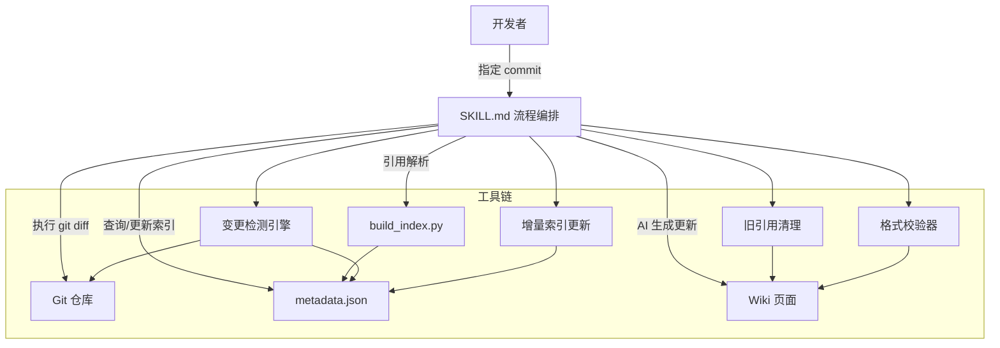
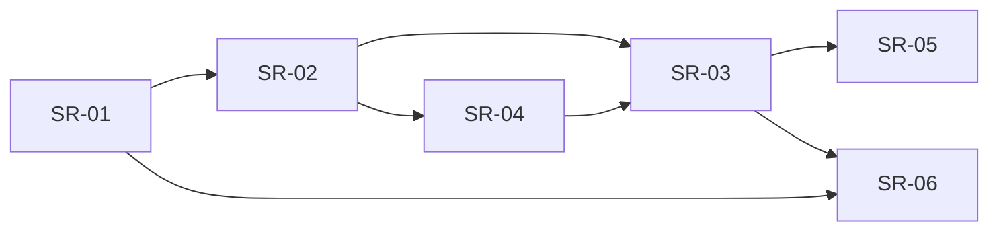

# Wiki 增量更新 Skill 技术设计

> 本文档为设计总览，子需求详细设计见下方索引。

## 1. 设计目标

通过 metadata.json 双向索引 + git diff pathspec 排除 + 三级匹配策略，实现 wiki 的半自动化增量更新，保持 wiki 与源代码同步。

## 2. 架构总览

## 3. 子需求清单

| 子需求 | 优先级 | 前置依赖 | 实现形态 | 设计文档 |
|--------|--------|----------|----------|----------|
| SR-01: 索引构建工具 | P0 | 无 | Python 脚本 | [SR-01-index-builder.md](SR-01-index-builder.md) |
| SR-02: 变更检测与匹配引擎 | P0 | SR-01 | Python 脚本 | [SR-02-change-detection.md](SR-02-change-detection.md) |
| SR-03: 增量更新 Skill | P0 | SR-01, SR-02 | SKILL.md 指令 | [SR-03-incremental-skill.md](SR-03-incremental-skill.md) |
| SR-04: 旧引用清理 | P1 | SR-02 | Python 函数 | [SR-04-citation-cleanup.md](SR-04-citation-cleanup.md) |
| SR-05: 格式校验与修复 | P1 | SR-03 | Python 函数 | [SR-05-format-validation.md](SR-05-format-validation.md) |
| SR-06: 增量索引更新 | P2 | SR-01, SR-03 | Python 函数 | [SR-06-incremental-index.md](SR-06-incremental-index.md) |

## 4. 依赖关系

## 5. 实施路线

| 阶段 | 子需求 | 产出 | 目标 |
|------|--------|------|------|
| 阶段 1 | SR-01 → SR-02 → SR-03 | 最小可用版本 | 核心链路跑通 |
| 阶段 2 | SR-04 → SR-05 | 质量保障 | 叠加引用清理 + 格式校验 |
| 阶段 3 | SR-06 | 性能优化 | 增量索引替代全量重建 |

## 6. 关键设计决策

| 决策项 | 选择 | 理由 | 来源 |
|--------|------|------|------|
| 排除路径实现 | git pathspec `:!` 语法 | 在 git 层面过滤，无需后处理，实测验证等价 | SR-02 |
| 匹配策略 | 三级：精确 → dirname → 父目录 | 解决引用粒度与代码变更粒度不一致问题 | SR-02 |
| 索引存储 | 单 JSON 文件 | 392KB 无需拆分，orjson 解析 0.78ms | SR-01 |
| 格式校验 | R1-R6 规则链 + 自动修复 | 确保更新后 wiki 格式一致 | SR-05 |
| 目录锚点 | 保留中文文本锚点（如 `#简介`） | 实测现有 wiki 全部使用中文锚点，非 GitHub 式 slug | SR-05 |
| 引用清理替换 | 正则限定替换（非全局 replace） | 避免误伤正文中同名文本 | SR-04 |
| 索引更新副作用 | deepcopy 输入 dict | 避免修改调用方原始数据 | SR-06 |
| 引用层级区分 | cite=文档级，章节来源=章节级 | Citation.type + section_name 保留区分信息 | SR-01 |

## 7. 关联文档

| 文档 | 路径 | 说明 |
|------|------|------|
| 需求挖掘报告 | [requirement.md](../requirement.md) | 需求定义与验收标准 |
| 数据流设计 | [data-flow.md](data-flow.md) | ER 图 + 数据流图（v3） |
