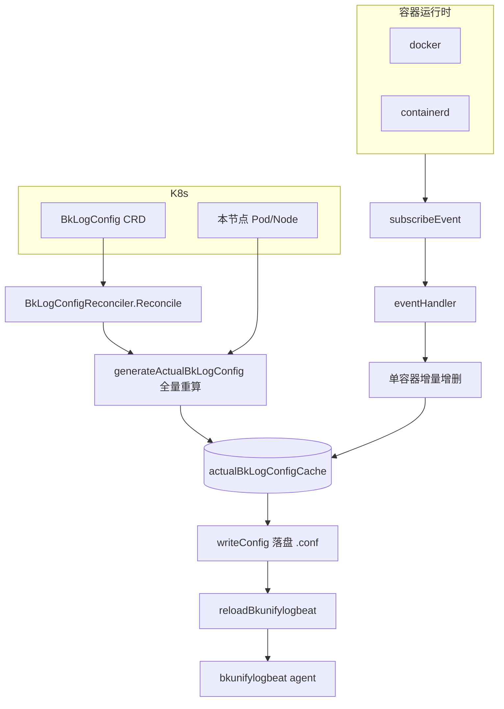
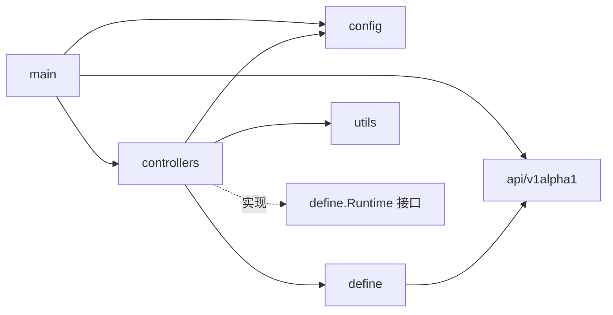

<!-- [待审核] AI 自动生成，请人工确认后移除此标记 -->
# 概览与架构

<cite>
**本文引用的文件**
- [main.go](file://bkmonitor-datalink/pkg/bk-log-sidecar/main.go)
- [bklog_sidecar.go](file://bkmonitor-datalink/pkg/bk-log-sidecar/controllers/bklog_sidecar.go)
- [bklogconfig_controller.go](file://bkmonitor-datalink/pkg/bk-log-sidecar/controllers/bklogconfig_controller.go)
- [runtime.go](file://bkmonitor-datalink/pkg/bk-log-sidecar/define/runtime.go)
</cite>

## 目录
1. [简介](#简介)
2. [项目结构](#项目结构)
3. [核心组件](#核心组件)
4. [架构总览](#架构总览)
5. [组件详细分析](#组件详细分析)
6. [依赖关系分析](#依赖关系分析)
7. [结论](#结论)

## 简介

`bk-log-sidecar` 是蓝鲸日志平台的 **Kubernetes 日志采集边车 Operator**，基于 `controller-runtime` 构建。它以 DaemonSet 方式运行在每个节点上，核心职责是：

- 监听自定义资源 `BkLogConfig`（CRD），根据其中的选择器（标签/注解/命名空间/工作负载/容器名）匹配本节点上的容器与节点级采集目标；
- 将匹配结果渲染成 `bkunifylogbeat`（实际的日志采集 agent）子配置文件并落盘；
- 同时订阅容器运行时（docker/containerd）的容器生命周期事件，做配置的增量热更新；
- 每次配置变更后通知 `bkunifylogbeat` 重新加载。

整个模块本质上是一个"**期望状态（BkLogConfig）+ 实际状态（节点容器）→ 渲染采集配置**"的协调器，采集能力本身由外部的 `bkunifylogbeat` 完成，本模块只负责"配置的生成与维护"。

**章节来源**
- [main.go](file://bkmonitor-datalink/pkg/bk-log-sidecar/main.go#L46-L121)
- [bklog_sidecar.go](file://bkmonitor-datalink/pkg/bk-log-sidecar/controllers/bklog_sidecar.go#L42-L77)

## 项目结构

模块位于 `bkmonitor-datalink/pkg/bk-log-sidecar`，按职责分层：

| 目录 | 职责 |
|------|------|
| `main.go` | 程序入口：注册 Scheme、构造 Manager（含节点级 cache 选择器）、装配 Reconciler 与 BkLogSidecar、启动信号处理 |
| `api/bk.tencent.com/v1alpha1/` | `BkLogConfig` CRD 类型定义与 Scheme 注册 |
| `controllers/` | 协调器（`BkLogConfigReconciler`）、核心边车逻辑（`BkLogSidecar`）、容器运行时实现、缓存、平台适配 |
| `define/` | 领域模型与配置渲染：`Runtime` 接口、`Container`/`ContainerEvent`、`LogConfigType` 及 `bkunifylogbeat` 配置结构 |
| `config/` | 命令行参数与常量 |
| `utils/` | 通用工具（k8s 元数据、docker 版本、指标、版本比较等） |

**章节来源**
- [main.go](file://bkmonitor-datalink/pkg/bk-log-sidecar/main.go#L11-L32)
- [bklog_sidecar.go](file://bkmonitor-datalink/pkg/bk-log-sidecar/controllers/bklog_sidecar.go#L11-L35)

## 核心组件

模块在 `main` 中装配两大运行时组件，二者共享同一个节点视图：

### BkLogConfigReconciler（事件驱动的协调器）

`BkLogConfigReconciler` 是标准的 controller-runtime 协调器，`For(&BkLogConfig{})` 监听 CRD 的增删改，把"配置定义的变化"翻译为"重新生成采集配置"。它持有 `BkLogSidecar` 引用，实际工作委托给后者。

### BkLogSidecar（节点级采集配置引擎）

`BkLogSidecar` 是真正的业务核心，维护本节点的容器缓存与实际采集配置缓存，负责：容器缓存刷新、容器事件订阅、配置生成/落盘/清理、通知 agent 重载。其结构体字段说明了它的状态：

```go
type BkLogSidecar struct {
	sync.RWMutex
	runtime                define.Runtime   // 容器运行时抽象
	kubeClient             cache.Cache      // 节点范围的 k8s 缓存客户端
	containerCache         sync.Map         // 容器 ID -> *Container
	currentNodeInfo        corev1.Node      // 当前节点信息
	actualBkLogConfigCache sync.Map         // 实际配置名 -> LogConfigType
	log                    logr.Logger
	stopCh                 chan struct{}
}
```

**章节来源**
- [bklog_sidecar.go](file://bkmonitor-datalink/pkg/bk-log-sidecar/controllers/bklog_sidecar.go#L42-L86)
- [bklogconfig_controller.go](file://bkmonitor-datalink/pkg/bk-log-sidecar/controllers/bklogconfig_controller.go#L27-L74)

## 架构总览

模块有两条数据流汇聚到同一份"实际配置缓存"，再统一落盘并触发 agent 重载：

1. **CRD 驱动**：`BkLogConfig` 变更 → `Reconcile` → 删除旧配置 + `generateActualBkLogConfig()` 全量重算；
2. **容器事件驱动**：运行时上报容器 create/stop/delete → `eventHandler` → 针对单容器增量增删配置。



**图表来源**
- [bklog_sidecar.go](file://bkmonitor-datalink/pkg/bk-log-sidecar/controllers/bklog_sidecar.go#L115-L164)
- [bklog_sidecar.go](file://bkmonitor-datalink/pkg/bk-log-sidecar/controllers/bklog_sidecar.go#L224-L262)
- [bklogconfig_controller.go](file://bkmonitor-datalink/pkg/bk-log-sidecar/controllers/bklogconfig_controller.go#L46-L67)

**章节来源**
- [bklog_sidecar.go](file://bkmonitor-datalink/pkg/bk-log-sidecar/controllers/bklog_sidecar.go#L115-L164)
- [bklog_sidecar.go](file://bkmonitor-datalink/pkg/bk-log-sidecar/controllers/bklog_sidecar.go#L224-L262)

## 组件详细分析

### 启动装配（main）

`init()` 先把 `client-go` 内置类型与 `BkLogConfig` 类型注册进全局 `scheme`，并调用 `config.FlagInit()` 完成命令行参数初始化。

```go
func init() {
	utilruntime.Must(clientgoscheme.AddToScheme(scheme))
	utilruntime.Must(bluekingv1alpha1.AddToScheme(scheme))
	config.FlagInit()
}
```

`main()` 的关键设计是**用节点名把 Manager 的 cache 限定到本节点**：为 `Pod` 按 `spec.nodeName`、为 `Node` 按 `metadata.name` 建立字段选择器，节点名取自环境变量 `config.CurrentNodeNameKey`。这样每个边车只 watch 自己节点的资源，避免全集群 list/watch 带来的开销。

```go
NewCache: cache.BuilderWithOptions(cache.Options{
	SelectorsByObject: cache.SelectorsByObject{
		&corev1.Pod{}:  {Field: fields.SelectorFromSet(fields.Set{"spec.nodeName": os.Getenv(config.CurrentNodeNameKey)})},
		&corev1.Node{}: {Field: fields.SelectorFromSet(fields.Set{"metadata.name": os.Getenv(config.CurrentNodeNameKey)})},
	},
}),
```

随后：先 `NewBkLogSidecar(mgr)`，再把它注入 `BkLogConfigReconciler` 并 `SetupWithManager`；用 `mgr.Add(bkLogSidercar)` 将边车作为 `Runnable` 交给 Manager 管理其生命周期；可选开启 pprof（`config.HttpProf`）；最后 `mgr.Start(ctx)` 阻塞运行，`ctx.Done()` 后调用 `bkLogSidercar.Stop()` 优雅退出。

**章节来源**
- [main.go](file://bkmonitor-datalink/pkg/bk-log-sidecar/main.go#L39-L121)

### 边车生命周期（Start/Stop）

`BkLogSidecar` 实现了 controller-runtime 的 `Runnable` 接口。`Start` 是被 Manager 调起的入口，按序完成三件事：

```go
func (s *BkLogSidecar) Start(_ context.Context) error {
	s.initContainerCache()        // 首次刷新容器缓存 + 启动周期刷新协程
	s.initEventHandler()          // 启动容器事件订阅协程
	s.generateActualBkLogConfig() // 首次全量生成采集配置
	return nil
}
```

`getRuntime()` 采用**懒加载**：首次使用时先 `refreshNodeInfo()` 读取本节点信息，再根据节点上报的 `ContainerRuntimeVersion` 通过 `NewRuntime` 选择 docker 或 containerd 实现。`Stop` 仅关闭 `stopCh`，用于通知周期刷新等协程退出。

**章节来源**
- [bklog_sidecar.go](file://bkmonitor-datalink/pkg/bk-log-sidecar/controllers/bklog_sidecar.go#L64-L113)

### 两条数据流的分工

- **全量路径 `generateActualBkLogConfig`**：遍历本节点所有容器生成容器级/标准输出级配置，再遍历所有 `BkLogConfig` 匹配节点级配置，统一写入 `actualBkLogConfigCache`；随后 `deleteInvalidConfig()` 清理磁盘上不再有效的 `.conf` 文件、`writeConfig()` 落盘、`reloadBkunifylogbeat()` 通知重载。
- **增量路径 `eventHandler`**：按事件类型分派——`create` 走 `startActionHandler`（对新容器从头采集）、`stop`/`delete` 走延迟清理（`DelayCleanConfig` 秒后删配置再重载），避免容器短暂重启导致日志丢采。

两条路径最终都作用于同一份 `actualBkLogConfigCache`，保证磁盘配置与期望状态一致。匹配与生成的细节见《04-配置生成与匹配引擎》，事件驱动细节见《06-容器运行时与事件驱动》。

**章节来源**
- [bklog_sidecar.go](file://bkmonitor-datalink/pkg/bk-log-sidecar/controllers/bklog_sidecar.go#L115-L164)
- [bklog_sidecar.go](file://bkmonitor-datalink/pkg/bk-log-sidecar/controllers/bklog_sidecar.go#L248-L329)

## 依赖关系分析

- `main` 依赖 `controllers`（装配 Reconciler/Sidecar）、`config`（参数）、`api/v1alpha1`（Scheme 注册）。
- `controllers.BkLogSidecar` 依赖 `define.Runtime` 抽象（解耦 docker/containerd 具体实现）、`define.LogConfigType`（配置渲染）、`utils`（k8s 元数据与错误处理）、`config`（路径与常量）。
- `BkLogConfigReconciler` 依赖 `BkLogSidecar`，仅做"事件 → 重算"的转译，不直接接触运行时。
- 领域层 `define.Runtime` 接口是关键解耦点：上层只面向接口编程，具体 runtime 由 `NewRuntime` 按节点运行时版本注入。



**图表来源**
- [main.go](file://bkmonitor-datalink/pkg/bk-log-sidecar/main.go#L13-L32)
- [bklog_sidecar.go](file://bkmonitor-datalink/pkg/bk-log-sidecar/controllers/bklog_sidecar.go#L13-L35)
- [runtime.go](file://bkmonitor-datalink/pkg/bk-log-sidecar/define/runtime.go#L72-L82)

**章节来源**
- [bklog_sidecar.go](file://bkmonitor-datalink/pkg/bk-log-sidecar/controllers/bklog_sidecar.go#L79-L86)
- [runtime.go](file://bkmonitor-datalink/pkg/bk-log-sidecar/define/runtime.go#L72-L82)

## 结论

`bk-log-sidecar` 通过 controller-runtime 将"CRD 期望状态"与"节点容器实际状态"协调为 `bkunifylogbeat` 的采集配置文件，采用**节点级 cache 隔离 + 全量协调 + 事件增量**双通道设计，兼顾一致性与实时性。理解本模块应从两条数据流入手：CRD 变更触发全量重算，容器事件触发增量增删，二者汇聚到 `actualBkLogConfigCache` 后统一落盘并重载 agent。后续各篇分别深入 CRD 模型、配置渲染、匹配引擎、缓存与运行时等细节。

**章节来源**
- [main.go](file://bkmonitor-datalink/pkg/bk-log-sidecar/main.go#L46-L121)
- [bklog_sidecar.go](file://bkmonitor-datalink/pkg/bk-log-sidecar/controllers/bklog_sidecar.go#L64-L164)
