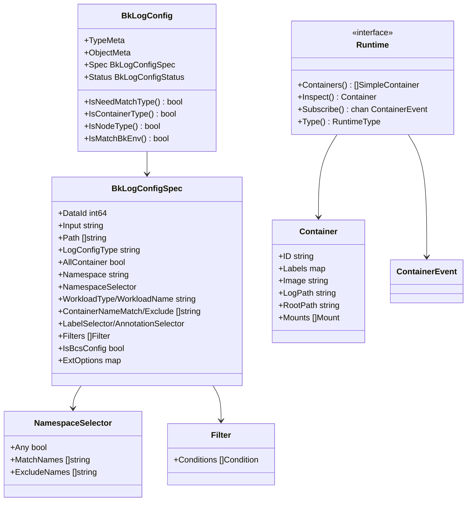

<!-- [待审核] AI 自动生成，请人工确认后移除此标记 -->
# CRD 与领域模型

<cite>
**本文引用的文件**
- [bklogconfig_types.go](file://bkmonitor-datalink/pkg/bk-log-sidecar/api/bk.tencent.com/v1alpha1/bklogconfig_types.go)
- [groupversion_info.go](file://bkmonitor-datalink/pkg/bk-log-sidecar/api/bk.tencent.com/v1alpha1/groupversion_info.go)
- [runtime.go](file://bkmonitor-datalink/pkg/bk-log-sidecar/define/runtime.go)
</cite>

## 目录
1. [简介](#简介)
2. [项目结构](#项目结构)
3. [核心组件](#核心组件)
4. [架构总览](#架构总览)
5. [组件详细分析](#组件详细分析)
6. [依赖关系分析](#依赖关系分析)
7. [结论](#结论)

## 简介

本篇阐述 `bk-log-sidecar` 的领域模型，分两部分：

1. **`BkLogConfig` CRD**：用户声明"采什么日志、采哪些容器/节点"的期望状态，是整个模块的输入契约；
2. **运行时领域模型**：`Container`/`SimpleContainer`/`Mount`/`ContainerEvent`/`RuntimeType` 以及 `Runtime` 接口，是模块对"节点上容器实际状态"的抽象。

CRD 的三种 `logConfigType`（标准输出/容器内文件/节点文件）决定了后续走哪套渲染逻辑；`BkLogConfig` 上的一组判定方法（`IsNeedMatchType`/`IsContainerType`/`IsNodeType`/`IsMatchBkEnv`）则是匹配引擎的第一道分流。

**章节来源**
- [bklogconfig_types.go](file://bkmonitor-datalink/pkg/bk-log-sidecar/api/bk.tencent.com/v1alpha1/bklogconfig_types.go#L23-L73)
- [runtime.go](file://bkmonitor-datalink/pkg/bk-log-sidecar/define/runtime.go#L17-L82)

## 项目结构

领域模型分布在两处：

| 位置 | 内容 |
|------|------|
| `api/bk.tencent.com/v1alpha1/bklogconfig_types.go` | `BkLogConfig` / `BkLogConfigSpec` / `BkLogConfigStatus` / `Filter` / `Condition` / `NamespaceSelector` / `MultilineConfig` 及判定方法 |
| `api/bk.tencent.com/v1alpha1/groupversion_info.go` | GroupVersion、SchemeBuilder、AddToScheme 注册入口 |
| `define/runtime.go` | `Container` / `SimpleContainer` / `Mount` / `ContainerEvent` / `ContainerEventType` / `RuntimeType` / `Runtime` 接口 |

**章节来源**
- [bklogconfig_types.go](file://bkmonitor-datalink/pkg/bk-log-sidecar/api/bk.tencent.com/v1alpha1/bklogconfig_types.go#L11-L18)
- [groupversion_info.go](file://bkmonitor-datalink/pkg/bk-log-sidecar/api/bk.tencent.com/v1alpha1/groupversion_info.go#L11-L25)

## 核心组件

- **`BkLogConfig`**：CRD 顶层对象，`Namespaced` 作用域，含 `Spec` 与 `Status`（Status 目前为空占位）。
- **`BkLogConfigSpec`**：采集参数 + 匹配规则的集合。
- **类型判定方法**：`IsNeedMatchType`/`IsContainerType`/`IsNodeType`/`IsMatchBkEnv`。
- **运行时模型**：`Container`（容器详情）、`SimpleContainer`（仅 ID）、`Mount`（挂载映射）、`ContainerEvent`（生命周期事件）、`RuntimeType`（运行时枚举）、`Runtime`（运行时接口）。

**章节来源**
- [bklogconfig_types.go](file://bkmonitor-datalink/pkg/bk-log-sidecar/api/bk.tencent.com/v1alpha1/bklogconfig_types.go#L110-L157)
- [runtime.go](file://bkmonitor-datalink/pkg/bk-log-sidecar/define/runtime.go#L17-L82)

## 架构总览



**图表来源**
- [bklogconfig_types.go](file://bkmonitor-datalink/pkg/bk-log-sidecar/api/bk.tencent.com/v1alpha1/bklogconfig_types.go#L24-L125)
- [runtime.go](file://bkmonitor-datalink/pkg/bk-log-sidecar/define/runtime.go#L33-L82)

**章节来源**
- [bklogconfig_types.go](file://bkmonitor-datalink/pkg/bk-log-sidecar/api/bk.tencent.com/v1alpha1/bklogconfig_types.go#L24-L125)
- [runtime.go](file://bkmonitor-datalink/pkg/bk-log-sidecar/define/runtime.go#L33-L82)

## 组件详细分析

### BkLogConfigSpec 字段语义

`BkLogConfigSpec` 混合了两类字段：**采集行为参数**与**匹配规则**。

采集行为参数（最终映射到 `bkunifylogbeat` 的 `Local`）：

| 字段 | 含义 |
|------|------|
| `DataId` | 上报数据 ID |
| `Input` | 采集 input 类型（未设时按配置类型给默认值） |
| `Path` / `ExcludeFiles` | 采集路径与排除路径 |
| `Encoding` / `ScanFrequency` / `CloseInactive` / `IgnoreOlder` / `CleanInactive` | 采集器行为调优 |
| `Multiline` | 多行日志聚合（pattern/maxLines/timeout） |
| `Package` / `PackageCount` | 是否打包上报及条数 |
| `Delimiter` | 分隔符 |
| `Filters` | 过滤规则（`Filter`→`Condition`：index/key/op） |
| `ExtMeta` | 附加元数据 |
| `ExtOptions` | 透传的原始扩展配置（`RawExtension`，直接渲染进子配置） |

匹配规则字段：

| 字段 | 含义 |
|------|------|
| `LogConfigType` | 三选一：`std_log_config` / `container_log_config` / `node_log_config` |
| `AllContainer` | 为真时直接匹配所有容器（跳过标签/工作负载等细粒度匹配） |
| `Namespace`（不推荐） / `NamespaceSelector` | 命名空间匹配，后者支持 `Any`/`MatchNames`/`ExcludeNames` |
| `WorkloadType` / `WorkloadName` | 工作负载类型/名称匹配（名称支持正则） |
| `ContainerNameMatch` / `ContainerNameExclude` | 容器名白/黑名单 |
| `LabelSelector` / `AnnotationSelector` | 标准 k8s 标签/注解选择器 |
| `AddPodLabel` / `AddPodAnnotation` | 是否把 Pod 标签/注解注入元数据 |
| `IsBcsConfig` | 标记配置从 BCS 迁移，走兼容渲染分支 |

注意 `TailFiles` 字段带 `json:"-"`，不由用户在 CRD 中声明，而是运行时按"是否新增容器"动态设置。

**章节来源**
- [bklogconfig_types.go](file://bkmonitor-datalink/pkg/bk-log-sidecar/api/bk.tencent.com/v1alpha1/bklogconfig_types.go#L24-L102)

### 类型判定与环境过滤

`BkLogConfig` 上四个判定方法构成匹配引擎的前置分流：

```go
func (b *BkLogConfig) IsNeedMatchType() bool {
	return b.Spec.LogConfigType == config.ContainerLogConfig || b.Spec.LogConfigType == config.StdLogConfig
}
func (b *BkLogConfig) IsContainerType() bool { return b.Spec.LogConfigType == config.ContainerLogConfig }
func (b *BkLogConfig) IsNodeType() bool      { return b.Spec.LogConfigType == config.NodeLogConfig }
func (b *BkLogConfig) IsMatchBkEnv() bool    { return b.Labels[config.BkEnvLabelName] == config.BkEnv }
```

- `IsNeedMatchType`：只有标准输出与容器内文件两类需要走"容器匹配"流程；节点级配置不参与容器匹配。
- `IsContainerType` / `IsNodeType`：决定生成 `ContainerLogConfig` 还是 `NodeLogConfig`，进而走不同渲染。
- `IsMatchBkEnv`：**环境隔离**关键。当边车设置了 `bk-env` 时只处理带相同 `bkEnv` 标签的 CR；未设置时只处理未设或空值 `bkEnv` 的 CR，避免多环境配置串扰。该判定在 `bkLogConfigList()` 拉取阶段就完成过滤。

**章节来源**
- [bklogconfig_types.go](file://bkmonitor-datalink/pkg/bk-log-sidecar/api/bk.tencent.com/v1alpha1/bklogconfig_types.go#L136-L157)

### 运行时领域模型

`define/runtime.go` 定义了模块对容器世界的抽象：

- `SimpleContainer{ID}`：列举容器时的轻量结构，只带 ID；
- `Container{ID, Labels, Image, LogPath, RootPath, Mounts}`：`Inspect` 后的完整信息，`Labels` 承载 k8s 元数据（命名空间、Pod 名、容器名等），`LogPath` 为标准输出路径，`RootPath` 为容器根目录（用于容器内文件采集的路径前缀），`Mounts` 为挂载映射；
- `Mount{HostPath, ContainerPath}`：容器路径到宿主路径的映射，是容器内文件采集能落到宿主机的关键；
- `ContainerEvent{ContainerID, Type}` 与 `ContainerEventType`（`create`/`stop`/`delete`）：统一后的容器生命周期事件；
- `RuntimeType`（`containerd`/`docker`/`eks`）：运行时类型枚举，影响标准输出的 CRI 解析开关。

`Runtime` 接口把不同运行时收敛为四个方法：

```go
type Runtime interface {
	Containers(ctx context.Context) ([]SimpleContainer, error)
	Inspect(ctx context.Context, containerID string) (Container, error)
	Subscribe(ctx context.Context) (ch <-chan *ContainerEvent, errs <-chan error)
	Type() RuntimeType
}
```

这一抽象让上层 `BkLogSidecar` 完全不感知 docker 与 containerd 的差异，具体实现见《06-容器运行时与事件驱动》。

**章节来源**
- [runtime.go](file://bkmonitor-datalink/pkg/bk-log-sidecar/define/runtime.go#L17-L82)

### Scheme 注册

`groupversion_info.go` 定义了 GroupVersion `bk.tencent.com/v1alpha1` 与 `SchemeBuilder`，`AddToScheme` 作为对外注册入口（在 `main.init` 中被调用）。`addKnownTypes` 显式注册 `BkLogConfig` 与 `BkLogConfigList`，`bklogconfig_types.go` 的 `init()` 也通过 `SchemeBuilder.Register` 完成同样注册，保证类型进入运行时 Scheme。

**章节来源**
- [groupversion_info.go](file://bkmonitor-datalink/pkg/bk-log-sidecar/api/bk.tencent.com/v1alpha1/groupversion_info.go#L27-L50)
- [bklogconfig_types.go](file://bkmonitor-datalink/pkg/bk-log-sidecar/api/bk.tencent.com/v1alpha1/bklogconfig_types.go#L159-L161)

## 依赖关系分析

- `BkLogConfigSpec` 的类型判定依赖 `config` 包中的常量（`ContainerLogConfig`/`StdLogConfig`/`NodeLogConfig`/`BkEnvLabelName`/`BkEnv`），常量定义见《08-配置与命令行参数》。
- 运行时模型 `Container`/`ContainerEvent` 被 `controllers` 层的缓存、事件处理与配置渲染广泛引用，是领域层与控制层的公共语言。
- CRD 通过 `AddToScheme` 接入 controller-runtime 的类型系统，才能被 `Reconciler` watch。

**章节来源**
- [bklogconfig_types.go](file://bkmonitor-datalink/pkg/bk-log-sidecar/api/bk.tencent.com/v1alpha1/bklogconfig_types.go#L136-L157)
- [runtime.go](file://bkmonitor-datalink/pkg/bk-log-sidecar/define/runtime.go#L33-L70)

## 结论

`BkLogConfig` CRD 以一个 `Spec` 同时承载"采集行为"与"匹配规则"，配合三种 `logConfigType` 与四个判定方法完成分流；`define/runtime.go` 则用 `Container` 与 `Runtime` 接口把容器运行时抽象成统一模型。二者共同构成 `bk-log-sidecar` 的输入契约与内部通用语言，是理解后续渲染与匹配逻辑的基础。

**章节来源**
- [bklogconfig_types.go](file://bkmonitor-datalink/pkg/bk-log-sidecar/api/bk.tencent.com/v1alpha1/bklogconfig_types.go#L24-L157)
- [runtime.go](file://bkmonitor-datalink/pkg/bk-log-sidecar/define/runtime.go#L33-L82)
