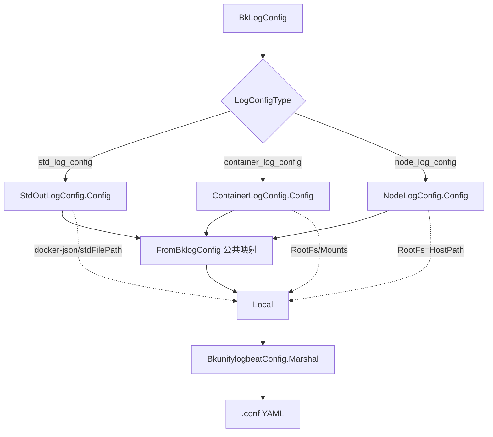

<!-- [待审核] AI 自动生成，请人工确认后移除此标记 -->
# 配置渲染

<cite>
**本文引用的文件**
- [bkunifylogbeat.go](file://bkmonitor-datalink/pkg/bk-log-sidecar/define/bkunifylogbeat.go)
- [log_config_type.go](file://bkmonitor-datalink/pkg/bk-log-sidecar/define/log_config_type.go)
</cite>

## 目录
1. [简介](#简介)
2. [项目结构](#项目结构)
3. [核心组件](#核心组件)
4. [架构总览](#架构总览)
5. [组件详细分析](#组件详细分析)
6. [依赖关系分析](#依赖关系分析)
7. [结论](#结论)

## 简介

本篇讲清楚一个 `BkLogConfig` 最终如何变成 `bkunifylogbeat` 能读的 YAML 子配置。渲染由 `define` 包完成，分两层：

- **数据结构层**（`bkunifylogbeat.go`）：`BkunifylogbeatConfig`/`Local`/`DockerJSON` 等 YAML 结构，以及 `FromBklogConfig` 从 CRD 到 `Local` 的字段映射与自定义 `Marshal`；
- **配置类型层**（`log_config_type.go`）：`LogConfigType` 接口的三个实现——`StdOutLogConfig`（标准输出）、`ContainerLogConfig`（容器内文件）、`NodeLogConfig`（节点文件），各自决定元数据注入、路径处理与配置命名。

三种配置类型共享大量元数据注入逻辑，差异集中在**路径来源**与 **docker-json / RootFs / Mounts** 的处理上。

**章节来源**
- [bkunifylogbeat.go](file://bkmonitor-datalink/pkg/bk-log-sidecar/define/bkunifylogbeat.go#L21-L131)
- [log_config_type.go](file://bkmonitor-datalink/pkg/bk-log-sidecar/define/log_config_type.go#L24-L28)

## 项目结构

| 文件 | 职责 |
|------|------|
| `define/bkunifylogbeat.go` | YAML 数据结构（`BkunifylogbeatConfig`/`Local`/`DockerJSON`/`Multiline`/`Filter`/`Condition`）、自定义 `Marshal`、`FromBklogConfig` 映射 |
| `define/log_config_type.go` | `LogConfigType` 接口 + 三实现的 `Config()`/`ConfigName()`，元数据注入与路径转换 |

**章节来源**
- [bkunifylogbeat.go](file://bkmonitor-datalink/pkg/bk-log-sidecar/define/bkunifylogbeat.go#L11-L24)
- [log_config_type.go](file://bkmonitor-datalink/pkg/bk-log-sidecar/define/log_config_type.go#L11-L28)

## 核心组件

- **`BkunifylogbeatConfig`**：顶层结构，`local` 列表，最终序列化产物。
- **`Local`**：单条采集配置，映射 `bkunifylogbeat` 的一个 `local` 块。
- **`DockerJSON`**：标准输出专用的 CRI/docker-json 解析开关。
- **`FromBklogConfig`**：CRD Spec → `Local` 的公共字段映射。
- **`LogConfigType` 接口**：`Config() []byte` + `ConfigName() string`，三种实现分别对应 std/container/node。

**章节来源**
- [bkunifylogbeat.go](file://bkmonitor-datalink/pkg/bk-log-sidecar/define/bkunifylogbeat.go#L21-L97)
- [log_config_type.go](file://bkmonitor-datalink/pkg/bk-log-sidecar/define/log_config_type.go#L24-L51)

## 架构总览



**图表来源**
- [log_config_type.go](file://bkmonitor-datalink/pkg/bk-log-sidecar/define/log_config_type.go#L54-L310)
- [bkunifylogbeat.go](file://bkmonitor-datalink/pkg/bk-log-sidecar/define/bkunifylogbeat.go#L27-L131)

**章节来源**
- [log_config_type.go](file://bkmonitor-datalink/pkg/bk-log-sidecar/define/log_config_type.go#L54-L310)
- [bkunifylogbeat.go](file://bkmonitor-datalink/pkg/bk-log-sidecar/define/bkunifylogbeat.go#L27-L131)

## 组件详细分析

### 自定义 Marshal：注入 ExtOptions

`Local` 的 `ExtOptions` 字段带 `yaml:"-"`，不会被普通序列化输出。`BkunifylogbeatConfig.Marshal` 用"三步法"把它合并进最终 YAML：

```go
for _, local := range config.Local {
	yamlBytes, _ := yaml.Marshal(local)        // 1. Local -> YAML
	yamlMap := map[string]interface{}{}
	yaml.Unmarshal(yamlBytes, &yamlMap)        // 2. YAML -> map
	for key, rawMessage := range local.ExtOptions {
		var value interface{}
		json.Unmarshal(rawMessage.Raw, &value) // 3. 把 ExtOptions 逐项塞进 map
		yamlMap[key] = value
	}
	locals = append(locals, yamlMap)
}
```

这样用户在 CRD 中通过 `extOptions` 声明的任意扩展字段能**直接透传**进子配置，而不必在结构体里逐一定义，兼顾灵活性与向前兼容。

**章节来源**
- [bkunifylogbeat.go](file://bkmonitor-datalink/pkg/bk-log-sidecar/define/bkunifylogbeat.go#L27-L60)

### FromBklogConfig：公共字段映射

三种配置类型的 `Config()` 都先调用 `FromBklogConfig` 得到基础 `Local`，它负责搬运采集通用字段（DataId/Input/Path/ExcludeFiles/打包/扫描频率/Delimiter/Filters/ExtOptions）。两处特殊逻辑：

- **多行聚合**：当 `Multiline.Pattern` 非空时构造 `Multiline`，并固定 `Negate=true`、`Match="after"`（即"不匹配 pattern 的行向后拼接"）；
- **BCS 兼容**：当 `IsBcsConfig` 为真时设置 `OutputFormat="v1"`，走旧版输出格式。

`transferCrdFilterToFilter` 把 CRD 的 `Filter/Condition` 转成 `define` 包同名结构（YAML tag 不同），完成过滤规则搬运。

**章节来源**
- [bkunifylogbeat.go](file://bkmonitor-datalink/pkg/bk-log-sidecar/define/bkunifylogbeat.go#L100-L143)

### 元数据注入（三类共用）

`StdOutLogConfig` 与 `ContainerLogConfig` 的元数据注入逻辑几乎一致，按开关注入到 `extMeta`：

1. `AddPodLabel`：注入 Pod 标签；BCS 模式下标签**平铺到最外层**，非 BCS 模式放在 `labels` 键下；
2. `AddPodAnnotation`：注入 Pod 注解到 `annotations` 键；
3. `Spec.ExtMeta`：用户自定义元数据合并；
4. **身份元数据**：BCS 模式注入 `io_tencent_bcs_*` 系列（pod/namespace/type/server_name/container_name/container_id）；非 BCS 模式注入 `io_kubernetes_*` 系列（含 pod_uid、workload_name/type、container_name/id/image）。

标签/注解键名会经 `labelKeyToField` 归一化：把 `/`、`.`、`-` 统一替换为 `_`，以符合下游字段命名约束。

`NodeLogConfig` 的元数据注入类似，但标签/注解取自 `Node`（而非 Pod），且不注入容器身份字段。

**章节来源**
- [log_config_type.go](file://bkmonitor-datalink/pkg/bk-log-sidecar/define/log_config_type.go#L38-L107)
- [log_config_type.go](file://bkmonitor-datalink/pkg/bk-log-sidecar/define/log_config_type.go#L265-L289)

### StdOutLogConfig：标准输出采集

标准输出采集的关键在**路径与 CRI 解析**：

- 路径固定为 `stdFilePath()`，即把容器上报的 `LogPath` 经 `ToHostPath` 转换成宿主机路径（单元素 `Path`）；
- `RemovePathPrefix` 设为去尾分隔符的 `HostPath`；
- Input 缺省时取 `config.StdLogConfigInput`；
- 非 BCS 配置会构造 `DockerJSON`：`Stream="all"`（采标准输出+标准错误）、`Partial=true`（拼接被截断的单行）、`CRIFlags=true`（解析 P/F 换行标签，containerd 必需）；当运行时为 `containerd` 时进一步 `ForceCRI=true`，docker 则为 `false`；
- BCS 迁移配置则跳过 docker-json 构造，按原始格式采集。

```go
if !s.BkLogConfig.Spec.IsBcsConfig {
	local.DockerJSON = &DockerJSON{Stream: "all", Partial: true, CRIFlags: true}
	if s.RuntimeType == RuntimeTypeContainerd {
		local.DockerJSON.ForceCRI = true
	} else {
		local.DockerJSON.ForceCRI = false
	}
}
```

**章节来源**
- [log_config_type.go](file://bkmonitor-datalink/pkg/bk-log-sidecar/define/log_config_type.go#L109-L149)

### ContainerLogConfig：容器内文件采集

容器内文件采集需要把"容器视角的路径"落到"宿主机视角"，核心是 `RootFs` 与 `Mounts` 计算：

- `RootFs = HostPath + 容器 RootPath`：给采集器一个容器根文件系统前缀，用于读取非挂载路径下的文件；
- 遍历用户声明的 `Path`，对每条路径调用 `GetContainerMount` 得到"命中的挂载映射"，合并成 `mountMap`；再转成 `Mount{HostPath: ToHostPath(k), ContainerPath: v}` 列表。这样挂载卷内的日志能直接从宿主机对应路径采集，避免穿透容器根文件系统；
- Input 缺省时取 `config.ContainerLogConfigInput`。

路径解析（`ToHostPath`/`GetContainerMount`）的实现见《05-容器缓存与路径解析》。

**章节来源**
- [log_config_type.go](file://bkmonitor-datalink/pkg/bk-log-sidecar/define/log_config_type.go#L159-L251)

### NodeLogConfig：节点文件采集

节点级采集最简单：不涉及容器映射，`TailFiles` 固定为 `true`，`RemovePathPrefix` 与 `RootFs` 均取 `HostPath`，路径保持原样（`Path` 直接使用用户声明值）。Input 缺省取 `config.NodeLogConfigInput`。

**章节来源**
- [log_config_type.go](file://bkmonitor-datalink/pkg/bk-log-sidecar/define/log_config_type.go#L265-L310)

### ConfigName：配置命名规则

三种类型的 `ConfigName()` 决定落盘文件名（`.conf` 前缀），也是缓存键与"按 CR/容器删除"匹配的依据：

| 类型 | 命名格式 |
|------|----------|
| Std | `{容器ID}_{std_log_config}_{命名空间}_{CR名}` |
| Container | `{容器ID}_{container_log_config}_{命名空间}_{CR名}` |
| Node | `{node_log_config}_{命名空间}_{CR名}` |

容器级配置以容器 ID 开头，便于容器销毁时按前缀批量删除；节点级不含容器 ID。命名末尾统一为 `命名空间_CR名`，便于按 CR 删除（`deleteConfigByName` 用后缀匹配）。

**章节来源**
- [log_config_type.go](file://bkmonitor-datalink/pkg/bk-log-sidecar/define/log_config_type.go#L147-L149)
- [log_config_type.go](file://bkmonitor-datalink/pkg/bk-log-sidecar/define/log_config_type.go#L254-L256)
- [log_config_type.go](file://bkmonitor-datalink/pkg/bk-log-sidecar/define/log_config_type.go#L313-L315)

## 依赖关系分析

- `log_config_type.go` 依赖 `bkunifylogbeat.go` 的 `Local`/`FromBklogConfig`/`Marshal`，以及 `utils`（Pod 元数据提取）、`config`（Input 常量与 HostPath）、`define` 路径转换（`ToHostPath`/`GetContainerMount`）。
- `BkunifylogbeatConfig.Marshal` 依赖 `gopkg.in/yaml.v3` 与 `encoding/json`（透传 `RawExtension`）。
- 渲染产物由《01/04》中的 `writeConfigFile` 通过 `Config()` 落盘，`ConfigName()` 提供文件名。

**章节来源**
- [log_config_type.go](file://bkmonitor-datalink/pkg/bk-log-sidecar/define/log_config_type.go#L11-L22)
- [bkunifylogbeat.go](file://bkmonitor-datalink/pkg/bk-log-sidecar/define/bkunifylogbeat.go#L13-L19)

## 结论

配置渲染层通过 `FromBklogConfig` 统一公共字段、`Marshal` 三步法透传 `ExtOptions`，再由三种 `LogConfigType` 实现分别处理标准输出（docker-json/CRI）、容器内文件（RootFs/Mounts）与节点文件（HostPath 前缀）的差异，并以 `ConfigName` 规则支撑落盘与增删匹配。它是"CRD 期望 → agent 可用配置"的最后一环，其路径转换细节承接《05》，落盘与匹配承接《04》。

**章节来源**
- [bkunifylogbeat.go](file://bkmonitor-datalink/pkg/bk-log-sidecar/define/bkunifylogbeat.go#L27-L131)
- [log_config_type.go](file://bkmonitor-datalink/pkg/bk-log-sidecar/define/log_config_type.go#L54-L315)
