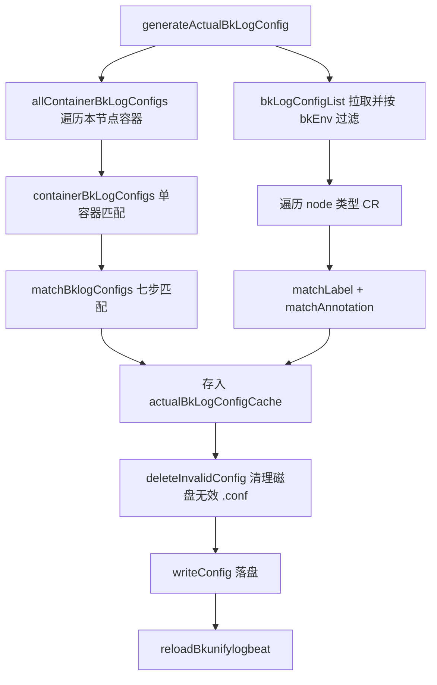
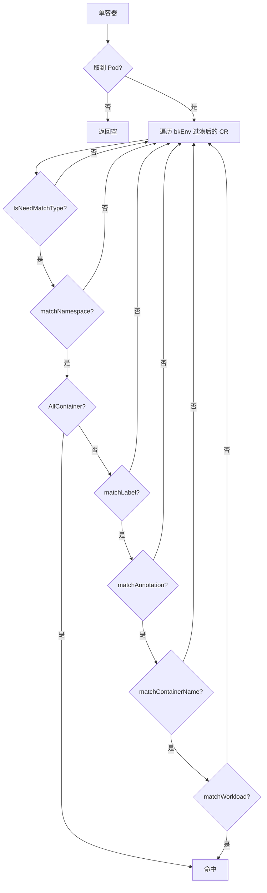

<!-- [待审核] AI 自动生成，请人工确认后移除此标记 -->
# 配置生成与匹配引擎

<cite>
**本文引用的文件**
- [bklog_sidecar.go](file://bkmonitor-datalink/pkg/bk-log-sidecar/controllers/bklog_sidecar.go)
</cite>

## 目录
1. [简介](#简介)
2. [项目结构](#项目结构)
3. [核心组件](#核心组件)
4. [架构总览](#架构总览)
5. [组件详细分析](#组件详细分析)
6. [依赖关系分析](#依赖关系分析)
7. [结论](#结论)

## 简介

本篇是模块的核心引擎，回答一个问题：**给定本节点所有容器与集群中所有 `BkLogConfig`，如何算出应该落盘的采集配置集合，并保持磁盘与内存一致。**

引擎主要由三部分组成：

1. **生成**：`generateActualBkLogConfig` 全量重算，遍历容器生成容器级配置、遍历 CR 生成节点级配置；
2. **匹配**：`matchBklogConfigs` 的七步过滤，决定某容器命中哪些 CR；
3. **落盘/清理**：`writeConfig`/`writeConfigFile` 落盘，`deleteInvalidConfig`/`deleteConfigByName`/`deleteContainerConfig` 清理。

全量重算由 CRD 协调触发；单容器增量由事件触发（见《06》）。二者共享同一份 `actualBkLogConfigCache`。

**章节来源**
- [bklog_sidecar.go](file://bkmonitor-datalink/pkg/bk-log-sidecar/controllers/bklog_sidecar.go#L115-L164)
- [bklog_sidecar.go](file://bkmonitor-datalink/pkg/bk-log-sidecar/controllers/bklog_sidecar.go#L454-L529)

## 项目结构

引擎全部集中在 `controllers/bklog_sidecar.go`，按职责可分为四组方法：

| 分组 | 方法 |
|------|------|
| 生成 | `generateActualBkLogConfig` / `allContainerBkLogConfigs` / `containerBkLogConfigs` |
| 拉取与环境过滤 | `bkLogConfigList` |
| 匹配 | `matchBklogConfigs` / `matchLabel` / `matchAnnotation` / `matchNamespace` / `matchWorkload` / `matchWorkloadName` / `matchWorkloadType` / `matchContainerName` |
| 落盘与清理 | `writeConfig` / `writeConfigFile` / `deleteInvalidConfig` / `deleteConfigByName` / `deleteContainerConfig` / `deleteConfigFile` |

**章节来源**
- [bklog_sidecar.go](file://bkmonitor-datalink/pkg/bk-log-sidecar/controllers/bklog_sidecar.go#L115-L216)
- [bklog_sidecar.go](file://bkmonitor-datalink/pkg/bk-log-sidecar/controllers/bklog_sidecar.go#L374-L451)

## 核心组件

- **`generateActualBkLogConfig`**：全量协调入口。
- **`matchBklogConfigs`**：单容器 → 命中 CR 列表的匹配核心。
- **`actualBkLogConfigCache`**：实际配置名 → `LogConfigType` 的内存权威副本。
- **`bkLogConfigList`**：拉取并按 `bkEnv` 过滤 CR。

**章节来源**
- [bklog_sidecar.go](file://bkmonitor-datalink/pkg/bk-log-sidecar/controllers/bklog_sidecar.go#L116-L164)
- [bklog_sidecar.go](file://bkmonitor-datalink/pkg/bk-log-sidecar/controllers/bklog_sidecar.go#L436-L451)

## 架构总览



**图表来源**
- [bklog_sidecar.go](file://bkmonitor-datalink/pkg/bk-log-sidecar/controllers/bklog_sidecar.go#L116-L164)
- [bklog_sidecar.go](file://bkmonitor-datalink/pkg/bk-log-sidecar/controllers/bklog_sidecar.go#L193-L216)

**章节来源**
- [bklog_sidecar.go](file://bkmonitor-datalink/pkg/bk-log-sidecar/controllers/bklog_sidecar.go#L116-L216)

## 组件详细分析

### 全量生成：generateActualBkLogConfig

全量协调分三段：

1. **容器级配置**：`allContainerBkLogConfigs` 遍历本节点所有容器，为每个容器算出命中的 std/container 配置；
2. **节点级配置**：拉取所有 CR，只处理 `IsNodeType()` 为真的，用节点标签/注解做 `matchLabel`/`matchAnnotation`，命中则构造 `NodeLogConfig`。这里用 `firstMatchNodeConfig` 标志**懒刷新节点信息**——只有当确有节点级 CR 时才 `refreshNodeInfo()`，避免无谓的 API 调用；
3. **收敛落盘**：把所有 `logConfigs` 存入 `actualBkLogConfigCache`，随后 `deleteInvalidConfig()` → `writeConfig()` → `reloadBkunifylogbeat()`。

注意顺序：**先删无效、后写、再重载**，保证磁盘最终只保留当前有效配置。

```go
for _, logConfig := range logConfigs {
	s.actualBkLogConfigCache.Store(logConfig.ConfigName(), logConfig)
}
s.deleteInvalidConfig()
s.writeConfig()
utils.CheckErrorFn(s.reloadBkunifylogbeat(), func(err error) { ... })
```

**章节来源**
- [bklog_sidecar.go](file://bkmonitor-datalink/pkg/bk-log-sidecar/controllers/bklog_sidecar.go#L116-L164)

### 容器配置生成：allContainerBkLogConfigs / containerBkLogConfigs

`allContainerBkLogConfigs` 遍历运行时返回的容器列表，优先命中 `containerCache`，未命中则 `containerByID` 拉取并回填缓存，再交给 `containerBkLogConfigs`。

`containerBkLogConfigs` 对单容器调用 `matchBklogConfigs` 得到命中 CR，然后按类型分流构造 `ContainerLogConfig` 或 `StdOutLogConfig`。关键设计：

```go
// 对于新增容器的场景，需要从头开始采集日志文件
bkLogConfig.Spec.TailFiles = !isNewContainer
```

`isNewContainer` 为 `false`（全量/已有容器）时 `TailFiles=true`（从尾部采，避免重复采历史）；为 `true`（事件新增容器）时 `TailFiles=false`（从头采，避免漏采容器启动初期日志）。标准输出配置还会带上运行时类型（`s.getRuntime().Type()`），供渲染层决定 CRI 开关。

**章节来源**
- [bklog_sidecar.go](file://bkmonitor-datalink/pkg/bk-log-sidecar/controllers/bklog_sidecar.go#L167-L216)

### 环境过滤：bkLogConfigList

`bkLogConfigList` 从节点级 cache 拉取全部 `BkLogConfig`，逐条用 `IsMatchBkEnv()` 过滤，不匹配当前 `bkEnv` 的 CR 被跳过并记日志。这是多环境隔离的统一入口，匹配流程中所有对 CR 列表的获取都经过它。

**章节来源**
- [bklog_sidecar.go](file://bkmonitor-datalink/pkg/bk-log-sidecar/controllers/bklog_sidecar.go#L436-L451)

### 七步匹配：matchBklogConfigs

`matchBklogConfigs` 是匹配引擎心脏，输入单个容器，输出命中的 CR 列表与对应 Pod。流程：

1. **取 Pod**：用容器标签中的 `k8s_pod_namespace`/`k8s_pod_name` 从 cache 取 Pod，失败直接返回；
2. **取 CR 列表**：`bkLogConfigList()`（已按 bkEnv 过滤）；
3. **容器名校验**：无 `k8s_container_name` 标签视为非 k8s 容器跳过；`IsNetworkPod` 判定的 pause/网络容器跳过；
4. 逐个 CR 过滤：
   - `IsNeedMatchType()`：只处理 std/container 类型；
   - `matchNamespace`：命名空间匹配；
   - `AllContainer` 短路：为真直接命中；
   - `matchLabel`：Pod 标签选择器；
   - `matchAnnotation`：Pod 注解选择器；
   - `matchContainerName`：容器名白/黑名单；
   - `matchWorkload`：工作负载类型/名称。

所有条件通过才追加到结果。设计上 `AllContainer` 提供"全采"快捷通道，其余为逐级收窄的与关系。



**图表来源**
- [bklog_sidecar.go](file://bkmonitor-datalink/pkg/bk-log-sidecar/controllers/bklog_sidecar.go#L454-L529)

**章节来源**
- [bklog_sidecar.go](file://bkmonitor-datalink/pkg/bk-log-sidecar/controllers/bklog_sidecar.go#L454-L529)

### 各维度匹配细节

- **`matchLabel` / `matchAnnotation`**：均把 `metav1.LabelSelector` 转成 selector 后对目标 labels/annotations 做 `Matches`，复用 k8s 标准语义。
- **`matchNamespace`**：优先级为 `Any`（全匹配）> `ExcludeNames`（黑名单，全不命中才 true）> `MatchNames`（白名单，命中任一即 true）> `Namespace`（单名精确匹配）> 未配置返回 true。
- **`matchWorkload`**：`WorkloadType` 与 `WorkloadName` 分别校验（都配置则都要过）。`matchWorkloadName` 支持正则匹配也支持全等；vcluster Pod 走 `GetPodWorkload*` 从注解取工作负载，普通 Pod 走 `OwnerReferences`。
- **`matchWorkloadType`**：特殊处理 `ReplicaSet` → 当 CR 声明 `Deployment` 时视为匹配（因为 Deployment 的 Pod 属主是 ReplicaSet）。
- **`matchContainerName`**：先查排除名单（命中即 false），再查匹配名单（空则 true，否则需全等命中）。

**章节来源**
- [bklog_sidecar.go](file://bkmonitor-datalink/pkg/bk-log-sidecar/controllers/bklog_sidecar.go#L531-L691)

### 落盘与清理

- **`writeConfig` / `writeConfigFile`**：遍历 `actualBkLogConfigCache`，把每个配置的 `Config()` 写入 `{BkunifylogbeatConfig}/{ConfigName}.conf`；
- **`deleteInvalidConfig`**：读配置目录，把文件名（去 `.conf`）不在缓存中的文件删除——用于全量协调后清理"孤儿"配置；
- **`deleteConfigByName`**：按 `{namespace}_{name}` 后缀匹配删除某 CR 的所有实际配置（CR 删除/更新时用）；
- **`deleteContainerConfig`**：按容器 ID 前缀删除某容器的所有配置（容器销毁/停止时用），返回是否需要 reload；
- **`deleteConfigFile`**：删除单个 `.conf` 物理文件。

命名规则（见《03》）保证了"按 CR 后缀删"与"按容器前缀删"都能精准命中。

**章节来源**
- [bklog_sidecar.go](file://bkmonitor-datalink/pkg/bk-log-sidecar/controllers/bklog_sidecar.go#L332-L433)

## 依赖关系分析

- 引擎依赖 `define.LogConfigType`（`Config()`/`ConfigName()`）完成渲染与命名（见《03》）。
- 依赖 `define.Runtime`（`Containers`/`Inspect`）获取容器与详情（见《06》），以及 `containerCache`（见《05》）。
- 依赖 `v1alpha1.BkLogConfig` 的判定方法与 `utils`（k8s 元数据、错误处理）。
- 落盘目录来自 `config.BkunifylogbeatConfig`，延迟清理时长来自 `config.DelayCleanConfig`（见《08》）。

**章节来源**
- [bklog_sidecar.go](file://bkmonitor-datalink/pkg/bk-log-sidecar/controllers/bklog_sidecar.go#L167-L222)
- [bklog_sidecar.go](file://bkmonitor-datalink/pkg/bk-log-sidecar/controllers/bklog_sidecar.go#L399-L451)

## 结论

配置生成与匹配引擎以 `generateActualBkLogConfig` 做全量协调、`matchBklogConfigs` 做七步逐级收窄的容器匹配，并通过"先删无效、后写、再重载"的落盘纪律与基于命名规则的精准删除，保证磁盘配置与期望状态强一致。它是连接"CRD 期望 + 容器实际"到"agent 配置文件"的核心枢纽，向下依赖渲染层（《03》）、缓存层（《05》）与运行时层（《06》）。

**章节来源**
- [bklog_sidecar.go](file://bkmonitor-datalink/pkg/bk-log-sidecar/controllers/bklog_sidecar.go#L116-L164)
- [bklog_sidecar.go](file://bkmonitor-datalink/pkg/bk-log-sidecar/controllers/bklog_sidecar.go#L454-L529)
