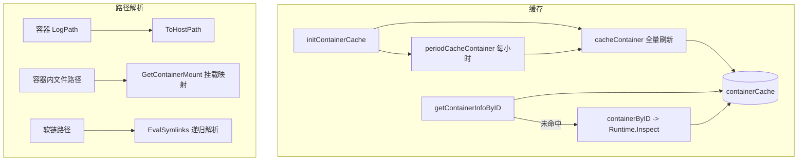
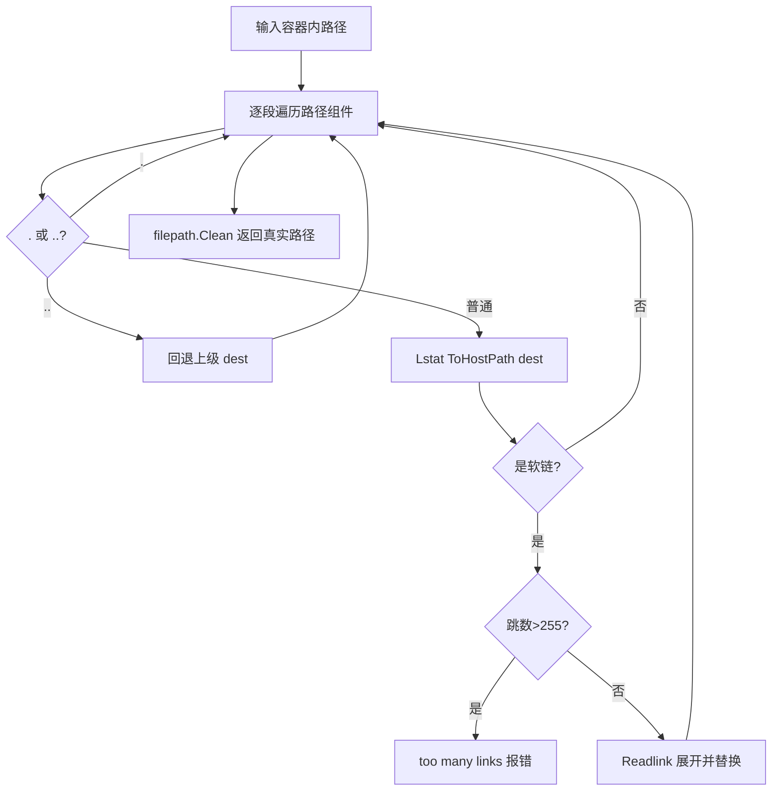

<!-- [待审核] AI 自动生成，请人工确认后移除此标记 -->
# 容器缓存与路径解析

<cite>
**本文引用的文件**
- [cache.go](file://bkmonitor-datalink/pkg/bk-log-sidecar/controllers/cache.go)
- [container_path.go](file://bkmonitor-datalink/pkg/bk-log-sidecar/define/container_path.go)
- [container_path_linux.go](file://bkmonitor-datalink/pkg/bk-log-sidecar/define/container_path_linux.go)
</cite>

## 目录
1. [简介](#简介)
2. [项目结构](#项目结构)
3. [核心组件](#核心组件)
4. [架构总览](#架构总览)
5. [组件详细分析](#组件详细分析)
6. [依赖关系分析](#依赖关系分析)
7. [结论](#结论)

## 简介

本篇讲两件事：

1. **容器缓存**：`BkLogSidecar` 如何缓存本节点容器详情（`containerCache`），减少对运行时的 `Inspect` 调用；
2. **路径解析**：容器视角的日志路径如何转换成 `bkunifylogbeat`（运行在宿主机/挂载视角）能读到的真实路径，涉及 `ToHostPath`、容器根路径 `ContainerRootPath`、软链解析 `EvalSymlinks` 与挂载映射 `GetContainerMount`。

路径解析是容器日志采集能"落地"的关键——采集器并不在容器内运行，必须把容器内路径翻译为宿主机可访问路径。

**章节来源**
- [cache.go](file://bkmonitor-datalink/pkg/bk-log-sidecar/controllers/cache.go#L26-L81)
- [container_path.go](file://bkmonitor-datalink/pkg/bk-log-sidecar/define/container_path.go#L25-L38)

## 项目结构

| 文件 | 职责 |
|------|------|
| `controllers/cache.go` | 容器缓存的刷新与读取：`cacheContainer`/`periodCacheContainer`/`getContainerInfoByID`/`containerByID` |
| `define/container_path.go` | 容器根路径判定 `ContainerRootPath`、宿主路径转换 `ToHostPath`、软链递归解析 `EvalSymlinks` |
| `define/container_path_linux.go` | 挂载映射匹配 `GetContainerMount` |

**章节来源**
- [cache.go](file://bkmonitor-datalink/pkg/bk-log-sidecar/controllers/cache.go#L11-L24)
- [container_path.go](file://bkmonitor-datalink/pkg/bk-log-sidecar/define/container_path.go#L11-L23)
- [container_path_linux.go](file://bkmonitor-datalink/pkg/bk-log-sidecar/define/container_path_linux.go#L11-L20)

## 核心组件

- **`containerCache`（sync.Map）**：容器 ID → `*define.Container`。
- **`cacheContainer` / `periodCacheContainer`**：全量刷新与每小时周期刷新。
- **`getContainerInfoByID` / `containerByID`**：读缓存（未命中回源 `Inspect`）。
- **`ToHostPath` / `ContainerRootPath` / `EvalSymlinks` / `GetContainerMount`**：路径转换四件套。

**章节来源**
- [cache.go](file://bkmonitor-datalink/pkg/bk-log-sidecar/controllers/cache.go#L22-L81)
- [container_path.go](file://bkmonitor-datalink/pkg/bk-log-sidecar/define/container_path.go#L25-L41)

## 架构总览



**图表来源**
- [cache.go](file://bkmonitor-datalink/pkg/bk-log-sidecar/controllers/cache.go#L26-L81)
- [container_path.go](file://bkmonitor-datalink/pkg/bk-log-sidecar/define/container_path.go#L25-L153)
- [container_path_linux.go](file://bkmonitor-datalink/pkg/bk-log-sidecar/define/container_path_linux.go#L20-L40)

**章节来源**
- [cache.go](file://bkmonitor-datalink/pkg/bk-log-sidecar/controllers/cache.go#L26-L81)
- [container_path.go](file://bkmonitor-datalink/pkg/bk-log-sidecar/define/container_path.go#L25-L153)

## 组件详细分析

### 容器缓存刷新与读取

缓存有两条写入路径：

- **周期刷新** `periodCacheContainer`：`time.Hour` 定时器触发 `cacheContainer`，`stopCh` 关闭时退出。用于兜底纠正缓存漂移；
- **全量刷新** `cacheContainer`：列出运行时全部容器，逐个 `containerByID`（`Inspect`）后写入 `containerCache`。

读取用 `getContainerInfoByID`：命中缓存直接返回；未命中则回源 `Inspect` 并回填。`containerByID` 封装 `Runtime.Inspect`，出错返回 `nil`（调用方据此跳过）。`castContainer` 做 `interface{}` → `*define.Container` 的类型断言，是 `sync.Map` 存取的适配器。

```go
func (s *BkLogSidecar) getContainerInfoByID(containerID string) *define.Container {
	if containerInfo, ok := s.containerCache.Load(containerID); ok {
		return castContainer(containerInfo)
	}
	container := s.containerByID(containerID)
	if container != nil {
		s.containerCache.Store(containerID, container)
	}
	return container
}
```

缓存的价值：匹配与生成过程会多次访问容器详情，缓存避免了对 docker/containerd 的高频 `Inspect`；周期刷新则保证长时间运行下缓存不至于长期失真。

**章节来源**
- [cache.go](file://bkmonitor-datalink/pkg/bk-log-sidecar/controllers/cache.go#L22-L81)

### 宿主路径转换：ToHostPath 与 ContainerRootPath

- **`ToHostPath`**：把容器/节点视角路径拼上 `config.HostPath` 前缀（宿主机根挂载点），得到采集器能访问的路径。这是所有路径落地的基础操作。
- **`ContainerRootPath`**：根据 docker inspect 的存储驱动决定容器根路径——`overlay2` 用 `GraphDriver.Data["MergedDir"]`（合并层目录）；其他驱动回退到 `/proc/{Pid}/root`（通过进程命名空间访问容器根文件系统）。

**章节来源**
- [container_path.go](file://bkmonitor-datalink/pkg/bk-log-sidecar/define/container_path.go#L25-L38)

### 软链递归解析：EvalSymlinks

`EvalSymlinks` 是一个**在宿主机视角下解析容器内软链**的定制实现（改写自标准库 `filepath.EvalSymlinks`）。它逐段遍历路径组件，对每段：

- 处理 `.`（忽略）与 `..`（回退上级）；
- 对普通组件 `Lstat(ToHostPath(dest))` 判断是否软链；
- 若是软链则 `Readlink` 展开，绝对链接重置 `dest`，相对链接替换最后一段；
- 累计软链跳数，超过 255 报"too many links"防环。

关键点在于所有文件系统操作都经 `ToHostPath` 加前缀——即"以容器内路径为逻辑视角，但实际在宿主机挂载点上做 lstat/readlink"，从而正确解析容器内以软链形式存在的日志文件（如很多应用把日志软链到 stdout 或其他目录）。



**图表来源**
- [container_path.go](file://bkmonitor-datalink/pkg/bk-log-sidecar/define/container_path.go#L41-L153)

**章节来源**
- [container_path.go](file://bkmonitor-datalink/pkg/bk-log-sidecar/define/container_path.go#L41-L153)

### 挂载映射匹配：GetContainerMount

容器内文件采集时，若日志目录恰好是一个挂载卷，则应直接从宿主机挂载源采集（性能更好、更可靠）。`GetContainerMount` 做这件事：

- 校验 `path` 必须为绝对路径；
- 遍历容器 `Mounts`，用 `filepath.Rel(mount.ContainerPath, path)` 计算相对关系；
- 若 `rel` 不是绝对路径也不以 `../` 开头，说明 `path` 落在该挂载点内，把 `mountMap[HostPath] = ContainerPath` 记录。

返回的 `mountMap` 被渲染层（`ContainerLogConfig.Config`）转成 `Mount` 列表写入采集配置。这样采集器就知道"容器内的某目录对应宿主机的哪个源路径"。

**章节来源**
- [container_path_linux.go](file://bkmonitor-datalink/pkg/bk-log-sidecar/define/container_path_linux.go#L20-L40)

## 依赖关系分析

- `cache.go` 依赖 `define.Runtime`（`Containers`/`Inspect`）与 `define.Container` 模型，被匹配引擎（《04》）与事件处理（《06》）调用。
- 路径解析 `container_path*.go` 依赖 `config.HostPath` 与 docker 的 `InspectResponse` 类型；`ToHostPath`/`GetContainerMount` 被渲染层（《03》）直接使用。
- `EvalSymlinks` 主要服务于容器日志真实路径解析，配合平台适配（《07》）中的路径处理。

**章节来源**
- [cache.go](file://bkmonitor-datalink/pkg/bk-log-sidecar/controllers/cache.go#L13-L20)
- [container_path.go](file://bkmonitor-datalink/pkg/bk-log-sidecar/define/container_path.go#L13-L23)

## 结论

容器缓存以 `sync.Map` + 每小时周期刷新 + 未命中回源的策略，在减少运行时 `Inspect` 压力的同时保持数据新鲜；路径解析四件套（`ToHostPath`/`ContainerRootPath`/`EvalSymlinks`/`GetContainerMount`）解决了"采集器在宿主机、日志在容器内"的核心矛盾——通过前缀拼接、存储驱动判定、软链递归展开与挂载映射，把容器视角路径可靠地翻译到宿主机视角。二者是配置渲染与匹配引擎能正确落地的底层支撑。

**章节来源**
- [cache.go](file://bkmonitor-datalink/pkg/bk-log-sidecar/controllers/cache.go#L26-L81)
- [container_path.go](file://bkmonitor-datalink/pkg/bk-log-sidecar/define/container_path.go#L25-L153)
