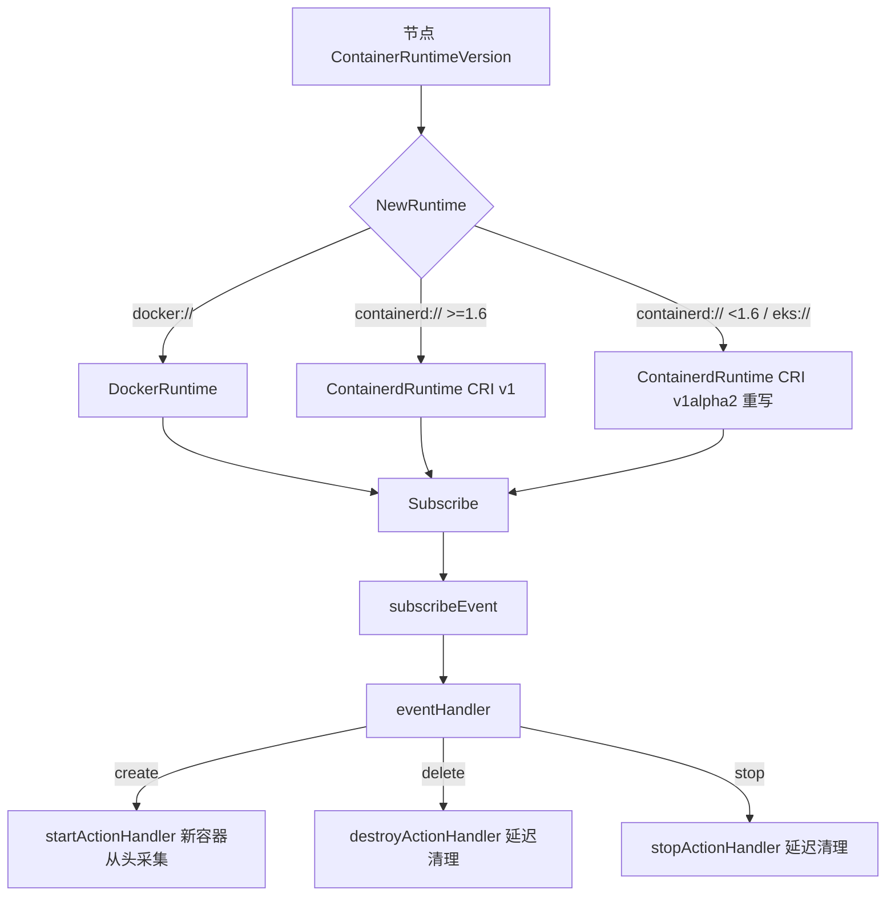
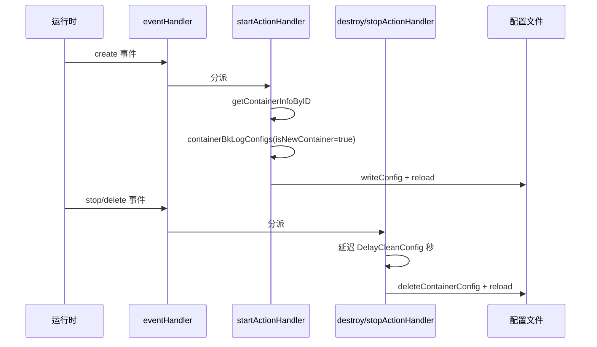

<!-- [待审核] AI 自动生成，请人工确认后移除此标记 -->
# 容器运行时与事件驱动

<cite>
**本文引用的文件**
- [runtime.go](file://bkmonitor-datalink/pkg/bk-log-sidecar/define/runtime.go)
- [runtime.go](file://bkmonitor-datalink/pkg/bk-log-sidecar/controllers/runtime.go)
- [runtime_docker.go](file://bkmonitor-datalink/pkg/bk-log-sidecar/controllers/runtime_docker.go)
- [runtime_containerd.go](file://bkmonitor-datalink/pkg/bk-log-sidecar/controllers/runtime_containerd.go)
- [runtime_containerd_base.go](file://bkmonitor-datalink/pkg/bk-log-sidecar/controllers/runtime_containerd_base.go)
- [runtime_container_others.go](file://bkmonitor-datalink/pkg/bk-log-sidecar/controllers/runtime_container_others.go)
- [runtime_container_windows.go](file://bkmonitor-datalink/pkg/bk-log-sidecar/controllers/runtime_container_windows.go)
- [bklog_sidecar.go](file://bkmonitor-datalink/pkg/bk-log-sidecar/controllers/bklog_sidecar.go)
</cite>

## 目录
1. [简介](#简介)
2. [项目结构](#项目结构)
3. [核心组件](#核心组件)
4. [架构总览](#架构总览)
5. [组件详细分析](#组件详细分析)
6. [依赖关系分析](#依赖关系分析)
7. [结论](#结论)

## 简介

本篇讲清楚 `bk-log-sidecar` 如何屏蔽容器运行时差异，并把容器生命周期事件转成配置增删。两条主线：

1. **运行时抽象**：`define.Runtime` 接口 + `NewRuntime` 工厂，按节点运行时版本选择 docker 或 containerd 实现（containerd 还需处理 CRI v1/v1alpha2 兼容）；
2. **事件驱动**：`subscribeEvent` 订阅运行时事件，`eventHandler` 按类型分派到 `startActionHandler`/`destroyActionHandler`/`stopActionHandler`，完成单容器的配置增量维护。

**章节来源**
- [runtime.go](file://bkmonitor-datalink/pkg/bk-log-sidecar/controllers/runtime.go#L22-L42)
- [bklog_sidecar.go](file://bkmonitor-datalink/pkg/bk-log-sidecar/controllers/bklog_sidecar.go#L224-L262)

## 项目结构

| 文件 | 职责 |
|------|------|
| `define/runtime.go` | `Runtime` 接口定义 |
| `controllers/runtime.go` | `NewRuntime` 工厂，按版本选择实现 |
| `controllers/runtime_docker.go` | `DockerRuntime`：列举/Inspect/事件订阅/API 版本协商 |
| `controllers/runtime_containerd.go` | `ContainerdRuntime` + `criClient`：CRI 列举/状态 |
| `controllers/runtime_containerd_base.go` | `ContainerdBase`：containerd 事件订阅与解析 |
| `controllers/runtime_container_others.go` | 非 windows 的 `NewContainerdRuntime` 与 v1alpha2 重写器 |
| `controllers/runtime_container_windows.go` | windows 的 `NewContainerdRuntime`（命名管道拨号） |
| `controllers/bklog_sidecar.go` | `subscribeEvent`/`eventHandler` 及三个 action handler |

**章节来源**
- [runtime.go](file://bkmonitor-datalink/pkg/bk-log-sidecar/controllers/runtime.go#L11-L19)
- [runtime_containerd.go](file://bkmonitor-datalink/pkg/bk-log-sidecar/controllers/runtime_containerd.go#L11-L28)

## 核心组件

- **`define.Runtime` 接口**：`Containers`/`Inspect`/`Subscribe`/`Type`。
- **`NewRuntime`**：运行时工厂。
- **`DockerRuntime` / `ContainerdRuntime`（+ `ContainerdBase` / `criClient`）**：两套实现。
- **`criV1Alpha2Rewriter`**：CRI v1 → v1alpha2 gRPC 方法路径重写。
- **`subscribeEvent` / `eventHandler` / `*ActionHandler`**：事件订阅与派发。

**章节来源**
- [runtime.go](file://bkmonitor-datalink/pkg/bk-log-sidecar/define/runtime.go#L72-L82)
- [runtime_containerd.go](file://bkmonitor-datalink/pkg/bk-log-sidecar/controllers/runtime_containerd.go#L58-L67)

## 架构总览



**图表来源**
- [runtime.go](file://bkmonitor-datalink/pkg/bk-log-sidecar/controllers/runtime.go#L22-L42)
- [bklog_sidecar.go](file://bkmonitor-datalink/pkg/bk-log-sidecar/controllers/bklog_sidecar.go#L249-L329)

**章节来源**
- [runtime.go](file://bkmonitor-datalink/pkg/bk-log-sidecar/controllers/runtime.go#L22-L42)
- [bklog_sidecar.go](file://bkmonitor-datalink/pkg/bk-log-sidecar/controllers/bklog_sidecar.go#L249-L329)

## 组件详细分析

### 运行时工厂：NewRuntime

`NewRuntime` 解析节点上报的运行时版本字符串（形如 `docker://19.3.1`、`containerd://1.4.1`）选择实现：

- 前缀 `containerd`：拆出版本号，用 `CompareVersion(version, "1.6") < 0` 判断——**小于 1.6 使用 CRI v1alpha2**，否则用 v1；
- 前缀 `eks`：直接用 v1alpha2 的 containerd 实现；
- 前缀 `docker`：用 `NewDockerRuntime`；
- 其他：报错。

```go
version := parts[1]
useV1Alpha2 := utils.CompareVersion(version, "1.6") < 0
return NewContainerdRuntime(useV1Alpha2)
```

**章节来源**
- [runtime.go](file://bkmonitor-datalink/pkg/bk-log-sidecar/controllers/runtime.go#L22-L42)

### Docker 运行时

`DockerRuntime` 基于 docker client：

- **`Containers`**：`ContainerList` 列出全部容器，映射为 `SimpleContainer`；
- **`Inspect`**：带 3 秒超时的 `ContainerInspect`（放在 goroutine + channel + `ctx.Done()` 做超时控制），取根路径（`ContainerRootPath`）、挂载（source→host/dest→container）、标签、镜像、LogPath 构造 `Container`；
- **`parseEvent`**：docker 事件 `start`→create、`die`→delete、`stop`→stop 的映射；
- **`Subscribe`**：只过滤 `type=container` 与 `start/die/stop` 事件。**关键容错**：收到错误时用 `ExtractDockerApiVersion` 从错误信息里解析出服务端 API 版本，用该版本重建 client 并重新订阅——解决客户端与 docker daemon API 版本不一致问题；
- **`NewDockerRuntime`**：有 `DockerSocket` 配置则用指定 socket + 版本，否则 `FromEnv` + API 版本协商。

**章节来源**
- [runtime_docker.go](file://bkmonitor-datalink/pkg/bk-log-sidecar/controllers/runtime_docker.go#L44-L193)

### Containerd 运行时（CRI）

`ContainerdRuntime` 组合 `ContainerdBase`（事件）与 `criClient`（容器查询）：

- **`criClient.ListContainers`**：只列 `CONTAINER_RUNNING` 状态容器；
- **`criClient.ContainerStatus`**：`Verbose=true` 获取详情；
- **`Inspect`**：从 CRI status 取挂载、标签、镜像（`Image` 为空回退 `ImageRef`）；根路径与日志路径通过 `resolveContainerdV2Path`（见《07》）解析——**优先用 PID 拼 `/proc/{pid}/root`，PID 不存在时回退 containerd 的 merged 路径**（代码注释指出后者对 sidecar 之后创建的容器可能取到空路径，属已知问题）。

**CRI 版本兼容**：`criClient` 只面向 `v1.RuntimeServiceClient` 编程，v1 与 v1alpha2 的 protobuf wire 格式相同，差异仅在 gRPC service path。`criV1Alpha2Rewriter` 作为 unary interceptor，把 `/runtime.v1.RuntimeService/` 重写为 `/runtime.v1alpha2.RuntimeService/`，从而在不改业务代码的前提下兼容旧版 containerd。

**章节来源**
- [runtime_containerd.go](file://bkmonitor-datalink/pkg/bk-log-sidecar/controllers/runtime_containerd.go#L30-L111)
- [runtime_container_others.go](file://bkmonitor-datalink/pkg/bk-log-sidecar/controllers/runtime_container_others.go#L32-L62)

### Containerd 事件订阅与解析

`ContainerdBase.Subscribe` 只订阅四个 task 事件 topic：`TaskStart`/`TaskResumed`/`TaskPaused`/`TaskDelete`。`parseEvent` 做语义映射：

| containerd 事件 | 映射为 |
|-----------------|--------|
| TaskStart / TaskResumed | create |
| TaskPaused | stop |
| TaskDelete | delete |

事件体用 `typeurl.UnmarshalTo` 解码后，通过 `Field(["container_id"])` 提取容器 ID。这样把 containerd 的 task 语义统一到模块的 `ContainerEvent` 抽象。

**平台差异**：非 windows（`runtime_container_others.go`）用 `unix://` 拨号 containerd；windows（`runtime_container_windows.go`）用 `winio.DialPipe` 命名管道拨号，二者其余逻辑一致。

**章节来源**
- [runtime_containerd_base.go](file://bkmonitor-datalink/pkg/bk-log-sidecar/controllers/runtime_containerd_base.go#L42-L120)
- [runtime_container_windows.go](file://bkmonitor-datalink/pkg/bk-log-sidecar/controllers/runtime_container_windows.go#L38-L62)

### 事件派发：subscribeEvent 与 eventHandler

`subscribeEvent` 从运行时拿到事件/错误双通道，在 goroutine 里循环消费：

- 收到事件 → `eventHandler`；
- 收到错误 → 记录后 `cancel()` 当前 ctx，`SubscribeRetryInterval`（5 秒）后**递归重新订阅**，实现断线自愈；
- `ctx.Done()` → 退出。

`eventHandler` 按 `event.Type` 分派：create→`startActionHandler`、delete→`destroyActionHandler`、stop→`stopActionHandler`。

```go
events, errs := s.getRuntime().Subscribe(ctx)
// ...
case err := <-errs:
	cancel()
	time.Sleep(SubscribeRetryInterval)
	s.subscribeEvent()   // 递归重订阅
	return
```

**章节来源**
- [bklog_sidecar.go](file://bkmonitor-datalink/pkg/bk-log-sidecar/controllers/bklog_sidecar.go#L224-L262)

### 三个 Action Handler



**图表来源**
- [bklog_sidecar.go](file://bkmonitor-datalink/pkg/bk-log-sidecar/controllers/bklog_sidecar.go#L265-L329)

- **`startActionHandler`（create）**：取容器详情，以 `isNewContainer=true` 生成配置（标准输出/容器文件从头采集，避免漏采启动日志），存入缓存后 `writeConfig`+reload；无命中配置则跳过。
- **`destroyActionHandler`（delete）**：在 goroutine 中**延迟 `config.DelayCleanConfig` 秒**后从缓存删除容器并 `deleteContainerConfig`，有变更才 reload。延迟是为容器短暂重启/重建预留缓冲，避免频繁增删。
- **`stopActionHandler`（stop）**：同样延迟清理，但先 `getContainerInfoByID` 确认容器存在再删。

**章节来源**
- [bklog_sidecar.go](file://bkmonitor-datalink/pkg/bk-log-sidecar/controllers/bklog_sidecar.go#L265-L329)

## 依赖关系分析

- 运行时实现依赖 `config`（containerd 地址/命名空间、docker socket/API 版本）与 `utils`（`CompareVersion`、`ExtractDockerApiVersion`、错误处理）。
- 事件处理依赖缓存（《05》）取容器详情、依赖匹配引擎（《04》）的 `containerBkLogConfigs`/`deleteContainerConfig`/`writeConfig`、依赖平台适配（《07》）的 `resolveContainerdV2Path` 与 `reloadBkunifylogbeat`。
- 上层 `BkLogSidecar` 只依赖 `define.Runtime` 接口，运行时具体实现完全可替换。

**章节来源**
- [runtime.go](file://bkmonitor-datalink/pkg/bk-log-sidecar/controllers/runtime.go#L13-L19)
- [runtime_docker.go](file://bkmonitor-datalink/pkg/bk-log-sidecar/controllers/runtime_docker.go#L13-L28)

## 结论

运行时层通过 `Runtime` 接口 + `NewRuntime` 工厂屏蔽 docker/containerd 差异，并用 gRPC interceptor 优雅解决 CRI v1/v1alpha2 兼容、用 API 版本协商解决 docker 版本漂移；事件层以"订阅-分派-增量"模型实现容器级配置的实时维护，配合断线重订阅与延迟清理保证鲁棒性。它与全量协调（《04》）互补，共同维持配置与容器实际状态的一致。

**章节来源**
- [runtime.go](file://bkmonitor-datalink/pkg/bk-log-sidecar/controllers/runtime.go#L22-L42)
- [bklog_sidecar.go](file://bkmonitor-datalink/pkg/bk-log-sidecar/controllers/bklog_sidecar.go#L224-L329)
