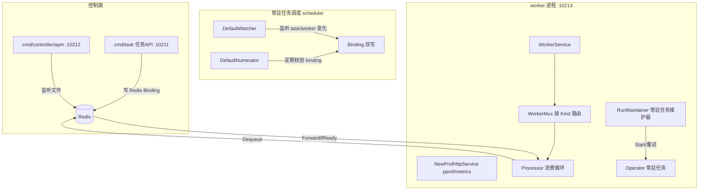

<!-- [待审核] AI 自动生成，请人工确认后移除此标记 -->
# 概览与架构

<cite>
**本文引用的文件**
- [README.md](file://bkmonitor-datalink/pkg/bk-monitor-worker/README.md)
- [cmd/bmw.go](file://bkmonitor-datalink/pkg/bk-monitor-worker/cmd/bmw.go)
- [cmd/worker.go](file://bkmonitor-datalink/pkg/bk-monitor-worker/cmd/worker.go)
- [cmd/task.go](file://bkmonitor-datalink/pkg/bk-monitor-worker/cmd/task.go)
- [cmd/apm/start_from_file.go](file://bkmonitor-datalink/pkg/bk-monitor-worker/cmd/apm/start_from_file.go)
- [service/worker_service.go](file://bkmonitor-datalink/pkg/bk-monitor-worker/service/worker_service.go)
- [Makefile](file://bkmonitor-datalink/pkg/bk-monitor-worker/Makefile)
- [Dockerfile](file://bkmonitor-datalink/pkg/bk-monitor-worker/Dockerfile)
</cite>

## 目录
1. [简介](#简介)
2. [模块定位与三类任务](#模块定位与三类任务)
3. [组件地图](#组件地图)
4. [启动流程（子命令）](#启动流程子命令)
5. [核心数据流](#核心数据流)
6. [目录结构](#目录结构)
7. [结论](#结论)

## 简介

bk-monitor-worker（简称 BMW）是蓝鲸监控的数据链路任务执行组件，是一个**基于 Redis 的分布式任务队列框架**（设计上借鉴 asynq / machinery）。它统一承载监控平台内多种后台任务：APM 预计算、告警 CMDB 缓存刷新、元数据计算、指标上报等，对外提供常驻任务、异步任务、定时（周期）任务三类执行模型。

本篇给出 BMW 的整体定位、组件地图、启动流程与核心数据流，后续各篇逐项深入。

**章节来源**
- [README.md](file://bkmonitor-datalink/pkg/bk-monitor-worker/README.md#L1-L7)

## 模块定位与三类任务

BMW 支持的任务类型（《README》）：

| 类型 | 特征 | 典型实现 |
|------|------|---------|
| **异步任务** | 入队即执行，支持重试/归档 | 各业务 `async:*` 任务（`async.go` 注册） |
| **定时/周期任务** | 按 `ProcessAt`/`ProcessInterval` 延迟执行，由 Forwarder 转发 | `periodic` 子包注册的周期任务 |
| **常驻任务** | 死循环、不返回，需维护器保活与失败重试 | `daemon:apm:pre_calculate`、`daemon:alarm:cmdb_*` |

三类任务共用同一套底层抽象：`task`（任务模型）、`broker`（Redis 消息队列）、`worker`+`processor`（消费执行）、`store`（元数据存储）、`service/scheduler`（常驻任务调度）。

**章节来源**
- [README.md](file://bkmonitor-datalink/pkg/bk-monitor-worker/README.md#L3-L7)

## 组件地图

**图表来源**
- [cmd/worker.go](file://bkmonitor-datalink/pkg/bk-monitor-worker/cmd/worker.go#L53-L125)
- [service/worker_service.go](file://bkmonitor-datalink/pkg/bk-monitor-worker/service/worker_service.go#L29-L85)
- [service/scheduler/daemon/daemon.go](file://bkmonitor-datalink/pkg/bk-monitor-worker/service/scheduler/daemon/daemon.go#L47-L88)

- **broker**：任务在 Redis 中以 List（pending/active）+ ZSet（scheduled/retry/archived/completed）+ Hash（任务本体）组织，详见《04》。
- **worker / processor**：worker 持有 broker 连接，启动 forwarder 与 processor 两个 goroutine；processor 出队后按 `Kind` 经 `WorkerMux` 路由到具体 `Handler`，详见《03》《05》。
- **service/scheduler**：常驻任务专用，由 Watcher + Numerator + RunMaintainer 三层协同，详见《06》《09》。

**章节来源**
- [service/worker_service.go](file://bkmonitor-datalink/pkg/bk-monitor-worker/service/worker_service.go#L29-L85)
- [cmd/worker.go](file://bkmonitor-datalink/pkg/bk-monitor-worker/cmd/worker.go#L53-L125)

## 启动流程（子命令）

入口 `bmw.go` → `cmd.Execute()`，基于 cobra 注册多个子命令：

| 子命令 | 端口 | 职责 | 来源 |
|--------|------|------|------|
| `worker` | `WorkerListenPort`=**10213** | 启动 `WorkerService` + 常驻任务 `RunMaintainer`，并起 pprof/metrics HTTP | `cmd/worker.go` |
| `task` | `TaskListenPort`=**10211** | 提供 `/bmw/task/` 任务管理 API（增删查、常驻任务 reload） | `cmd/task.go` |
| `controller` / `start_from_file` | `ControllerListenPort`=**10212** | 从文件监听启动 APM 等任务 | `cmd/apm/start_from_file.go` |
| （根） | — | `--config` 指定 `bmw.yaml`，默认 `./bmw.yaml` | `cmd/bmw.go` |

`worker` 子命令的 `startWorker` 流程：`config.InitConfig()` → `log.InitLogger()` → 初始化 SchemaProvider（redis/static，优雅降级）→ 起 HTTP（NewProfHttpService）→ `NewWorkerService(ctx, queues)` 并 `go Run()` → `NewDaemonTaskRunMaintainer(ctx, workerId)` 并 `go Run()` → 监听 SIGQUIT/SIGTERM/SIGINT 优雅退出。

**章节来源**
- [cmd/bmw.go](file://bkmonitor-datalink/pkg/bk-monitor-worker/cmd/bmw.go#L24-L43)
- [cmd/worker.go](file://bkmonitor-datalink/pkg/bk-monitor-worker/cmd/worker.go#L45-L125)
- [cmd/task.go](file://bkmonitor-datalink/pkg/bk-monitor-worker/cmd/task.go#L33-L71)
- [cmd/apm/start_from_file.go](file://bkmonitor-datalink/pkg/bk-monitor-worker/cmd/apm/start_from_file.go#L32-L73)

## 核心数据流

**异步/周期任务**：
1. 生产者（业务代码或 `task` API）调用 broker `Enqueue`/`Schedule`，写入 Redis pending / scheduled ZSet；
2. `Forwarder` 定时 `ForwardIfReady` 将到期的 scheduled/retry 任务批量移到 pending；
3. `Processor.Exec` 从 pending `Dequeue`（RPOPLPUSH 到 active 并加 lease），按 `Kind` 经 `WorkerMux` 路由到 `Handler.ProcessTask`；
4. 成功 → `MarkAsDone`/`MarkAsComplete`；失败 → 按 `RetryDelayFunc` 计算延迟 `Retry`，超过 `Retry` 上限 → `Archive`。

**常驻任务**（额外链路，详见《06》）：
1. `task` API 或调度器写入 Redis 任务集合（`DaemonTaskKey`）；
2. `DefaultWatcher` 监听变化并写入 `Binding`（task↔worker 双写 Hash）；
3. `DefaultNumerator` 定期校验 binding 与 worker 一致性；
4. worker 侧 `RunMaintainer` 监听自身 `DaemonBindingWorker(workerId)`，启动对应 `Operator.Start`，失败经 `errorReceiveChan` 触发重试，并每 30s 上报 `daemon_running_task_count`。

**章节来源**
- [service/worker_service.go](file://bkmonitor-datalink/pkg/bk-monitor-worker/service/worker_service.go#L38-L50)
- [processor/delivery.go](file://bkmonitor-datalink/pkg/bk-monitor-worker/processor/delivery.go#L51-L74)
- [service/scheduler/daemon/maintainer.go](file://bkmonitor-datalink/pkg/bk-monitor-worker/service/scheduler/daemon/maintainer.go#L70-L120)

## 目录结构

| 目录 | 职责 |
|------|------|
| `cmd/` | 子命令入口（worker/task/controller/apm） |
| `worker/` | Worker、WorkerMux 路由、WorkerConfig |
| `task/` | 任务模型、状态机、选项、序列化 |
| `processor/` | Processor 消费循环、Forwarder 延迟转发、Handler 接口 |
| `broker/redis/` | 基于 Redis 的 Broker 实现 |
| `store/` | 元数据存储抽象与 7 种后端 |
| `service/` | WorkerService、scheduler（常驻任务调度） |
| `watcher/` | Watcher 接口（consul/redis 实现） |
| `config/` | viper 配置体系与业务配置 |
| `metrics/` | Prometheus 指标 |
| `log/` | 日志初始化 |
| `utils/` | 15 个通用工具子包 |
| `internal/` | 业务任务实现（apm/alarm/metadata/clustermetrics/relation/api 等） |
| `versions/` | 版本信息（ldflags 注入） |

构建：`Makefile` 用 `go build -tags jsonsonic`（JSON 库可切换），`Dockerfile` 基于 `centos:7` 打包静态二进制到 `/data/bkmonitor`。

**章节来源**
- [Makefile](file://bkmonitor-datalink/pkg/bk-monitor-worker/Makefile#L33-L37)
- [Dockerfile](file://bkmonitor-datalink/pkg/bk-monitor-worker/Dockerfile#L10-L19)

## 结论

BMW 是一套以 Redis 为中心、支持异步/周期/常驻三类任务的分布式任务框架。其架构由「broker 消息队列 + worker/processor 消费 + store 元数据存储 + scheduler 常驻任务调度 + task/controller HTTP 控制面」组成，并通过 cobra 子命令将控制面、调度面、执行面拆分为独立进程（端口 10211/10212/10213）。后续篇章将逐层拆解这些组件的内部实现。

**章节来源**
- [cmd/bmw.go](file://bkmonitor-datalink/pkg/bk-monitor-worker/cmd/bmw.go#L24-L43)
- [service/worker_service.go](file://bkmonitor-datalink/pkg/bk-monitor-worker/service/worker_service.go#L29-L85)
