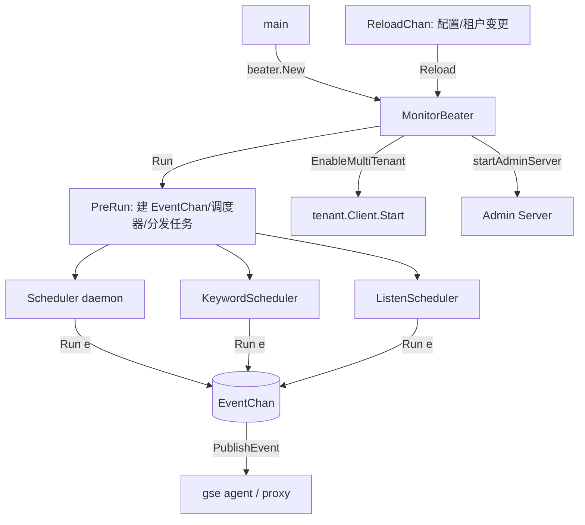

# 总览

<cite>
**本文引用的文件**
- [程序入口 main](file://bkmonitor-datalink/pkg/bkmonitorbeat/main.go)
- [Beater 总控 beater.go](file://bkmonitor-datalink/pkg/bkmonitorbeat/beater/beater.go)
- [契约层 define](file://bkmonitor-datalink/pkg/bkmonitorbeat/define/task.go)
- [配置体系 configs](file://bkmonitor-datalink/pkg/bkmonitorbeat/configs/config.go)
- [调度框架 scheduler](file://bkmonitor-datalink/pkg/bkmonitorbeat/scheduler/scheduler.go)
- [采集任务 tasks](file://bkmonitor-datalink/pkg/bkmonitorbeat/tasks/task.go)
- [上报通道 report](file://bkmonitor-datalink/pkg/bkmonitorbeat/report/report.go)
- [多租户 tenant](file://bkmonitor-datalink/pkg/bkmonitorbeat/tenant/client.go)
</cite>

## 目录
- [简介](#简介)
- [子页面导航](#子页面导航)
- [项目结构](#项目结构)
- [核心组件](#核心组件)
- [架构总览](#架构总览)
- [组件详细分析](#组件详细分析)
- [依赖关系分析](#依赖关系分析)
- [结论](#结论)

## 子页面导航
本总览的下钻子页（按阅读顺序）：

章节来源
- [Beater 总控编排决定子页划分](file://bkmonitor-datalink/pkg/bkmonitorbeat/beater/beater.go#L141-L322)
- [接口与契约层](02-接口与契约层.md)：`define/` 契约接口与公共类型
- [配置体系](03-配置体系.md)：`configs/` 全局与任务配置、并发限制
- [调度框架](04-调度框架.md)：`scheduler/` 五种调度器
- [采集任务框架](05-采集任务框架.md)：`tasks/` 顶层 BaseTask/Semaphore/Event
- [采集任务分类总览](06-采集任务分类总览.md)：26 个采集子模块归类
- [采集任务深化：basereport](07-采集任务深化-basereport.md)：主机基础指标字段下钻
- [工具与上报通道](08-工具与上报通道.md)：`utils/` 工具集与 `report/` 旁路上报
- [HTTP服务与多租户](09-HTTP服务与多租户.md)：`http/` Admin 服务与 `tenant/` 多租户

## 简介
bkmonitorbeat 是蓝鲸监控（BlueKing Monitor）的数据采集器（采集端 beat），负责在目标主机/容器上采集主机指标、网络探测、进程、日志与事件、资产等多类监控数据，并经 gse agent 或直接 HTTP 上报到 bkmonitorproxy。其代码以「契约层 + 配置 + 调度 + 采集任务 + 支撑通道」分层组织，通过接口解耦，具备高可扩展性与统一的热更新能力。本页为总览，子主题详见《接口与契约层》《配置体系》《调度框架》《采集任务框架》《采集任务分类总览》《工具与上报通道》《HTTP服务与多租户》。

章节来源
- [程序入口 main](file://bkmonitor-datalink/pkg/bkmonitorbeat/main.go#L69-L190)
- [Beater 总控 beater.go](file://bkmonitor-datalink/pkg/bkmonitorbeat/beater/beater.go#L141-L190)

## 项目结构
```
bkmonitorbeat/
├── main.go            程序入口：flag 解析、beater 创建与运行、旁路子命令
├── beater/            总控层：MonitorBeater、配置引擎、调度器工厂、taskfactory
├── define/            契约层：Task/Scheduler/Beater/Event/Config 接口与公共类型
├── configs/           配置体系：全局 Config、BaseTaskParam、各任务配置、并发限制
├── scheduler/         调度框架：BaseScheduler + daemon/cron/check/keyword/listen
├── tasks/             采集任务层：26 个子模块 + 顶层公共机制（BaseTask/Semaphore/Event）
├── utils/             工具集：HookManager、IP/域名校验、匹配、RPM、cgroup 等
├── report/            旁路上报通道：命令行直接上报（agent/http）
├── http/              Admin HTTP 服务（gse debug handler）
└── tenant/            多租户 DataID 拉取与热更新
```

章节来源
- [程序入口 main](file://bkmonitor-datalink/pkg/bkmonitorbeat/main.go#L69-L190)
- [Beater 总控 beater.go](file://bkmonitor-datalink/pkg/bkmonitorbeat/beater/beater.go#L141-L322)
- [契约层 define](file://bkmonitor-datalink/pkg/bkmonitorbeat/define/task.go#L17-L77)
- [采集任务 tasks](file://bkmonitor-datalink/pkg/bkmonitorbeat/tasks/task.go#L23-L152)

## 核心组件
| 层 | 核心组件 | 职责 |
|----|----------|------|
| 入口 | `main` / `beater.MonitorBeater` | 解析参数、创建并运行 beater、驱动整个采集生命周期 |
| 契约 | `define.Task`/`Scheduler`/`Beater`/`Event`/`Config` | 各层解耦的接口与公共类型（Module 常量、状态枚举） |
| 配置 | `configs.Config` / `ConfigEngine` | 加载、清洗、按 Type 分发任务配置，提供并发限制 |
| 调度 | `scheduler.BaseScheduler` + 5 种调度器 | 按 daemon/cron/check/keyword/listen 驱动任务执行 |
| 采集 | `tasks/*`（26 模块） + `BaseTask`/`Semaphore`/`Event` | 具体采集实现与统一运行骨架 |
| 支撑 | `utils` / `report` / `http` / `tenant` | 工具、旁路上报、Admin 服务、多租户 DataID |

章节来源
- [契约层 define](file://bkmonitor-datalink/pkg/bkmonitorbeat/define/task.go#L66-L77)
- [调度框架 scheduler](file://bkmonitor-datalink/pkg/bkmonitorbeat/scheduler/scheduler.go#L25-L35)
- [采集任务 tasks](file://bkmonitor-datalink/pkg/bkmonitorbeat/tasks/task.go#L24-L118)
- [Beater 总控 beater.go](file://bkmonitor-datalink/pkg/bkmonitorbeat/beater/beater.go#L491-L576)

## 架构总览
启动链路：`main` → `beater.New`（创建 beater、按 `EnableMultiTenant` 建 `tcli`）→ `bt.Run`：`tcli.Start` → `PreRun`（建 EventChan、按 Mode 建 3 个调度器、按任务 Type 分发到对应调度器）→ `startAdminServer` → 启动 `Scheduler`/`KeywordScheduler`/`ListenScheduler` → 主循环消费 `EventChan` 调用 `PublishEvent`，并监听 `ReloadChan`/信号/心跳 → 退出时 `Stop` 三调度器并 `PostRun`。

章节来源
- [程序入口 main](file://bkmonitor-datalink/pkg/bkmonitorbeat/main.go#L180-L189)
- [Beater New 创建 tcli](file://bkmonitor-datalink/pkg/bkmonitorbeat/beater/beater.go#L141-L184)
- [Beater PreRun 建调度器并分发任务](file://bkmonitor-datalink/pkg/bkmonitorbeat/beater/beater.go#L293-L322)
- [Beater Run 启动与事件循环](file://bkmonitor-datalink/pkg/bkmonitorbeat/beater/beater.go#L491-L576)



图表来源
- [程序入口 main](file://bkmonitor-datalink/pkg/bkmonitorbeat/main.go#L180-L189)
- [Beater New 创建 tcli](file://bkmonitor-datalink/pkg/bkmonitorbeat/beater/beater.go#L180-L184)
- [Beater PreRun 建调度器并分发任务](file://bkmonitor-datalink/pkg/bkmonitorbeat/beater/beater.go#L293-L322)
- [Beater Run 启动与事件循环](file://bkmonitor-datalink/pkg/bkmonitorbeat/beater/beater.go#L491-L576)
- [多租户 Client Start](file://bkmonitor-datalink/pkg/bkmonitorbeat/tenant/client.go#L151-L158)

## 组件详细分析
### 启动与生命周期
- `main`（main.go L69）：`senderhttp.Register()` 注册 HTTP Sender；非 `-report` 模式时 `senderagent.Register` 注册 agent Sender；解析 `logging` 配置并初始化日志；`beater.New` 创建 beater，最后 `bt.Run()` 进入常驻运行。
- `beater.New`（beater.go L142）：建立可取消 `ctx`、加载 `config`；若 `EnableMultiTenant` 则创建 `tenant.Client`（`tcli`）。
- `beater.Run`（beater.go L491）：`tcli.Start()` → `PreRun()` → `startAdminServer()`/`startAdminServerReloader()` → 依次 `Start` 三个调度器 → 主循环（监听 `sig`/`beat.ReloadChan`/`ctx.Done()`/`EventChan`/`heartBeatTicker`）→ 退出时 `Stop` 三调度器并 `PostRun`。
- `PreRun`（beater.go L293）：建 `EventChan`；`schedulerfactory.New` 按 `Mode` 与 `SchedulerTypeKeyword`/`SchedulerTypeListen` 建三个调度器；`GetTasks` 取出任务，按 `ConfigTypeKeyword`→KeywordScheduler、`ConfigTypeTrap/Metric/Kubeevent/Dmesg`→ListenScheduler、其余→Scheduler 分发；执行 `HookPreRun`。

章节来源
- [程序入口 main](file://bkmonitor-datalink/pkg/bkmonitorbeat/main.go#L180-L189)
- [Beater New 创建 tcli](file://bkmonitor-datalink/pkg/bkmonitorbeat/beater/beater.go#L141-L184)
- [Beater Run 启动与事件循环](file://bkmonitor-datalink/pkg/bkmonitorbeat/beater/beater.go#L491-L576)
- [Beater PreRun 建调度器并分发任务](file://bkmonitor-datalink/pkg/bkmonitorbeat/beater/beater.go#L293-L322)

### 分层协作
- **契约解耦**：`define` 提供接口，`beater`/`configs`/`scheduler`/`tasks` 均面向接口编程（详见《接口与契约层》）。
- **配置驱动**：`configs` + `ConfigEngine` 加载并清洗配置，按 `Type` 经 `taskfactory` 实例化任务（详见《配置体系》《采集任务分类总览》）。
- **调度驱动采集**：`scheduler` 按模式驱动各 `tasks/*` 的 `Gather.Run`，任务内嵌 `BaseTask` 借 `Semaphore` 限流、借 `Event` 封装上报（详见《调度框架》《采集任务框架》）。
- **上报与运维**：常驻链路经 `EventChan`→`PublishEvent` 上报；`report` 提供独立 CLI 上报；`http` 提供 Admin 服务；`tenant` 在多租户下热拉 DataID（详见《工具与上报通道》《HTTP服务与多租户》）。

章节来源
- [契约层 define](file://bkmonitor-datalink/pkg/bkmonitorbeat/define/task.go#L66-L77)
- [调度框架 scheduler](file://bkmonitor-datalink/pkg/bkmonitorbeat/scheduler/scheduler.go#L25-L35)
- [采集任务 tasks](file://bkmonitor-datalink/pkg/bkmonitorbeat/tasks/task.go#L24-L118)
- [上报通道 report](file://bkmonitor-datalink/pkg/bkmonitorbeat/report/report.go#L138-L174)
- [多租户 Client（gse agent-message）](file://bkmonitor-datalink/pkg/bkmonitorbeat/tenant/client.go#L33-L199)

## 依赖关系分析
- `define` 在最底层，被所有层依赖；`beater` 是编排中枢，依赖 `configs`/`scheduler`/`tasks`/`http`/`tenant`/`report`/`define`。
- `tasks` 依赖 `define`/`configs`/`utils`；被 `beater`/`taskfactory` 实例化、`scheduler` 驱动。
- `configs` 被 `beater`/`taskfactory`/各 `tasks` 配置消费；`scheduler` 依赖 `define.Task`/`define.Scheduler`。
- `report`/`http`/`tenant` 为相对独立的支撑组件，经 `main`/`beater` 挂载；`tenant` 变更与配置热更新共用 `beat.ReloadChan`。

章节来源
- [Beater 总控 beater.go](file://bkmonitor-datalink/pkg/bkmonitorbeat/beater/beater.go#L141-L322)
- [契约层 define](file://bkmonitor-datalink/pkg/bkmonitorbeat/define/task.go#L10-L77)
- [采集任务 tasks](file://bkmonitor-datalink/pkg/bkmonitorbeat/tasks/task.go#L23-L152)
- [多租户 Client（gse agent-message）](file://bkmonitor-datalink/pkg/bkmonitorbeat/tenant/client.go#L73-L97)

## 结论
bkmonitorbeat 以清晰的分层与接口契约，将「入口编排 → 配置加载 → 调度驱动 → 任务采集 → 事件上报 → 运维/多租户支撑」串成一条可热更新的采集管线。新增采集能力只需在 `tasks/` 下新增一个子模块（实现 `Gather.Run` 并注册到 `taskfactory`），即可被整套调度与上报框架接管，体现了「高内聚、低耦合、易扩展」的设计目标。

章节来源
- [程序入口 main](file://bkmonitor-datalink/pkg/bkmonitorbeat/main.go#L69-L190)
- [Beater 总控 beater.go](file://bkmonitor-datalink/pkg/bkmonitorbeat/beater/beater.go#L491-L576)
- [契约层 define](file://bkmonitor-datalink/pkg/bkmonitorbeat/define/task.go#L66-L77)
- [采集任务 tasks](file://bkmonitor-datalink/pkg/bkmonitorbeat/tasks/task.go#L24-L118)
