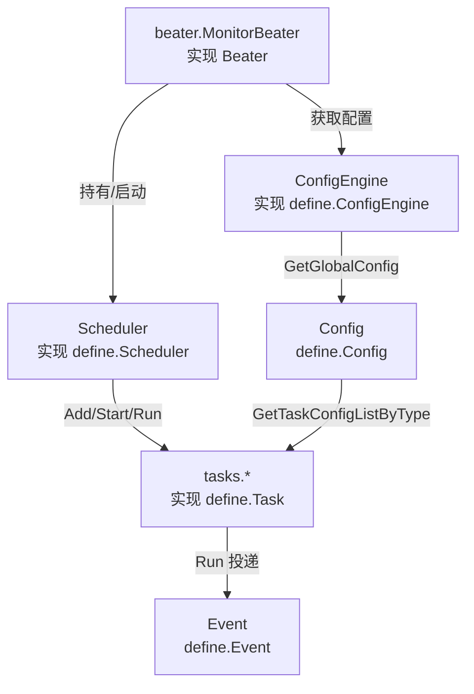

# 接口与契约层

> 返回：[总览](01-总览.md)
<cite>
**本文引用的文件**
- [Task 接口与模块常量](file://bkmonitor-datalink/pkg/bkmonitorbeat/define/task.go)
- [Beater 接口与运行状态](file://bkmonitor-datalink/pkg/bkmonitorbeat/define/beater.go)
- [Scheduler 接口与调度状态](file://bkmonitor-datalink/pkg/bkmonitorbeat/define/scheduler.go)
- [配置相关接口与默认常量](file://bkmonitor-datalink/pkg/bkmonitorbeat/define/config.go)
- [Event 事件接口](file://bkmonitor-datalink/pkg/bkmonitorbeat/define/event.go)
- [进程公共数据结构](file://bkmonitor-datalink/pkg/bkmonitorbeat/define/proc.go)
</cite>

## 目录
- [简介](#简介)
- [项目结构](#项目结构)
- [核心组件](#核心组件)
- [架构总览](#架构总览)
- [组件详细分析](#组件详细分析)
- [依赖关系分析](#依赖关系分析)
- [结论](#结论)

## 简介
`define/` 包是 bkmonitorbeat 各层之间解耦的**契约层**。它不依赖任何具体实现，只定义全局接口（Task、Scheduler、Beater、Event、Config、ConfigEngine）与公共类型（模块名常量、任务/调度器状态枚举、进程采集结构等），供 `beater/`、`configs/`、`scheduler/`、`tasks/` 各层按接口编程、互不耦合。

章节来源
- [Task 接口与模块常量](file://bkmonitor-datalink/pkg/bkmonitorbeat/define/task.go#L10-L77)
- [Beater 接口与运行状态](file://bkmonitor-datalink/pkg/bkmonitorbeat/define/beater.go#L10-L52)
- [Scheduler 接口与调度状态](file://bkmonitor-datalink/pkg/bkmonitorbeat/define/scheduler.go#L10-L35)
- [配置相关接口与默认常量](file://bkmonitor-datalink/pkg/bkmonitorbeat/define/config.go#L10-L76)
- [Event 事件接口](file://bkmonitor-datalink/pkg/bkmonitorbeat/define/event.go#L10-L21)
- [进程公共数据结构](file://bkmonitor-datalink/pkg/bkmonitorbeat/define/proc.go#L10-L69)

## 项目结构
`define/` 目录以单一职责的方式组织契约：

| 文件 | 职责 |
|------|------|
| `task.go` | `Task` 接口、`Module*` 模块名常量、`Status` 任务状态枚举、UTC 时间格式 |
| `beater.go` | `Beater` 接口、`BeaterStatus`/`GatherStatus` 状态常量、`LogConfig` 日志配置、`GlobalWatcher` |
| `scheduler.go` | `Scheduler` 接口、调度器状态枚举 |
| `config.go` | `CompositeConfig`/`CompositeParam`/`TaskConfig`/`TaskMetaConfig`/`Config`/`ConfigEngine` 接口与默认超时/并发常量 |
| `event.go` | `Event` 事件接口 |
| `proc.go` | 进程采集公共结构 `ProcStat`/`IOStat`/`CPUStat`/`MemStat`/`FdStat` 等 |

章节来源
- [Task 接口与模块常量](file://bkmonitor-datalink/pkg/bkmonitorbeat/define/task.go#L16-L77)
- [Beater 接口与运行状态](file://bkmonitor-datalink/pkg/bkmonitorbeat/define/beater.go#L18-L52)
- [Scheduler 接口与调度状态](file://bkmonitor-datalink/pkg/bkmonitorbeat/define/scheduler.go#L16-L35)
- [配置相关接口与默认常量](file://bkmonitor-datalink/pkg/bkmonitorbeat/define/config.go#L18-L76)
- [Event 事件接口](file://bkmonitor-datalink/pkg/bkmonitorbeat/define/event.go#L16-L21)
- [进程公共数据结构](file://bkmonitor-datalink/pkg/bkmonitorbeat/define/proc.go#L16-L69)

## 核心组件
`define/` 的核心是一组接口与全局常量，它们构成调度与采集的骨架：

- **模块名常量（`Module*`）**：标识各类采集任务，如 `ModuleBasereport="basereport"`、`ModuleProcessbeat="processbeat"`、`ModulePing="ping"`、`ModuleTrap="snmptrap"` 等，被 `tasks/` 子目录与配置 `Type` 字段直接引用。
- **任务状态枚举（`Status`）**：`TaskReady`/`TaskRunning`/`TaskError`/`TaskFinished`，调度器据此管理任务生命周期。
- **调度器状态枚举**：`SchedulerReady`/`SchedulerRunning`/`SchedulerError`/`SchedulerTerminting`/`SchedulerFinished`。
- **Beater 状态常数**：`BeaterStatusUnknown/Error/Ready/Running/Terminating/Terminated` 与 `GatherStatusUnknown/OK/Error`。
- **默认常量**：`DefaultTimeout=3s`、`DefaultPeriod=10s`、`DefaultTaskConcurrencyLimitPerInstance=100000`、`DefaultTaskConcurrencyLimitPerTask=1000`。

章节来源
- [模块名常量定义](file://bkmonitor-datalink/pkg/bkmonitorbeat/define/task.go#L17-L48)
- [任务状态枚举](file://bkmonitor-datalink/pkg/bkmonitorbeat/define/task.go#L54-L63)
- [调度器状态枚举](file://bkmonitor-datalink/pkg/bkmonitorbeat/define/scheduler.go#L16-L23)
- [Beater 状态常数](file://bkmonitor-datalink/pkg/bkmonitorbeat/define/beater.go#L18-L31)
- [默认超时与并发常量](file://bkmonitor-datalink/pkg/bkmonitorbeat/define/config.go#L18-L23)

## 架构总览
`define/` 通过接口在三个角色之间建立解耦关系：Beater 持有并驱动 Scheduler，Scheduler 管理与执行 Task，所有 Task 把采集结果以 Event 形式投递；ConfigEngine 经由 Config 接口向各 Task 下发配置。

章节来源
- [Beater 接口定义](file://bkmonitor-datalink/pkg/bkmonitorbeat/define/beater.go#L33-L41)
- [Scheduler 接口定义](file://bkmonitor-datalink/pkg/bkmonitorbeat/define/scheduler.go#L25-L35)
- [Task 接口定义](file://bkmonitor-datalink/pkg/bkmonitorbeat/define/task.go#L66-L77)
- [Event 接口定义](file://bkmonitor-datalink/pkg/bkmonitorbeat/define/event.go#L16-L21)
- [Config 与 ConfigEngine 接口](file://bkmonitor-datalink/pkg/bkmonitorbeat/define/config.go#L57-L76)

图表来源
- [Beater 接口定义](file://bkmonitor-datalink/pkg/bkmonitorbeat/define/beater.go#L33-L41)
- [Scheduler 接口定义](file://bkmonitor-datalink/pkg/bkmonitorbeat/define/scheduler.go#L25-L35)
- [Task 接口定义](file://bkmonitor-datalink/pkg/bkmonitorbeat/define/task.go#L66-L77)
- [Event 接口定义](file://bkmonitor-datalink/pkg/bkmonitorbeat/define/event.go#L16-L21)
- [Config 与 ConfigEngine 接口](file://bkmonitor-datalink/pkg/bkmonitorbeat/define/config.go#L57-L76)

## 组件详细分析
### Task 接口
`Task` 是调度器可执行的最小单元，方法覆盖身份、配置、生命周期与执行：
- 身份/状态：`GetTaskID() int32`、`GetStatus() Status`
- 配置注入：`SetConfig(TaskConfig)`、`GetConfig()`、`SetGlobalConfig(Config)`、`GetGlobalConfig()`
- 生命周期：`Reload()`、`Wait()`、`Stop()`
- 执行：`Run(ctx context.Context, e chan<- Event)` —— 采集逻辑在 `Run` 中执行，并将结果写入事件通道 `e`

章节来源
- [Task 接口定义](file://bkmonitor-datalink/pkg/bkmonitorbeat/define/task.go#L66-L77)

### Scheduler 接口
`Scheduler` 管理一组 Task 的执行：
- `Add(Task)` 注册任务、`Start(context.Context) error` 启动调度、`Stop()`/`Wait()` 停止与等待
- `IsDaemon() bool` 标识是否为常驻守护调度、`Count() int` 返回任务数、`GetStatus() Status` 取状态
- `Reload(context.Context, Config, []Task) error` 热更新任务列表与全局配置

章节来源
- [Scheduler 接口定义](file://bkmonitor-datalink/pkg/bkmonitorbeat/define/scheduler.go#L25-L35)
- [调度器状态枚举](file://bkmonitor-datalink/pkg/bkmonitorbeat/define/scheduler.go#L16-L23)

### Beater 接口
`Beater` 是采集进程的总控入口：
- `Run() error` 主运行、`Stop()` 停止、`Reload(*common.Config)` 热加载配置
- `GetEventChan() chan Event` 暴露事件通道、`GetConfig() Config` 取全局配置、`GetScheduler() Scheduler` 取调度器
- `BeaterStatus*` 描述进程状态；`LogConfig` 描述日志输出（stdout/level/path/maxsize/maxage/backups）；`GlobalWatcher` 为全局主机信息 watcher

章节来源
- [Beater 接口定义](file://bkmonitor-datalink/pkg/bkmonitorbeat/define/beater.go#L33-L41)
- [Beater 状态常数](file://bkmonitor-datalink/pkg/bkmonitorbeat/define/beater.go#L18-L31)
- [LogConfig 与 GlobalWatcher](file://bkmonitor-datalink/pkg/bkmonitorbeat/define/beater.go#L43-L52)

### Event 接口
`Event` 是采集产物：
- `AsMapStr() common.MapStr` 序列化为上报字段
- `IgnoreCMDBLevel() bool` 是否忽略 CMDB 层级标签
- `GetType() string` 事件类型

章节来源
- [Event 接口定义](file://bkmonitor-datalink/pkg/bkmonitorbeat/define/event.go#L16-L21)

### Config 与 ConfigEngine 接口
配置侧配套接口：
- `CompositeConfig.CleanConfig()` / `CompositeParam.CleanParams()`：配置与参数的清洗钩子
- `TaskConfig`：单任务配置契约（`GetBizID`/`GetIdent`/`GetDataID`/`GetPeriod`/`GetType`/`GetLabels`/`Clean` 等）
- `TaskMetaConfig`：任务元配置，聚合一组 `TaskConfig`（`GetTaskConfigList`）
- `Config`：全局配置，`GetTaskConfigListByType(type)` 按模块名取任务列表、`GetGatherUpDataID`、`Clean`
- `ConfigEngine`：配置引擎，`Init`/`ReInit` 初始化、`GetTaskConfigList`/`GetTaskNum`/`GetWrongTaskNum` 统计、`RefreshHeartBeat`/`SendHeartBeat` 心跳、`GetGlobalConfig`、`HasChildPath` 是否支持子配置路径

章节来源
- [配置相关接口与默认常量](file://bkmonitor-datalink/pkg/bkmonitorbeat/define/config.go#L18-L76)

### 进程公共结构（proc.go）
`proc.go` 定义进程采集的共享数据模型，被 `tasks/processbeat` 等模块复用：
- `ProcStat`：进程基础信息（Pid/PPid/Name/Cwd/Exe/Cmd/Status/Username/Created）及内嵌 `Mem`/`CPU`/`IO`/`Fd` 指标指针
- `IOStat`：读写字节与速率；`CPUStat`：CPU 时间片与占用百分比；`MemStat`：内存大小与占用百分比；`FdStat`：打开文件描述符及软/硬限制

章节来源
- [进程公共数据结构](file://bkmonitor-datalink/pkg/bkmonitorbeat/define/proc.go#L16-L69)

### Module 常量表
`define/task.go` 中 `Module*` 常量与 `tasks/` 子模块一一对应，是配置 `Type` 与调度分发的枢纽：

| 常量 | 值 | 说明 |
|------|-----|------|
| `ModuleBasereport` | `basereport` | 主机基础指标 |
| `ModuleProcessbeat` | `processbeat` | 进程指标 |
| `ModulePing` | `ping` | ICMP 探测 |
| `ModuleTCP` | `tcp` | TCP 探测 |
| `ModuleUDP` | `udp` | UDP 探测 |
| `ModuleHTTP` | `http` | HTTP 探测 |
| `ModuleKeyword` | `keyword` | 日志关键字 |
| `ModuleTrap` | `snmptrap` | SNMP Trap |
| `ModuleKubeevent` | `kubeevent` | K8s 事件 |
| `ModuleDmesg` | `dmesg` | 内核日志 |
| `ModuleExceptionbeat` | `exceptionbeat` | 异常事件 |
| `ModuleProcStatus`/`ProcConf`/`ProcCustom`/`ProcSync`/`ProcBin`/`ProcSnapshot` | `procstatus` 等 | 进程相关子采集 |
| `ModuleSocketSnapshot` | `socketsnapshot` | 套接字快照 |
| `ModuleLoginLog`/`ShellHistory`/`RpmPackage` | `loginlog` 等 | 安全/资产类采集 |
| `ModuleStatus`/`Static`/`TimeSync`/`SelfStats`/`GatherUpBeat` 等 | — | 心跳/状态/自监控 |

章节来源
- [模块名常量定义](file://bkmonitor-datalink/pkg/bkmonitorbeat/define/task.go#L17-L48)

## 依赖关系分析
`define/` 位于依赖图最底层，**不导入** `beater`/`configs`/`scheduler`/`tasks` 任何实现包，仅依赖外部库（`context`、`time`、`common`、`host`）。反之：
- `beater/` 通过 `define.Beater`/`define.Scheduler`/`define.Event`/`define.Config`/`define.ConfigEngine` 编程
- `scheduler/` 通过 `define.Scheduler`/`define.Task`/`define.Status` 编程
- `tasks/` 各采集任务实现 `define.Task`，消费 `define.Event`/`define.TaskConfig` 及 `define.ProcStat` 等结构
- `configs/` 的配置结构体实现 `define.TaskConfig`/`define.TaskMetaConfig`/`define.Config`

通过接口而非具体类型耦合，使调度框架、采集任务、配置体系可独立演进与单测。

章节来源
- [Beater 接口定义](file://bkmonitor-datalink/pkg/bkmonitorbeat/define/beater.go#L33-L41)
- [Scheduler 接口定义](file://bkmonitor-datalink/pkg/bkmonitorbeat/define/scheduler.go#L25-L35)
- [Task 接口定义](file://bkmonitor-datalink/pkg/bkmonitorbeat/define/task.go#L66-L77)
- [配置相关接口与默认常量](file://bkmonitor-datalink/pkg/bkmonitorbeat/define/config.go#L25-L76)

## 结论
`define/` 以纯接口 + 公共类型的方式为 bkmonitorbeat 建立了解耦契约：模块名常量统一了配置 `Type` 与任务分发的命名空间；`Task`/`Scheduler`/`Beater` 三接口界定了"采集单元—调度—总控"的职责边界；`Config`/`ConfigEngine` 与 `Event` 分别规范了配置下发与数据上报的通道；`proc.go` 等结构为具体采集模块提供可复用的数据模型。下游各层均面向这些接口编程，是该采集器可扩展、可测试的基础。

章节来源
- [Task 接口与模块常量](file://bkmonitor-datalink/pkg/bkmonitorbeat/define/task.go#L17-L77)
- [Beater 接口与运行状态](file://bkmonitor-datalink/pkg/bkmonitorbeat/define/beater.go#L33-L52)
- [配置相关接口与默认常量](file://bkmonitor-datalink/pkg/bkmonitorbeat/define/config.go#L25-L76)
