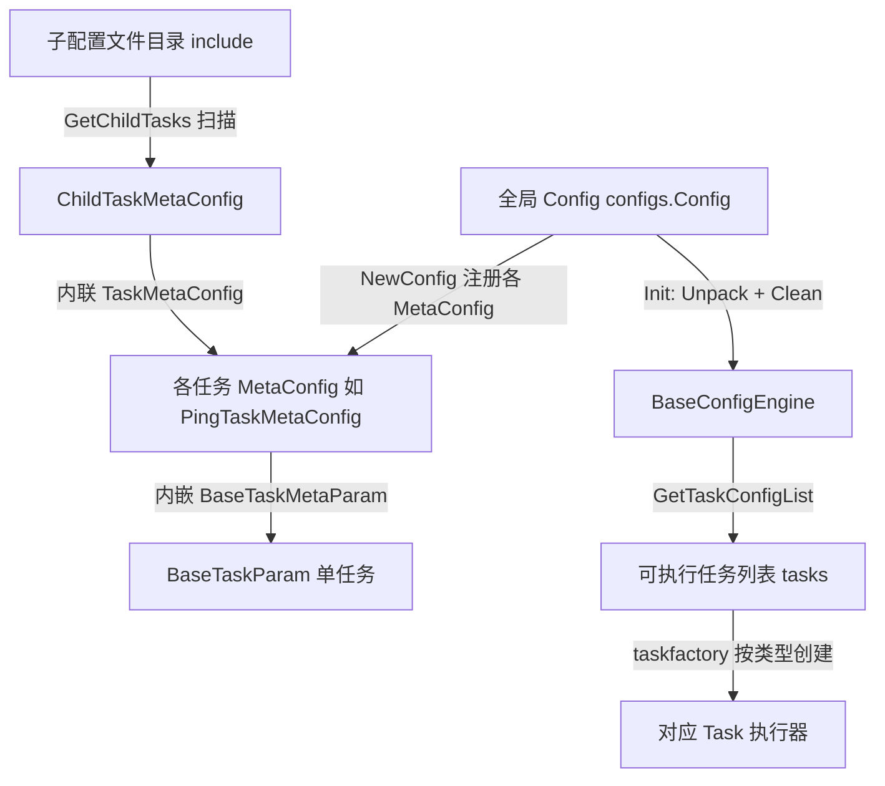

# 配置体系

> 返回：[总览](01-总览.md)
<cite>
**本文引用的文件**
- [全局配置与并发限制](file://bkmonitor-datalink/pkg/bkmonitorbeat/configs/config.go)
- [任务基类参数](file://bkmonitor-datalink/pkg/bkmonitorbeat/configs/basetaskparam.go)
- [子任务配置](file://bkmonitor-datalink/pkg/bkmonitorbeat/configs/childconfig.go)
- [系统指标采集配置](file://bkmonitor-datalink/pkg/bkmonitorbeat/configs/basereport.go)
- [Ping 任务配置](file://bkmonitor-datalink/pkg/bkmonitorbeat/configs/pingconfig.go)
- [TCP 任务配置](file://bkmonitor-datalink/pkg/bkmonitorbeat/configs/tcpconfig.go)
- [HTTP 任务配置](file://bkmonitor-datalink/pkg/bkmonitorbeat/configs/httpconfig.go)
- [进程采集配置](file://bkmonitor-datalink/pkg/bkmonitorbeat/configs/processbeat.go)
- [配置引擎](file://bkmonitor-datalink/pkg/bkmonitorbeat/beater/configengine.go)
</cite>

## 目录
- [简介](#简介)
- [项目结构](#项目结构)
- [核心组件](#核心组件)
- [架构总览](#架构总览)
- [组件详细分析](#组件详细分析)
- [依赖关系分析](#依赖关系分析)
- [结论](#结论)

## 简介
`configs/` 包统一定义了 bkmonitorbeat 中所有采集任务的配置结构体，以及这些配置的解析、默认填充、校验与标识（ident）生成逻辑。每个任务类型都由一个 `MetaConfig`（任务组配置）与若干 `TaskConfig`（单任务配置）组成，并通过统一的接口被配置引擎加载、清洗后下发到对应的 task 执行器。

章节来源
- [全局配置结构](file://bkmonitor-datalink/pkg/bkmonitorbeat/configs/config.go#L10-L13)
- [任务基类参数定义](file://bkmonitor-datalink/pkg/bkmonitorbeat/configs/basetaskparam.go#L10-L11)

## 项目结构
`configs/` 目录采用"一任务一文件"的组织方式，每个采集任务类型对应一个源文件，所有文件同属 `configs` 包：
- `config.go`：全局 `Config` 聚合结构、`NewConfig` 构造器、并发限制配置定义、配置清洗入口。
- `basetaskparam.go`：所有任务共用的基类 `BaseTaskParam` 与组配置基类 `BaseTaskMetaParam`，提供字段默认值填充、标签/业务 ID 解析、ident 计算等通用逻辑。
- `childconfig.go`：子任务机制 `ChildTaskMetaConfig`，支持从独立配置文件目录加载任务。
- 各任务配置文件（如 `basereport.go`、`pingconfig.go`、`tcpconfig.go`、`httpconfig.go`、`processbeat.go` 等）分别定义对应任务类型的具体字段与清洗规则。

章节来源
- [全局配置聚合](file://bkmonitor-datalink/pkg/bkmonitorbeat/configs/config.go#L70-L133)
- [任务基类参数](file://bkmonitor-datalink/pkg/bkmonitorbeat/configs/basetaskparam.go#L24-L25)
- [子任务配置](file://bkmonitor-datalink/pkg/bkmonitorbeat/configs/childconfig.go#L18-L33)

## 核心组件
### 全局 Config 聚合结构
`Config` 结构（`config.go#L71-L133`）聚合了所有任务类型的 MetaConfig 指针（如 `TCPTask`、`PingTask`、`BaseReportTask`、`ProcessBeatTask` 等），以及全局运行参数（`CheckInterval`、`CleanUpTimeout`、`EventBufferSize`、`Mode`、`MetricsBatchSize`、多租户开关、节点/主机标识、并发限制等）。`TaskTypeMapping` 字段以任务类型名为 key，将各 `MetaConfig` 注册到统一映射中，作为后续批量清洗与任务列表提取的入口。

`NewConfig()`（`config.go#L136-L175`）为所有任务类型构造默认 MetaConfig 并完成注册，同时为全局参数设置了默认值（如 `CheckInterval=500ms`、`Mode="check"`、`EventBufferSize=10`）。

`Clean()`（`config.go#L183-L202`）遍历 `TaskTypeMapping` 逐个调用各 MetaConfig 的 `Clean()`，并在 `daemon` 模式下校验心跳 data id，最后统一调用并发限制配置的 `Clean()`。

### 任务基类 BaseTaskParam / BaseTaskMetaParam
`BaseTaskParam`（`basetaskparam.go#L25-L38`）是所有单任务配置的内嵌基类，承载通用字段：
- `DataID`、`BizID`、`TaskID`（必填）、`Timeout`、`AvailableDuration`、`Period`（最小 1s）、`Labels`、`Tags`。
- 通过 `CleanParams()`（`basetaskparam.go#L124-L143`）对 `Timeout`、`AvailableDuration`、`Period` 进行默认填充，并解析 `Labels` 中的 `bk_biz_id`。
- 通过 `initIdent()`（`basetaskparam.go#L112-L121`）将 `Labels` 转换为排序后的 `Tags` 并计算哈希 `Ident`，作为任务去重与唯一标识的依据；并提供 `GetDataID/GetPeriod/GetTaskID/GetBizID` 等一系列取值方法。

`BaseTaskMetaParam`（`basetaskparam.go#L195-L199`）是所有组配置（MetaConfig）的基类，承载组级约束 `DataID`（必填）、`MaxTimeout`、`MinPeriod`。其 `CleanParams()` 做默认值填充；`CleanTask()`（`basetaskparam.go#L213-L244`）在单个任务清洗后对 `BaseTaskParam` 施加约束：把 `Timeout` 收敛到不超过 `MaxTimeout`，把 `Period` 收敛到不小于 `MinPeriod`，并保证 `Timeout ≤ Period`，缺失时回退使用组级 `DataID`，最后重新计算 ident。

### 子任务机制 ChildTaskMetaConfig
`ChildTaskMetaConfig`（`childconfig.go#L27-L33`）内联了一个 `define.TaskMetaConfig`，并附加 `Version`、`Name`、`Type`、`Path` 等子任务元信息。`Clean()`（`childconfig.go#L36-L63`）先清洗内联的任务配置，校验 `Name` 与 `Version` 非空，再对每个子任务在其原始 ident 基础上叠加 `Name/Type/Version` 重新计算 ident，用于区分来自同一模板的不同子配置实例。

章节来源
- [并发限制配置](file://bkmonitor-datalink/pkg/bkmonitorbeat/configs/config.go#L42-L202)
- [任务基类参数与清洗](file://bkmonitor-datalink/pkg/bkmonitorbeat/configs/basetaskparam.go#L24-L258)
- [子任务配置](file://bkmonitor-datalink/pkg/bkmonitorbeat/configs/childconfig.go#L18-L63)

## 架构总览
配置的生命周期遵循"加载 → 解析 → 清洗 → 合并 → 下发"的链路：

图表来源
- [配置引擎初始化](file://bkmonitor-datalink/pkg/bkmonitorbeat/beater/configengine.go#L60-L296)

配置引擎（`beater/configengine.go`）在 `Init()`（`configengine.go#L60-L97`）中调用 `configs.NewConfig()` 并通过 `cfg.Unpack(baseConfig)` 将原始配置反序列化到 `Config`，随后执行 `baseConfig.Clean()` 完成全局清洗，再通过 `GetTaskConfigList()` 收集全局任务；子任务则通过 `GetChildTasks()`（`configengine.go#L121-L149`）从配置的 `include` 目录递归扫描子配置文件，经 `GetChildTask()`（`configengine.go#L200-L228`）解析、填充为 `ChildTaskMetaConfig`。`CleanTaskConfigList()`（`configengine.go#L283-L296`）整合全局与子任务，并以 ident 去重，最终形成可下发到各 task 的任务集合。

章节来源
- [配置引擎初始化](file://bkmonitor-datalink/pkg/bkmonitorbeat/beater/configengine.go#L30-L97)
- [子任务加载](file://bkmonitor-datalink/pkg/bkmonitorbeat/beater/configengine.go#L121-L268)
- [任务列表整合](file://bkmonitor-datalink/pkg/bkmonitorbeat/beater/configengine.go#L283-L364)

## 组件详细分析
### 系统指标采集配置（以 basereport 为代表）
`BasereportConfig`（`basereport.go#L79-L93`）内联 `BaseTaskParam`，并包含 `TimeTolerate` 与四个子模块配置：`CpuConfig`、`DiskConfig`、`MemConfig`、`NetConfig`，以及环境信息上报开关 `ReportCrontab/ReportHosts/ReportRoute`。各子模块通过 `StatTimes`、`InfoPeriod`、`*WhiteList`/`*BlackList` 等字段控制采集频率与过滤规则（白/黑名单以正则 Pattern 形式配置，运行时编译为 `*regexp.Regexp`）。

其 `GetTaskConfigList()`（`basereport.go#L95-L109`）约定一个 `BasereportConfig` 有且仅有一个任务：当 `DataID == 0` 时返回空列表（无任务），否则优先从多租户存储 `tenant.DefaultStorage()` 覆盖 data id 后返回自身。`Clean()` 为空实现，由 `BaseTaskParam` 的 `CleanParams` 承担清洗。`NewBasereportConfig()`（`basereport.go#L193-L199`）将实例注册到 `TaskTypeMapping[define.ModuleBasereport]`。文件还提供了 `DefaultBasereportConfig` 与 `FastBasereportConfig` 两套预置模板。

### 其他任务配置代表
- **Ping**（`pingconfig.go`）：`PingTaskConfig` 内联 `BaseTaskParam`，含 `Targets`、`MaxRTT`、`TotalNum`、`PingSize`、`DNSCheckMode` 等；`Clean()`（`pingconfig.go#L62-L95`）对 RTT/次数/包大小做默认值，并校验 `target_type` 为 `ip` 或 `domain`。`PingTaskMetaConfig` 聚合 `[]*PingTaskConfig`。
- **TCP**（`tcpconfig.go`）：`TCPTaskConfig` 内联 `NetTaskParam`、`SimpleMatchParam`、`SimpleTaskParam`；`TCPTaskMetaConfig` 内联 `NetTaskMetaParam`，聚合 `[]*TCPTaskConfig`。
- **HTTP**（`httpconfig.go`）：`HTTPTaskConfig` 内联 `NetTaskParam`，含 `Proxy`、`InsecureSkipVerify`、`Steps`；`HTTPTaskStepConfig` 提供 `URL/Method/Headers/ResponseCode` 等，`Clean()` 默认补全 `GET` 方法与 `200` 状态码、自动补齐 `http://` 前缀并解析响应码列表。`HTTPTaskMetaConfig` 内联 `NetTaskMetaParam` 并聚合 `[]*HTTPTaskConfig`。
- **Processbeat**（`processbeat.go`）：`ProcessbeatConfig` 内联 `BaseTaskParam`，含进程/端口采集相关的 `PortDataId/TopDataId/PerfDataId`、`Processes` 列表；`GetTaskConfigList()`（`processbeat.go#L60-L69`）在 `Disable` 或三个 data id 全为 0 时返回空；`InitIdent()` 先由多租户存储覆盖 data id 再计算 ident；并提供 `MatchRegex/MatchNames/Setup` 等运行期匹配逻辑。

### 并发限制配置
并发限制由两层结构定义（`config.go#L42-L68`）：
- `TaskConcurrencyLimitConfig`：含 `PerInstanceLimit`（全局限制）与 `PerTaskLimit`（单任务限制），通过 `Clean()` 将零值回退为 `define.DefaultTaskConcurrencyLimitPerInstance` / `define.DefaultTaskConcurrencyLimitPerTask`。
- `ConcurrencyLimitConfig`：以 `Task map[string]*TaskConcurrencyLimitConfig` 形式按任务类型名保存限制；其 `Clean()` 遍历各任务类型调用对应的 `Clean()`。

该配置被挂载在全局 `Config.ConcurrencyLimit`（`config.go#L84`），并在 `Config.Clean()` 末尾统一初始化（`config.go#L200`）。

章节来源
- [系统指标采集配置](file://bkmonitor-datalink/pkg/bkmonitorbeat/configs/basereport.go#L20-L199)
- [Ping 任务配置](file://bkmonitor-datalink/pkg/bkmonitorbeat/configs/pingconfig.go#L24-L151)
- [TCP 任务配置](file://bkmonitor-datalink/pkg/bkmonitorbeat/configs/tcpconfig.go#L22-L99)
- [HTTP 任务配置](file://bkmonitor-datalink/pkg/bkmonitorbeat/configs/httpconfig.go#L25-L172)
- [进程采集配置](file://bkmonitor-datalink/pkg/bkmonitorbeat/configs/processbeat.go#L28-L104)
- [并发限制配置](file://bkmonitor-datalink/pkg/bkmonitorbeat/configs/config.go#L42-L68)

## 依赖关系分析
- **configs 被外部消费**：`beater/configengine.go` 在 `Init()` 中直接依赖 `configs.NewConfig()`、`Config.Clean()`、`GetTaskConfigList()`，并在子任务加载中依赖 `configs.ChildTaskMetaConfig` 及其 `Clean()`；同时借助 `taskfactory.GetTaskConfigByName()`（`configengine.go#L236-L250`）按任务类型取回对应的 MetaConfig 实例。
- **BaseTaskParam 被普遍内嵌**：所有单任务配置（包括 `BasereportConfig`、`PingTaskConfig`、`TCPTaskConfig`、`HTTPTaskConfig`、`ProcessbeatConfig` 等）均内联 `BaseTaskParam`，从而保证统一的字段、清洗与 ident 计算行为；所有 MetaConfig 均内联 `BaseTaskMetaParam`（如 `PingTaskMetaConfig`）或自行实现等价的组级约束逻辑，统一由 `Config.Clean()` 调度。
- **配置与 tenant 包的协作**：`BasereportConfig`、`ProcessbeatConfig` 在生成任务列表或计算 ident 时会查询 `tenant.DefaultStorage().GetTaskDataID()` 以覆盖 data id，实现多租户场景下的 data id 映射。
- **定义层依赖**：`configs` 依赖 `define` 包中的 `TaskMetaConfig`、`TaskConfig` 接口与若干默认常量（`DefaultTimeout`、`DefaultPeriod` 等），以及 `utils` 包中的复合参数清洗（`CleanCompositeParamList`）与哈希工具（`HashIt`）。

章节来源
- [配置引擎消费](file://bkmonitor-datalink/pkg/bkmonitorbeat/beater/configengine.go#L60-L250)
- [基类内嵌](file://bkmonitor-datalink/pkg/bkmonitorbeat/configs/basetaskparam.go#L24-L258)
- [basereport 任务列表](file://bkmonitor-datalink/pkg/bkmonitorbeat/configs/basereport.go#L95-L117)
- [processbeat 任务列表](file://bkmonitor-datalink/pkg/bkmonitorbeat/configs/processbeat.go#L79-L99)

## 结论
bkmonitorbeat 的配置体系以 `configs.Config` 为聚合根，通过"MetaConfig（任务组）+ TaskConfig（单任务）"两层结构组织全部采集任务；以 `BaseTaskParam`/`BaseTaskMetaParam` 为公共基类统一承担字段默认值、约束收敛与 ident 生成；以 `ChildTaskMetaConfig` 支持配置目录化的子任务扩展；以 `ConcurrencyLimitConfig` 提供按任务类型的并发限制。配置引擎 `BaseConfigEngine` 负责将全局配置与子配置统一加载、清洗、去重，最终形成可执行任务列表并交由 `taskfactory` 与各 task 执行器消费。整体结构清晰、扩展性强，新增任务类型只需新增对应的 MetaConfig/TaskConfig 并在 `NewConfig()` 中注册即可接入完整配置生命周期。

> 本节为概念性总结，不直接分析具体文件。
