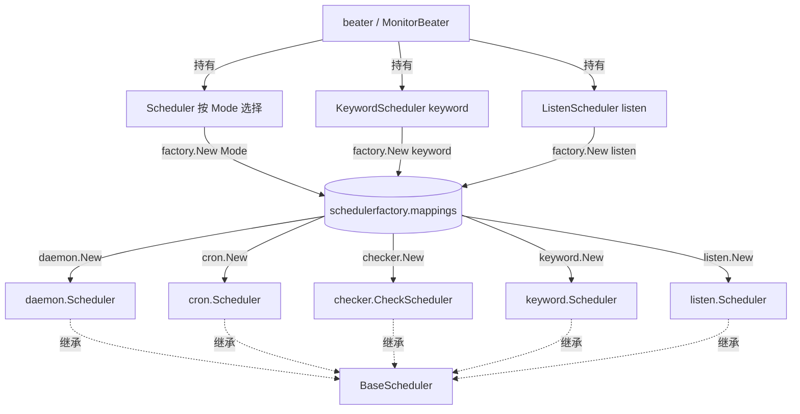

# 调度框架

> 返回：[总览](01-总览.md)
<cite>
**本文引用的文件**
- [BaseScheduler 基类](file://bkmonitor-datalink/pkg/bkmonitorbeat/scheduler/scheduler.go)
- [daemon 调度器](file://bkmonitor-datalink/pkg/bkmonitorbeat/scheduler/daemon/scheduler.go)
- [cron 调度器](file://bkmonitor-datalink/pkg/bkmonitorbeat/scheduler/cron/scheduler.go)
- [checker 调度器](file://bkmonitor-datalink/pkg/bkmonitorbeat/scheduler/checker/scheduler.go)
- [keyword 调度器](file://bkmonitor-datalink/pkg/bkmonitorbeat/scheduler/keyword/scheduler.go)
- [listen 调度器](file://bkmonitor-datalink/pkg/bkmonitorbeat/scheduler/listen/scheduler.go)
- [调度器工厂](file://bkmonitor-datalink/pkg/bkmonitorbeat/beater/schedulerfactory/factory.go)
- [调度器类型常量](file://bkmonitor-datalink/pkg/bkmonitorbeat/beater/schedulerfactory/define.go)
- [Beater 主程序](file://bkmonitor-datalink/pkg/bkmonitorbeat/beater/beater.go)
</cite>

## 目录
- [简介](#简介)
- [项目结构](#项目结构)
- [核心组件](#核心组件)
- [架构总览](#架构总览)
- [组件详细分析](#组件详细分析)
- [依赖关系分析](#依赖关系分析)
- [结论](#结论)

## 简介
`scheduler/` 目录实现了 bkmonitorbeat 的调度框架。调度器（Scheduler）的核心职责是决定 `task`（采集任务）如何被启动、周期执行或常驻监听，并将采集结果通过事件通道（`EventChan`）上报。`define.Scheduler` 接口定义了统一的生命周期方法（`Start` / `Stop` / `Wait` / `Reload` / `Add` / `Count` / `GetStatus` / `IsDaemon`），具体调度策略由各子调度器实现。框架按任务类型提供多种调度器：周期轮询、cron 周期、一次性检查、日志关键字、常驻监听。

章节来源
- [Scheduler 接口与基类](file://bkmonitor-datalink/pkg/bkmonitorbeat/scheduler/scheduler.go#L10-L47)

## 项目结构
调度框架由两大部分组成：

- `scheduler/`：调度器实现层。
  - `scheduler.go`：定义 `BaseScheduler` 基类，提供状态、事件通道、配置的默认实现。
  - `daemon/`：主调度路径，基于时间轮询任务队列。
  - `cron/`：基于 gron 的周期调度。
  - `checker/`：一次性检查模式。
  - `keyword/`：日志关键字专用调度器。
  - `listen/`：常驻监听型调度器（trap / metric / kubeevent / dmesg）。
- `beater/schedulerfactory/`：调度器工厂，按模式名在 `mappings` 注册表中查找并创建对应调度器，常量定义在 `define.go`（`SchedulerTypeDaemon`/`SchedulerTypeCron`/`SchedulerTypeChecker`/`SchedulerTypeKeyword`/`SchedulerTypeListen`）。
- `beater/beater.go`：持有并统一启动/停止/重载三种调度器实例。

章节来源
- [调度器类型常量](file://bkmonitor-datalink/pkg/bkmonitorbeat/beater/schedulerfactory/define.go#L10-L17)
- [调度器工厂](file://bkmonitor-datalink/pkg/bkmonitorbeat/beater/schedulerfactory/factory.go#L19-L39)

## 核心组件
### BaseScheduler 基类
`BaseScheduler` 是所有调度器的公共基类，内嵌于各子调度器中，提供默认字段与方法：

- 字段：`Status define.Status`（调度器状态）、`EventChan chan<- define.Event`（事件上报通道）、`Config define.Config`（配置）。
- 方法：`Stop()` 将状态置为 `SchedulerTerminting`；`Wait()` 将状态置为 `SchedulerFinished`；`GetStatus()` 返回当前状态；`IsDaemon()` 默认返回 `true`（表示常驻型，可被子类覆写）；`Start(ctx)` 置为 `SchedulerRunning` 并返回；`Reload(ctx, config, tasks)` 仅更新 `Config`。

子类可覆写上述方法以实现各自的停止、等待、启动、重载逻辑。

章节来源
- [BaseScheduler 基类](file://bkmonitor-datalink/pkg/bkmonitorbeat/scheduler/scheduler.go#L18-L47)

### 五种调度器
| 调度器 | 触发条件 | 执行模型 | IsDaemon |
| --- | --- | --- | --- |
| daemon | 周期性轮询（按全局 `CheckInterval` 时间片） | 任务入队，到点并发执行并求下一次执行时间 | true |
| cron | 按任务配置的 `Period`，由 gron 周期触发 | 启动时一次性注册到 gron 并持续周期运行 | true（基类默认） |
| checker | 启动时一次性执行 | 遍历所有任务顺序 Run，完成后即结束 | false |
| keyword | 启动时一次性启动输入模块，持续采集 | 单例输入模块常驻扫描日志关键字 | false |
| listen | 任务加入即启动 goroutine 常驻监听，退出后自动重启动 | 每个任务独立 goroutine 监听，异常 recover 并重启 | false |

章节来源
- [daemon 主调度](file://bkmonitor-datalink/pkg/bkmonitorbeat/scheduler/daemon/scheduler.go#L52-L260)
- [cron 周期调度](file://bkmonitor-datalink/pkg/bkmonitorbeat/scheduler/cron/scheduler.go#L24-L181)
- [checker 一次性检查](file://bkmonitor-datalink/pkg/bkmonitorbeat/scheduler/checker/scheduler.go#L25-L111)
- [keyword 日志关键字](file://bkmonitor-datalink/pkg/bkmonitorbeat/scheduler/keyword/scheduler.go#L32-L159)
- [listen 常驻监听](file://bkmonitor-datalink/pkg/bkmonitorbeat/scheduler/listen/scheduler.go#L27-L177)

## 架构总览
`schedulerfactory.New` 接收 `conf.Mode` 或显式传入的 `schedulerType`，从全局 `mappings` 注册表查找对应的构造函数并返回 `define.Scheduler`。若未注册则 panic。

`beater` 在初始化时分别创建并持有三个调度器：
- `Scheduler`：按 `conf.Mode` 选择（生产通常为 `daemon`）。
- `KeywordScheduler`：固定为 `SchedulerTypeKeyword`。
- `ListenScheduler`：固定为 `SchedulerTypeListen`。

三个调度器共享同一份全局配置与事件通道，由 beater 统一 `Start`/`Stop`/`Wait`/`Reload`，并按任务类型（通过 `Add`）分发到对应调度器。

图表来源
- [调度器工厂](file://bkmonitor-datalink/pkg/bkmonitorbeat/beater/schedulerfactory/factory.go#L19-L39)
- [Beater 持有三调度器](file://bkmonitor-datalink/pkg/bkmonitorbeat/beater/beater.go#L57-L59)
- [Beater 创建调度器](file://bkmonitor-datalink/pkg/bkmonitorbeat/beater/beater.go#L297-L299)

章节来源
- [调度器工厂](file://bkmonitor-datalink/pkg/bkmonitorbeat/beater/schedulerfactory/factory.go#L19-L39)
- [Beater 持有三调度器](file://bkmonitor-datalink/pkg/bkmonitorbeat/beater/beater.go#L57-L59)
- [Beater 创建调度器](file://bkmonitor-datalink/pkg/bkmonitorbeat/beater/beater.go#L297-L299)

## 组件详细分析
### daemon（主调度路径）
`Daemon` 内嵌 `daemonState`，使用 `treemap`（按 ident 字符串比较）保存任务、使用 `JobQueue`（`NewLockQueue`）保存待执行 Job，并基于 `time.Ticker`（`CheckInterval`）周期性轮询。

- `Add`：任务写入 `tasks`；若已处于 `SchedulerRunning`，立即 `addJob` 入队。
- `Start`：创建带 cancel 的 ctx，遍历 `tasks` 生成 Job 入队，启动 ticker 与后台 `run` goroutine。
- `run`：循环等待 ticker，到点后 `PopUntil(now)` 取出到点的 Job，并发 `go job.Run(EventChan)` 执行，执行后 `job.Next()` 计算下一次执行时间再入队；ctx 取消时停止 ticker 并退出。
- `Reload`：构建新的 `daemonState`，保留旧 ticker/ctx/EventChan；旧 Job 中 ident 仍存在的任务执行 `reloadJobFromTask`（仅更新全局配置与任务配置，不替换已绑定的 scheduler 以防 ctx 丢失），其余 `Stop`；新增任务 `makeJobfromTask` 入队，最后原子替换 `daemonState`。
- `Wait`：`waitgroup.Wait()` 后对所有剩余 Job 调用 `task.Wait()`，置 `SchedulerFinished`。

适用：绝大多数周期性采集任务的主路径。

章节来源
- [daemon 调度器实现](file://bkmonitor-datalink/pkg/bkmonitorbeat/scheduler/daemon/scheduler.go#L44-L259)

### cron（周期调度）
`cron.Scheduler` 使用 `gron` 库进行周期调度，内嵌 `schedulerState`（含 `gron.Cron` 实例与 `treemap` 任务表）。

- `Start`：为每个任务创建 `Job`（绑定 ctx、scheduler、task），先 `go job.Run()` 执行一次，再以 `gron.Every(conf.GetPeriod())` 注册周期执行；另起 goroutine 监听 ctx 取消，停止 gron 并等待所有 task `Wait()` 完成。
- `Job.Run`：调用 `task.Run(ctx, scheduler.EventChan)`。
- `Reload`：先 `Stop` 旧 state（停止 gron、cancel ctx），构建新 state，重新 `Add` 所有任务并 `Wait` 旧 state、`Start` 新 state。
- `Count`：返回 gron 条目数。

适用：需要按固定周期（Period）精确调度的任务。

章节来源
- [cron 调度器实现](file://bkmonitor-datalink/pkg/bkmonitorbeat/scheduler/cron/scheduler.go#L24-L181)

### checker（一次性检查模式）
`CheckScheduler` 覆写 `IsDaemon()` 返回 `false`。内嵌 `BaseScheduler`，持有 `treemap` 任务表与 `sync.WaitGroup`，并提供 `PreRun`/`PostRun` 两个 `utils.HookManager` 钩子。

- `Start`：创建 cancel ctx，`go Run`。
- `Run`：置 `SchedulerRunning`，执行 `PreRun` 钩子；若任务数为 0 则 `panic(ErrTaskNotFound)`；遍历所有任务顺序 `task.Run`；`time.Sleep(2s)`（测试用）后置 `SchedulerFinished` 并执行 `PostRun` 钩子。`PostRun` 中注册了 `bt.Stop()`，即检查完成后自动停止 beater。
- `New`：在 `PostRun` 中追加 `bt.Stop()`，因此该调度器用于一次性检查场景，执行完即触发进程退出。

适用：一次性检查任务（如启动自检、一次性巡检）。

章节来源
- [checker 调度器实现](file://bkmonitor-datalink/pkg/bkmonitorbeat/scheduler/checker/scheduler.go#L25-L111)

### keyword（日志关键字专用调度器）
`keyword.Scheduler` 覆写 `IsDaemon()` 返回 `false`。通过 `tasks map[string]*keyword.TaskConfig` 管理任务，启动时构建单例输入模块 `input.SingleInstance` 常驻采集。

- `Start`：创建 cancel ctx；若任务数为 0 仅告警；用 `input.New` 创建单例输入并 `Start`；`addTasks` 为每个任务构建 sender/processor 链路（IPLinker/PSLinker channel）并启动。
- `taskToKeywordTask`：将 `define.Task` 的配置转换为 `keyword.TaskConfig`，做路径清洗、排除文件正则编译、Label 去重、输入/处理/发送配置组装。
- `Reload`：对比新旧任务：未变化的忽略，变化的加入 addTasks，消失的 `removeTasks`（cancel 其 ctx）；最后调用 `input.SingleInstance.Reload(addTasks)`。

适用：日志关键字采集（LogFile/关键字匹配场景），单输入多任务复用同一扫描模块。

章节来源
- [keyword 调度器实现](file://bkmonitor-datalink/pkg/bkmonitorbeat/scheduler/keyword/scheduler.go#L32-L277)

### listen（常驻监听型）
`listen.Scheduler` 覆写 `IsDaemon()` 返回 `false`。持有 `tasks map[string]define.Task` 与 `taskCancel map[string]context.CancelFunc`，为每个任务维护独立可取消 ctx。

- `Start`：创建 cancel ctx，对每个任务启动 `keepListen`。
- `keepListen`：为每个任务生成子 ctx 与 cancel 并存入 `taskCancel`，起 goroutine 循环：监听 `subCtx.Done()` 则返回，否则 `time.Sleep(restartInterval=10s)` 后调用 `listen`；即任务退出后隔 10 秒自动重启，保证常驻监听。
- `listen`：以 `defer recover` 包裹 `task.Run(ctx, EventChan)`，保证单个任务 panic 不影响主进程。
- `Reload`：先按 ident 差异计算 deleteList 与 addList（注释指出因端口占用需先删后增），`removeTasks` 调用对应 cancel 关闭，`addTasks` 重新 `Add` 并 `keepListen`。

适用：trap / metric / kubeevent / dmesg 等需要持续监听外部事件源、且对断连需要自动重连的任务。

章节来源
- [listen 调度器实现](file://bkmonitor-datalink/pkg/bkmonitorbeat/scheduler/listen/scheduler.go#L26-L177)

## 依赖关系分析
- 调度器层依赖 `define` 包：`define.Scheduler` 接口、`define.Task` 接口、`define.Status`（`SchedulerReady`/`SchedulerRunning`/`SchedulerTerminting`/`SchedulerFinished`）、`define.Config`、`define.Beater`（`GetEventChan()` 获取事件通道、`Stop()` 等）。各调度器均通过 `New(bt define.Beater, config define.Config) define.Scheduler` 构造函数接收 beater 与配置。
- 调度器层内部相互解耦：`daemon`/`cron`/`checker`/`keyword`/`listen` 各自内嵌 `scheduler.BaseScheduler`，互不直接引用。
- `schedulerfactory` 依赖各子调度器包与 `configs`，通过 `Register(name, f)` 在 init 阶段把构造函数注册进 `mappings`，`New` 按名取用。部分调度器（keyword/listen）的注册文件带有 `//go:build` 编译标签（如 `keywordscheduler || basescheduler`、`listenscheduler || basescheduler`），可按构建开关裁剪。
- `beater` 依赖 `schedulerfactory`，在运行时创建并持有 `Scheduler`/`KeywordScheduler`/`ListenScheduler` 三个 `define.Scheduler` 实例，统一负责分发任务（`Add`）、启动（`Start`）、停止（`Stop`）、等待（`Wait`）、状态查询与重载（`Reload`）。beater 通过 `GetScheduler`/`GetKeywordScheduler`/`GetListenScheduler` 暴露这些实例。

章节来源
- [调度器工厂](file://bkmonitor-datalink/pkg/bkmonitorbeat/beater/schedulerfactory/factory.go#L19-L39)
- [Beater 持有三调度器](file://bkmonitor-datalink/pkg/bkmonitorbeat/beater/beater.go#L57-L59)
- [Beater 创建调度器](file://bkmonitor-datalink/pkg/bkmonitorbeat/beater/beater.go#L297-L299)
- [Beater 生命周期管理](file://bkmonitor-datalink/pkg/bkmonitorbeat/beater/beater.go#L521-L575)
- [Beater 重载调度器](file://bkmonitor-datalink/pkg/bkmonitorbeat/beater/beater.go#L658-L718)

## 结论
bkmonitorbeat 的调度框架以 `BaseScheduler` 为统一基类，上层的 `define.Scheduler` 接口屏蔽了调度策略差异。框架通过 `schedulerfactory` 的注册表机制按模式名（Mode 或显式类型）灵活选择调度器；beater 以三个独立调度器实例（主路径 `Scheduler`、关键字 `KeywordScheduler`、监听 `ListenScheduler`）覆盖全部采集场景，并对它们进行统一的生命周期管理。五种调度器分别针对周期轮询（daemon）、固定周期（cron）、一次性检查（checker）、日志关键字常驻扫描（keyword）、事件源常驻监听且自动重连（listen）等执行模型，使任务执行的触发条件与生命周期各不相同，但对外均遵循同一套 `Start/Stop/Wait/Reload` 契约。

章节来源
- [BaseScheduler 基类](file://bkmonitor-datalink/pkg/bkmonitorbeat/scheduler/scheduler.go#L18-L47)
- [调度器工厂](file://bkmonitor-datalink/pkg/bkmonitorbeat/beater/schedulerfactory/factory.go#L19-L39)
- [Beater 持有三调度器](file://bkmonitor-datalink/pkg/bkmonitorbeat/beater/beater.go#L57-L59)
