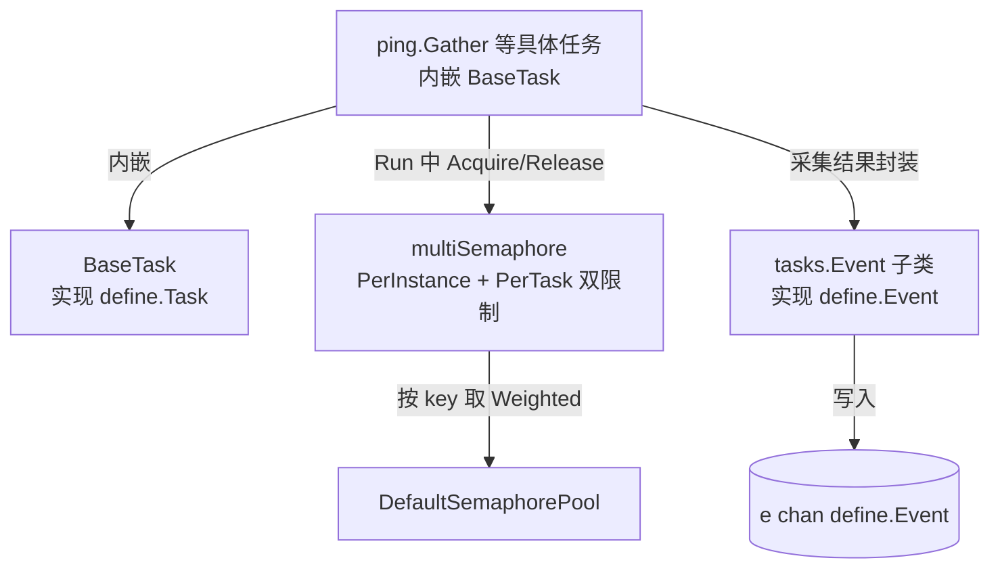

# 采集任务框架

> 返回：[总览](01-总览.md)
<cite>
**本文引用的文件**
- [BaseTask 与 EventTask 基类](file://bkmonitor-datalink/pkg/bkmonitorbeat/tasks/task.go)
- [并发信号量 Semaphore 与 SemaphorePool](file://bkmonitor-datalink/pkg/bkmonitorbeat/tasks/semaphore.go)
- [Event 事件封装体系](file://bkmonitor-datalink/pkg/bkmonitorbeat/tasks/event.go)
- [Ping 采集任务示例](file://bkmonitor-datalink/pkg/bkmonitorbeat/tasks/ping/gather.go)
</cite>

## 目录
- [简介](#简介)
- [项目结构](#项目结构)
- [核心组件](#核心组件)
- [架构总览](#架构总览)
- [组件详细分析](#组件详细分析)
- [依赖关系分析](#依赖关系分析)
- [结论](#结论)

## 简介
`tasks/` 是 bkmonitorbeat 的采集任务实现层，包含 26 个采集子模块（basereport、ping、tcp、processbeat、keyword 等）。所有子模块共享同一套顶层公共机制：`tasks/task.go` 中的 `BaseTask`/`EventTask` 基类、`tasks/semaphore.go` 中的并发信号量、`tasks/event.go` 中的事件封装体系。本页聚焦这些公共机制，子模块的分组与职责见《采集任务分类总览》。

章节来源
- [BaseTask 与 EventTask 基类](file://bkmonitor-datalink/pkg/bkmonitorbeat/tasks/task.go#L23-L152)
- [并发信号量 Semaphore 与 SemaphorePool](file://bkmonitor-datalink/pkg/bkmonitorbeat/tasks/semaphore.go#L19-L148)
- [Event 事件封装体系](file://bkmonitor-datalink/pkg/bkmonitorbeat/tasks/event.go#L24-L592)

## 项目结构
`tasks/` 顶层（非子模块）的关键公共文件：

| 文件 | 职责 |
|------|------|
| `task.go` | `BaseTask`/`EventTask` 基类，定义任务生命周期与并发钩子 |
| `semaphore.go` | `Semaphore` 接口、`NoopSemaphore`、`multiSemaphore`、`SemaphorePool`、`DefaultSemaphorePool` |
| `event.go` | `Event`/`SimpleEvent`/`StandardEvent`/`PingEvent`/`MetricEvent`/`CustomEvent` 等事件封装，实现 `define.Event` |
| `cmdb.go` / `host_dimension.go` / `default_ip.go` | CMDB 维度、主机维度、默认 IP 等公共辅助 |
| `prom_event.go` / `gatherup.go` / `timestamp.go` / `utils.go` | Prometheus 事件、汇聚上报、时间戳、工具函数 |

章节来源
- [BaseTask 与 EventTask 基类](file://bkmonitor-datalink/pkg/bkmonitorbeat/tasks/task.go#L10-L152)
- [并发信号量 Semaphore 与 SemaphorePool](file://bkmonitor-datalink/pkg/bkmonitorbeat/tasks/semaphore.go#L10-L148)
- [Event 事件封装体系](file://bkmonitor-datalink/pkg/bkmonitorbeat/tasks/event.go#L10-L592)

## 核心组件
- **BaseTask**：所有采集任务的内嵌基类，持有 `Status`/`GlobalConfig`/`TaskConfig`、`HookPreRun`/`HookPostRun` 钩子管理器与并发信号量 `s`。
- **EventTask**：在 `BaseTask` 基础上增加 `runningLock` 与 `isRunning`，提供 `CheckRunning`/`ResetRunningState`（防止重复运行）与 `CheckMode`（判断是否 check 调度模式），供一次性/事件型任务使用。
- **Semaphore**：统一信号量接口（`Acquire`/`TryAcquire`/`Release`），`multiSemaphore` 通过两个 Weighted 信号量实现「全局维度 + 任务维度」双重并发限制，`SemaphorePool` 按 key 缓存复用，`DefaultSemaphorePool` 为全局实例。
- **Event 体系**：`tasks.Event` 实现 `define.Event`，并提供 `SimpleEvent`/`StatusEvent`/`StandardEvent`/`PingEvent`/`MetricEvent`/`CustomEvent` 等子类，覆盖拨测、状态、指标、自定义消息等上报形态。

章节来源
- [BaseTask 结构](file://bkmonitor-datalink/pkg/bkmonitorbeat/tasks/task.go#L24-L37)
- [EventTask 结构](file://bkmonitor-datalink/pkg/bkmonitorbeat/tasks/task.go#L121-L152)
- [Semaphore 接口与实现](file://bkmonitor-datalink/pkg/bkmonitorbeat/tasks/semaphore.go#L19-L148)
- [Event 体系](file://bkmonitor-datalink/pkg/bkmonitorbeat/tasks/event.go#L24-L592)

## 架构总览
一个具体采集任务（如 `ping.Gather`）内嵌 `BaseTask` 以获得 `define.Task` 能力；`Run` 执行时通过 `GetSemaphore().Acquire` 获取并发额度、采集完成后 `Release`；采集结果封装为 `tasks.Event` 子类写入事件通道 `e`；调度器 `PostRun` 时由基类统一回收资源。

章节来源
- [BaseTask 结构与 GetSemaphore](file://bkmonitor-datalink/pkg/bkmonitorbeat/tasks/task.go#L24-L37)
- [EventTask 与 CheckMode](file://bkmonitor-datalink/pkg/bkmonitorbeat/tasks/task.go#L121-L152)
- [multiSemaphore 与 SemaphorePool](file://bkmonitor-datalink/pkg/bkmonitorbeat/tasks/semaphore.go#L40-L148)
- [Event 体系与 NewEvent](file://bkmonitor-datalink/pkg/bkmonitorbeat/tasks/event.go#L24-L132)
- [Ping Gather.Run 示例](file://bkmonitor-datalink/pkg/bkmonitorbeat/tasks/ping/gather.go#L29-L29)



图表来源
- [BaseTask 结构与 GetSemaphore](file://bkmonitor-datalink/pkg/bkmonitorbeat/tasks/task.go#L24-L37)
- [EventTask 与 CheckMode](file://bkmonitor-datalink/pkg/bkmonitorbeat/tasks/task.go#L121-L152)
- [multiSemaphore 与 SemaphorePool](file://bkmonitor-datalink/pkg/bkmonitorbeat/tasks/semaphore.go#L40-L148)
- [Event 体系与 NewEvent](file://bkmonitor-datalink/pkg/bkmonitorbeat/tasks/event.go#L24-L132)

## 组件详细分析
### BaseTask 生命周期
`BaseTask` 实现 `define.Task` 的大部分方法：`GetTaskID`/`GetConfig`/`SetConfig`/`GetGlobalConfig`/`SetGlobalConfig`/`GetStatus`/`Wait` 为简单读写；`Reload`/`Stop` 默认空实现，由具体任务覆写。`Init()` 将状态置为 `TaskReady`。

- `PreRun(ctx)`（L72）：记录日志、执行 `HookPreRun` 钩子；读取全局配置中的 `ConcurrencyLimit.Task[type]`（PerInstance/PerTask），向 `DefaultSemaphorePool` 申请信号量并写入 `s`（key 形如 `type_per_instance` 与 `type_per_task_ident`）；若无并发限制配置则置 `NoopSemaphore`；状态置 `TaskRunning` 并 `waitgroup.Add(1)`。
- `PostRun(ctx)`（L102）：执行 `HookPostRun`；并发计数 `sCount--`，归零时从池中 `Delete` 任务维度 key；状态置 `TaskFinished`，`waitgroup.Done()`。

章节来源
- [BaseTask 结构与基础方法](file://bkmonitor-datalink/pkg/bkmonitorbeat/tasks/task.go#L24-L59)
- [PreRun 并发初始化](file://bkmonitor-datalink/pkg/bkmonitorbeat/tasks/task.go#L72-L99)
- [PostRun 资源回收](file://bkmonitor-datalink/pkg/bkmonitorbeat/tasks/task.go#L102-L118)

### EventTask 与运行互斥
`EventTask` 在 `BaseTask` 之上增加互斥运行控制：
- `CheckRunning()`（L128）：加锁，若已在运行返回 `true`（调用方据此跳过），否则标记运行中返回 `false`。
- `ResetRunningState()`（L139）：重置 `isRunning`，供常驻/重复触发场景释放锁。
- `CheckMode()`（L146）：读取全局配置 `Mode == "check"` 返回 `true`，用于适配 check 调度器的一次性检查语义。

章节来源
- [EventTask 结构与运行互斥](file://bkmonitor-datalink/pkg/bkmonitorbeat/tasks/task.go#L120-L152)

### Semaphore 并发控制
- `Semaphore` 接口（L20）：`Acquire(ctx, n)`/`TryAcquire(n)`/`Release(n)`。
- `NoopSemaphore`（L26）：空实现，不限制并发（无并发配置时退化使用）。
- `multiSemaphore`（L40）：组合 `s1`/`s2` 两个 `semaphore.Weighted`，`acquireLoop`（L47）先申请 s1，成功再申请 s2，失败时回退释放 s1，实现「全局 + 任务」两维同时受限。
- `SemaphorePool`（L108）：`get` 按 key 缓存 `*semaphore.Weighted`（以首次 weight 为准），`GetSemaphore(key1,n1,key2,n2)` 返回 `multiSemaphore`；`DefaultSemaphorePool`（L148）为全局共享池，使同名 key 的并发限制在进程内互通。

章节来源
- [Semaphore 接口与 NoopSemaphore](file://bkmonitor-datalink/pkg/bkmonitorbeat/tasks/semaphore.go#L19-L38)
- [multiSemaphore 双维信号量](file://bkmonitor-datalink/pkg/bkmonitorbeat/tasks/semaphore.go#L40-L106)
- [SemaphorePool 与全局池](file://bkmonitor-datalink/pkg/bkmonitorbeat/tasks/semaphore.go#L108-L148)

### Event 事件封装
`tasks.Event`（L25）实现 `define.Event`：`AsMapStr()`（L93）输出 `dataid`/`bk_biz_id`/`task_id`/`task_type`/`status`/`available`/`task_duration`/`group_info` 等字段；`NewEvent(task)`（L119）从 `define.Task` 配置初始化。`Fail`/`Success`/`SuccessOrTimeout` 维护采集状态与时间。派生类型：
- `SimpleEvent`（L135）：追加 `target_host`/`target_port`/`resolved_ip`，用于拨测类。
- `StatusEvent`（L159）：仅 `dataid`/`status`，`GetType` 返回 `ModuleStatus`。
- `StandardEvent`（L205）：带 `Metrics`/`Dimensions`，`AsMapStr` 注入 `bk_host_id`/`bk_biz_id`/`task_id` 等维度，用于指标上报。
- `PingEvent`（L248）：`IgnoreCMDBLevel()=true`，用于 ping 指标。
- `MetricEvent`（L386）：`GetType` 返回 `ModuleMetricbeat`，透传采集到的 `Data`。
- `CustomEvent`（L415）：通用自定义消息，`AsMapStr` 将 `Labels` 注入到每条 `data[].dimension`，支持多 label 复制上报。

章节来源
- [Event 基础结构与 NewEvent](file://bkmonitor-datalink/pkg/bkmonitorbeat/tasks/event.go#L24-L132)
- [SimpleEvent / StatusEvent / StandardEvent](file://bkmonitor-datalink/pkg/bkmonitorbeat/tasks/event.go#L134-L245)
- [PingEvent / MetricEvent](file://bkmonitor-datalink/pkg/bkmonitorbeat/tasks/event.go#L248-L412)
- [CustomEvent 与 label 注入](file://bkmonitor-datalink/pkg/bkmonitorbeat/tasks/event.go#L414-L592)

### 具体任务的统一形态
各子模块均定义 `Gather` 结构体并内嵌 `BaseTask`，实现 `Run(ctx, e)`。例如 `ping/gather.go`:
```go
func (g *Gather) Run(ctx context.Context, e chan<- define.Event) { ... }  // L29
```
`Run` 内部通常：`PreRun` 钩子 → 获取信号量 → 采集 → 构造 `tasks.Event` 子类 → `e <- event` → 释放信号量 → `PostRun`。其余模块（tcp/udp/http/processbeat/keyword/...）均遵循同一签名（见《采集任务分类总览》）。

章节来源
- [Ping Gather.Run 示例](file://bkmonitor-datalink/pkg/bkmonitorbeat/tasks/ping/gather.go#L29-L29)

## 依赖关系分析
- `tasks/` 依赖 `define`（实现 `Task`/`Event`/`Config` 接口，使用 `Module*` 常量与 `Status`/`NamedCode`/`GatherStatus*`）。
- `tasks/` 依赖 `configs`：`BaseTask.getTaskConcurrencyLimitConfig` 将 `GlobalConfig` 断言为 `*configs.Config` 读取 `ConcurrencyLimit`。
- 各子模块依赖顶层 `tasks` 包的公共机制（`BaseTask`/`Semaphore`/`Event`）。
- `tasks/` 被 `beater/taskfactory` 实例化、`scheduler/*` 调度执行、`report/` 消费通道中的事件。

章节来源
- [BaseTask 依赖 configs](file://bkmonitor-datalink/pkg/bkmonitorbeat/tasks/task.go#L61-L69)
- [BaseTask 依赖 define](file://bkmonitor-datalink/pkg/bkmonitorbeat/tasks/task.go#L17-L21)
- [Event 依赖 define](file://bkmonitor-datalink/pkg/bkmonitorbeat/tasks/event.go#L19-L22)

## 结论
`tasks/` 顶层通过 `BaseTask`/`EventTask` + `Semaphore` + `Event` 三件套，为 26 个采集子模块提供了一致的运行骨架：统一的任务身份/配置/生命周期管理、双重维度并发限流、规范的事件封装与上报。具体任务只需内嵌 `BaseTask` 并实现 `Run(ctx, e)`，即可被任意调度器驱动，是该采集器「高内聚、易扩展」的关键设计。

章节来源
- [BaseTask 与 EventTask 基类](file://bkmonitor-datalink/pkg/bkmonitorbeat/tasks/task.go#L23-L152)
- [并发信号量 Semaphore 与 SemaphorePool](file://bkmonitor-datalink/pkg/bkmonitorbeat/tasks/semaphore.go#L19-L148)
- [Event 事件封装体系](file://bkmonitor-datalink/pkg/bkmonitorbeat/tasks/event.go#L24-L592)
