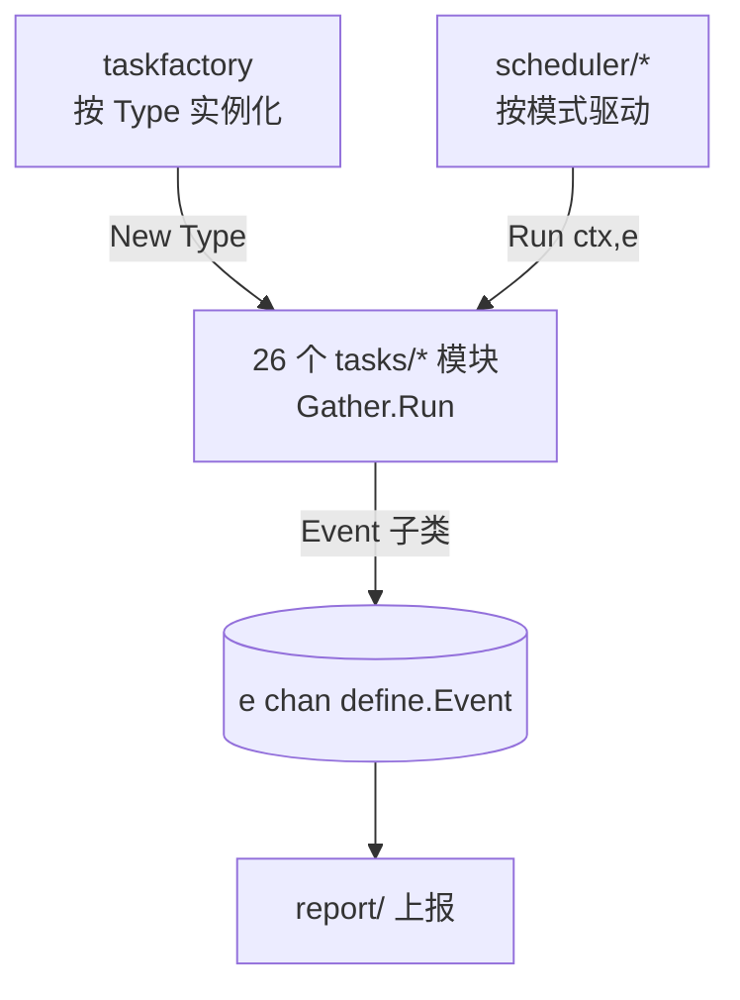

# 采集任务分类总览

> 返回：[总览](01-总览.md)
<cite>
**本文引用的文件**
- [basereport 主机指标采集](file://bkmonitor-datalink/pkg/bkmonitorbeat/tasks/basereport/basereport.go)
- [metricbeat 指标采集](file://bkmonitor-datalink/pkg/bkmonitorbeat/tasks/metricbeat/gather.go)
- [ping 拨测采集](file://bkmonitor-datalink/pkg/bkmonitorbeat/tasks/ping/gather.go)
- [tcp 拨测采集](file://bkmonitor-datalink/pkg/bkmonitorbeat/tasks/tcp/gather.go)
- [udp 拨测采集](file://bkmonitor-datalink/pkg/bkmonitorbeat/tasks/udp/gather.go)
- [http 拨测采集](file://bkmonitor-datalink/pkg/bkmonitorbeat/tasks/http/gather.go)
- [processbeat 进程采集](file://bkmonitor-datalink/pkg/bkmonitorbeat/tasks/processbeat/gather.go)
- [procstatus 进程状态](file://bkmonitor-datalink/pkg/bkmonitorbeat/tasks/procstatus/gather.go)
- [procconf 进程配置](file://bkmonitor-datalink/pkg/bkmonitorbeat/tasks/procconf/gather.go)
- [proccustom 自定义进程配置](file://bkmonitor-datalink/pkg/bkmonitorbeat/tasks/proccustom/gather.go)
- [procsync 进程配置同步](file://bkmonitor-datalink/pkg/bkmonitorbeat/tasks/procsync/gather.go)
- [procbin 进程二进制](file://bkmonitor-datalink/pkg/bkmonitorbeat/tasks/procbin/gather.go)
- [procsnapshot 进程快照](file://bkmonitor-datalink/pkg/bkmonitorbeat/tasks/procsnapshot/gather.go)
- [keyword 日志关键字](file://bkmonitor-datalink/pkg/bkmonitorbeat/tasks/keyword/gather.go)
- [exceptionbeat 异常事件](file://bkmonitor-datalink/pkg/bkmonitorbeat/tasks/exceptionbeat/exceptionbeat_unix.go)
- [trap SNMP Trap](file://bkmonitor-datalink/pkg/bkmonitorbeat/tasks/trap/gather.go)
- [kubeevent K8s 事件](file://bkmonitor-datalink/pkg/bkmonitorbeat/tasks/kubeevent/gather.go)
- [dmesg 内核日志](file://bkmonitor-datalink/pkg/bkmonitorbeat/tasks/dmesg/gather.go)
- [shellhistory Shell 历史](file://bkmonitor-datalink/pkg/bkmonitorbeat/tasks/shellhistory/gather.go)
- [rpmpackage RPM 资产](file://bkmonitor-datalink/pkg/bkmonitorbeat/tasks/rpmpackage/gather.go)
- [static 静态资产](file://bkmonitor-datalink/pkg/bkmonitorbeat/tasks/static/gather.go)
- [socketsnapshot 套接字快照](file://bkmonitor-datalink/pkg/bkmonitorbeat/tasks/socketsnapshot/gather.go)
- [selfstats 自监控](file://bkmonitor-datalink/pkg/bkmonitorbeat/tasks/selfstats/gather.go)
- [timesync 时间同步](file://bkmonitor-datalink/pkg/bkmonitorbeat/tasks/timesync/gather.go)
- [script 脚本采集](file://bkmonitor-datalink/pkg/bkmonitorbeat/tasks/script/gather.go)
- [loginlog 登录日志](file://bkmonitor-datalink/pkg/bkmonitorbeat/tasks/loginlog/event.go)
</cite>

## 目录
- [简介](#简介)
- [项目结构](#项目结构)
- [核心组件](#核心组件)
- [架构总览](#架构总览)
- [组件详细分析](#组件详细分析)
- [依赖关系分析](#依赖关系分析)
- [结论](#结论)

## 简介
`tasks/` 下包含 26 个采集子模块（经 `beater/taskfactory` 按配置 `Type` 注册并实例化），均由调度器驱动执行，并遵循统一的 `Gather.Run(ctx, e)` 形态（见《采集任务框架》）。本页按采集对象将这 26 个模块归纳为 5 大类，便于快速定位：主机指标与系统资产、网络探测（拨测）、进程采集、日志与事件、资产/安全/脚本及其他。（注：`tasks/` 目录下另有 `processsnapshot/` 辅助子包，仅提供进程状态共享快照函数，被 `procsnapshot` 复用，并非独立注册模块，故不计入上述 26 个。）

章节来源
- [basereport 主机指标采集](file://bkmonitor-datalink/pkg/bkmonitorbeat/tasks/basereport/basereport.go#L134-L134)
- [ping 拨测采集](file://bkmonitor-datalink/pkg/bkmonitorbeat/tasks/ping/gather.go#L29-L29)
- [processbeat 进程采集](file://bkmonitor-datalink/pkg/bkmonitorbeat/tasks/processbeat/gather.go#L87-L87)
- [keyword 日志关键字](file://bkmonitor-datalink/pkg/bkmonitorbeat/tasks/keyword/gather.go#L28-L28)

## 项目结构
26 个子模块目录与 `define.Module*` 常量一一对应，配置下发时以 `Type` 字段匹配：

| 大类 | 包含模块目录 | 对应 Module 常量 |
|------|--------------|------------------|
| 主机指标与系统资产 | basereport、metricbeat、static、selfstats、timesync、socketsnapshot | ModuleBasereport/Metricbeat/Static/SelfStats/TimeSync/SocketSnapshot |
| 网络探测（拨测） | ping、tcp、udp、http | ModulePing/TCP/UDP/HTTP |
| 进程采集 | processbeat、procstatus、procconf、proccustom、procsync、procbin、procsnapshot | ModuleProcessbeat/ProcStatus/ProcConf/ProcCustom/ProcSync/ProcBin/ProcSnapshot |
| 日志与事件 | keyword、exceptionbeat、trap、kubeevent、dmesg、loginlog、shellhistory | ModuleKeyword/Exceptionbeat/Trap/Kubeevent/Dmesg/LoginLog/ShellHistory |
| 资产/安全/脚本/其他 | rpmpackage、script、（status/heartbeat 由内部实现） | ModuleRpmPackage/Script/Status |

章节来源
- [Module 常量定义](file://bkmonitor-datalink/pkg/bkmonitorbeat/define/task.go#L17-L48)
- [basereport 主机指标采集](file://bkmonitor-datalink/pkg/bkmonitorbeat/tasks/basereport/basereport.go#L134-L134)
- [metricbeat 指标采集](file://bkmonitor-datalink/pkg/bkmonitorbeat/tasks/metricbeat/gather.go#L31-L31)
- [static 静态资产](file://bkmonitor-datalink/pkg/bkmonitorbeat/tasks/static/gather.go#L38-L38)
- [selfstats 自监控](file://bkmonitor-datalink/pkg/bkmonitorbeat/tasks/selfstats/gather.go#L44-L44)
- [timesync 时间同步](file://bkmonitor-datalink/pkg/bkmonitorbeat/tasks/timesync/gather.go#L47-L47)
- [socketsnapshot 套接字快照](file://bkmonitor-datalink/pkg/bkmonitorbeat/tasks/socketsnapshot/gather.go#L41-L41)
- [ping 拨测采集](file://bkmonitor-datalink/pkg/bkmonitorbeat/tasks/ping/gather.go#L29-L29)
- [tcp 拨测采集](file://bkmonitor-datalink/pkg/bkmonitorbeat/tasks/tcp/gather.go#L134-L134)
- [udp 拨测采集](file://bkmonitor-datalink/pkg/bkmonitorbeat/tasks/udp/gather.go#L142-L142)
- [http 拨测采集](file://bkmonitor-datalink/pkg/bkmonitorbeat/tasks/http/gather.go#L291-L291)
- [processbeat 进程采集](file://bkmonitor-datalink/pkg/bkmonitorbeat/tasks/processbeat/gather.go#L87-L87)
- [procstatus 进程状态](file://bkmonitor-datalink/pkg/bkmonitorbeat/tasks/procstatus/gather.go#L137-L137)
- [procconf 进程配置](file://bkmonitor-datalink/pkg/bkmonitorbeat/tasks/procconf/gather.go#L85-L85)
- [proccustom 自定义进程配置](file://bkmonitor-datalink/pkg/bkmonitorbeat/tasks/proccustom/gather.go#L115-L115)
- [procsync 进程配置同步](file://bkmonitor-datalink/pkg/bkmonitorbeat/tasks/procsync/gather.go#L78-L78)
- [procbin 进程二进制](file://bkmonitor-datalink/pkg/bkmonitorbeat/tasks/procbin/gather.go#L40-L40)
- [procsnapshot 进程快照](file://bkmonitor-datalink/pkg/bkmonitorbeat/tasks/procsnapshot/gather.go#L40-L40)
- [keyword 日志关键字](file://bkmonitor-datalink/pkg/bkmonitorbeat/tasks/keyword/gather.go#L28-L28)
- [exceptionbeat 异常事件](file://bkmonitor-datalink/pkg/bkmonitorbeat/tasks/exceptionbeat/exceptionbeat_unix.go#L96-L96)
- [trap SNMP Trap](file://bkmonitor-datalink/pkg/bkmonitorbeat/tasks/trap/gather.go#L534-L534)
- [kubeevent K8s 事件](file://bkmonitor-datalink/pkg/bkmonitorbeat/tasks/kubeevent/gather.go#L150-L150)
- [dmesg 内核日志](file://bkmonitor-datalink/pkg/bkmonitorbeat/tasks/dmesg/gather.go#L78-L78)
- [shellhistory Shell 历史](file://bkmonitor-datalink/pkg/bkmonitorbeat/tasks/shellhistory/gather.go#L41-L41)
- [rpmpackage RPM 资产](file://bkmonitor-datalink/pkg/bkmonitorbeat/tasks/rpmpackage/gather.go#L44-L44)
- [script 脚本采集](file://bkmonitor-datalink/pkg/bkmonitorbeat/tasks/script/gather.go#L35-L35)
- [loginlog 登录日志](file://bkmonitor-datalink/pkg/bkmonitorbeat/tasks/loginlog/event.go#L25-L25)

## 核心组件
所有子模块共享同一入口形态：各自定义 `Gather` 结构体（内嵌 `tasks.BaseTask`），实现 `Run(ctx context.Context, e chan<- define.Event)`，并在 `gather.go` 中提供 `New(globalConfig define.Config, taskConfig define.TaskConfig) define.Task` 工厂函数，由 `taskfactory` 按 `Type` 调用。下表分大类列出各模块的 `Run` 实现位置。

章节来源
- [basereport 主机指标采集](file://bkmonitor-datalink/pkg/bkmonitorbeat/tasks/basereport/basereport.go#L134-L134)
- [ping 拨测采集](file://bkmonitor-datalink/pkg/bkmonitorbeat/tasks/ping/gather.go#L29-L29)
- [processbeat 进程采集](file://bkmonitor-datalink/pkg/bkmonitorbeat/tasks/processbeat/gather.go#L87-L87)
- [keyword 日志关键字](file://bkmonitor-datalink/pkg/bkmonitorbeat/tasks/keyword/gather.go#L28-L28)
- [taskfactory 实例化入口](file://bkmonitor-datalink/pkg/bkmonitorbeat/beater/taskfactory/factory.go#L28-L35)

## 架构总览
各采集模块由 `taskfactory` 统一实例化后注入调度器；调度器按模式（daemon/cron/check/keyword/listen）驱动 `Gather.Run`，采集结果经 `tasks.Event` 子类写入事件通道，最终由 `report/` 上报。

章节来源
- [taskfactory 按 Type 实例化](file://bkmonitor-datalink/pkg/bkmonitorbeat/beater/taskfactory/factory.go#L28-L35)
- [Ping Gather.Run 示例](file://bkmonitor-datalink/pkg/bkmonitorbeat/tasks/ping/gather.go#L29-L29)
- [Event 事件封装体系](file://bkmonitor-datalink/pkg/bkmonitorbeat/tasks/event.go#L24-L132)

图表来源
- [taskfactory 实例化入口](file://bkmonitor-datalink/pkg/bkmonitorbeat/beater/taskfactory/factory.go#L28-L35)
- [Ping Gather.Run 示例](file://bkmonitor-datalink/pkg/bkmonitorbeat/tasks/ping/gather.go#L29-L29)
- [Event 事件封装体系](file://bkmonitor-datalink/pkg/bkmonitorbeat/tasks/event.go#L24-L132)

## 组件详细分析
### 一、主机指标与系统资产采集
| 模块目录 | Module 常量 | Run 位置 | 职责 |
|----------|-------------|----------|------|
| `basereport/` | ModuleBasereport | basereport.go#L134 | 主机基础系统指标采集 |
| `metricbeat/` | ModuleMetricbeat | gather.go#L31 | Exporter/自定义指标采集（Prometheus 格式） |
| `static/` | ModuleStatic | gather.go#L38 | 主机静态资产信息 |
| `selfstats/` | ModuleSelfStats | gather.go#L44 | 采集器自身运行指标（自监控） |
| `timesync/` | ModuleTimeSync | gather.go#L47 | 主机时间同步状态 |
| `socketsnapshot/` | ModuleSocketSnapshot | gather.go#L41 | 主机套接字/网络连接快照 |

### 二、网络探测（拨测 UptimeCheck）
| 模块目录 | Module 常量 | Run 位置 | 职责 |
|----------|-------------|----------|------|
| `ping/` | ModulePing | gather.go#L29 | ICMP 探测 |
| `tcp/` | ModuleTCP | gather.go#L134 | TCP 端口探测 |
| `udp/` | ModuleUDP | gather.go#L142 | UDP 探测 |
| `http/` | ModuleHTTP | gather.go#L291 | HTTP 探测 |

### 三、进程采集
| 模块目录 | Module 常量 | Run 位置 | 职责 |
|----------|-------------|----------|------|
| `processbeat/` | ModuleProcessbeat | gather.go#L87 | 进程性能指标采集 |
| `procstatus/` | ModuleProcStatus | gather.go#L137 | 进程状态采集 |
| `procconf/` | ModuleProcConf | gather.go#L85 (New) | 进程采集配置拉取 |
| `proccustom/` | ModuleProcCustom | gather.go#L115 (New) | 自定义进程采集配置 |
| `procsync/` | ModuleProcSync | gather.go#L78 | 进程配置同步 |
| `procbin/` | ModuleProcBin | gather.go#L40 | 进程二进制信息 |
| `procsnapshot/` | ModuleProcSnapshot | gather.go#L40 | 进程快照 |

### 四、日志与事件采集
| 模块目录 | Module 常量 | Run 位置 | 职责 |
|----------|-------------|----------|------|
| `keyword/` | ModuleKeyword | gather.go#L28 | 日志关键字匹配（listen 调度） |
| `exceptionbeat/` | ModuleExceptionbeat | exceptionbeat_unix.go#L96 | 主机异常事件（崩溃/核心转储等） |
| `trap/` | ModuleTrap | gather.go#L534 | SNMP Trap 接收 |
| `kubeevent/` | ModuleKubeevent | gather.go#L150 | Kubernetes 事件采集（listen） |
| `dmesg/` | ModuleDmesg | gather.go#L78 | 内核 ring buffer 日志（listen） |
| `loginlog/` | ModuleLoginLog | event.go#L25 | 登录日志事件 |
| `shellhistory/` | ModuleShellHistory | gather.go#L41 | Shell 命令历史采集 |

### 五、资产 / 安全 / 脚本 / 其他
| 模块目录 | Module 常量 | Run 位置 | 职责 |
|----------|-------------|----------|------|
| `rpmpackage/` | ModuleRpmPackage | gather.go#L44 | RPM 包资产采集 |
| `script/` | ModuleScript | gather.go#L35 | 自定义脚本采集 |
| （status/heartbeat） | ModuleStatus/global_heartbeat/child_heartbeat | — | 心跳/状态上报，由 `gatherup.go`/`StatusEvent` 内部实现 |

章节来源
- [basereport 主机指标采集](file://bkmonitor-datalink/pkg/bkmonitorbeat/tasks/basereport/basereport.go#L134-L134)
- [metricbeat 指标采集](file://bkmonitor-datalink/pkg/bkmonitorbeat/tasks/metricbeat/gather.go#L31-L31)
- [static 静态资产](file://bkmonitor-datalink/pkg/bkmonitorbeat/tasks/static/gather.go#L38-L38)
- [selfstats 自监控](file://bkmonitor-datalink/pkg/bkmonitorbeat/tasks/selfstats/gather.go#L44-L44)
- [timesync 时间同步](file://bkmonitor-datalink/pkg/bkmonitorbeat/tasks/timesync/gather.go#L47-L47)
- [socketsnapshot 套接字快照](file://bkmonitor-datalink/pkg/bkmonitorbeat/tasks/socketsnapshot/gather.go#L41-L41)
- [ping 拨测采集](file://bkmonitor-datalink/pkg/bkmonitorbeat/tasks/ping/gather.go#L29-L29)
- [tcp 拨测采集](file://bkmonitor-datalink/pkg/bkmonitorbeat/tasks/tcp/gather.go#L134-L134)
- [udp 拨测采集](file://bkmonitor-datalink/pkg/bkmonitorbeat/tasks/udp/gather.go#L142-L142)
- [http 拨测采集](file://bkmonitor-datalink/pkg/bkmonitorbeat/tasks/http/gather.go#L291-L291)
- [processbeat 进程采集](file://bkmonitor-datalink/pkg/bkmonitorbeat/tasks/processbeat/gather.go#L87-L87)
- [procstatus 进程状态](file://bkmonitor-datalink/pkg/bkmonitorbeat/tasks/procstatus/gather.go#L137-L137)
- [procconf 进程配置](file://bkmonitor-datalink/pkg/bkmonitorbeat/tasks/procconf/gather.go#L85-L85)
- [proccustom 自定义进程配置](file://bkmonitor-datalink/pkg/bkmonitorbeat/tasks/proccustom/gather.go#L115-L115)
- [procsync 进程配置同步](file://bkmonitor-datalink/pkg/bkmonitorbeat/tasks/procsync/gather.go#L78-L78)
- [procbin 进程二进制](file://bkmonitor-datalink/pkg/bkmonitorbeat/tasks/procbin/gather.go#L40-L40)
- [procsnapshot 进程快照](file://bkmonitor-datalink/pkg/bkmonitorbeat/tasks/procsnapshot/gather.go#L40-L40)
- [keyword 日志关键字](file://bkmonitor-datalink/pkg/bkmonitorbeat/tasks/keyword/gather.go#L28-L28)
- [exceptionbeat 异常事件](file://bkmonitor-datalink/pkg/bkmonitorbeat/tasks/exceptionbeat/exceptionbeat_unix.go#L96-L96)
- [trap SNMP Trap](file://bkmonitor-datalink/pkg/bkmonitorbeat/tasks/trap/gather.go#L534-L534)
- [kubeevent K8s 事件](file://bkmonitor-datalink/pkg/bkmonitorbeat/tasks/kubeevent/gather.go#L150-L150)
- [dmesg 内核日志](file://bkmonitor-datalink/pkg/bkmonitorbeat/tasks/dmesg/gather.go#L78-L78)
- [shellhistory Shell 历史](file://bkmonitor-datalink/pkg/bkmonitorbeat/tasks/shellhistory/gather.go#L41-L41)
- [rpmpackage RPM 资产](file://bkmonitor-datalink/pkg/bkmonitorbeat/tasks/rpmpackage/gather.go#L44-L44)
- [script 脚本采集](file://bkmonitor-datalink/pkg/bkmonitorbeat/tasks/script/gather.go#L35-L35)
- [loginlog 登录日志](file://bkmonitor-datalink/pkg/bkmonitorbeat/tasks/loginlog/event.go#L25-L25)

## 依赖关系分析
- 所有子模块依赖 `tasks` 顶层公共机制（`BaseTask`/`Semaphore`/`Event`）与 `define` 接口/`Module*` 常量。
- `basereport`/`metricbeat`/`processbeat` 等通过 `configs` 中对应配置结构体接收参数。
- 拨测类（ping/tcp/udp/http）与 `SimpleEvent`/`CustomEvent` 配合上报可用性指标。
- 日志/事件类（keyword/trap/kubeevent/dmesg）多为 listen 调度，常驻监听通道。
- 各模块经 `taskfactory` 实例化后由 `scheduler` 驱动，产物统一进入事件通道交 `report/` 上报。

章节来源
- [BaseTask 与 EventTask 基类](file://bkmonitor-datalink/pkg/bkmonitorbeat/tasks/task.go#L23-L152)
- [Event 事件封装体系](file://bkmonitor-datalink/pkg/bkmonitorbeat/tasks/event.go#L24-L592)
- [taskfactory 实例化入口](file://bkmonitor-datalink/pkg/bkmonitorbeat/beater/taskfactory/factory.go#L28-L35)

## 结论
`tasks/` 的 26 个采集模块在统一框架（`Gather.Run` + `BaseTask` + `Event`）下，按采集对象分为主机指标、网络探测、进程、日志事件、资产/安全/脚本五大类。配置 `Type` 通过 `define.Module*` 常量与模块一一映射，由 `taskfactory` 实例化、调度器驱动、统一上报，使新增采集能力只需新增一个 `tasks/<module>` 子包即可接入整套采集管线。

章节来源
- [Module 常量定义](file://bkmonitor-datalink/pkg/bkmonitorbeat/define/task.go#L17-L48)
- [basereport 主机指标采集](file://bkmonitor-datalink/pkg/bkmonitorbeat/tasks/basereport/basereport.go#L134-L134)
- [ping 拨测采集](file://bkmonitor-datalink/pkg/bkmonitorbeat/tasks/ping/gather.go#L29-L29)
- [processbeat 进程采集](file://bkmonitor-datalink/pkg/bkmonitorbeat/tasks/processbeat/gather.go#L87-L87)
- [keyword 日志关键字](file://bkmonitor-datalink/pkg/bkmonitorbeat/tasks/keyword/gather.go#L28-L28)
