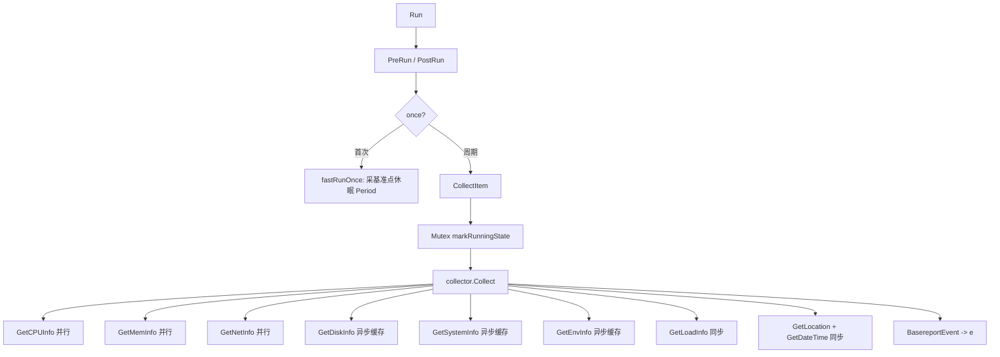

# 采集任务深化：basereport（主机基础指标）

> 返回：[总览](01-总览.md) ｜ 上接：[采集任务分类总览](06-采集任务分类总览.md)

<cite>
**本文引用的文件**
- [任务入口 Gather / Run / CollectItem](file://bkmonitor-datalink/pkg/bkmonitorbeat/tasks/basereport/basereport.go)
- [采集汇总 Collect 与 ReportData](file://bkmonitor-datalink/pkg/bkmonitorbeat/tasks/basereport/collector/colloctor.go)
- [CPU 指标 CpuReport](file://bkmonitor-datalink/pkg/bkmonitorbeat/tasks/basereport/collector/cpu.go)
- [内存指标 MemReport](file://bkmonitor-datalink/pkg/bkmonitorbeat/tasks/basereport/collector/mem.go)
- [磁盘指标 DiskReport / DiskStats](file://bkmonitor-datalink/pkg/bkmonitorbeat/tasks/basereport/collector/disk.go)
- [网络指标 NetReport](file://bkmonitor-datalink/pkg/bkmonitorbeat/tasks/basereport/collector/net.go)
- [负载指标 LoadReport](file://bkmonitor-datalink/pkg/bkmonitorbeat/tasks/basereport/collector/load.go)
- [系统指标 SystemReport](file://bkmonitor-datalink/pkg/bkmonitorbeat/tasks/basereport/collector/system.go)
- [环境指标 EnvReport](file://bkmonitor-datalink/pkg/bkmonitorbeat/tasks/basereport/collector/env.go)
- [配置结构 BasereportConfig](file://bkmonitor-datalink/pkg/bkmonitorbeat/configs/basereport.go)
</cite>

## 目录
- [简介](#简介)
- [核心配置](#核心配置)
- [采集流程](#采集流程)
- [指标组详解](#指标组详解)
- [上报与去重](#上报与去重)
- [结论](#结论)

## 简介
`basereport` 对应 `define.ModuleBasereport="basereport"`，是 bkmonitorbeat 最基础的主机指标采集任务，覆盖 CPU、内存、磁盘、网络、负载、系统、环境 7 大类主机运行数据。它内嵌 `tasks.BaseTask` 获得 `define.Task` 能力，由 `Scheduler` 按 daemon 周期驱动；采集逻辑集中在 `tasks/basereport/collector/` 子包，与任务编排解耦，便于单独演进与单测。本页为《采集任务分类总览》中 basereport 模块的下钻，聚焦其配置分组、采集流程与具体指标字段。

章节来源
- [Gather 结构与 Run 入口](file://bkmonitor-datalink/pkg/bkmonitorbeat/tasks/basereport/basereport.go#L28-L35)
- [BasereportConfig 配置分组](file://bkmonitor-datalink/pkg/bkmonitorbeat/configs/basereport.go#L79-L90)

## 核心配置
`configs.BasereportConfig`（configs/basereport.go L79）内嵌 `BaseTaskParam`，并按采集维度分组：

| 配置分组 | 类型 | 关键字段 |
|----------|------|----------|
| `Cpu` | `CpuConfig` | `StatTimes`（采样次数）、`StatPeriod`（采样间隔）、`InfoPeriod`/`InfoTimeout` |
| `Disk` | `DiskConfig` | `StatTimes`、`DiskWhiteList/BlackList`、`Partition*List`、`Mountpoint*List`、`FSType*List`、`IOSkipPartition`、`DropDuplicateDevice` |
| `Mem` | `MemConfig` | `InfoTimes`、`SpecialSource`（内存来源） |
| `Net` | `NetConfig` | `InterfaceWhiteList/BlackList`、`ForceReportList`、`SkipVirtualInterface`、`RevertProtectNumber` |
| 环境开关 | `bool` | `ReportCrontab`/`ReportHosts`/`ReportRoute` 等 |
| `TimeTolerate` | `int64` | 时间戳容差，默认 59s |

`New`（basereport.go L38）会按 `Period` 与各组 `StatTimes` 反算 `StatPeriod`/`InfoPeriod`，并预编译磁盘/网络各黑白名单正则；若 `StatTimes` 为 0 则回退到 `DefaultBasereportConfig`。

章节来源
- [New 初始化与正则编译](file://bkmonitor-datalink/pkg/bkmonitorbeat/tasks/basereport/basereport.go#L38-L131)
- [配置结构与默认兜底](file://bkmonitor-datalink/pkg/bkmonitorbeat/configs/basereport.go#L79-L90)

## 采集流程
`Run`（basereport.go L134）先 `PreRun` 再执行：首次运行走 `fastRunOnce` 采集基准点（用于后续差值计算），之后每次周期走 `CollectItem` → `collector.Collect`。

`collector.Collect`（colloctor.go L134）以并发方式汇总 7 组指标：CPU/内存/网络三组并行（sync.WaitGroup）；磁盘/系统/环境三组用 `JobMgr` 异步后台采集并缓存到全局变量（避免每轮重复开销），本轮直接 `deepCopy` 复用；负载、地理位置、时间戳则为同步采集。

章节来源
- [Run 入口与首次基准](file://bkmonitor-datalink/pkg/bkmonitorbeat/tasks/basereport/basereport.go#L134-L186)
- [CollectItem 并发控制](file://bkmonitor-datalink/pkg/bkmonitorbeat/tasks/basereport/basereport.go#L208-L267)
- [Collect 并发汇总](file://bkmonitor-datalink/pkg/bkmonitorbeat/tasks/basereport/collector/colloctor.go#L134-L253)

图表来源
- [Run 入口与首次基准](file://bkmonitor-datalink/pkg/bkmonitorbeat/tasks/basereport/basereport.go#L134-L186)
- [CollectItem 并发控制](file://bkmonitor-datalink/pkg/bkmonitorbeat/tasks/basereport/basereport.go#L208-L267)
- [Collect 并发汇总](file://bkmonitor-datalink/pkg/bkmonitorbeat/tasks/basereport/collector/colloctor.go#L134-L253)

## 指标组详解
`ReportData`（colloctor.go L255）聚合 7 个指标组，JSON 字段名即上报字段：

| 指标组 | JSON key | 结构 | 关键字段 |
|--------|----------|------|----------|
| CPU | `cpu` | `CpuReport` | `per_usage`（每核利用率）、`total_usage`、`total_stat`（cpu.TimesStat 累计时间片）、`cpuinfo` |
| 内存 | `mem` | `MemReport` | `meminfo`（VirtualMemoryStat：total/used/free/used_percent 等）、`vmstat`（SwapMemoryStat）、`swap_in`/`swap_out` |
| 磁盘 | `disk` | `DiskReport` | `diskstat`（按设备名索引的 IO 统计）、`partition`、`usage` |
| 网络 | `net` | `NetReport` | `interface`、`dev`（含 `speedSent/speedRecv/speedPacketsSent/Recv` 速率）、`netstat`、`protocolstat` |
| 负载 | `load` | `LoadReport` | `load_avg`（1/5/15 分钟）、`per_cpu_load` |
| 系统 | `system` | `SystemReport` | `info`（host.Info：hostname/os/platform/version、procs、procs_zombie、uptime、system_type） |
| 环境 | `env` | `EnvReport` | `crontab`、`host`、`route`、`maxfiles`、`allocated_files`、`uname`、`login_user`、`proc_running_current`、`procs_processes_total`、`procs_ctxt_total` |

`DiskStats`（disk.go L26）按磁盘设备名索引，核心 IO 字段包括：`readBytes`/`writeBytes`、`readCount`/`writeCount`、`readTime`/`writeTime`、`speedIORead`/`speedByteRead`/`speedIOWrite`/`speedByteWrite`、`util`（利用率）、`avgrq_sz`/`avgqu_sz`、`iopsInProgress` 等。

章节来源
- [ReportData 聚合结构](file://bkmonitor-datalink/pkg/bkmonitorbeat/tasks/basereport/collector/colloctor.go#L255-L264)
- [CpuReport](file://bkmonitor-datalink/pkg/bkmonitorbeat/tasks/basereport/collector/cpu.go#L21-L27)
- [MemReport](file://bkmonitor-datalink/pkg/bkmonitorbeat/tasks/basereport/collector/mem.go#L21-L26)
- [DiskReport 与 DiskStats](file://bkmonitor-datalink/pkg/bkmonitorbeat/tasks/basereport/collector/disk.go#L26-L96)
- [NetReport](file://bkmonitor-datalink/pkg/bkmonitorbeat/tasks/basereport/collector/net.go#L23-L28)
- [LoadReport](file://bkmonitor-datalink/pkg/bkmonitorbeat/tasks/basereport/collector/load.go#L16-L18)
- [SystemReport](file://bkmonitor-datalink/pkg/bkmonitorbeat/tasks/basereport/collector/system.go#L40-L42)
- [EnvReport](file://bkmonitor-datalink/pkg/bkmonitorbeat/tasks/basereport/collector/env.go#L17-L29)

## 上报与去重
- **事件封装**：`BasereportEvent`（basereport.go L188）实现 `define.Event`，`GetType()` 返回 `ModuleBasereport`，`AsMapStr()` 输出 `{type:"basereport", dataid, data}`，`data` 即 `collector.ReportData`。
- **并发互斥**：`CollectItem` 用 `runMutex` + `markRunningState`/`markDoneState` 保证同一时刻只有一个采集在跑，避免重叠。
- **按分钟去重**：`toolkit.IsDiffMinLastPublish` 校验当前分钟是否已上报，配合 `toolkit.RecordPublishTime` 记录上报时间，防止同分钟内重复投递（规避跨分钟时间戳漂移导致的误判）。
- **DataID 门控**：仅当 `config.DataID >= 0` 才真正采集并上报。

章节来源
- [BasereportEvent 封装](file://bkmonitor-datalink/pkg/bkmonitorbeat/tasks/basereport/basereport.go#L188-L206)
- [CollectItem 互斥与按分钟去重](file://bkmonitor-datalink/pkg/bkmonitorbeat/tasks/basereport/basereport.go#L208-L267)

## 结论
basereport 是 bkmonitorbeat 主机指标采集的核心实现：以 `BaseTask` 为骨架、以 `collector` 子包承载具体指标采集，通过分组配置与并发/异步混合的采集策略在性能与实时性间取得平衡；7 组指标最终聚合为单一 `ReportData` 经 `BasereportEvent` 上报。其"任务编排与指标采集分离"的写法，是该采集器可下钻、可单测、可扩展的典型范例，也是理解其他 `tasks/*` 模块实现模式的入口。

章节来源
- [Gather 结构与 Run 入口](file://bkmonitor-datalink/pkg/bkmonitorbeat/tasks/basereport/basereport.go#L28-L35)
- [Collect 并发汇总](file://bkmonitor-datalink/pkg/bkmonitorbeat/tasks/basereport/collector/colloctor.go#L134-L253)
