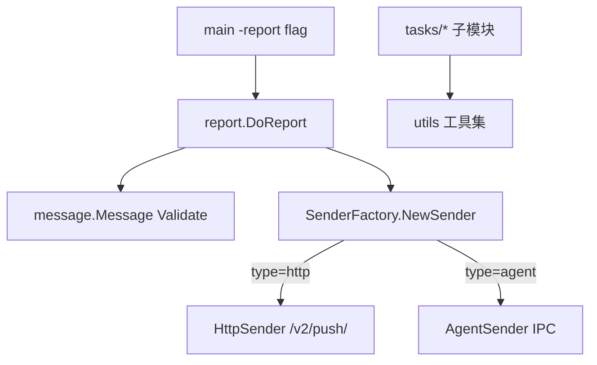

# 工具与上报通道

> 返回：[总览](01-总览.md)
<cite>
**本文引用的文件**
- [HookManager 钩子管理](file://bkmonitor-datalink/pkg/bkmonitorbeat/utils/hooks.go)
- [IP/域名校验工具](file://bkmonitor-datalink/pkg/bkmonitorbeat/utils/ip.go)
- [字符串匹配工具](file://bkmonitor-datalink/pkg/bkmonitorbeat/utils/match.go)
- [上报配置与入口 DoReport](file://bkmonitor-datalink/pkg/bkmonitorbeat/report/report.go)
- [Sender 抽象与工厂](file://bkmonitor-datalink/pkg/bkmonitorbeat/report/base.go)
- [Message 结构与校验](file://bkmonitor-datalink/pkg/bkmonitorbeat/report/message/message.go)
- [HTTP Sender 实现](file://bkmonitor-datalink/pkg/bkmonitorbeat/report/sender/http/http.go)
</cite>

## 目录
- [简介](#简介)
- [项目结构](#项目结构)
- [核心组件](#核心组件)
- [架构总览](#架构总览)
- [组件详细分析](#组件详细分析)
- [依赖关系分析](#依赖关系分析)
- [结论](#结论)

## 简介
bkmonitorbeat 的支撑能力由两部分构成：`utils/` 提供各采集任务共用的工具集（钩子、IP/域名校验、字符串匹配、类型转换、RPM 校验、cgroup 限制等）；`report/` 提供独立命令行上报通道，将事件/时序数据直接推送到 bkmonitorproxy（agent IPC 或 HTTP）。本页说明这两部分的设计与用法。

章节来源
- [HookManager 钩子管理](file://bkmonitor-datalink/pkg/bkmonitorbeat/utils/hooks.go#L23-L45)
- [上报配置与入口 DoReport](file://bkmonitor-datalink/pkg/bkmonitorbeat/report/report.go#L39-L174)
- [Sender 抽象与工厂](file://bkmonitor-datalink/pkg/bkmonitorbeat/report/base.go#L18-L44)

## 项目结构
### utils/ 工具集（按职责分组）
| 文件 | 职责 |
|------|------|
| `hooks.go` | `HookManager`/`HookFunction` 钩子链，供 `BaseTask` 的 `PreRun`/`PostRun` 调用 |
| `ip.go` | `DomainType` 与 `CheckIpOrDomainValid`/`FilterIpsWithIpType`，IP/域名类型判断 |
| `match.go` | 匹配类型常量与 `IsMatch`/`IsMatchString`/`WildcardToRegex`，用于日志关键字等匹配 |
| `conv.go` | 类型转换（如 `ConvertHexStringToBytes`，被 `match.go` 的 `MatchHex` 调用） |
| `diffs.go` | 差异计算工具 |
| `reflect.go` | 反射辅助 |
| `rpm.go` | RPM 包校验（`RpmVerify`，被 main 的 `-verify-rpm` 调用） |
| `time.go` | 时间处理 |
| `file.go` | 文件操作 |
| `pipes.go` / `pipes_unix.go` / `pipes_windows.go` | 管道读写（跨平台） |
| `cgroup_linux.go` / `cgroup_others.go` | cgroup 资源限制（`SetLinuxCGroup`） |
| `atomic.go` | 原子操作 |
| `misc.go` / `tempfile.go` | 杂项与临时文件 |

### report/ 上报通道
| 文件 | 职责 |
|------|------|
| `report.go` | `ReportConfig`、命令行 flag、参数组装 `CompareAndPrepareArgs`、上报入口 `DoReport` |
| `base.go` | `Sender` 接口、`SenderFactory`、`RegisterSender` 注册机制 |
| `message/message.go` | `Message`（Kind/Content）与 `Validate`（按 JSON Schema 校验） |
| `message/schema.go` | event/timeseries 的 JSON Schema 定义 |
| `sender/agent/` | 经由 gse agent IPC 的 Sender 实现 |
| `sender/http/` | 经由 HTTP 推送到 bkmonitorproxy 的 Sender 实现 |

章节来源
- [HookManager 钩子管理](file://bkmonitor-datalink/pkg/bkmonitorbeat/utils/hooks.go#L23-L45)
- [IP/域名校验工具](file://bkmonitor-datalink/pkg/bkmonitorbeat/utils/ip.go#L17-L48)
- [字符串匹配工具](file://bkmonitor-datalink/pkg/bkmonitorbeat/utils/match.go#L20-L100)
- [上报配置与入口 DoReport](file://bkmonitor-datalink/pkg/bkmonitorbeat/report/report.go#L25-L174)
- [Sender 抽象与工厂](file://bkmonitor-datalink/pkg/bkmonitorbeat/report/base.go#L18-L44)
- [Message 结构与校验](file://bkmonitor-datalink/pkg/bkmonitorbeat/report/message/message.go#L20-L39)

## 核心组件
- **HookManager**：以 `arraylist` 维护 `HookFunction` 链，`Add` 追加、`Apply(ctx)` 顺序执行所有钩子；`BaseTask` 的 `HookPreRun`/`HookPostRun` 即此类型。
- **IP/域名校验**：`CheckIpOrDomainValid` 返回 `Domain(0)/V4(4)/V6(6)`，`FilterIpsWithIpType` 按类型过滤 IP 列表。
- **字符串匹配**：`match.go` 定义 `reg`/`eq`/`nq`/`startswith`/`endswith`/`in`/`nin`/`wildcard`/`hex` 等匹配类型，`IsMatch` 按类型对字节内容匹配，`WildcardToRegex` 将通配符转为正则。
- **上报通道（report）**：`ReportConfig` 承载 `report.type`（http/agent）、HTTP 服务地址/token、DataID、消息类型（event/timeseries）等；`DoReport` 为入口，组装 `Message` 并经 `SenderFactory.NewSender` 选择 Sender 发送。

章节来源
- [HookManager 钩子管理](file://bkmonitor-datalink/pkg/bkmonitorbeat/utils/hooks.go#L19-L45)
- [IP/域名校验工具](file://bkmonitor-datalink/pkg/bkmonitorbeat/utils/ip.go#L17-L48)
- [字符串匹配工具](file://bkmonitor-datalink/pkg/bkmonitorbeat/utils/match.go#L20-L100)
- [上报配置与入口 DoReport](file://bkmonitor-datalink/pkg/bkmonitorbeat/report/report.go#L39-L174)
- [Sender 抽象与工厂](file://bkmonitor-datalink/pkg/bkmonitorbeat/report/base.go#L18-L44)
- [Message 结构与校验](file://bkmonitor-datalink/pkg/bkmonitorbeat/report/message/message.go#L20-L39)

## 架构总览
`report/` 是独立的命令行通道（由 `main` 的 `-report` flag 触发），与常驻采集链路解耦：它读取命令行参数组装 `Message`，通过 `SenderFactory` 按 `report.type` 选择 `agent` 或 `http` Sender 推送数据；`utils/` 工具则在常驻采集链路中被各 `tasks/*` 子模块直接调用。

章节来源
- [上报配置与入口 DoReport](file://bkmonitor-datalink/pkg/bkmonitorbeat/report/report.go#L138-L174)
- [Sender 抽象与工厂](file://bkmonitor-datalink/pkg/bkmonitorbeat/report/base.go#L18-L44)
- [HookManager 钩子管理](file://bkmonitor-datalink/pkg/bkmonitorbeat/utils/hooks.go#L23-L45)

图表来源
- [上报配置与入口 DoReport](file://bkmonitor-datalink/pkg/bkmonitorbeat/report/report.go#L138-L174)
- [Sender 抽象与工厂](file://bkmonitor-datalink/pkg/bkmonitorbeat/report/base.go#L18-L44)
- [HTTP Sender 实现](file://bkmonitor-datalink/pkg/bkmonitorbeat/report/sender/http/http.go#L22-L64)

## 组件详细分析
### utils/ 工具集用法
- `HookManager`：`tasks/task.go` 的 `BaseTask` 通过 `HookPreRun.Apply(ctx)`（在 `PreRun` 中）与 `HookPostRun.Apply(ctx)`（在 `PostRun` 中）执行钩子链，用于注入任务前后逻辑。
- `match.go`：关键词采集（`tasks/keyword`）等场景调用 `IsMatch`/`IsMatchString` 进行内容匹配；`WildcardToRegex` 支撑通配符匹配。
- `ip.go`：拨测/网络类任务在解析 target 时调用 `CheckIpOrDomainValid` 判断地址类型并用 `FilterIpsWithIpType` 筛选。
- `rpm.go`：`main.go` 在 `-verify-rpm` 模式下调用 `utils.RpmVerify` 校验 RPM 包完整性（配合 `cgroup` 限制）。

章节来源
- [HookManager 钩子管理](file://bkmonitor-datalink/pkg/bkmonitorbeat/utils/hooks.go#L19-L45)
- [IP/域名校验工具](file://bkmonitor-datalink/pkg/bkmonitorbeat/utils/ip.go#L17-L48)
- [字符串匹配工具](file://bkmonitor-datalink/pkg/bkmonitorbeat/utils/match.go#L20-L100)

### report/ 上报通道
- `ReportConfig` 与命令行 flag（L25-L67）：`report.type`、`report.http.server`、`report.http.token`、`report.agent.address`、`report.bk_data_id`、`report.message.kind`（event/timeseries）等。
- `CompareAndPrepareArgs`（L69）：按 `MessageKind` 组装/补全 JSON 内容（event 填充 `event_name`/`target`/`content`/`data_id`/`timestamp`，timeseries 填充 `data_id`），并注入 `access_token`。
- `DoReport`（L138）：`Validate` 校验 `Message` → `NewSenderFactory().NewSender(reportType, config)` 取得 Sender → `SendSync(dataID, msg)` 发送；整个过程包 `recover` 防止 panic。
- `Sender` 抽象（base.go L21）：`Send`/`SendSync` 两个方法；`RegisterSender(name, fn)` 注册，`SenderFactory.NewSender` 按名查找。具体实现：`sender/http` 的 `HttpSender`（POST 到 `http://{server}/v2/push/`）与 `sender/agent`（agent IPC）。`main.go` 启动时调用 `senderhttp.Register()` 与 `senderagent.Register(...)` 完成注册。
- `Message.Validate`（message.go L30）：按 `Kind` 用 `eventSchema`/`timeseriesSchema` 做 JSON Schema 校验。

章节来源
- [上报配置与入口 DoReport](file://bkmonitor-datalink/pkg/bkmonitorbeat/report/report.go#L25-L174)
- [Sender 抽象与工厂](file://bkmonitor-datalink/pkg/bkmonitorbeat/report/base.go#L18-L44)
- [Message 结构与校验](file://bkmonitor-datalink/pkg/bkmonitorbeat/report/message/message.go#L20-L39)
- [HTTP Sender 实现](file://bkmonitor-datalink/pkg/bkmonitorbeat/report/sender/http/http.go#L22-L64)

## 依赖关系分析
- `utils/` 为基础库，被 `tasks/*`（HookManager/IP/匹配/RPM）、`beater`（RecoverFor）等广泛依赖，自身仅依赖 `logger`/第三方小库。
- `report/` 依赖 `report/message` 与 `report/sender/*`；`sender/http` 与 `sender/agent` 在 `main` 初始化期注册到 `base.go` 的 `senderFactor`。
- `report/` 与常驻采集链路（`beater`/`scheduler`/`tasks`）除共享 `define.Event`/工具外相互独立，作为独立 CLI 子命令存在。

章节来源
- [上报配置与入口 DoReport](file://bkmonitor-datalink/pkg/bkmonitorbeat/report/report.go#L138-L174)
- [Sender 抽象与工厂](file://bkmonitor-datalink/pkg/bkmonitorbeat/report/base.go#L18-L44)
- [HookManager 钩子管理](file://bkmonitor-datalink/pkg/bkmonitorbeat/utils/hooks.go#L23-L45)

## 结论
`utils/` 以零业务依赖的纯工具集支撑各采集任务（钩子、地址校验、匹配、RPM、cgroup 等），`report/` 则以独立命令行通道（`DoReport` + `Sender` 抽象 + `Message` Schema 校验）提供事件/时序数据的直接上报能力。两者分别承担了「采集过程支撑」与「旁路数据上报」职责，使 bkmonitorbeat 既能在常驻模式下海量采集，也能按需单发数据。

章节来源
- [HookManager 钩子管理](file://bkmonitor-datalink/pkg/bkmonitorbeat/utils/hooks.go#L23-L45)
- [上报配置与入口 DoReport](file://bkmonitor-datalink/pkg/bkmonitorbeat/report/report.go#L39-L174)
- [Sender 抽象与工厂](file://bkmonitor-datalink/pkg/bkmonitorbeat/report/base.go#L18-L44)
- [Message 结构与校验](file://bkmonitor-datalink/pkg/bkmonitorbeat/report/message/message.go#L20-L39)
