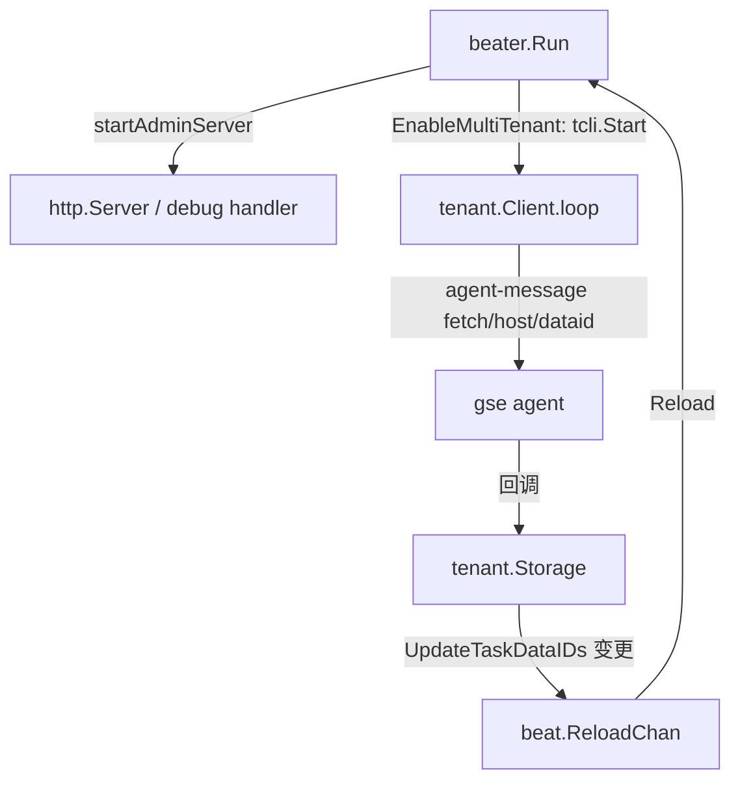

# HTTP服务与多租户

> 返回：[总览](01-总览.md)
<cite>
**本文引用的文件**
- [Admin HTTP 服务](file://bkmonitor-datalink/pkg/bkmonitorbeat/http/server.go)
- [多租户 Client（gse agent-message）](file://bkmonitor-datalink/pkg/bkmonitorbeat/tenant/client.go)
- [多租户 DataID 存储](file://bkmonitor-datalink/pkg/bkmonitorbeat/tenant/storage.go)
- [Beater 启动链路中启用两者](file://bkmonitor-datalink/pkg/bkmonitorbeat/beater/beater.go)
</cite>

## 目录
- [简介](#简介)
- [项目结构](#项目结构)
- [核心组件](#核心组件)
- [架构总览](#架构总览)
- [组件详细分析](#组件详细分析)
- [依赖关系分析](#依赖关系分析)
- [结论](#结论)

## 简介
bkmonitorbeat 在常驻采集之外还提供两类支撑能力：`http/` 暴露一个 Admin HTTP 服务（基于 gse debug handler，用于运维排查）；`tenant/` 在多租户模式下通过 gse agent-message 通道从平台拉取「任务 → DataID」映射，并热更新采集配置。本页说明两者的设计与在启动链路中的位置。

章节来源
- [Admin HTTP 服务](file://bkmonitor-datalink/pkg/bkmonitorbeat/http/server.go#L24-L39)
- [多租户 Client（gse agent-message）](file://bkmonitor-datalink/pkg/bkmonitorbeat/tenant/client.go#L33-L199)
- [Beater 启动链路中启用两者](file://bkmonitor-datalink/pkg/bkmonitorbeat/beater/beater.go#L180-L184)

## 项目结构
- `http/server.go`：定义 `NewRootHandler`（挂载 debug handler）与 `NewServer`，即 Admin 服务本体。
- `tenant/client.go`：`Client` 封装 gse `agentmessage.Client`，按节奏向 agent 发送 `fetch/host/dataid` 请求，回调中更新本地 DataID 映射并触发 reload。
- `tenant/storage.go`：`Storage` 以 `map[string]int32` 缓存 `task→dataid`，提供 `GetTaskDataID`/`UpdateTaskDataIDs` 与全局 `DefaultStorage`。
- `tenant/socket_options*.go`：按平台构造 agent-message 的 socket 连接选项（Windows/其他）。
- `beater/beater.go`：在 `New` 中按 `EnableMultiTenant` 创建 `tcli`；在 `Run` 中 `tcli.Start()` 并 `startAdminServer()`。

章节来源
- [Admin HTTP 服务](file://bkmonitor-datalink/pkg/bkmonitorbeat/http/server.go#L10-L39)
- [多租户 Client（gse agent-message）](file://bkmonitor-datalink/pkg/bkmonitorbeat/tenant/client.go#L33-L114)
- [多租户 DataID 存储](file://bkmonitor-datalink/pkg/bkmonitorbeat/tenant/storage.go#L17-L51)
- [Beater 启动链路中启用两者](file://bkmonitor-datalink/pkg/bkmonitorbeat/beater/beater.go#L141-L184)

## 核心组件
- **Admin Server**：`NewRootHandler`（L24）构造 `http.ServeMux` 并把根路径 `/` 挂到 `debug.NewDebugHandler(version)`；`NewServer(addr)`（L34）用给定地址创建 `*http.Server`。由 `beater.startAdminServer` 在 `Run` 中启动（仅当 `AdminAddr` 非空）。
- **Tenant Client**：`Client`（client.go L33）持有 gse `agentmessage.Client` 与一个 `Pacer`（最大间隔 1 小时）。`Start`（L151）启动 agent 连接并 `go c.loop()`；`loop`（L160）按打散节奏发送 `fetch/host/dataid` 请求，回调中调用 `DefaultStorage().UpdateTaskDataIDs` 并在变更时向 `beat.ReloadChan` 推送触发 reload。
- **Tenant Storage**：`Storage`（storage.go L17）以互斥锁保护 `task→dataid` 映射，`UpdateTaskDataIDs` 通过 `reflect.DeepEqual` 判断是否有变更（有变更才返回 `true` 并触发 reload），`DefaultStorage()` 返回进程内单例。

章节来源
- [Admin HTTP 服务](file://bkmonitor-datalink/pkg/bkmonitorbeat/http/server.go#L18-L39)
- [多租户 Client（gse agent-message）](file://bkmonitor-datalink/pkg/bkmonitorbeat/tenant/client.go#L33-L199)
- [多租户 DataID 存储](file://bkmonitor-datalink/pkg/bkmonitorbeat/tenant/storage.go#L17-L51)

## 架构总览
两者均由 `beater` 在启动期按需启用：Admin Server 在 `Run` 中 `startAdminServer()` 启动；多租户 Client 在 `EnableMultiTenant` 时在 `New` 创建、`Run` 中 `Start()`，其后通过 agent-message 周期拉取 DataID 映射，变更即驱动配置 reload。

章节来源
- [Beater 启动 Admin 服务](file://bkmonitor-datalink/pkg/bkmonitorbeat/beater/beater.go#L761-L769)
- [Beater 启动链路中启用两者](file://bkmonitor-datalink/pkg/bkmonitorbeat/beater/beater.go#L180-L184)
- [多租户 Client（gse agent-message）](file://bkmonitor-datalink/pkg/bkmonitorbeat/tenant/client.go#L33-L199)

图表来源
- [Admin HTTP 服务](file://bkmonitor-datalink/pkg/bkmonitorbeat/http/server.go#L34-L39)
- [Beater 启动 Admin 服务](file://bkmonitor-datalink/pkg/bkmonitorbeat/beater/beater.go#L761-L769)
- [多租户 Client（gse agent-message）](file://bkmonitor-datalink/pkg/bkmonitorbeat/tenant/client.go#L151-L199)
- [多租户 DataID 存储](file://bkmonitor-datalink/pkg/bkmonitorbeat/tenant/storage.go#L36-L45)

## 组件详细分析
### Admin HTTP 服务
`http/server.go` 极简：仅暴露 gse 提供的 debug handler（用于查看运行时信息/pprof 等运维能力），不承载业务采集接口。`NewRootHandler` 支持通过 `HandlerOptFn` 注入 `version`；`NewServer` 用 `AdminAddr` 构造服务并在 `beater.startAdminServer` 中 `ListenAndServe`（协程），`AdminAddr` 为空则跳过。

章节来源
- [Admin HTTP 服务](file://bkmonitor-datalink/pkg/bkmonitorbeat/http/server.go#L24-L39)
- [Beater 启动 Admin 服务](file://bkmonitor-datalink/pkg/bkmonitorbeat/beater/beater.go#L761-L769)

### 多租户 Client
- `NewClient(opt)`（L61）：按 `opt.IPC` 构造 agent-message socket 选项，注册插件名 `bkmonitorbeat` 与版本；回调（L73）解析响应中的 `[]FetchHostDataIDData`（task/dataid 对），调用 `DefaultStorage().UpdateTaskDataIDs` 更新；若更新则写入 `beat.ReloadChan` 触发采集器 reload，并记录日志。
- 请求类型 `TypeFetchHostDataID = "fetch/host/dataid"`（L120），命名规则为 `{动作}/{范围}/{对象}`；`loop`（L160）首包在启动后 1 分钟内随机打散发送，`Pacer.Next()`（L212）以指数退避（封顶 1 小时）控制拉取节奏，避免对 agent 造成突发压力。
- `AgentMsgRequest`（L132）携带 `cloudid`/`bk_agent_id`/`bk_tenant_id`/`ip` 与 `params`（待查询的 `Tasks` 列表），据此获取各主机相关任务的内置 DataID。

章节来源
- [多租户 Client（gse agent-message）](file://bkmonitor-datalink/pkg/bkmonitorbeat/tenant/client.go#L61-L199)

### 多租户 DataID 存储
`Storage`（storage.go L17）是「任务名 → DataID」的本地缓存：`GetTaskDataID(task)` 供采集任务获取当前 DataID；`UpdateTaskDataIDs(tasks)` 在收到 agent 响应时写入，仅当映射变化才返回 `true`（触发 reload）。`DefaultStorage()` 提供进程单例，被 `Client` 回调与各采集任务共享。

章节来源
- [多租户 DataID 存储](file://bkmonitor-datalink/pkg/bkmonitorbeat/tenant/storage.go#L17-L51)

## 依赖关系分析
- `http/` 依赖 `libgse/debug`（debug handler）与标准 `net/http`，被 `beater.startAdminServer` 调用。
- `tenant/` 依赖 gse `agent-message`、libgse `beat`（`ReloadChan`）、`define`（日志/配置）、`logger`；`Client` 依赖 `Storage`（`DefaultStorage`）。
- `beater` 在 `New`（`EnableMultiTenant`）创建 `tcli`、在 `Run` 启动 `tcli` 与 admin server，并将 tenant 变更经 `beat.ReloadChan` 汇入统一的 reload 链路（与配置热更新共用）。
- 多租户拉取的 DataID 经由 `Storage` 注入各采集任务的配置（`TaskConfig.GetDataID`），与 `configs`/`configengine` 协同。

章节来源
- [Beater 启动链路中启用两者](file://bkmonitor-datalink/pkg/bkmonitorbeat/beater/beater.go#L180-L184)
- [Beater Run 启动 tcli 与 admin](file://bkmonitor-datalink/pkg/bkmonitorbeat/beater/beater.go#L507-L519)
- [多租户 Client（gse agent-message）](file://bkmonitor-datalink/pkg/bkmonitorbeat/tenant/client.go#L73-L97)
- [多租户 DataID 存储](file://bkmonitor-datalink/pkg/bkmonitorbeat/tenant/storage.go#L36-L45)

## 结论
`http/` 提供了轻量的 Admin 运维服务（基于 gse debug handler），`tenant/` 则在多租户场景下通过 gse agent-message 通道动态拉取「任务 → DataID」映射并热更新采集配置。两者都作为 `beater` 启动期的可选/条件能力挂载：Admin Server 受 `AdminAddr` 控制，多租户 Client 受 `EnableMultiTenant` 控制，且租户变更与配置热更新汇入同一 `ReloadChan`，保证采集管线一致地感知外部变化。

章节来源
- [Admin HTTP 服务](file://bkmonitor-datalink/pkg/bkmonitorbeat/http/server.go#L24-L39)
- [多租户 Client（gse agent-message）](file://bkmonitor-datalink/pkg/bkmonitorbeat/tenant/client.go#L33-L199)
- [多租户 DataID 存储](file://bkmonitor-datalink/pkg/bkmonitorbeat/tenant/storage.go#L17-L51)
- [Beater 启动链路中启用两者](file://bkmonitor-datalink/pkg/bkmonitorbeat/beater/beater.go#L180-L184)
