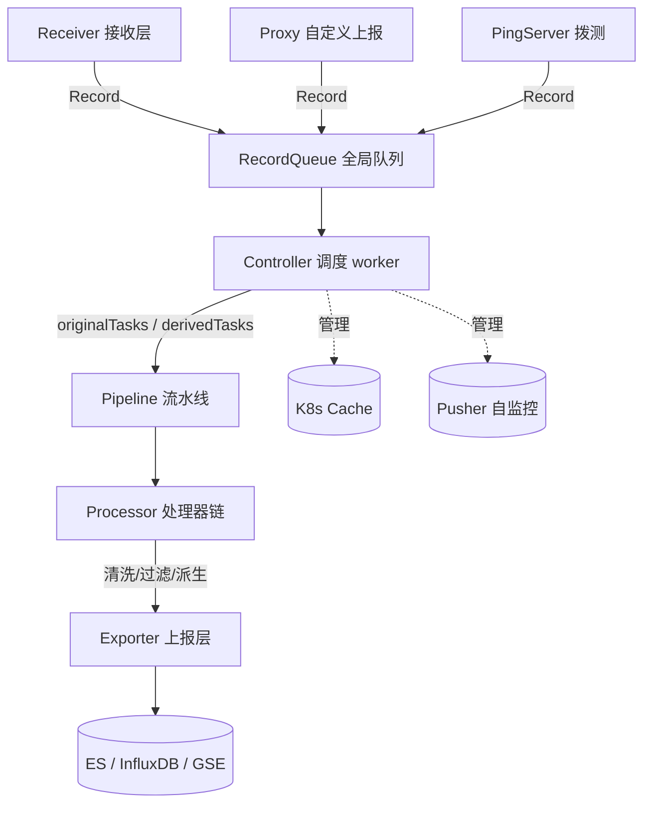
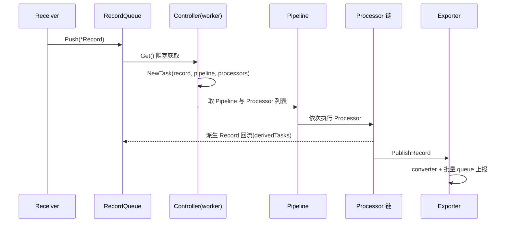

<!-- [待审核] AI 自动生成，请人工确认后移除此标记 -->
# 01-概述与架构总览

<cite>
- [Controller 装配](file://pkg/collector/controller/controller.go)
- [RecordType 定义](file://pkg/collector/define/record.go)
- [Task 调度单元](file://pkg/collector/define/task.go)
- [并发模型](file://pkg/collector/define/concurrency.go)
- [子配置类型](file://pkg/collector/define/subconfig.go)
</cite>

## 目录
1. [简介](#简介)
2. [项目结构](#项目结构)
3. [核心组件](#核心组件)
4. [架构总览](#架构总览)
5. [核心数据流](#核心数据流)
6. [并发与 worker 模型](#并发与-worker-模型)
7. [配置三态](#配置三态)
8. [结论](#结论)

## 简介

bk-collector 是蓝鲸监控（BlueKing Monitor）可观测数据采集层的统一接收与清洗框架，代码位于 `pkg/collector`。它作为数据中转枢纽，接收多种采集协议（OTLP / Jaeger / SkyWalking / Prometheus / Beat / Tars / FTA 等）上报的 trace、metric、log、profile 数据，经过 Processor 清洗、过滤、派生后，由 Exporter 转换为目标存储格式（Elasticsearch / InfluxDB / GSE）上报。其设计目标是把"接收协议差异"与"数据处理逻辑"解耦，使新增协议或新增处理逻辑都只需实现约定接口并注册，由 Controller 统一调度。

**章节来源**
- [Controller 装配各层 Manager](file://pkg/collector/controller/controller.go#L42-L59)

## 项目结构

`pkg/collector` 按职责纵向分层，主要目录如下：

| 目录 | 职责 |
|------|------|
| `define` | 全链路数据契约：Record / Token / Task / Event / 并发配置 / 子配置常量 |
| `receiver` | 接收层，启动 HTTP / Admin / GRPC / Tars 服务，解析各协议并转为 Record |
| `pipeline` | 流水线定义与解析，绑定 DataID 到一组 Processor |
| `processor` | 处理器实现（清洗 / 控制 / 派生），通过注册机制挂载 |
| `exporter` | 上报层，converter 转换 + 批量 queue 上报到存储 |
| `controller` | 控制器，装配各层并调度 worker 消费 Record / Task |
| `confengine` | 配置引擎，封装 beat.Config 并支持主/平台/子配置三级查找 |
| `proxy` | 自定义上报代理（/v2/push）与 Consul 注册 |
| `pingserver` | 拨测（ICMP）接收 |
| `cache` | K8s 元数据缓存等辅助缓存 |
| `pusher` | 指标自监控 pusher |

**章节来源**
- [Controller 持有的各层 Manager 字段](file://pkg/collector/controller/controller.go#L49-L59)

## 核心组件

`Controller.New` 按依赖顺序装配各层，且"优先加载 pipeline，配置就绪后才启动服务"：

1. **Pipeline**：最先 `pipeline.New(conf)`，因为后续服务（Exporter/Proxy/Receiver）都依赖流水线定义。
2. **Exporter**：若未 `Disabled(exporter)` 则 `exporter.New`，负责上报。
3. **Proxy**：若未禁用则 `proxy.New`，负责自定义上报与 Consul 心跳。
4. **Pingserver**：若未禁用则 `pingserver.New`，负责拨测。
5. **Receiver**：若未禁用则 `receiver.New`，启动接收服务。
6. **Cache**：`cache.Install(conf)` 安装缓存（如 K8s 缓存）。
7. **Pusher**：若未禁用则 `pusher.New(ctx, conf)`，自监控指标上报。
8. 最后创建两个全局任务队列：`originalTasks` 与 `derivedTasks`（均为 `PushModeGuarantee`）。

**章节来源**
- [New 装配各层并创建双任务队列](file://pkg/collector/controller/controller.go#L111-L184)

## 架构总览

下图展示各层静态依赖关系：Receiver / Proxy / Pingserver 将外部数据汇入全局 `RecordQueue`，Controller 调度 worker 从队列取 Record 组装成 Task，交由 Pipeline 绑定的 Processor 链处理，最终 Exporter 上报；Controller 同时管理 Cache 等辅助组件。

**图表来源**
- [Controller 结构聚合各层 Manager](file://pkg/collector/controller/controller.go#L42-L59)
- [New 装配顺序与双任务队列](file://pkg/collector/controller/controller.go#L111-L184)

**章节来源**
- [Controller 装配各层关系](file://pkg/collector/controller/controller.go#L42-L184)

## 核心数据流

核心数据流为：Receiver 把协议数据解析为 `*Record` 推入 `RecordQueue`；Controller 的 worker 阻塞 `Get()` 取出 Record，按 Record 的 `RecordType` 与 Token 解析出所属 Pipeline 与 Processor 列表，封装为 `Task` 投入 `originalTasks` / `derivedTasks`；Pipeline 依次执行 Processor；派生类 Processor 产生的新 Record 会再次回流到队列形成 `derivedTasks`；最终 Exporter 的 `PublishRecord` 完成上报。

**图表来源**
- [Controller 双任务队列字段](file://pkg/collector/controller/controller.go#L57-L58)
- [New 创建 originalTasks/derivedTasks](file://pkg/collector/controller/controller.go#L181-L183)
- [Record 结构定义](file://pkg/collector/define/record.go#L135-L143)
- [Task 接口与 NewTask](file://pkg/collector/define/task.go#L12-L40)

**章节来源**
- [Controller 调度与任务队列](file://pkg/collector/controller/controller.go#L57-L58)
- [Record/Task 数据契约](file://pkg/collector/define/record.go#L135-L143)

## 并发与 worker 模型

并发度由 `define.Concurrency()` 决定，返回 `coreNum * 2`，队列容量通过 `QueueAmplification = 2` 放大（`Concurrency() * QueueAmplification`）。`SetCoreNum` 可经主配置 `max_procs` 覆盖并同步 `GOMAXPROCS`。Record / Task / Event 三类队列均提供 `Guarantee`（阻塞写入）与 `DropIfFull`（满则丢弃）两种 `PushMode`，全局队列默认 `Guarantee` 以保证不丢数据。

**章节来源**
- [并发度与队列放大常量](file://pkg/collector/define/concurrency.go#L17-L38)
- [RecordQueue 与 Push/Get](file://pkg/collector/define/record.go#L259-L286)
- [TaskQueue 与 Push/Get](file://pkg/collector/define/task.go#L65-L92)

## 配置三态

collector 的配置来自三层：`ConfigTypePrivileged`（主配置）、`ConfigTypePlatform`（平台下发）、`ConfigTypeSubConfig`（子配置，按 default/service/instance 三级字段细分）。`confengine.Config` 在 beat.Config 之上封装，支持 instance > service > default > global 的逐级回退查找（详见 `10-配置系统ConfEngine`）。子配置通过 `SubConfigFieldDefault/Service/Instance` 区分作用域。

**章节来源**
- [子配置作用域字段常量](file://pkg/collector/define/subconfig.go#L12-L16)
- [配置类型与字段常量](file://pkg/collector/define/subconfig.go#L18-L34)
- [max_procs 等主配置字段](file://pkg/collector/controller/controller.go#L36-L40)

## 结论

bk-collector 以 `define` 包定义的数据契约为中心，通过 Receiver → RecordQueue → Controller → Pipeline/Processor → Exporter 的流水线完成"接收—清洗—上报"，并用 `confengine` 的三态配置与 `proxy`/`pingserver` 等辅助组件支撑多协议、多租户的可观测数据接入。后续页面将逐层展开：数据结构（02）、接收层（03/04/05）、处理层（06-09）、配置（10）、上报（11）、调度（12）、辅助模块（13）。

**章节来源**
- [Controller 装配](file://pkg/collector/controller/controller.go#L111-L184)
- [RecordType 定义](file://pkg/collector/define/record.go#L53-L114)
