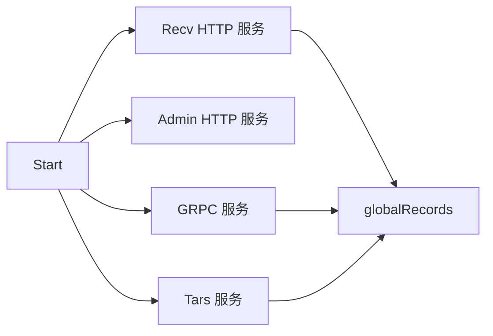

<!-- [待审核] AI 自动生成，请人工确认后移除此标记 -->
# 03-接收层Receiver

<cite>
- [Receiver 结构与启动](file://pkg/collector/receiver/receiver.go)
- [路由注册机制](file://pkg/collector/receiver/router.go)
- [响应与指标处理](file://pkg/collector/receiver/handler.go)
- [接收指标](file://pkg/collector/receiver/metrics.go)
</cite>

## 目录
1. [简介](#简介)
2. [Receiver 结构与全局管道](#receiver-结构与全局管道)
3. [四类服务（HTTP/Admin/GRPC/Tars）](#四类服务httpadmimgrpctars)
4. [路由注册机制](#路由注册机制)
5. [鉴权与 Token 解析](#鉴权与-token-解析)
6. [限流 throttle](#限流-throttle)
7. [指标](#指标)
8. [结论](#结论)

## 简介

`receiver` 包是 collector 的接收入口，负责启动 HTTP / Admin / GRPC / Tars 四类服务，把各协议上报的数据解析为统一的 `*define.Record`，并通过全局 `RecordQueue` 推送给下游 Controller。其设计核心是"端口收敛 + 路由注册"：所有协议的 HTTP 路由都注册到同一个 `mux.Router`，由上层 Controller 统一管控服务生命周期。

**章节来源**
- [Receiver 包与全局管道](file://pkg/collector/receiver/receiver.go#L37-L61)

## Receiver 结构与全局管道

`Receiver` 结构体持有 `adminServer`/`recvServer`（两个 HTTP Server）、`grpcServer`、`tarsServer` 以及 TLS 配置。`globalRecords` 是包级全局 `RecordQueue`（`PushModeGuarantee`），所有协议 handler 解析出的 Record 都经 `publishRecord` 推入此处；`Records()` 暴露只读 channel 供 Controller 消费。`Publisher` 提供可注入 `Func` 的发布钩子，默认回落到 `publishRecord`。

**章节来源**
- [Receiver 结构与全局管道](file://pkg/collector/receiver/receiver.go#L37-L73)
- [New 初始化与全局队列](file://pkg/collector/receiver/receiver.go#L86-L128)

## 四类服务（HTTP/Admin/GRPC/Tars）

`New` 构造 Receiver 并装配 `RecvHttpRouter()` 与 `AdminHttpRouter()`；`Start()` 在独立 goroutine 中并行拉起四类服务，每个服务受对应 `Enabled` 开关控制，失败时写入 `errs` channel。`startRecvHttpServer`/`starAdminHttpServer` 支持 TLS 监听；`startGrpcServer` 注册 `serviceMgr.grpcServices`；`startTarsServer` 通过 `NewTarsProtocol` 注册 Tars servant。

**图表来源**
- [四类服务启动实现](file://pkg/collector/receiver/receiver.go#L141-L239)

**章节来源**
- [Start 并行拉起四类服务](file://pkg/collector/receiver/receiver.go#L241-L314)

## 路由注册机制

`serviceManager` 是全局单例，聚合 `httpRoutes`（路由表）、`httpRouter`（`mux.Router`）、`grpcServices`、`tarsServants`。各协议包通过 `RegisterRecvHttpRoute`（注册失败直接 panic）、`RegisterRecvGrpcRoute`、`RegisterRecvTarsRoute` 把路由注入同一 Router，实现端口收敛。`registerHttpRoute` 校验路由 key 去重，`RecvHttpRoutes()` 返回排序后的路由表供可观测。`componentsReady` 维护各组件 ready 回调，由 `ready()` 统一触发。

**章节来源**
- [serviceManager 与路由注册](file://pkg/collector/receiver/router.go#L23-L114)

## 鉴权与 Token 解析

`ResponseHandler` 接口定义协议 handler 的统一契约：`ContentType`/`Response`/`ErrorStatus`/`Unmarshal`，由各协议实现具体的反序列化与响应。`RecordHandleMetrics` 在 handler 处理完成后汇总接收字节、耗时、处理计数，并调用 `define.SetTokenInfo` 暴露 Token 维度指标。Token 的实际解析（从 `X-BK-TOKEN`/`X-BK-DATA-ID` 等 Header）在各协议 handler 内完成，统一生成 `define.Token` 供下游路由。

**章节来源**
- [ResponseHandler 接口与响应辅助](file://pkg/collector/receiver/handler.go#L19-L52)
- [鉴权 Header 常量 KeyToken/KeyDataID](file://pkg/collector/define/record.go#L47-L51)

## 限流 throttle

`New` 中根据 `RecvServer.Throttle.Enabled` 决定是否初始化限流：`throttle.Init(c.Throttle)` 启用，否则 `throttle.Stop()`。限流作用于接收入口，防止突发流量压垮下游处理链路。

**章节来源**
- [throttle 初始化开关](file://pkg/collector/receiver/receiver.go#L104-L112)

## 指标

`metrics.go` 定义接收层全量 Prometheus 指标：`receiver_handled_total`/`receiver_dropped_total`/`receiver_skipped_total`/`receiver_internal_error_total` 计数，`receiver_handled_duration_seconds` 耗时直方图，`receiver_received_bytes_total`/`receiver_received_bytes_size` 字节统计，`receiver_precheck_failed_total` 预检失败（按 processor/code 维度）。`metricMonitor` 封装各指标的打点方法，`DefaultMetricMonitor` 为默认实例。

**章节来源**
- [接收层指标定义](file://pkg/collector/receiver/metrics.go#L21-L95)

## 结论

`receiver` 包通过端口收敛与路由注册机制，把多协议接收统一在四类服务之下，解析为 `*Record` 汇入全局 `RecordQueue`，并以 `throttle` 限流与全套 Prometheus 指标保障稳定性与可观测性。各具体协议的解析实现见 `04-接收协议实现`。

**章节来源**
- [Receiver 结构与全局管道](file://pkg/collector/receiver/receiver.go#L37-L73)
- [路由注册机制](file://pkg/collector/receiver/router.go#L23-L114)
