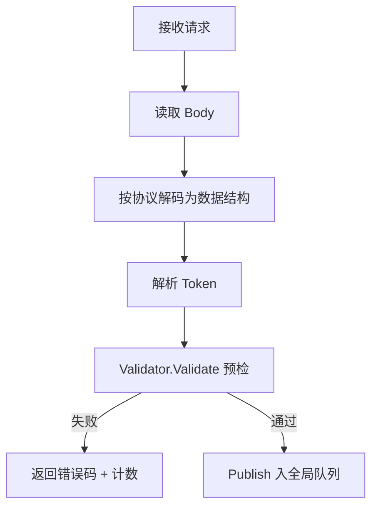

<!-- [待审核] AI 自动生成，请人工确认后移除此标记 -->
# 04-接收协议实现

<cite>
- [路由注册机制](file://pkg/collector/receiver/router.go)
- [OTLP 实现](file://pkg/collector/receiver/otlp/http.go)
- [Jaeger 实现](file://pkg/collector/receiver/jaeger/http.go)
- [SkyWalking 实现](file://pkg/collector/receiver/skywalking/http.go)
- [PushGateway 实现](file://pkg/collector/receiver/pushgateway/http.go)
- [RemoteWrite 实现](file://pkg/collector/receiver/remotewrite/http.go)
- [FTA 实现](file://pkg/collector/receiver/fta/http.go)
- [Tars 实现](file://pkg/collector/receiver/tars/tars.go)
</cite>

## 目录
1. [简介](#简介)
2. [协议矩阵总览](#协议矩阵总览)
3. [OTLP 实现](#otlp-实现)
4. [Jaeger 与 SkyWalking](#jaeger-与-skywalking)
5. [Prometheus（pushgateway 与 remotewrite）](#prometheuspushgateway-与-remotewrite)
6. [其他协议（beat/fta/zipkin/pyroscope/logpush/tars）](#其他协议beatftazipkinpyrologpushtars)
7. [接入路由与鉴权方式](#接入路由与鉴权方式)
8. [结论](#结论)

## 简介

本章逐协议拆解 `receiver` 下各子目录的实现：它们都遵循"在 `init` 中注册 ready 回调、`Ready()` 中调用 `RegisterRecvHttpRoute`/`RegisterRecvGrpcRoute`/`RegisterRecvTarsRoute` 把路由注入全局 Router，handler 解析协议体 → 构造 `*define.Record` → 经 `pipeline.Validator` 预检 → `Publish` 入全局队列"的统一模式。下文按协议族分组说明其接入方式、路由与转换要点。

本节为概念性内容，不直接分析具体文件。

## 协议矩阵总览

| 协议 | 接入方式 | 代表路由 | RecordType | 转换目标 |
|------|----------|----------|-----------|----------|
| OTLP | HTTP + GRPC | `/v1/traces`、`/v1/metrics`、`/v1/logs` | traces/metrics/logs | OTLP pdata 原生结构 |
| Jaeger | HTTP + GRPC | `/jaeger/v1/traces` | traces | ptrace.Traces |
| SkyWalking | HTTP + GRPC | `/v3/segment`、`/v3/segments` | traces/metrics/logs | SegmentObject 等 |
| PushGateway | HTTP | `/metrics/job/{job}` 等 | pushgateway | dto.MetricFamily |
| RemoteWrite | HTTP | `/prometheus/write` | remotewrite | prompb.TimeSeries |
| Zipkin | HTTP | `/api/v2/spans`（见 zipkin/http.go） | traces | span 结构 |
| Pyroscope | HTTP | 见 pyroscope/http.go | profiles | pprof/jfr |
| Beat | HTTP | 见 beat/http.go | beat | 原始字节 |
| FTA | HTTP | `/fta/v1/event` | fta | FtaData（事件） |
| LogPush | HTTP | 见 logpush/http.go | logpush | 文本行 |
| Tars | Tars | StatObj / PropertyObj | tars | TarsStatData / TarsPropertyData |

**章节来源**
- [全局路由注册机制](file://pkg/collector/receiver/router.go#L23-L114)
- [OTLP 路由注册](file://pkg/collector/receiver/otlp/http.go#L54-L82)
- [Jaeger 路由注册](file://pkg/collector/receiver/jaeger/http.go#L42-L53)
- [SkyWalking 路由注册](file://pkg/collector/receiver/skywalking/http.go#L56-L79)
- [PushGateway 路由注册](file://pkg/collector/receiver/pushgateway/http.go#L52-L93)
- [RemoteWrite 路由注册](file://pkg/collector/receiver/remotewrite/http.go#L37-L44)
- [FTA 路由注册](file://pkg/collector/receiver/fta/http.go#L41-L53)
- [Tars 路由注册](file://pkg/collector/receiver/tars/tars.go#L34-L35)

## OTLP 实现

OTLP 是核心协议，同时支持 HTTP 与 GRPC。`init` 中 `throttle.RegisterHTTPRecordType` 把 `/v1/traces|metrics|logs` 映射到对应 RecordType 并注册 ready 回调；`Ready()` 注册 4 条 HTTP 路由（`ExportTraces`/`ExportMetrics`/`ExportLogs`）与 3 个 GRPC 服务（`ptraceotlp`/`pmetricotlp`/`plogotlp`）。HTTP 侧统一由 `httpExport` 处理：读 body → `getResponseHandler`（按 `Content-Type` 选 Protobuf/JSON 解码器）→ `rh.Unmarshal` 解析 → `tokenparser.FromHttpRequest` 取 Token → `prettyprint.Pretty` → `s.Validate` 预检 → `s.Publish` 入队。`HttpService` 内嵌 `receiver.Publisher` 与 `pipeline.Validator`，复用全局发布与预检能力。

**章节来源**
- [OTLP 路由注册（HTTP+GRPC）](file://pkg/collector/receiver/otlp/http.go#L45-L82)
- [httpExport 解析与发布](file://pkg/collector/receiver/otlp/http.go#L110-L170)
- [响应处理器选择](file://pkg/collector/receiver/otlp/http.go#L184-L191)

## Jaeger 与 SkyWalking

**Jaeger**：`Ready()` 注册 HTTP `/jaeger/v1/traces` 与 GRPC `api_v2.RegisterCollectorServiceServer`。`JaegerTraces` 通过 `decodeHTTPBody` 按 `Content-Type`（thrift 二进制）解码为 `ptrace.Traces`，`tokenparser.FromHttpRequest` 取 Token，预检后 Publish。`acceptedFormats` 声明 thrift 编码器。

**SkyWalking**：`Ready()` 注册 HTTP `/v3/segment`、`/v3/segments` 与一组 GRPC 服务（trace/jvm/meter/management/event/profile）。其鉴权特殊：HTTP SDK 不便设 Header，token 从 `serviceInstance` 中以 `splitKey="_"` 分割提取（`extractMetadata`），再构造 Record。

**章节来源**
- [Jaeger 路由与解码](file://pkg/collector/receiver/jaeger/http.go#L41-L113)
- [SkyWalking 路由与 GRPC 服务](file://pkg/collector/receiver/skywalking/http.go#L55-L79)
- [SkyWalking 从 serviceInstance 提取 token](file://pkg/collector/receiver/skywalking/http.go#L84-L120)

## Prometheus（pushgateway 与 remotewrite）

**PushGateway**：路由覆盖 `/metrics/job/{job}`、`/metrics/job@base64/{job}` 及其带 labels 变体（支持 POST/PUT），job 名可为 base64。其 handler 从 URL 解析 job/labels，按 `Content-Type` 支持文本 exposition 与 `application/vnd.google.protobuf`（delimited MetricFamily）两种格式，解析为 `dto.MetricFamily` 后构造 Record（`RecordType=RecordPushGateway`）。

**RemoteWrite**：单路由 `/prometheus/write`，`Write` 先 `tokenparser.FromHttpRequest` 取 Token 并预检（失败即返回，不消费 body），再用 `utils.DecodeWriteRequest` 解码为 `prompb.WriteRequest`，把 `Timeseries` 封装为 `define.RemoteWriteData` 后 Publish。

**章节来源**
- [PushGateway 路由与导出](file://pkg/collector/receiver/pushgateway/http.go#L47-L94)
- [PushGateway 指标解析 exportMetrics](file://pkg/collector/receiver/pushgateway/http.go#L107-L160)
- [RemoteWrite 路由与解码](file://pkg/collector/receiver/remotewrite/http.go#L27-L99)

## 其他协议（beat/fta/zipkin/pyroscope/logpush/tars）

- **Beat**：`beat/http.go` 注册 HTTP 路由，承载 libbeat 上报，数据以原始字节 `BeatData` 承载（`RecordType=RecordBeat`）。
- **FTA**：`/fta/v1/event` 接收故障自愈事件；token 优先取 Header `X-BK-TOKEN`、回退到 query 参数 `token`，空则 403；请求体 unmarshal 为 map，并把 HTTP headers/query 注入 `__http_headers__`/`__http_query_params__`，封装为 `define.FtaData`（带生成 `EventId`）后 Publish。
- **Zipkin**：`zipkin/http.go` 注册 HTTP 路由（`/api/v2/spans` 等），span 数据转为 traces Record。
- **Pyroscope**：`pyroscope/http.go` 注册 HTTP 路由，承接持续性能剖析数据（pprof/jfr），`RecordType=RecordProfiles`。
- **LogPush**：`logpush/http.go` 注册 HTTP 路由，承载文本日志行（`LogPushData`），`RecordType=RecordLogPush`。
- **Tars**：`tars/tars.go` 通过 `RegisterRecvTarsRoute` 注册 `StatObj`/`tarsstat` 与 `PropertyObj`/`tarsproperty` 两个 Tars Servant，分别承载服务指标（stat）与属性统计（property），数据落入 `TarsStatData`/`TarsPropertyData`（`RecordType=RecordTars`）。

**章节来源**
- [Beat 路由注册](file://pkg/collector/receiver/beat/http.go#L34-L34)
- [FTA 路由与事件解析](file://pkg/collector/receiver/fta/http.go#L40-L53)
- [FTA 生成 FtaData 并发布](file://pkg/collector/receiver/fta/http.go#L72-L159)
- [Zipkin 路由注册](file://pkg/collector/receiver/zipkin/http.go#L42-L42)
- [Pyroscope 路由注册](file://pkg/collector/receiver/pyroscope/http.go#L80-L80)
- [LogPush 路由注册](file://pkg/collector/receiver/logpush/http.go#L35-L35)
- [Tars Servant 注册](file://pkg/collector/receiver/tars/tars.go#L34-L35)

## 接入路由与鉴权方式

所有协议 handler 共享同一处理骨架：读 body → 解析为对应数据结构 → 解析 Token → `pipeline.Validator.Validate` 预检（执行 tokenchecker 等 Processor）→ `Publish` 入全局队列。Token 来源有三种：① HTTP Header `X-BK-TOKEN`（`tokenparser.FromHttpRequest`，见 OTLP L143、Jaeger L92、RemoteWrite L61）；② query 参数（FTA 回退到 `token` 参数）；③ 协议体内字段（SkyWalking 从 `serviceInstance` 提取）。预检失败以状态码返回并计入 `precheck_failed` 指标。

**图表来源**
- [OTLP httpExport 处理骨架](file://pkg/collector/receiver/otlp/http.go#L110-L170)

**章节来源**
- [OTLP 从 Header 取 Token](file://pkg/collector/receiver/otlp/http.go#L143-L147)
- [Jaeger 从 Header 取 Token](file://pkg/collector/receiver/jaeger/http.go#L92-L99)
- [RemoteWrite 从 Header 取 Token](file://pkg/collector/receiver/remotewrite/http.go#L61-L67)
- [FTA 从 Header/参数取 Token](file://pkg/collector/receiver/fta/http.go#L78-L89)
- [SkyWalking 从 serviceInstance 提取 Token](file://pkg/collector/receiver/skywalking/http.go#L84-L91)

## 结论

`receiver` 下各协议实现高度一致：通过全局路由注册机制挂载到统一端口，handler 把协议体转为 `*define.Record` 并经预检后入队。OTLP/Jaeger/SkyWalking 同时提供 GRPC，Prometheus 类走 PushGateway/RemoteWrite，Tars 走 Servant；鉴权以 `X-BK-TOKEN` 为主、并按协议特性兼容参数或体内字段提取。

**章节来源**
- [全局路由注册机制](file://pkg/collector/receiver/router.go#L23-L114)
- [OTLP 路由注册](file://pkg/collector/receiver/otlp/http.go#L54-L82)
