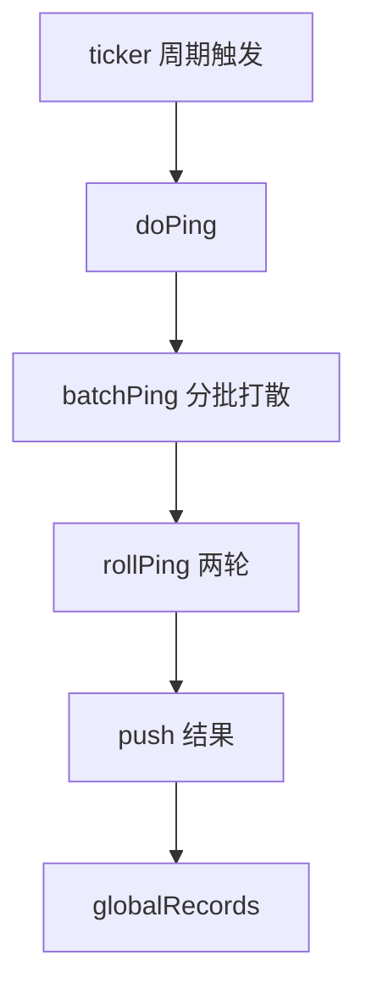

<!-- [待审核] AI 自动生成，请人工确认后移除此标记 -->
# 05-Proxy与PingServer

<cite>
- [Proxy 结构与路由](file://pkg/collector/proxy/proxy.go)
- [Proxy V2 Push 处理](file://pkg/collector/proxy/http.go)
- [PingServer 拨测](file://pkg/collector/pingserver/pingserver.go)
- [PingServer 探测器](file://pkg/collector/pingserver/detector.go)
</cite>

## 目录
1. [简介](#简介)
2. [Proxy 自定义上报（/v2/push）](#proxy-自定义上报v2push)
3. [鉴权与 Consul 注册](#鉴权与-consul-注册)
4. [PingServer 拨测原理](#pingserver-拨测原理)
5. [结论](#结论)

## 简介

`proxy` 与 `pingserver` 是接收层的两条辅助数据通路。`proxy` 提供 `/v2/push/` 自定义上报入口，供外部系统（如自建 Agent）以统一 JSON 格式推送指标/事件；`pingserver` 则周期性对目标 IP 执行 ICMP 拨测，产出网络质量指标（rtt/loss）。两者解析出的 Record 同样汇入各自的全局 `RecordQueue`，与 Receiver 共享下游处理链路。

**章节来源**
- [Proxy 结构](file://pkg/collector/proxy/proxy.go#L37-L43)
- [Pingserver 结构](file://pkg/collector/pingserver/pingserver.go#L35-L43)

## Proxy 自定义上报（/v2/push）

`V2PushRoute` 是 `/v2/push/` 的处理函数：先读 body（空 body 直接 400 拒绝），用 `json.Unmarshal` 解析为 `define.ProxyData`（含 `data_id`/`access_token`/`data`/`type`）。随后构造 `define.Record`（`RecordType=RecordProxy`、`AppName="proxy"`、用 `ProxyDataId` 与 `AccessToken` 填充 Token），调用 `p.Validate(r)` 执行预检 Processor（如 tokenchecker），通过后 `globalRecords.Push(r)` 并回写 200。预检失败按 code 返回并计入 `IncPreCheckFailedCounter`。

**章节来源**
- [V2PushRoute 解析与推送](file://pkg/collector/proxy/http.go#L27-L84)
- [ProxyData 结构定义](file://pkg/collector/define/record.go#L207-L213)

## 鉴权与 Consul 注册

`New` 构建 `mux.Router` 并把 `routeV2Push`（`/v2/push/`）绑定到 `V2PushRoute`，同时应用 HTTP 中间件。`Start` 在 goroutine 中启动 HTTP 服务（失败不阻断关键路径，可按 `RetryListen` 周期重试），随后调用 `startConsulHeartbeat`：当 Consul 启用时，用 `consul.NewConsulInstance` 注册自身服务并 `KeepServiceAlive` 维持 TTL 心跳；`Stop` 取消服务并优雅关闭 HTTP。`Validate` 来自内嵌的 `pipeline.Validator`，复用 Pipeline 的预检能力。

**章节来源**
- [New 注册路由与中间件](file://pkg/collector/proxy/proxy.go#L45-L70)
- [Consul 心跳注册与 Stop](file://pkg/collector/proxy/proxy.go#L92-L178)
- [Token 构造与 Validate 调用](file://pkg/collector/proxy/http.go#L62-L79)

## PingServer 拨测原理

`Pingserver` 按 `config.Sub.Period` 周期触发 `doPing`：`batchPing` 把目标 IP 按 `MaxBatchSize` 分批，并依据"周期 − 滚动 ping 耗时"的剩余时间打散各批次的 sleep 间隔，避免瞬间抖动；`rollPing` 在单周期内执行两轮（rtt 分别为 3s/10s，由 `rollPingRTT` 配置），首轮仅上报有回应的地址、把无回应的地址带入下一轮，最后一轮统一 `push`。`push` 把探测结果（max/min/avg rtt、loss_percent）封装为 `define.PingserverData` 的 `Record`（`RecordType=RecordPingserver`、`RequestType=RequestICMP`）推入全局队列。

**图表来源**
- [doPing/batchPing/rollPing/push 拨测流程](file://pkg/collector/pingserver/pingserver.go#L110-L272)

**章节来源**
- [Pingserver 结构与启动](file://pkg/collector/pingserver/pingserver.go#L35-L108)
- [Detector 接口与探测执行](file://pkg/collector/pingserver/detector.go#L43-L107)

## 结论

`proxy` 以 `/v2/push/` 统一入口承接自定义上报并经 Consul 注册保活，`pingserver` 以周期滚动拨测产出网络质量指标，二者都是 Receiver 之外的重要数据来源，经全局 `RecordQueue` 汇入同一处理链路。

**章节来源**
- [Proxy 结构与路由](file://pkg/collector/proxy/proxy.go#L37-L70)
- [PingServer 拨测流程](file://pkg/collector/pingserver/pingserver.go#L110-L272)
