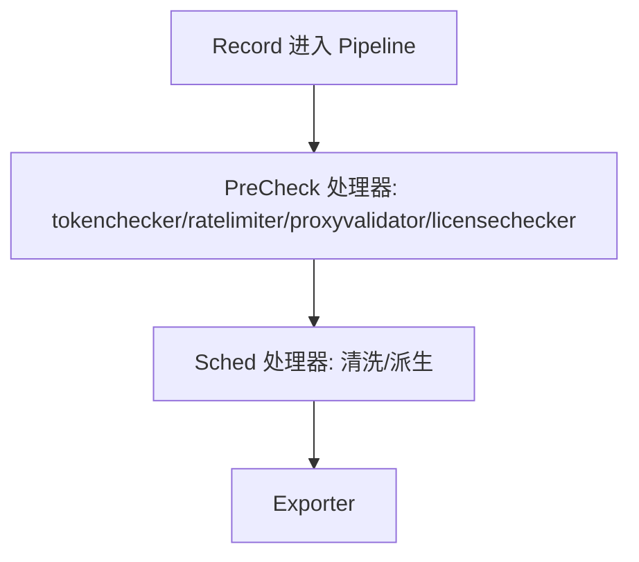

<!-- [待审核] AI 自动生成，请人工确认后移除此标记 -->
# 06-Processor框架与注册

<cite>
- [Processor 接口与注册](file://pkg/collector/processor/processor.go)
- [Processor 配置结构](file://pkg/collector/processor/config.go)
- [组件注册（副作用导入）](file://pkg/collector/controller/register.go)
</cite>

## 目录
1. [简介](#简介)
2. [Processor 接口设计](#processor-接口设计)
3. [PreCheck 与 Sched](#precheck-与-sched)
4. [注册机制](#注册机制)
5. [Instance 与 CommonProcessor](#instance-与-commonprocessor)
6. [非调度记录通道](#非调度记录通道)
7. [配置热更新 Reload](#配置热更新-reload)
8. [结论](#结论)

## 简介

`processor` 包定义了数据处理的统一契约 `Processor` 接口，并维护全局处理器工厂表 `processorsMap`。所有具体处理器（清洗、控制、派生）都实现该接口，并通过 `Register` 注入工厂表；`Manager` 在解析 Pipeline 时按名称从工厂表实例化。理解本页是理解 `07-流水线Pipeline` 与 `08/09-处理器实现` 的前提。

**章节来源**
- [Processor 包定位](file://pkg/collector/processor/processor.go#L23-L26)

## Processor 接口设计

`Processor` 接口约定：`Name()` 返回处理器名；`IsDerived()` 标识是否派生类型；`IsPreCheck()` 标识是否预处理类型（默认 PreCheck 类有 proxyvalidator/tokenchecker/ratelimiter/licensechecker）；`Process(originalRecord)` 就地修改 `*define.Record`，仅当需要派生新 Record 时才返回派生实例；`Reload` 重载配置（有状态处理器需谨慎避免泄漏）；`MainConfig`/`SubConfigs` 暴露配置；`Clean` 清理。

**章节来源**
- [Processor 接口定义](file://pkg/collector/processor/processor.go#L26-L53)

## PreCheck 与 Sched

处理器按 `IsPreCheck()` 分为两类：PreCheck（预处理）在 Pipeline 校验阶段必须先于 Sched（调度类）执行，用于鉴权/限流/license 等准入控制；Sched 类（清洗/派生）是真正的数据处理。`pipeline` 在 `PreCheckProcessors`/`SchedProcessors` 中据此划分，`Validate` 强制 PreCheck 索引必须全部小于 Sched 索引。

**图表来源**
- [Processor.IsPreCheck 约定](file://pkg/collector/processor/processor.go#L30-L38)

**章节来源**
- [PreCheck 类型说明](file://pkg/collector/processor/processor.go#L30-L38)
- [Pipeline 按 PreCheck/Sched 划分](file://pkg/collector/pipeline/pipeline.go#L61-L79)

## 注册机制

`processorsMap` 是 `name → CreateFunc` 的全局工厂表。`register` 写入并去重（重复则报错），`Register` 对外暴露且在冲突时 panic；`GetProcessorCreator(name)` 支持 `name/xxx` 形式按 `/` 拆分取第一段。`CreateFunc` 签名为 `func(config map[string]any, customized []SubConfigProcessor) (Processor, error)`。`MustLoadConfigs`/`MustCreateFactory` 为测试/初始化提供便利；`DiffCustomizedConfig` 比较新旧子配置产出 Keep/Updated/Deleted 三类变更。

**章节来源**
- [工厂表与注册/获取](file://pkg/collector/processor/processor.go#L168-L193)

## Instance 与 CommonProcessor

`Instance` 是带唯一 `ID` 的处理器包装（`NewInstance(id, processor)`），Pipeline 持有 `[]processor.Instance`。`CommonProcessor` 提供 `MainConfig`/`SubConfigs`/`Clean` 的默认实现，供具体处理器内嵌复用，减少样板代码。

**章节来源**
- [Instance 接口与 NewInstance](file://pkg/collector/processor/processor.go#L146-L166)
- [CommonProcessor 默认实现](file://pkg/collector/processor/processor.go#L195-L215)

## 非调度记录通道

`nonSchedRecords` 是一条 `Guarantee` 模式的全局 `RecordQueue`，配套 `PublishNonSchedRecords`/`NonSchedRecords`。它用于承载"不需要经过常规调度链"的记录（如某些处理器直接产出的旁路记录），由 Controller 另路消费，与主 `originalTasks`/`derivedTasks` 解耦。

**章节来源**
- [非调度记录队列](file://pkg/collector/processor/processor.go#L217-L225)

## 配置热更新 Reload

`Reload(config, customized)` 是 `Processor` 接口的一部分。`Manager.Reload` 重新解析配置生成 `newManager`，对已有同名的处理器调用 `inst.Reload(MainConfig, SubConfigs)` 热替换变量，新名称则直接加入；有状态处理器在 `mergeProcessors` 时先 `Clean` 再替换，避免内存/goroutine 泄漏。

**章节来源**
- [Processor.Reload 接口](file://pkg/collector/processor/processor.go#L40-L52)
- [Manager.Reload 调用 inst.Reload](file://pkg/collector/pipeline/manager.go#L372-L396)

## 结论

`processor` 包以 `Processor` 接口 + `processorsMap` 工厂表 + 副作用导入注册（见 `controller/register.go`）为基础，配合 `Instance`/`CommonProcessor` 复用与 `nonSchedRecords` 旁路通道，构成可插拔的处理器体系；PreCheck/Sched 的划分则交由 `pipeline` 在构建与校验阶段约束。

**章节来源**
- [组件注册（副作用导入所有 Processor）](file://pkg/collector/controller/register.go#L12-L42)
- [Processor 接口定义](file://pkg/collector/processor/processor.go#L26-L53)
