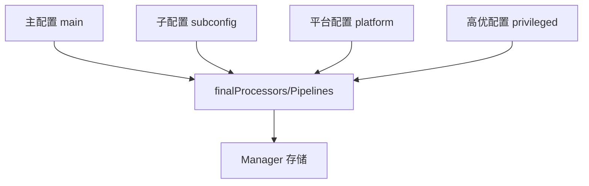

<!-- [待审核] AI 自动生成，请人工确认后移除此标记 -->
# 07-流水线Pipeline

<cite>
- [Pipeline 接口](file://pkg/collector/pipeline/pipeline.go)
- [Manager 解析与存储](file://pkg/collector/pipeline/manager.go)
- [预检验证器](file://pkg/collector/pipeline/validator.go)
</cite>

## 目录
1. [简介](#简介)
2. [Pipeline 接口与数据类型绑定](#pipeline-接口与数据类型绑定)
3. [构建与校验（PreCheck 在前）](#构建与校验precheck-在前)
4. [Manager 解析与合并](#manager-解析与合并)
5. [流水线唯一性约束](#流水线唯一性约束)
6. [热更新 Reload](#热更新-reload)
7. [GetProcessor 与 GetPipeline](#getprocessor-与-getpipeline)
8. [结论](#结论)

## 简介

`pipeline` 包把一组 `Processor.Instance` 按数据类型（`RecordType`）绑定为一条 `Pipeline`，是"数据契约（define）→ 处理器（processor）→ 调度（controller）"之间的桥梁。`Manager` 负责解析主/子/平台/高优四类配置、合并并存储 `processors` 与 `pipelines` 两张表，并通过 `Getter` 供预检与调度查询。

**章节来源**
- [Pipeline 包与接口定义](file://pkg/collector/pipeline/pipeline.go#L19-L38)

## Pipeline 接口与数据类型绑定

`Pipeline` 接口绑定 `Name`、`RecordType`、`AllProcessors`/`PreCheckProcessors`/`SchedProcessors`（返回处理器 ID 列表）、`Validate()`。`pipeline` 私有实现持有 `recordType` 与 `[]processor.Instance`；`NewPipeline` 构造。`PreCheckProcessors`/`SchedProcessors` 按实例 `IsPreCheck()` 划分索引，供调度与预检使用。

**章节来源**
- [Pipeline 接口定义](file://pkg/collector/pipeline/pipeline.go#L19-L52)
- [PreCheck/Sched 方法与全部处理器列表](file://pkg/collector/pipeline/pipeline.go#L54-L87)

## 构建与校验（PreCheck 在前）

`Validate()` 收集 PreCheck 与 Sched 的索引，要求**所有 Sched 索引必须大于所有 PreCheck 索引**（即 PreCheck 必须排在 Sched 之前），否则返回 false。`parsePipelines` 在构建每条 Pipeline 后调用 `Validate`，失败则计入 `built_failed` 并跳过，保证非法顺序的流水线不会生效。

**章节来源**
- [Validate 顺序约束](file://pkg/collector/pipeline/pipeline.go#L89-L109)
- [parsePipelines 构建并校验](file://pkg/collector/pipeline/manager.go#L61-L125)

## Manager 解析与合并

`Manager` 无并发读写、不加锁。`parseManagerConfig` 先加载 APM 配置模式 `apmConf.Patterns` 对应的子配置，再分三层合并：
1. **主配置 + 子配置**：`parseProcessors`/`parsePipelines` 用合并后的 `processorSubConfigs` 生成 `finalProcessors`/`finalPipelines`；
2. **+ 平台配置**（platform）：若存在且含 processor/pipeline 字段，解析后 `mergeProcessors`/`mergePipelines` 覆盖；
3. **+ 高优配置**（privileged）：仅覆盖 processor。

`mergeProcessors` 在覆盖有状态处理器前先 `Clean`，`mergeSubConfigs`/`mergePipelines` 分别做追加/覆盖合并。

**图表来源**
- [parseManagerConfig 主+子+平台+高优合并](file://pkg/collector/pipeline/manager.go#L296-L361)

**章节来源**
- [parseProcessors 解析实例](file://pkg/collector/pipeline/manager.go#L21-L59)
- [merge 系列合并函数](file://pkg/collector/pipeline/manager.go#L232-L268)
- [parseManagerConfig 合并层级](file://pkg/collector/pipeline/manager.go#L296-L361)

## 流水线唯一性约束

`parsePipelines` 要求**每个 RecordType 只能存在唯一 Pipeline**（重复则 `duplicated pipeline type` 跳过）；若 `IntoRecordType` 得到 `RecordUndefined` 或引用的 processor 未知，则该条流水线构建失败。节点缺失会导致整条流水线构建失败（计入 `built_failed`）。

**章节来源**
- [Pipeline 类型唯一性约束](file://pkg/collector/pipeline/manager.go#L79-L84)
- [未知 processor / 节点缺失导致构建失败](file://pkg/collector/pipeline/manager.go#L86-L111)

## 热更新 Reload

`Manager.Reload` 重新 `parseManagerConfig` 得到 `newManager`，遍历新处理器：已存在的同名实例调用 `inst.Reload(MainConfig, SubConfigs)` 热替换（有状态实例先 `Clean`），新名称直接加入；`pipelines` 整体替换为新版。这保证了配置变更（主/平台/子配置）无需重启即可生效。

**章节来源**
- [Manager.Reload 实现](file://pkg/collector/pipeline/manager.go#L372-L396)

## GetProcessor 与 GetPipeline

`Manager` 实现 `Getter` 接口：`GetProcessor(name)` 按名取实例，`GetPipeline(rtype)` 按 RecordType 取流水线；`GetDefaultGetter()` 返回全局 `defaultGetter`（在 `New` 中赋值）。`validator.Validator.Validate` 在 Receiver/Proxy 预检时通过 `GetDefaultGetter` 取出 Pipeline 的 PreCheck 处理器（tokenchecker/ratelimiter/proxyvalidator/licensechecker）依次执行，决定准入与否与状态码。

**章节来源**
- [Getter 接口与默认 getter](file://pkg/collector/pipeline/manager.go#L277-L289)
- [GetProcessor / GetPipeline 实现](file://pkg/collector/pipeline/manager.go#L398-L404)
- [Validator 经 Getter 预检 PreCheck 处理器](file://pkg/collector/pipeline/validator.go#L19-L67)

## 结论

`pipeline` 包以 `Pipeline` 接口绑定数据类型与处理器序列，`Manager` 通过主/子/平台/高优四层合并构建并存储处理器与流水线表，并以 `Validate` 强制 PreCheck 前置、`RecordType` 唯一；`Reload` 支持热更新，`Getter` 打通了接收层预检与调度层取用的查询路径。

**章节来源**
- [Pipeline 接口定义](file://pkg/collector/pipeline/pipeline.go#L19-L52)
- [Manager 解析与合并](file://pkg/collector/pipeline/manager.go#L296-L361)
