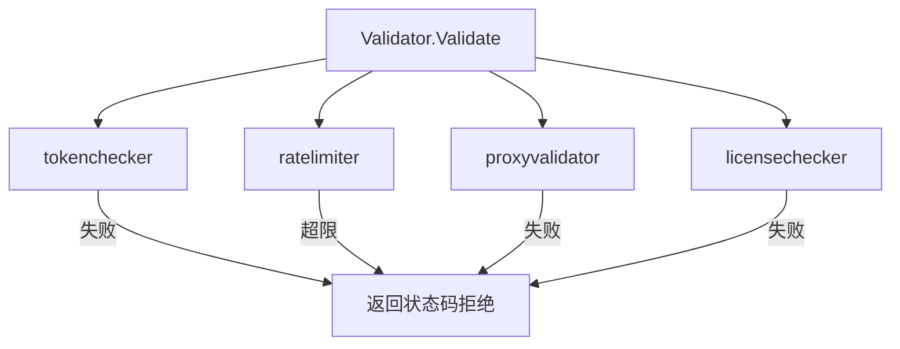

<!-- [待审核] AI 自动生成，请人工确认后移除此标记 -->
# 09-控制与派生类处理器

<cite>
- [tokenchecker 实现](file://pkg/collector/processor/tokenchecker/factory.go)
- [proxyvalidator 实现](file://pkg/collector/processor/proxyvalidator/factory.go)
- [ratelimiter 实现](file://pkg/collector/processor/ratelimiter/factory.go)
- [licensechecker 实现](file://pkg/collector/processor/licensechecker/factory.go)
- [sampler 实现](file://pkg/collector/processor/sampler/factory.go)
- [servicediscover 实现](file://pkg/collector/processor/servicediscover/factory.go)
- [tracesderiver 实现](file://pkg/collector/processor/tracesderiver/factory.go)
- [apdexcalculator 实现](file://pkg/collector/processor/apdexcalculator/factory.go)
- [probefilter 实现](file://pkg/collector/processor/probefilter/factory.go)
- [pproftranslator 实现](file://pkg/collector/processor/pproftranslator/factory.go)
</cite>

## 目录
1. [简介](#简介)
2. [控制类 Processor](#控制类-processor)
3. [sampler 采样](#sampler-采样)
4. [servicediscover 服务发现](#servicediscover-服务发现)
5. [派生类 Processor](#派生类-processor)
6. [probefilter 与 pproftranslator](#probefilter-与-pproftranslator)
7. [结论](#结论)

## 简介

控制类（`IsPreCheck()=true`）与派生类（`IsDerived()=true`）处理器是 pipeline 中两类特殊角色。控制类（tokenchecker/proxyvalidator/ratelimiter/licensechecker）在接收预检阶段由 `validator.Validator` 调用，决定请求准入与状态码；派生类（tracesderiver/apdexcalculator 等）在 `Process` 中返回新的 `*define.Record`，回流到 `derivedTasks` 形成二次处理。其余 sampler/servicediscover/probefilter/pproftranslator 属常规 Sched 处理。

**章节来源**
- [PreCheck 类在 validator 中被调用](file://pkg/collector/pipeline/validator.go#L41-L67)
- [派生类标记 IsDerived](file://pkg/collector/processor/tracesderiver/factory.go#L61-L63)

## 控制类 Processor

**tokenchecker**（鉴权）：`IsPreCheck()=true`，按 RecordType 分派 processTraces/Metrics/Logs/Proxy/Fta，从 Header、Span Resource attribute 或原始 token 解析 `Token`（优先级：Header → attributes → original），校验 DataID 合法性；无 span/metric 时返回 `ErrSkipEmptyRecord` 丢弃空记录。使用 `TierConfig` 分级 decoder/config。

**proxyvalidator**（代理校验）：对 Proxy 上报数据做预检验证，`IsPreCheck()=true`，失败时返回 `StatusCodeBadRequest`。

**ratelimiter**（限流）：`IsPreCheck()=true`，基于 `TierConfig` 对 token 维度做限流，超限返回 `StatusCodeTooManyRequests`。

**licensechecker**（许可校验）：`IsPreCheck()=true`，校验接入 license 合法性，失败返回 `StatusCodeBadRequest`。

**图表来源**
- [validator 依次执行 PreCheck 处理器](file://pkg/collector/pipeline/validator.go#L41-L67)

**章节来源**
- [tokenchecker Register 与 Process](file://pkg/collector/processor/tokenchecker/factory.go#L27-L29)
- [tokenchecker Process 与按类型解析](file://pkg/collector/processor/tokenchecker/factory.go#L95-L115)
- [proxyvalidator Register 与 Process](file://pkg/collector/processor/proxyvalidator/factory.go#L23-L24)
- [proxyvalidator Process](file://pkg/collector/processor/proxyvalidator/factory.go#L82-L130)
- [ratelimiter Register 与 Process](file://pkg/collector/processor/ratelimiter/factory.go#L24-L25)
- [ratelimiter Process](file://pkg/collector/processor/ratelimiter/factory.go#L83-L130)
- [licensechecker Register 与 Process](file://pkg/collector/processor/licensechecker/factory.go#L48-L49)
- [licensechecker Process](file://pkg/collector/processor/licensechecker/factory.go#L149-L200)

## sampler 采样

`sampler`（`IsPreCheck()=false`）基于 `evaluator.Evaluator`（同样经 `TierConfig` 分级）对 Record 做采样评估，`Process` 调用 `eval.Evaluate(record)`。有状态，需 `Clean` 停止 evaluator；`Reload` 用 `DiffCustomizedConfig` 对 Keep/Updated/Deleted 分别处理，避免 goroutine 泄漏。

**章节来源**
- [sampler Register 与 Process](file://pkg/collector/processor/sampler/factory.go#L21-L23)
- [sampler Process 评估采样](file://pkg/collector/processor/sampler/factory.go#L110-L114)
- [Reload 的 DiffCustomizedConfig 处理](file://pkg/collector/processor/sampler/factory.go#L76-L108)

## servicediscover 服务发现

`servicediscover` 负责服务发现类处理（如把实例映射到服务拓扑），`IsPreCheck()=false`，配置经 `TierConfig` 分级，`Process` 对 Record 做服务维度 enrichment。

**章节来源**
- [servicediscover Register 与 Process](file://pkg/collector/processor/servicediscover/factory.go#L25-L26)
- [servicediscover Process](file://pkg/collector/processor/servicediscover/factory.go#L92-L140)

## 派生类 Processor

**tracesderiver**（trace 派生）：`IsDerived()=true`，`Process` 对 `RecordTraces` 调用 `Operator.Operate(record)` 并返回派生 Record（回流 `derivedTasks`），其余类型返回 nil。`Operator` 同样经 `TierConfig` 分级，`Reload`/`Clean` 对算子做生命周期管理。

**apdexcalculator**（APDEX 计算）：派生类处理器，基于 trace/span 时延计算 APDEX 指标并产出派生 Record，配置经 `TierConfig` 分级。

**章节来源**
- [tracesderiver Register 与派生标记](file://pkg/collector/processor/tracesderiver/factory.go#L20-L22)
- [tracesderiver Process 返回派生 Record](file://pkg/collector/processor/tracesderiver/factory.go#L109-L118)
- [apdexcalculator Register 与 Process](file://pkg/collector/processor/apdexcalculator/factory.go#L28-L29)
- [apdexcalculator Process](file://pkg/collector/processor/apdexcalculator/factory.go#L95-L150)

## probefilter 与 pproftranslator

**probefilter**（拨测过滤）：对拨测相关数据做过滤处理，`IsPreCheck()=false`，按分级配置在 `Process` 中过滤。

**pproftranslator**（pprof 转换）：把 pprof/jfr 性能剖析数据转换为统一格式，`IsPreCheck()=false`，`Process` 执行格式转换。

**章节来源**
- [probefilter Register 与 Process](file://pkg/collector/processor/probefilter/factory.go#L35-L36)
- [probefilter Process](file://pkg/collector/processor/probefilter/factory.go#L96-L150)
- [pproftranslator Register 与 Process](file://pkg/collector/processor/pproftranslator/factory.go#L23-L24)
- [pproftranslator Process](file://pkg/collector/processor/pproftranslator/factory.go#L83-L140)

## 结论

控制类处理器（tokenchecker/proxyvalidator/ratelimiter/licensechecker）在预检阶段守护准入，派生类（tracesderiver/apdexcalculator）与 sampler/servicediscover/probefilter/pproftranslator 在调度阶段完成数据派生、采样、服务发现与格式转换。它们共享"`Register` + `TierConfig` 分级 + `Process`"骨架，并通过 `IsPreCheck`/`IsDerived` 被 `pipeline` 与 `validator` 区分调度。

**章节来源**
- [tokenchecker Register 与 Process](file://pkg/collector/processor/tokenchecker/factory.go#L27-L29)
- [tracesderiver Register 与派生标记](file://pkg/collector/processor/tracesderiver/factory.go#L20-L22)
