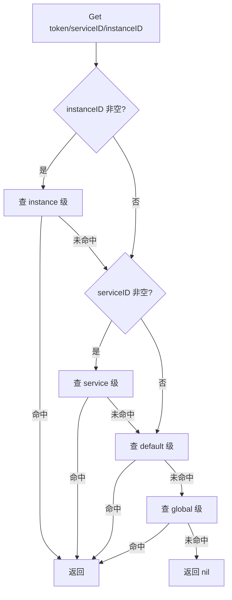

<!-- [待审核] AI 自动生成，请人工确认后移除此标记 -->
# 10-配置系统 ConfEngine

<cite>
- [Config 封装与 TierConfig](file://pkg/collector/confengine/config.go)
- [配置加载与 platform 标记](file://pkg/collector/confengine/engine.go)
- [子配置类型与字段常量](file://pkg/collector/define/subconfig.go)
</cite>

## 目录
1. [简介](#简介)
2. [Config 封装（beat.Config 之上）](#config-封装beatconfig-之上)
3. [配置三类（主/平台/子配置）](#配置三类主平台子配置)
4. [TierConfig 四级查找（instance>service>default>global）](#tierconfig-四级查找instanceservicedefaultglobal)
5. [加载流程与 platform 就绪标记](#加载流程与-platform-就绪标记)
6. [结论](#结论)

## 简介

`confengine` 是 collector 的配置引擎，在 `github.com/TencentBlueKing/bkmonitor-datalink/pkg/libgse/beat.Config`（基于 elastic beats 的 ucfg）之上做封装，统一对外提供"按层级回退查找"的能力。它向上层（Controller、Pipeline、Processor、Exporter 等）屏蔽了配置来源差异——主配置、平台下发配置、各类子配置在逻辑上被归并为一棵统一的配置树，调用方只需通过 `Config.Child/Unpack/UnpackChild` 等便捷方法取值。子配置进一步支持 `instance > service > default > global` 四级回退，使同一份处理逻辑能按 token/type/id 做精细化定制。

**章节来源**
- [Config 封装 beat.Config](file://pkg/collector/confengine/config.go#L22-L85)
- [TierConfig 四级查找实现](file://pkg/collector/confengine/config.go#L87-L189)

## Config 封装（beat.Config 之上）

`Config` 是对 `*beat.Config` 的轻量封装（非继承），仅持有一个 `conf *beat.Config` 字段，对外暴露一组取值便捷方法：

- `Has(s)`：判断某路径是否存在；
- `Child(s)` / `MustChild(s)`：取出子配置并再次封装为 `*Config`；
- `Unpack(to)` / `UnpackChild(s, to)`：将当前或某子节点反序列化到结构体；
- `Disabled(s)`：读取 `s.disabled` 布尔，用于判断某模块是否禁用（Controller 中大量使用 `conf.Disabled(ConfigFieldExporter)` 等）；
- `UnpackIntWithDefault(s, val)`：带默认值的整型读取（如 `max_procs`）；
- `RawConfig()`：返回底层 `*common.Config`，供需要原生配置的对象（如 `beat.NewGsePusherWithConfig`）使用。

所有便捷方法都在底层 `beat.Config` 失败时返回零值或 `nil`，调用方无需额外判错即可安全使用。

**章节来源**
- [Config 结构定义](file://pkg/collector/confengine/config.go#L22-L30)
- [Has/Child/MustChild/Unpack 便捷方法](file://pkg/collector/confengine/config.go#L31-L73)
- [Disabled/UnpackIntWithDefault/RawConfig](file://pkg/collector/confengine/config.go#L59-L85)

## 配置三类（主/平台/子配置）

collector 的配置在逻辑上分为三类，由 `define` 包中的常量标识：

- `ConfigTypePrivileged`（"privileged"）：主配置（即全局主 `global.config`）；
- `ConfigTypePlatform`（"platform"）：平台下发的配置，加载后标记 `loadedPlatformConfig = true`，作为服务就绪的判断依据；
- `ConfigTypeSubConfig`（"subconfig"）：按 `SubConfigFieldDefault/Service/Instance` 三级字段细分的子配置；
- 此外还有 `ConfigTypeReportV2`（"report_v2"）、`ConfigTypeReportV1`（"report"）等协议上报类标识。

各业务域在配置中对应固定字段名：`ConfigFieldProcessor`（`processor`）、`ConfigFieldPipeline`（`pipeline`）、`ConfigFieldReceiver`（`receiver`）、`ConfigFieldExporter`（`exporter`）、`ConfigFieldProxy`（`proxy`）、`ConfigFieldPingserver`（`pingserver`）、`ConfigFieldCache`（`cache`）、`ConfigFieldPusher`（`bk_metrics_pusher`）等，上层通过这些字段名从 `Config` 中取出对应子配置。

**章节来源**
- [子配置作用域字段常量](file://pkg/collector/define/subconfig.go#L12-L16)
- [配置类型与字段常量](file://pkg/collector/define/subconfig.go#L18-L34)

## TierConfig 四级查找（instance>service>default>global）

`TierConfig` 实现了"层级配置管理与查找"，内部用 `sync.Map` 以 `tierKey{Token, Type, ID}` 为键存储配置对象。搜索顺序为（优先级从高到低）：

1. `subconfigs.instance`：`Type = SubConfigFieldInstance`，按 token + instanceID 精确匹配；
2. `subconfigs.service`：`Type = SubConfigFieldService`，按 token + serviceID 匹配；
3. `subconfigs.default`：`Type = SubConfigFieldDefault`，仅按 token 匹配；
4. `global.config`：`Type = keyGlobal`（常量 `"__global__"`），全局兜底。

`Get(token, serviceID, instanceID)` 依次探测前三级（仅当对应 ID 非空才探测），最后回退到 global；`GetByToken(token)` 等价于 `Get(token, "", "")`；`GetExact(token, typ, id)` 做精确一次性命中（不回退）。`Set/SetGlobal/Del/DelGlobal/All` 用于写、删与遍历。

下图展示一次 `Get` 的回退路径：

**图表来源**
- [TierConfig.Get 四级回退查找](file://pkg/collector/confengine/config.go#L150-L184)
- [tierKey 与常量定义](file://pkg/collector/confengine/config.go#L87-L108)

**章节来源**
- [TierConfig 结构与 tierKey 定义](file://pkg/collector/confengine/config.go#L91-L112)
- [Set/Get/GetByToken/GetExact 方法](file://pkg/collector/confengine/config.go#L114-L189)

## 加载流程与 platform 就绪标记

`engine.go` 负责从文件/内容加载配置，并提供就绪标记：

- `LoadConfigPath(path)`：读取单个 yaml 配置并 `Unpack` 出 `define.Token`；若 token 非空则写入 `metacache.Set` 供运行时查询；若 `token.Type == ConfigTypePlatform` 则置 `loadedPlatformConfig = true`；最后用 `New(*beat.Config)` 包装返回；
- `LoadConfigPattern(pattern)` / `LoadConfigPatterns(patterns)`：基于 `filepath.Glob` 批量加载（支持通配符，多个子配置文件）；
- `LoadConfigContent(content)` / `MustLoadConfigContent(content)`：从字符串加载（用于 sidecar 等内存配置）；
- `LoadedPlatformConfig()`：返回是否已加载过 platform 配置，作为"服务是否就绪"的判断方案；
- `SelectConfigFromType(configs, typ)`：在一组 `*Config` 中按 `type` 字段挑选目标配置；
- 加载成功/失败分别由 `loadConfigSuccessTotal` / `loadConfigFailedTotal` 两个 Prometheus 计数器记录（经 `metricMonitor` 接口）。

加载主配置由进程启动入口（`cmd/collector/main.go`）调用 `beat.InitWithPublishConfig` 获得 `beat.Config`，再经 `confengine.New` 包装传递给 `Controller`；子配置（含平台下发）则由 sidecar 监听变更后触发 reload（详见 `13-缓存与辅助模块`）。

**章节来源**
- [LoadedPlatformConfig 就绪标记](file://pkg/collector/confengine/engine.go#L44-L51)
- [LoadConfigPath 加载与 metacache/Platform 标记](file://pkg/collector/confengine/engine.go#L118-L140)
- [LoadConfigPattern/Patterns 与 SelectConfigFromType](file://pkg/collector/confengine/engine.go#L65-L116)
- [加载指标计数器](file://pkg/collector/confengine/engine.go#L26-L42)

## 结论

`confengine` 以 `Config` 封装 `beat.Config` 屏蔽底层差异，以 `TierConfig` 提供 `instance > service > default > global` 四级回退查找，使各 Processor/Exporter 能按 token/type/id 做精细化配置。配置来源被归并为"主配置 / 平台配置 / 子配置"三类，平台配置加载后会置 `loadedPlatformConfig` 标记作为服务就绪信号，所有加载成功/失败都被 Prometheus 计数器记录。它是 collector 配置三态（见 `01-概述与架构总览` 配置三态）的工程实现。

**章节来源**
- [Config 封装总体](file://pkg/collector/confengine/config.go#L22-L85)
- [TierConfig 四级查找](file://pkg/collector/confengine/config.go#L150-L184)
- [Platform 就绪标记](file://pkg/collector/confengine/engine.go#L44-L51)
