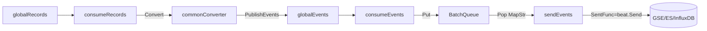

<!-- [待审核] AI 自动生成，请人工确认后移除此标记 -->
# 11-上报层 Exporter

<cite>
- [Exporter 主结构](file://pkg/collector/exporter/exporter.go)
- [Converter 转换分发](file://pkg/collector/exporter/converter/converter.go)
- [发送队列与批量](file://pkg/collector/exporter/queue/batch.go)
- [事件/指标 MapStr 封装](file://pkg/collector/exporter/queue/queue.go)
</cite>

## 目录
1. [简介](#简介)
2. [Exporter 结构与全局管道](#exporter-结构与全局管道)
3. [converter 转换（按 RecordType 分派）](#converter-转换按-recordtype-分派)
4. [queue 批量发送](#queue-批量发送)
5. [GSE 输出与指标](#gse-输出与指标)
6. [结论](#结论)

## 简介

`exporter` 是 collector 的上报层，承接 Controller 调度完成、经 Pipeline/Processor 处理后的 `Record`，将其转换为目标存储格式并批量发送。一条 Record 经过 `converter` 转换为 `Event`，汇入 `queue` 做按 DataID/RecordType 的批量聚合，最终由 GSE（`libgse/output/gse`）`beat.Send` 上报到后端（Elasticsearch / InfluxDB / GSE）。Exporter 通过两个全局队列 `globalRecords` / `globalEvents` 与上游解耦：Controller 调用 `exporter.PublishRecord`，非调度类 Processor 调用 `PublishEvents`，Exporter 内部起多组 worker 并发消费。

**章节来源**
- [Exporter 全局管道与发布入口](file://pkg/collector/exporter/exporter.go#L42-L52)
- [Exporter 结构与 converter/queue 字段](file://pkg/collector/exporter/exporter.go#L32-L40)

## Exporter 结构与全局管道

`Exporter` 结构体持有 `converter`、`queue`、`cfg`、`batches` 等字段，`batches` 是 `map[string]queue.Config`（按 DataID 维度配置批量参数，无并发读写故无需锁）。两个包级全局队列为入口：

- `globalRecords`（类型 `define.RecordQueue`，`PushModeGuarantee`）：`PublishRecord(r)` 直接 `Push`，供 Controller 调度后的原始/派生 Record 上报；
- `globalEvents`（类型 `define.EventQueue`，`PushModeGuarantee`）：`PublishEvents(events...)` 直接 `Push`，供非调度类 Processor（如 accumulator）直接上报的 Event。

`init()` 中把 `gse.MarshalFunc` 替换为内部 `json.Marshal`，统一序列化实现。`New(conf)` 会从 `exporter` 子配置解出 `Config`（含 converter 与 queue 参数），注册 GSE 发送 hook（记录 `MaxMessageBytes` 与上报字节），并用 `converter.NewCommonConverter` 与 `queue.NewBatchQueue` 构造 converter 与 queue。

**章节来源**
- [init 注册 gse.MarshalFunc](file://pkg/collector/exporter/exporter.go#L28-L30)
- [Exporter 结构与全局队列](file://pkg/collector/exporter/exporter.go#L32-L52)
- [New 构造 converter/queue 与 GSE hook](file://pkg/collector/exporter/exporter.go#L56-L82)

## converter 转换（按 RecordType 分派）

`converter.Converter` 接口只暴露 `Convert(record, f)` 与 `Clean`；`EventConverter` 在此基础上增加 `ToEvent`/`ToDataID`，负责把 Record 转换为 `define.Event` 并通过回调 `f`（即 `PublishEvents`）回吐。

`commonConverter` 内置 12 类 EventConverter，覆盖全部数据形态：`traces`、`metrics`、`logs`、`pushGateway`、`remoteWrite`、`proxy`、`pingserver`、`profiles`、`fta`、`beat`、`logPush`、`tars`（其中 `tars` 由 `newTarsConverter(conf.Tars)` 构造）。`Convert` 按 `record.RecordType` 分派到对应子 converter：

- **traces/logs**：转换为 flat_batch 事件数组，最终发往 Elasticsearch；
- **metrics / pushGateway / remoteWrite / tars**：转换为自定义指标结构，发往 InfluxDB；
- **proxy**：转换为 proxy 数据格式；
- **pingserver / fta / beat**：不聚合，逐条发送。

`traces` converter 还会经 `converterSpanKindTotal` 计数器记录 span kind 分布。各具体 converter 实现位于 `converter/traces.go`、`converter/metrics.go`、`converter/logs.go` 等文件。

**章节来源**
- [Converter 与 EventConverter 接口](file://pkg/collector/exporter/converter/converter.go#L40-L49)
- [NewCommonConverter 装配 12 类子 converter](file://pkg/collector/exporter/converter/converter.go#L51-L66)
- [Convert 按 RecordType 分派](file://pkg/collector/exporter/converter/converter.go#L87-L114)

## queue 批量发送

`queue.Queue` 接口提供 `Put(events...)`（调用方须保证同批 Event 的 RecordType/DataID 相同）、`Pop() <-chan common.MapStr`、`Close()`。`BatchQueue` 是主要实现：

- `Put`：以 `dataID + "/" + rtype` 为唯一键（`uk`），首次见到某 key 时按类型选择默认批次大小（metrics/pushGateway/remoteWrite→`MetricsBatchSize`，logs→`LogsBatchSize`，traces→`TracesBatchSize`，proxy→`ProxyBatchSize`，profiles→`ProfilesBatchSize`，默认 100），并为该 key 起一个 `compact` goroutine；
- `compact`：按 `FlushInterval` 定时或攒满 `dynamicBatch` 触发 `sentOut`；满批时经 `resize` 根据 token 级配置动态调整批次大小（允许每个 DataID 单独设置队列批次）；
- `compact` 内的 `sentOut` 闭包：按 RecordType 选择 MapStr 封装——traces/logs 用 `NewEventsMapStr`（含 datetime/utctime/time/items），metrics 等用 `NewMetricsMapStr`，profiles 用 `NewProfilesMapStr`，proxy 用 `NewProxyMapStr`，pingserver/fta/beat 逐条不过聚合；
- 批量大小分布、队列满/定时 tick 均由 `exporter_queue_*` 系列 Prometheus 指标记录。

下图展示 Record 流转到发送的路径：

**图表来源**
- [consumeRecords/consumeEvents/sendEvents 三循环](file://pkg/collector/exporter/exporter.go#L99-L151)
- [BatchQueue.Put 分键起 compact](file://pkg/collector/exporter/queue/batch.go#L222-L266)
- [compact 内 sentOut 闭包封装 MapStr](file://pkg/collector/exporter/queue/batch.go#L149-L211)

**章节来源**
- [Queue 接口与 MapStr 封装函数](file://pkg/collector/exporter/queue/queue.go#L20-L74)
- [BatchQueue 结构与批次动态调整](file://pkg/collector/exporter/queue/batch.go#L72-L147)
- [Exporter 三循环与 Start/Stop](file://pkg/collector/exporter/exporter.go#L84-L157)

## GSE 输出与指标

`sendEvents` 从 `queue.Pop()` 取出 `common.MapStr`，经包级变量 `SentFunc`（默认 `beat.Send`）实际发送；发送后记录 `exporter_sent_duration` / `exporter_sent_total` 等指标。`Start()` 按 `define.Concurrency()` 启动 `consumeRecords`/`consumeEvents`/`sendEvents` 三组各 `Concurrency()` 个 worker（共 `3 × Concurrency` 个 goroutine），实现与接收/调度侧对等的并发度。`Reload(conf)` 仅更新 `batches` 配置。`Stop()` 依次做 `converter.Clean`、`cancel` 与 `wg.Wait` 优雅退出。GSE 发送 hook 在 `New` 时注册，用于统计上报字节数（受 `MaxMessageBytes` 约束）。

**章节来源**
- [Start 按并发度起三组 worker](file://pkg/collector/exporter/exporter.go#L84-L93)
- [sendEvents 经 SentFunc 发送](file://pkg/collector/exporter/exporter.go#L134-L151)
- [Reload/Stop 生命周期](file://pkg/collector/exporter/exporter.go#L95-L157)

## 结论

Exporter 通过"`globalRecords`/`globalEvents` 全局管道 + `converter` 转换 + `BatchQueue` 批量 + GSE `beat.Send`"四级结构，将多样化 Record 收敛为统一上报流。converter 按 `RecordType` 分派到 12 类子转换器（traces/logs→ES、metrics→InfluxDB、proxy/fta/beat 等差异化处理），queue 以 DataID 为键动态批量并按类型封装 MapStr，并以与调度侧对等的并发度（`3 × Concurrency`）保证吞吐。它是 collector 五层架构中"上报"环节的落地实现。

**章节来源**
- [Exporter 全局管道与发布入口](file://pkg/collector/exporter/exporter.go#L42-L52)
- [commonConverter 12 类分派](file://pkg/collector/exporter/converter/converter.go#L51-L114)
- [BatchQueue 批量与动态批次](file://pkg/collector/exporter/queue/batch.go#L114-L211)
