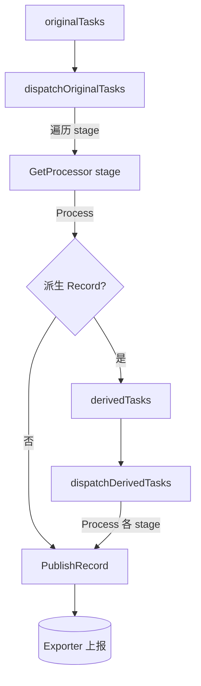

<!-- [待审核] AI 自动生成，请人工确认后移除此标记 -->
# 12-控制器与调度

<cite>
- [Controller 结构与装配](file://pkg/collector/controller/controller.go)
- [组件注册（副作用导入）](file://pkg/collector/controller/register.go)
- [调度指标](file://pkg/collector/controller/metrics.go)
</cite>

## 目录
1. [简介](#简介)
2. [Controller 装配](#controller-装配)
3. [worker 并发模型（coreNum×2）](#worker-并发模型corenum2)
4. [消费循环（consumeRecords）](#消费循环consumerecords)
5. [分发循环（dispatchOriginalTasks/dispatchDerivedTasks）](#分发循环dispatchoriginaltasksdispatchderivedtasks)
6. [事务性处理与错误控制](#事务性处理与错误控制)
7. [热更新 Reload](#热更新-reload)
8. [结论](#结论)

## 简介

`controller` 是 collector 的调度中枢：它装配 Receiver / Proxy / Pingserver / Exporter / Pipeline / Cache / Pusher 等全部组件，并通过一组常驻 worker goroutine 把"接收 Record → 组装 Task → 执行 Processor 链 → 上报 Event"串成闭环。核心调度逻辑集中在 `Controller` 上：`Start` 启动各层并起 worker，`consumeRecords` 从接收层取 Record 装 Task，`dispatchOriginalTasks` / `dispatchDerivedTasks` 事务性地执行 Pipeline 绑定的 Processor 链，派生 Record 回流形成 `derivedTasks`。所有 Receiver/Processor/Exporter 等组件均通过 `register.go` 的副作用导入（`import _`）注册，使 Controller 无需硬编码依赖。

**章节来源**
- [Controller 结构聚合各层 Manager](file://pkg/collector/controller/controller.go#L42-L59)
- [register.go 副作用导入全部组件](file://pkg/collector/controller/register.go#L12-L42)

## Controller 装配

`New(conf, buildInfo)` 按依赖顺序装配各层，关键约束是"**优先加载 pipeline，当配置就绪以后才启动服务**"：

1. `Setup(conf)`：依次 `SetupCoreNum`（`max_procs` 覆盖 GOMAXPROCS）、`SetupLogger`、`SetupHook`；
2. `pipeline.New(conf)`：必须先建，后续 Exporter/Proxy/Receiver 都依赖流水线定义；
3. `exporter.New` / `proxy.New` / `pingserver.New` / `receiver.New`：各自仅在未 `Disabled(...)` 时创建；
4. `cache.Install(conf)`：安装缓存（如 K8s 缓存）；
5. `pusher.New(ctx, conf)`：未禁用时创建自监控 pusher；
6. 最后创建两个全局任务队列：`originalTasks` 与 `derivedTasks`（均为 `PushModeGuarantee`）。

`Controller` 还持有 `ctx/cancel`/`wg`/`buildInfo` 与 `hostWatcher`（经 `newHostWatcher` 从配置 `host_id_path` 构造，非关键路径，失败返回 nil）。

**章节来源**
- [Setup 系列初始化函数](file://pkg/collector/controller/controller.go#L61-L109)
- [New 装配各层与双任务队列](file://pkg/collector/controller/controller.go#L111-L184)
- [newHostWatcher 构造主机信息监听](file://pkg/collector/controller/controller.go#L186-L201)

## worker 并发模型（coreNum×2）

并发度由 `define.Concurrency()` 决定（返回 `coreNum * 2`），`SetCoreNum` 可经主配置 `max_procs` 覆盖并同步 `GOMAXPROCS`。`Start()` 中每类循环各起 `define.Concurrency()` 个 worker（均经 `wait.Until` 在 `ctx` 取消后自动退出）：

- `consumeRecords`：从接收层（receiver/proxy/pingserver）取 Record；
- `consumeNonSchedRecords`：消费来自 accumulator 提交的非调度类 Record，直接 `PublishRecord`；
- `dispatchOriginalTasks`：消费 `originalTasks`；
- `dispatchDerivedTasks`：消费 `derivedTasks`。

即共起 `4 × Concurrency` 个调度类 worker（外加 `recordMetrics`/`updateIdentity` 两个指标 goroutine）。`Start` 还会按 nil 判断依次启动 `hostWatcher`/`receiverMgr`/`proxyMgr`/`pingserverMgr`/`exporterMgr`/`pusherMgr`，任一启动失败即返回错误。

**章节来源**
- [Start 启动各层与 4×Concurrency worker](file://pkg/collector/controller/controller.go#L248-L296)
- [配置字段常量（max_procs/logging/hook）](file://pkg/collector/controller/controller.go#L36-L40)
- [SetupCoreNum 覆盖 GOMAXPROCS](file://pkg/collector/controller/controller.go#L61-L63)

## 消费循环（consumeRecords）

`consumeRecords` 从 `receiver.Records()`、`proxy.Records()`、`pingserver.Records()` 三个全局 Record 通道中任选就绪者取出，按 `record.RecordType` 经 `pipelineMgr.GetPipeline(record.RecordType)` 取到对应 Pipeline，再调用 `submitTasks(c.originalTasks, record, pl)` 把 Record 封成 `Task`（`NewTask(record, pipeline.Name(), pipeline.SchedProcessors())`）投入 `originalTasks`。若 `pl == nil` 则仅告警不产任务。该循环与接收层解耦——接收层只管 Push，调度层只管 Get，二者通过全局 `RecordQueue` 衔接。`consumeNonSchedRecords` 则监听 `processor.NonSchedRecords()` 通道，把非调度类 Record 直接交给 `exporter.PublishRecord`。

**章节来源**
- [submitTasks 封装 Task](file://pkg/collector/controller/controller.go#L368-L374)
- [consumeNonSchedRecords 直报非调度记录](file://pkg/collector/controller/controller.go#L376-L393)
- [consumeRecords 三接收源取 Record 投 originalTasks](file://pkg/collector/controller/controller.go#L395-L426)

## 分发循环（dispatchOriginalTasks/dispatchDerivedTasks）

两个分发循环结构相同：从各自 `TaskQueue.Get()` 取出 Task，遍历其 `StageCount()` 个 stage，对每个 stage 取 `pipelineMgr.GetProcessor(stage)` 执行 `Process(task.Record())`。`dispatchOriginalTasks` 关注 `Process` 返回的 `derivedRecord`（非空时 `Unwrap` 后投入 `derivedTasks`，回流再处理）；`dispatchDerivedTasks` 不再关注派生（派生类型无需再派生子任务）。两者都通过 `exporter.PublishRecord(task.Record())` 在上链完成后上报，并对 `StageCount()==0`（无 Processor）的 Task 跳过导出耗时统计但照常计数。

下图展示原始任务的事务化处理与派生回流：

**图表来源**
- [dispatchOriginalTasks 遍历 stage 与派生回流](file://pkg/collector/controller/controller.go#L429-L486)
- [dispatchDerivedTasks 派生任务再处理](file://pkg/collector/controller/controller.go#L489-L541)

**章节来源**
- [originalTasks 分发与派生回流](file://pkg/collector/controller/controller.go#L428-L486)
- [derivedTasks 分发](file://pkg/collector/controller/controller.go#L488-L541)

## 事务性处理与错误控制

`dispatchOriginalTasks` 注释明确指出"任务执行应该是事务的，一旦中间某一环执行失败那就整体失败"。对每个 stage 的 `Process` 返回错误做三段式处理：

- `define.ErrSkipEmptyRecord`：记录 `skipped` 计数并 `goto loop`（跳过空记录，不下发，也不视为失败）；
- `define.ErrEndOfPipeline`：直接 `goto loop`（提前结束该 Pipeline，不下发）；
- 其他非 nil 错误：记录 `dropped` 计数并 `goto loop`（整条任务失败，整体丢弃，保证事务性）。

仅当全部 stage 成功走完，才执行 `exporter.PublishRecord` 并累加 `handled`/`exported` 计数与耗时观测。`dispatchDerivedTasks` 逻辑一致，区别在于派生任务不再产生新的派生回流。`goto loop` 直接跳回 `select` 顶部取下一条 Task，避免 `continue` 仅跳出内层 for 的歧义。

**章节来源**
- [dispatchOriginalTasks 错误三段式与 goto loop](file://pkg/collector/controller/controller.go#L444-L480)
- [dispatchDerivedTasks 错误处理一致性](file://pkg/collector/controller/controller.go#L504-L535)

## 热更新 Reload

`Reload(conf)` 在收到 reload 信号（由 `cmd/collector/main.go` 经 beat reload 通道收敛后触发）时执行增量重载：

1. `pipelineMgr.Reload(conf)`：优先重载流水线（失败则累加 `reload_failed` 并返回，保证原子性前置）；
2. `pingserverMgr.Reload(conf)`（非 nil）；
3. `exporterMgr.Reload(conf)`（非 nil，仅更新 batches）；
4. `receiverMgr.Reload(conf)`（非 nil）。

重载完成后记录 `reload_success` 计数与耗时。注意 `Reload` 不重建 Receiver/Exporter 实例，而是就地更新其内部配置，避免连接抖动。所有 reload 相关指标由 `controller/metrics.go` 的 `DefaultMetricMonitor` 提供（如 `reload_success_total`/`reload_failed_total`/`reload_duration`）。

**章节来源**
- [Reload 增量热更新顺序与原子性](file://pkg/collector/controller/controller.go#L335-L366)

## 结论

`controller` 以 `New` 装配全部组件、`Start` 启动 `4 × Concurrency` 个常驻 worker，构成"接收取 Record → 装 Task → 事务化执行 Processor 链 → 派生回流 → Exporter 上报"的闭环。`consumeRecords`/`consumeNonSchedRecords` 负责入队，`dispatchOriginalTasks`/`dispatchDerivedTasks` 负责事务化分发并对 `ErrSkipEmptyRecord`/`ErrEndOfPipeline` 做优雅跳过、对非空错误整体丢弃，`Reload` 对流水线优先原子重载。所有组件通过 `register.go` 副作用导入注册，使调度层与具体协议/处理逻辑彻底解耦。

**章节来源**
- [New 装配与双任务队列](file://pkg/collector/controller/controller.go#L111-L184)
- [Start worker 并发模型](file://pkg/collector/controller/controller.go#L248-L296)
- [dispatch 事务化与错误控制](file://pkg/collector/controller/controller.go#L428-L541)
- [组件副作用导入](file://pkg/collector/controller/register.go#L12-L42)
