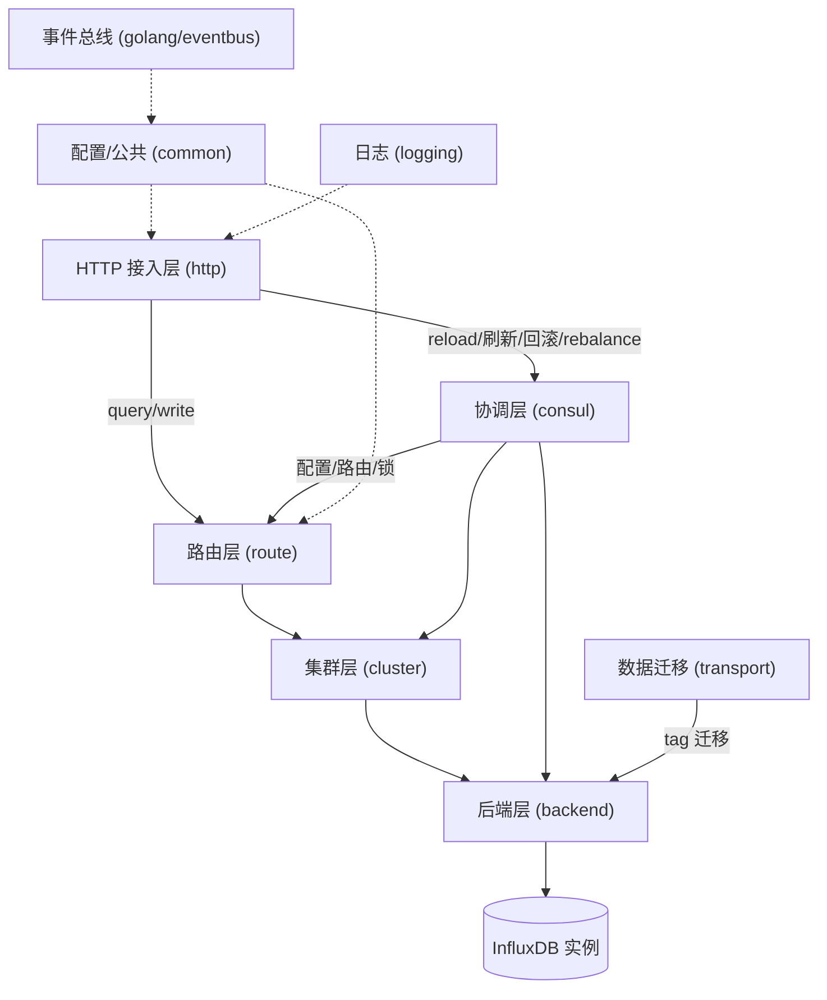

# 概览与架构

<cite>
**本文引用的文件**
- [main.go](file://bkmonitor-datalink/pkg/influxdb-proxy/main.go)
- [cmd/root.go](file://bkmonitor-datalink/pkg/influxdb-proxy/cmd/root.go)
- [cmd/transport.go](file://bkmonitor-datalink/pkg/influxdb-proxy/cmd/transport.go)
</cite>

## 目录
1. [模块定位](#模块定位)
2. [启动链路](#启动链路)
3. [组件地图](#组件地图)
4. [核心数据流](#核心数据流)
5. [子包一览](#子包一览)

## 模块定位

`influxdb-proxy` 是 BlueKing Monitor 数据链路（data-link）中**面向 InfluxDB 的查询/写入代理**。它对外暴露 InfluxDB 兼容的 HTTP 接口（`query` / `write` / `create_database`），对内把请求按 `db.measurement` 维度路由到正确的 `cluster` 与具体 `backend` 实例，并借助 Consul 实现配置动态发现、服务注册与多实例协调。与 `transfer`（采集/ETL/分发中枢）不同，`influxdb-proxy` 定位在**读写侧网关**：承接上游查询/写入流量，屏蔽底层 InfluxDB 集群拓扑变化。

**章节来源**
- [main.go](file://bkmonitor-datalink/pkg/influxdb-proxy/main.go#L21-L23)
- [cmd/root.go](file://bkmonitor-datalink/pkg/influxdb-proxy/cmd/root.go#L55-L118)

## 启动链路

进程启动遵循「入口 → CLI → 子包装配」的线性链：

1. `main()` 仅调用 `cmd.Execute()`，并通过匿名导入拉起 pprof、日志、consul 配置等包副作用。
2. `cmd/root.go` 的 `rootCmd`（proxy 主命令）由 `Execute()` 执行：`initConfigPath()` 用 viper + consul 加载配置，随后构建 HTTP service 并 `ListenAndServe`，同时启动信号监听。
3. 服务装配的核心是 `InitService` 初始化顺序：**`consul.Init` → `backend.Init` → `cluster.Init` → `route.Init`**，保证底层配置/后端就绪后再注册路由。
4. 另有独立的 `transportCmd` 子命令（来自 `cmd/transport.go`），周期性触发 tag 维度数据迁移，与主 proxy 进程解耦。

**章节来源**
- [main.go](file://bkmonitor-datalink/pkg/influxdb-proxy/main.go#L21-L23)
- [cmd/root.go](file://bkmonitor-datalink/pkg/influxdb-proxy/cmd/root.go#L44-L49)
- [cmd/root.go](file://bkmonitor-datalink/pkg/influxdb-proxy/cmd/root.go#L55-L118)
- [cmd/root.go](file://bkmonitor-datalink/pkg/influxdb-proxy/cmd/root.go#L121-L161)
- [cmd/transport.go](file://bkmonitor-datalink/pkg/influxdb-proxy/cmd/transport.go#L26-L93)

## 组件地图

下图展示 `influxdb-proxy` 各子包的依赖与协作关系：`http` 是接入与协调中枢，`consul` 提供配置/路由/锁，`route → cluster → backend` 形成请求处理主链，`transport` 独立于主链做数据迁移，`common`/`golang`/`logging` 为横切支撑。



**图表来源**
- [cmd/root.go](file://bkmonitor-datalink/pkg/influxdb-proxy/cmd/root.go#L55-L118)
- [cmd/transport.go](file://bkmonitor-datalink/pkg/influxdb-proxy/cmd/transport.go#L26-L93)

**章节来源**
- [cmd/root.go](file://bkmonitor-datalink/pkg/influxdb-proxy/cmd/root.go#L55-L118)
- [cmd/transport.go](file://bkmonitor-datalink/pkg/influxdb-proxy/cmd/transport.go#L26-L93)

## 核心数据流

一次查询/写入请求的端到端流转如下：HTTP 请求经 `http` 的 decorator 链（鉴权/可用性/方法校验）后，由 `route` 解析路由并选择执行器，再经 `cluster` 按 tag 维度路由到 `backend`，最终落到 InfluxDB；结果逐层返回。

```mermaid
sequenceDiagram
  participant C as Client
  participant H as http.Handler
  participant R as route
  participant CL as cluster
  participant B as backend
  participant I as InfluxDB
  C->>H: query / write
  H->>R: route.Query / route.Write
  R->>CL: cluster.Query / cluster.Write (by tag)
  CL->>B: backend.Write / backend.Query
  B->>I: InfluxDB API
  I-->>B: result
  B-->>CL
  CL-->>R
  R-->>H
  H-->>C: 逐层返回
```

**图表来源**
- [cmd/root.go](file://bkmonitor-datalink/pkg/influxdb-proxy/cmd/root.go#L65-L104)
- [route/route.go](file://bkmonitor-datalink/pkg/influxdb-proxy/route/route.go#L24-L39)

**章节来源**
- [route/route.go](file://bkmonitor-datalink/pkg/influxdb-proxy/route/route.go#L24-L39)
- [cmd/root.go](file://bkmonitor-datalink/pkg/influxdb-proxy/cmd/root.go#L65-L104)

## 子包一览

| 子包 | 职责 |
|------|------|
| `cmd` | cobra CLI 入口，装配 proxy HTTP 服务与 transport 迁移子命令 |
| `route` | 请求路由、SQL 类型分发、point 解析与执行器 |
| `backend` | InfluxDB 后端实例管理（连接/写入/查询/建库/Kafka 备份） |
| `cluster` | 多 backend 聚合，按 tag 做读写路由、负载均衡、容错 |
| `consul` | KV/服务发现/版本监听/分布式锁，提供路由与配置数据 |
| `http` | 对外 HTTP 接口、全局协调（reload/刷新/回滚/rebalance） |
| `transport` | 独立子命令，tag 维度数据重平衡迁移 |
| `common` | 全局配置、Tag 解析与路由生成、FlowID |
| `event` / `golang` / `logging` | 事件主题常量 / 基础件（错误、事件总线）/ 统一日志 |

**章节来源**
- [cmd/root.go](file://bkmonitor-datalink/pkg/influxdb-proxy/cmd/root.go#L55-L118)
- [cmd/transport.go](file://bkmonitor-datalink/pkg/influxdb-proxy/cmd/transport.go#L26-L93)
