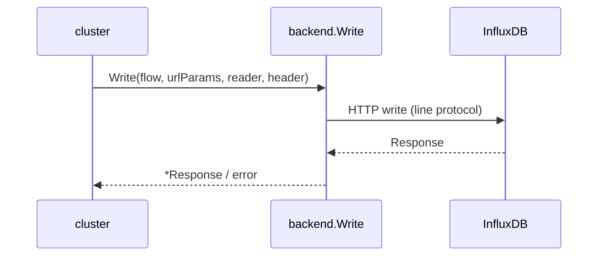

# 后端层 Backend

<cite>
**本文引用的文件**
- [backend/manager.go](file://bkmonitor-datalink/pkg/influxdb-proxy/backend/manager.go)
- [backend/factory.go](file://bkmonitor-datalink/pkg/influxdb-proxy/backend/factory.go)
- [backend/define.go](file://bkmonitor-datalink/pkg/influxdb-proxy/backend/define.go)
- [backend/struct.go](file://bkmonitor-datalink/pkg/influxdb-proxy/backend/struct.go)
- [backend/pointsreader.go](file://bkmonitor-datalink/pkg/influxdb-proxy/backend/pointsreader.go)
- [backend/influxdb/influxdb.go](file://bkmonitor-datalink/pkg/influxdb-proxy/backend/influxdb/influxdb.go)
- [backend/influxdb/influxdb_helper.go](file://bkmonitor-datalink/pkg/influxdb-proxy/backend/influxdb/influxdb_helper.go)
- [backend/influxdb/kafka_v2.go](file://bkmonitor-datalink/pkg/influxdb-proxy/backend/influxdb/kafka_v2.go)
- [backend/influxdb/buffer.go](file://bkmonitor-datalink/pkg/influxdb-proxy/backend/influxdb/buffer.go)
</cite>

## 目录
1. [Backend 接口与管理器](#backend-接口与管理器)
2. [InfluxDB 实现与生命周期](#influxdb-实现与生命周期)
3. [写入与查询](#写入与查询)
4. [建库与 RawQuery 透传](#建库与-rawquery-透传)
5. [Kafka 备份与缓冲](#kafka-备份与缓冲)
6. [可复制 Points Reader](#可复制-points-reader)

## Backend 接口与管理器

`Backend` 接口定义了后端实例的统一契约：`Write` / `Query` / `RawQuery` / `CreateDatabase` 四个核心方法，外加 `GetVersion` / `Close` / `Wait` / `Name` / `Ping` / `Reset` / `Readable` / `Disabled` 等生命周期与状态方法。`BackendManager` 是全局单例管理器，`Init` 构建 `newManager`，提供 `GetBackend` / `GetBackendList`，`Reload` 清空后重载，支持热更新而不中断服务。`factory.go` 的 `RegisterBackend` / `GetBackendFunc` 以类型名注册工厂，使新增后端类型（如未来其它 TSDB）无需修改调用方。

**章节来源**
- [backend/define.go](file://bkmonitor-datalink/pkg/influxdb-proxy/backend/define.go#L18-L45)
- [backend/manager.go](file://bkmonitor-datalink/pkg/influxdb-proxy/backend/manager.go#L31-L54)
- [backend/factory.go](file://bkmonitor-datalink/pkg/influxdb-proxy/backend/factory.go#L17-L34)

## InfluxDB 实现与生命周期

`backend/influxdb` 包提供 `Backend` 接口的 InfluxDB 实现。`Backend` 结构体持有 `ctx` / `cancelFunc` / `version` / `statusChannel`（异步状态上报）/ `name` / `domain` / `port` / `metric` 等；`influxdb_helper.go` 提供连接探测与配置辅助（如 `maxPingTime`、Kafka 错误识别），`factory.go` 负责按配置构造实例并注册。

**章节来源**
- [backend/influxdb/influxdb.go](file://bkmonitor-datalink/pkg/influxdb-proxy/backend/influxdb/influxdb.go#L44-L90)
- [backend/influxdb/influxdb_helper.go](file://bkmonitor-datalink/pkg/influxdb-proxy/backend/influxdb/influxdb_helper.go#L1-L45)

## 写入与查询

写入链路 `Write(flow, urlParams, reader, header)` 接收可复制 Reader，落库到 InfluxDB；`Query` 执行查询；`RawQuery` 透传原始 HTTP 请求。三者共享 `flow`（用于日志串联）与 `header`。错误通过 `CountIncFunc` / `CountAddFunc` 指标回调上报，便于按 db / status 统计。

**图表来源**
- [backend/influxdb/influxdb.go](file://bkmonitor-datalink/pkg/influxdb-proxy/backend/influxdb/influxdb.go#L593-L640)

**章节来源**
- [backend/influxdb/influxdb.go](file://bkmonitor-datalink/pkg/influxdb-proxy/backend/influxdb/influxdb.go#L593-L640)
- [backend/influxdb/influxdb.go](file://bkmonitor-datalink/pkg/influxdb-proxy/backend/influxdb/influxdb.go#L849-L890)

## 建库与 RawQuery 透传

`CreateDatabase` 接受完整语句 `q` 而非 DB 名，以避免复杂语句解析；`RawQuery` 直接将请求透传到 InfluxDB，用于不支持的查询类型。两者均经 `flow` / `header` 贯穿全链路，保证可观测性与一致性。

**章节来源**
- [backend/influxdb/influxdb.go](file://bkmonitor-datalink/pkg/influxdb-proxy/backend/influxdb/influxdb.go#L904-L950)
- [backend/influxdb/influxdb.go](file://bkmonitor-datalink/pkg/influxdb-proxy/backend/influxdb/influxdb.go#L751-L800)

## Kafka 备份与缓冲

`kafka_v2.go` 实现写入数据的 Kafka 备份：通过 `StorageBackup` 接口抽象（`emptyKafkaStorage` 为安全模式，屏蔽 Kafka 操作时不影响主链路），将写入数据异步投递到 Kafka，保证可重放；`buffer.go` 的 `Buffer` / `BufferData` 提供写入缓冲，集齐后统一写入 InfluxDB，平滑突发流量、保护后端。两者配合降低 InfluxDB 压力并提升可靠性。

**章节来源**
- [backend/influxdb/kafka_v2.go](file://bkmonitor-datalink/pkg/influxdb-proxy/backend/influxdb/kafka_v2.go#L1-L60)
- [backend/influxdb/buffer.go](file://bkmonitor-datalink/pkg/influxdb-proxy/backend/influxdb/buffer.go#L23-L50)

## 可复制 Points Reader

`CopyReader` 接口（`Copy` / `Read` / `AppendIndex` / `SeekZero` / `PointCount`）允许请求体被多次读取（如重试、备份）；`pointsreader.go` 的 `PointsReader` 与 `NewPointsReader` / `NewPointsReaderWithBytes` 提供实现，使得同一份 point 数据可同时用于写 InfluxDB 与 Kafka 备份而无需重复解析、不丢失游标。

**章节来源**
- [backend/define.go](file://bkmonitor-datalink/pkg/influxdb-proxy/backend/define.go#L47-L54)
- [backend/pointsreader.go](file://bkmonitor-datalink/pkg/influxdb-proxy/backend/pointsreader.go#L22-L45)
