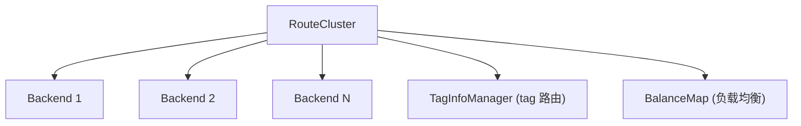

# 集群层 Cluster

<cite>
**本文引用的文件**
- [cluster/manager.go](file://bkmonitor-datalink/pkg/influxdb-proxy/cluster/manager.go)
- [cluster/factory.go](file://bkmonitor-datalink/pkg/influxdb-proxy/cluster/factory.go)
- [cluster/define.go](file://bkmonitor-datalink/pkg/influxdb-proxy/cluster/define.go)
- [cluster/struct.go](file://bkmonitor-datalink/pkg/influxdb-proxy/cluster/struct.go)
- [cluster/utils.go](file://bkmonitor-datalink/pkg/influxdb-proxy/cluster/utils.go)
- [cluster/routecluster/routecluster.go](file://bkmonitor-datalink/pkg/influxdb-proxy/cluster/routecluster/routecluster.go)
- [cluster/routecluster/tagmanager.go](file://bkmonitor-datalink/pkg/influxdb-proxy/cluster/routecluster/tagmanager.go)
- [cluster/routecluster/metric.go](file://bkmonitor-datalink/pkg/influxdb-proxy/cluster/routecluster/metric.go)
- [cluster/routecluster/struct.go](file://bkmonitor-datalink/pkg/influxdb-proxy/cluster/routecluster/struct.go)
</cite>

## 目录
1. [Cluster 接口与管理器](#cluster-接口与管理器)
2. [RouteCluster 多 Backend 聚合](#routecluster-多-backend-聚合)
3. [Tag 维度读写路由](#tag-维度读写路由)
4. [负载均衡与容错](#负载均衡与容错)
5. [Tag 管理](#tag-管理)

## Cluster 接口与管理器

`Cluster` 接口聚合多个 `Backend`，对外暴露与 `Backend` 同构的 `Write` / `Query` / `CreateDatabase` / `RawQuery` / `QueryInfo`，并增加 `GetName` / `Reset`（按 host 列表重建）/ `GetInfluxVersion`。`cluster.Manager` 是全局管理器，`Init` 构建实例，`GetCluster` 按名获取，`Reload` 停止后重建。对 `route` 层而言，`Cluster` 屏蔽了底层多 backend 拓扑，表现为单一逻辑集群。

**章节来源**
- [cluster/define.go](file://bkmonitor-datalink/pkg/influxdb-proxy/cluster/define.go#L17-L28)
- [cluster/manager.go](file://bkmonitor-datalink/pkg/influxdb-proxy/cluster/manager.go#L28-L46)

## RouteCluster 多 Backend 聚合

`RouteCluster` 是 `Cluster` 的主要实现，持有 `allBackendList`（全部 backend）、`unreadableHostMap`（不可读主机映射）、`balanceMap`（负载均衡计数）、`tagManager`（tag 路由）。`NewRouteCluster` 构造时初始化 `TagInfoManager` 并立即 `Refresh` + `WatchChange`，拉起 tag 路由监听，使集群在启动后即可按 tag 正确分发。

**图表来源**
- [cluster/routecluster/routecluster.go](file://bkmonitor-datalink/pkg/influxdb-proxy/cluster/routecluster/routecluster.go#L32-L60)

**章节来源**
- [cluster/routecluster/routecluster.go](file://bkmonitor-datalink/pkg/influxdb-proxy/cluster/routecluster/routecluster.go#L32-L60)

## Tag 维度读写路由

`RouteCluster` 的核心能力是按 tag 维度将请求路由到正确的 backend：写入/查询时依据 `common.GenerateBackendRoute` 计算 tag 路由键，在 `readMap` / `writeMap`（`PrintTagMap`：`tagKey → []Backend`）中查找对应 backend 列表。这样同一 tag 集合稳定落到同一 backend，实现数据分片；读写映射由 `TagInfoManager` 从 consul 的 tag 配置刷新，保证路由口径与配置一致。

**章节来源**
- [cluster/routecluster/routecluster.go](file://bkmonitor-datalink/pkg/influxdb-proxy/cluster/routecluster/routecluster.go#L60-L200)
- [common/tags.go](file://bkmonitor-datalink/pkg/influxdb-proxy/common/tags.go#L27-L27)

## 负载均衡与容错

`balanceMap` 记录各 backend 请求计数，用于在多个可读 backend 间做负载均衡；`unreadableHostMap` 标记不可读主机，查询时自动绕过、写入时仍可写（配合 tag 迁移）。当某 backend 不可用时，`Cluster` 在可用列表内重试，提升整体容错能力。

**章节来源**
- [cluster/routecluster/routecluster.go](file://bkmonitor-datalink/pkg/influxdb-proxy/cluster/routecluster/routecluster.go#L39-L42)

## Tag 管理

`TagInfoManager` 管理所属 cluster 的 tag 路由：持有 `readMap` / `writeMap`（`PrintTagMap`：`tagKey → []Backend`），`Refresh` 从 consul 拉取 `TagInfo`，`WatchChange` 监听变更实时更新。它是「consul tag 配置」与「cluster 实际路由」之间的桥梁，也是 rebalance / transport 的数据基础。

**章节来源**
- [cluster/routecluster/tagmanager.go](file://bkmonitor-datalink/pkg/influxdb-proxy/cluster/routecluster/tagmanager.go#L41-L60)
