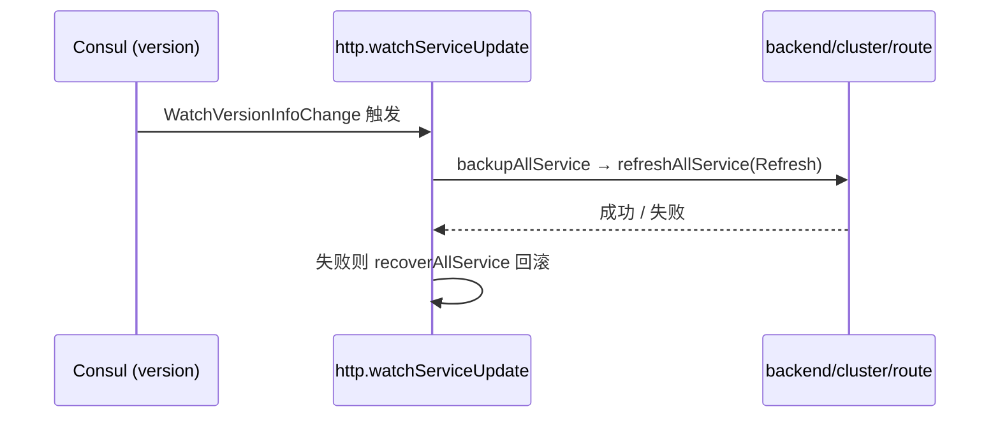

# 协调层 Consul

<cite>
**本文引用的文件**
- [consul/consul.go](file://bkmonitor-datalink/pkg/influxdb-proxy/consul/consul.go)
- [consul/route.go](file://bkmonitor-datalink/pkg/influxdb-proxy/consul/route.go)
- [consul/cluster.go](file://bkmonitor-datalink/pkg/influxdb-proxy/consul/cluster.go)
- [consul/backend.go](file://bkmonitor-datalink/pkg/influxdb-proxy/consul/backend.go)
- [consul/tag.go](file://bkmonitor-datalink/pkg/influxdb-proxy/consul/tag.go)
- [consul/struct.go](file://bkmonitor-datalink/pkg/influxdb-proxy/consul/struct.go)
- [consul/utils.go](file://bkmonitor-datalink/pkg/influxdb-proxy/consul/utils.go)
- [consul/base/baseclient.go](file://bkmonitor-datalink/pkg/influxdb-proxy/consul/base/baseclient.go)
- [consul/base/define.go](file://bkmonitor-datalink/pkg/influxdb-proxy/consul/base/define.go)
</cite>

## 目录
1. [Consul 中心职责](#consul-中心职责)
2. [KV 读写与版本监听](#kv-读写与版本监听)
3. [服务注册与健康检查](#服务注册与健康检查)
4. [路由集群主机 Tag 数据读取](#路由集群主机-tag-数据读取)
5. [分布式锁与 Tag 均衡](#分布式锁与-tag-均衡)
6. [base 层 Consul API 封装](#base-层-consul-api-封装)

## Consul 中心职责

`consul` 包是配置与协调中心：封装 KV 读写、服务注册、Watch 监听、分布式锁，向 `route` / `backend` / `cluster` 提供路由（host / cluster / route / tag）与配置数据。包级变量 `TotalPrefix` / `LockPath` 统一路径前缀（默认 `influxdb_proxy`），`Init` 初始化各子路径（release / route / cluster / tag）。共享数据结构集中在 `struct.go`：`TotalInfo` / `RouteInfo` / `ClusterInfo` / `HostInfo` / `TagInfo`，被各子包共同消费。

**章节来源**
- [consul/consul.go](file://bkmonitor-datalink/pkg/influxdb-proxy/consul/consul.go#L21-L41)
- [consul/struct.go](file://bkmonitor-datalink/pkg/influxdb-proxy/consul/struct.go#L13-L58)

## KV 读写与版本监听

`Init` / `Reload` / `Release` 管理 client 生命周期。`Reload` 先 `Release` 再 `Init`，用于 http 触发的配置重载。版本监听是数据刷新触发源：`WatchVersionInfoChange` 监听 `version` 路径，一旦 consul 发生一次完整数据更新即触发上层（`http`）全量刷新；`WatchChange` 是通用前缀监听封装，被各维度监听复用。

**图表来源**
- [consul/consul.go](file://bkmonitor-datalink/pkg/influxdb-proxy/consul/consul.go#L277-L286)

**章节来源**
- [consul/consul.go](file://bkmonitor-datalink/pkg/influxdb-proxy/consul/consul.go#L44-L96)
- [consul/consul.go](file://bkmonitor-datalink/pkg/influxdb-proxy/consul/consul.go#L224-L286)

## 服务注册与健康检查

`ServiceRegister` 将本实例注册到 Consul（带 `influxdb-proxy` tag 与 `http.listen` 地址）；`CheckPassing` / `CheckFail` 上报健康状态，供 `http.switchAvailable` 在刷新 / 回滚时切换。健康检查是「多实例协调 + 优雅切换」的基础，确保流量只打向健康实例。

**章节来源**
- [consul/consul.go](file://bkmonitor-datalink/pkg/influxdb-proxy/consul/consul.go#L99-L173)

## 路由集群主机 Tag 数据读取

`consul` 按维度提供只读数据获取：`route.go` 的 `GetRouteInfo` / `GetDBsName` / `GetTablesName` / `GetAllRoutesData`；`cluster.go` 的 `GetClusterInfo` / `GetAllClustersData`；`backend.go` 的 `GetHostInfo` / `GetHostsName` / `GetAllHostsData`；`tag.go` 的 `GetTagsInfo`。`utils.go` 的 `kvToRouteInfo` / `kvToClusterInfo` / `kvToHostInfo` / `kvToTagInfo` 负责 KV 反序列化为共享结构。这些接口在 `Refresh` 时被 `http` / `cluster` / `route` 调用，完成配置落地。

**章节来源**
- [consul/route.go](file://bkmonitor-datalink/pkg/influxdb-proxy/consul/route.go#L34-L101)
- [consul/cluster.go](file://bkmonitor-datalink/pkg/influxdb-proxy/consul/cluster.go#L34-L79)
- [consul/backend.go](file://bkmonitor-datalink/pkg/influxdb-proxy/consul/backend.go#L21-L77)
- [consul/tag.go](file://bkmonitor-datalink/pkg/influxdb-proxy/consul/tag.go#L42-L74)

## 分布式锁与 Tag 均衡

tag 维度的数据均衡依赖分布式锁：`NewSession` 获取带过期自动刷新的 session；`GetTagLock` / `ReleaseTagLock` 在 `TagLockPath` 上 `Acquire` / `Release` 全局锁；`NotifyTagChanged` / `WatchTagChange` 通过 `version` 路径通知 / 监听 tag 变更。这保证了 rebalance 与 transport 在集群范围内串行执行，避免并发迁移冲突。

**章节来源**
- [consul/tag.go](file://bkmonitor-datalink/pkg/influxdb-proxy/consul/tag.go#L125-L176)

## base 层 Consul API 封装

`consul/base` 是真实 Consul API 的封装：`BasicClient` 聚合 `KV` / `Agent` / `Session`；`NewBasicClient` 建立连接；`ServiceRegister` 注册；`Put` / `Get` / `GetPrefix` / `GetChild` 读写；`Watch` 监听；`CAS` 原子写入；`NewSessionID` / `Acquire` / `Release` 提供分布式锁原语。`ConsulClient` 接口（`define.go`）将其抽象，便于替换与测试。

**章节来源**
- [consul/base/baseclient.go](file://bkmonitor-datalink/pkg/influxdb-proxy/consul/base/baseclient.go#L29-L110)
- [consul/base/define.go](file://bkmonitor-datalink/pkg/influxdb-proxy/consul/base/define.go#L19-L44)
