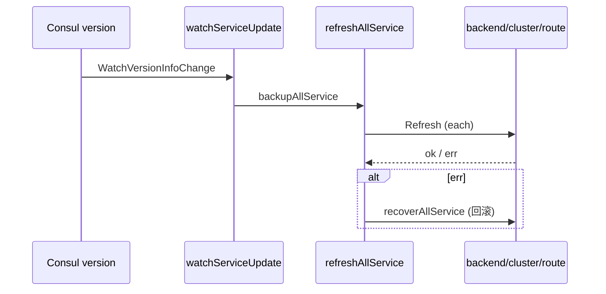

# HTTP 接入与全局协调

<cite>
**本文引用的文件**
- [http/http.go](file://bkmonitor-datalink/pkg/influxdb-proxy/http/http.go)
- [http/handler.go](file://bkmonitor-datalink/pkg/influxdb-proxy/http/handler.go)
- [http/watch.go](file://bkmonitor-datalink/pkg/influxdb-proxy/http/watch.go)
- [http/decorator.go](file://bkmonitor-datalink/pkg/influxdb-proxy/http/decorator.go)
- [http/rebalance.go](file://bkmonitor-datalink/pkg/influxdb-proxy/http/rebalance.go)
- [http/config.go](file://bkmonitor-datalink/pkg/influxdb-proxy/http/config.go)
- [http/metric.go](file://bkmonitor-datalink/pkg/influxdb-proxy/http/metric.go)
- [http/auth/define.go](file://bkmonitor-datalink/pkg/influxdb-proxy/http/auth/define.go)
- [http/auth/basic.go](file://bkmonitor-datalink/pkg/influxdb-proxy/http/auth/basic.go)
</cite>

## 目录
1. [HTTP 服务与路由注册](#http-服务与路由注册)
2. [Handler 矩阵](#handler-矩阵)
3. [Decorator 链](#decorator-链)
4. [Watch 刷新与回滚](#watch-刷新与回滚)
5. [健康检查与 Switch](#健康检查与-switch)
6. [Rebalance](#rebalance)
7. [Prometheus 指标与鉴权](#prometheus-指标与鉴权)

## HTTP 服务与路由注册

`Service` 是 HTTP 接入层核心，持有 `mux`、全局 `lock`（重载时暂停所有服务）、`auth`、`available` 状态及四类 decorator 列表。`NewHTTPService` 先 `InitService` 装配各子包，再注册路由：`/query`、`/write`、`/create_database`、`/api/v2/query`、`/reload`、`/debug`、`/switch`、`/print`、`/metrics`（Prometheus）。每个业务路由都经 `decorate` 套上对应 decorator 链。

**章节来源**
- [http/http.go](file://bkmonitor-datalink/pkg/influxdb-proxy/http/http.go#L34-L56)
- [http/http.go](file://bkmonitor-datalink/pkg/influxdb-proxy/http/http.go#L65-L104)

## Handler 矩阵

各 Handler 直接对接下层：`QueryHandler` → `route.Query`、`WriteHandler` → `route.Write`、`CreateDBHandler` → `route.CreateDB`、`RawQueryHandler` → `route.RawQuery`；`ReloadHandler` 触发全量重载；`SwitchHandler` 切换服务可用状态；`PrintHandler` 聚合 `backend.Print + cluster.Print + route.Print` 输出当前拓扑。InfluxDB 兼容接口因此被完整暴露。

**章节来源**
- [http/handler.go](file://bkmonitor-datalink/pkg/influxdb-proxy/http/handler.go#L29-L274)

## Decorator 链

`decorate` 将 Handler 依次套上 decorator 列表（顺序从前到后，最后一个最先执行）。装饰器类型包括：入口装饰器（处理 http 锁与关闭 body）、panic 恢复、可用性校验、鉴权、方法校验等。这样可将横切关注点（认证 / 可用性 / 方法 / 异常保护）与业务逻辑解耦，新增校验只需追加 decorator。

**章节来源**
- [http/decorator.go](file://bkmonitor-datalink/pkg/influxdb-proxy/http/decorator.go#L24-L55)

## Watch 刷新与回滚

`watchServiceUpdate` 监听 consul 版本变化，一旦触发即执行 `backupAllService`（备份 backend/cluster/route 当前状态）→ `refreshAllService`（依次 `Refresh` 三者）→ 失败则 `recoverAllService` 回滚到旧版本。全局 `lock` 保证刷新期间请求被阻塞，避免读到半更新状态。这是「配置热更新不中断服务」的关键机制。

**图表来源**
- [http/watch.go](file://bkmonitor-datalink/pkg/influxdb-proxy/http/watch.go#L26-L122)

**章节来源**
- [http/watch.go](file://bkmonitor-datalink/pkg/influxdb-proxy/http/watch.go#L26-L122)

## 健康检查与 Switch

`switchAvailable` 切换 consul 健康检查状态（`CheckPassing` / `CheckFail`），由 `SwitchHandler` 与刷新/回滚流程调用。`Shutdown` 负责优雅停止。健康检查与 switch 配合，使实例在配置刷新、数据回滚期间从 consul 服务列表摘除，流量不打向不稳定实例。

**章节来源**
- [http/handler.go](file://bkmonitor-datalink/pkg/influxdb-proxy/http/handler.go#L29-L50)
- [http/http.go](file://bkmonitor-datalink/pkg/influxdb-proxy/http/http.go#L112-L115)

## Rebalance

`Rebalance` 在获取 tag 全局锁（`consul.GetTagLock`）后，对全部集群的 tag 路由重新均衡：`rebalanceByCluster` 遍历各 tag，调用 `common.GenerateBackendRoute` 按当前主机列表重算读写后端，通过 `consul.ModifyTagInfo` 将差异写入（旧后端置 `UnreadableHost`、待删置 `DeleteHostList`、状态置 `Changed`），并 `NotifyTagChanged` 通知各实例刷新。全局锁保证 rebalance 与 transport 串行，避免并发迁移冲突。

**章节来源**
- [http/rebalance.go](file://bkmonitor-datalink/pkg/influxdb-proxy/http/rebalance.go#L57-L120)

## Prometheus 指标与鉴权

`metric.go` 暴露 `httpRequest` / `upRecord` / `aliveConsul` 等指标，并区分 consul 存活 `ConsulAliveUp` / `ConsulAliveDown`。鉴权方面，`auth.Auth` 接口由 `basic.go` 的 `BasicAuth.Check` 实现，作为 decorator 注入到受保护路由。基础认证信息存于 `Service.auth`，与 config/decorator 协同完成访问控制。

**章节来源**
- [http/metric.go](file://bkmonitor-datalink/pkg/influxdb-proxy/http/metric.go#L19-L42)
- [http/auth/define.go](file://bkmonitor-datalink/pkg/influxdb-proxy/http/auth/define.go#L17-L17)
- [http/auth/basic.go](file://bkmonitor-datalink/pkg/influxdb-proxy/http/auth/basic.go#L37-L37)
