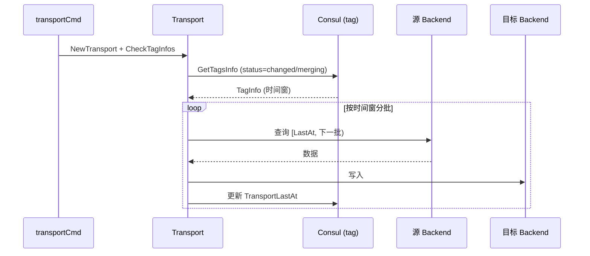

# 数据迁移 Transport

<cite>
**本文引用的文件**
- [transport/transport.go](file://bkmonitor-datalink/pkg/influxdb-proxy/transport/transport.go)
- [transport/influxdb.go](file://bkmonitor-datalink/pkg/influxdb-proxy/transport/influxdb.go)
- [transport/const.go](file://bkmonitor-datalink/pkg/influxdb-proxy/transport/const.go)
- [transport/error.go](file://bkmonitor-datalink/pkg/influxdb-proxy/transport/error.go)
- [cmd/transport.go](file://bkmonitor-datalink/pkg/influxdb-proxy/cmd/transport.go)
</cite>

## 目录
1. [Transport 定位与触发](#transport-定位与触发)
2. [迁移计划与执行](#迁移计划与执行)
3. [与 Consul / Backend 的关系](#与-consul--backend-的关系)

## Transport 定位与触发

`transport` 是一个**独立子命令**（非 proxy 主进程），用于 tag 维度的数据重平衡迁移：当 rebalance 将某 tag 的读写后端调整后，旧后端上已写入的数据需迁移 / 合并到新后端。`cmd/transport.go` 的 `transportCmd` 周期性触发 `NewTransport` + `CheckTagInfos`，扫描 consul 中处于 `changed` / `merging` 状态的 tag 并执行迁移。

**章节来源**
- [cmd/transport.go](file://bkmonitor-datalink/pkg/influxdb-proxy/cmd/transport.go#L26-L93)
- [transport/transport.go](file://bkmonitor-datalink/pkg/influxdb-proxy/transport/transport.go#L28-L45)

## 迁移计划与执行

`Transport` 持有各 backend 的 InfluxDB client（`clientMap`）、查询时间窗（`queryDuration`）、批量参数。`getClientInstance` 按 `consul.HostInfo` 构造客户端；`makeMergePlan` 依据 `consul.TagInfo`（源 `HostList`、迁移时间戳 `TransportStartAt` / `LastAt` / `FinishAt`）生成合并计划，从源 backend 按时间窗查询数据并写入目标 backend，逐步推进 `TransportLastAt` 直至 `FinishAt` 完成迁移。

**图表来源**
- [transport/transport.go](file://bkmonitor-datalink/pkg/influxdb-proxy/transport/transport.go#L48-L60)
- [cmd/transport.go](file://bkmonitor-datalink/pkg/influxdb-proxy/cmd/transport.go#L26-L93)

**章节来源**
- [transport/transport.go](file://bkmonitor-datalink/pkg/influxdb-proxy/transport/transport.go#L48-L60)
- [transport/influxdb.go](file://bkmonitor-datalink/pkg/influxdb-proxy/transport/influxdb.go#L1-L60)

## 与 Consul / Backend 的关系

Transport 是「配置（consul tag）」与「数据（backend）」之间的执行者：`CheckTagInfos` 读取 consul 中 rebalance 标记的 tag，按 `TagInfo` 的时间窗与主机列表驱动迁移；迁移进度（`TransportLastAt`）回写 consul，使 proxy 各实例能感知迁移状态并逐步将读流量切到目标后端。它与 `http.Rebalance` 共用 `common.GenerateBackendRoute` 的路由口径，确保「计划」与「实际路由」一致。

**章节来源**
- [transport/transport.go](file://bkmonitor-datalink/pkg/influxdb-proxy/transport/transport.go#L54-L60)
- [consul/tag.go](file://bkmonitor-datalink/pkg/influxdb-proxy/consul/tag.go#L42-L74)
