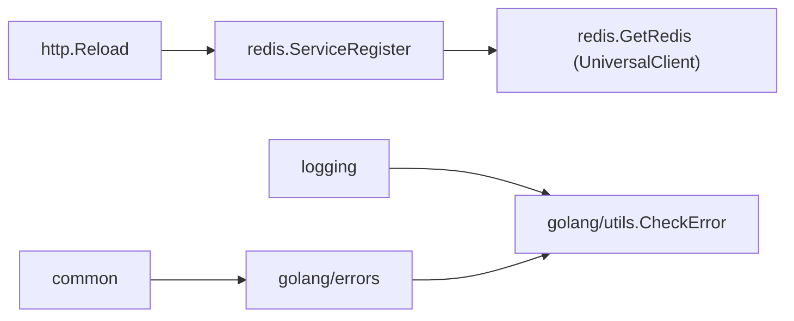

# 缓存与基础件

<cite>
**本文引用的文件**
- [redis/redis.go](file://bkmonitor-datalink/pkg/influxdb-proxy/redis/redis.go)
- [redis/setting.go](file://bkmonitor-datalink/pkg/influxdb-proxy/redis/setting.go)
- [golang/errors/define.go](file://bkmonitor-datalink/pkg/influxdb-proxy/golang/errors/define.go)
- [golang/utils/errors.go](file://bkmonitor-datalink/pkg/influxdb-proxy/golang/utils/errors.go)
- [golang/utils/print.go](file://bkmonitor-datalink/pkg/influxdb-proxy/golang/utils/print.go)
</cite>

## 目录
1. [Redis 缓存客户端](#redis-缓存客户端)
2. [错误包装与多错误聚合](#错误包装与多错误聚合)
3. [调用关系速查](#调用关系速查)

## Redis 缓存客户端

`redis` 包基于 `go-redis` 与项目 `utils/register/redis` 初始化全局 Redis 客户端，支持 standalone / sentinel 模式。`ServiceRegister` 在 `http.Reload` 中被调用以重建连接；`loadRedis` 从 viper 读取 mode / host / port / sentinel / 超时等配置；`GetRedis` 返回 `UniversalClient` 供上层（如缓存路由或限流）使用。`setting.go` 定义配置路径常量与默认值。

**章节来源**
- [redis/redis.go](file://bkmonitor-datalink/pkg/influxdb-proxy/redis/redis.go#L29-L72)
- [redis/setting.go](file://bkmonitor-datalink/pkg/influxdb-proxy/redis/setting.go#L18-L49)

## 错误包装与多错误聚合

`golang/errors` 重导出 `pkg/errors` 的 `Wrapf` / `Wrap` / `New` / `Errorf` / `Cause` / `WithStack` / `WithMessage*`，统一项目错误栈语义。`golang/utils/errors.go` 提供：`CheckError`（出错即 panic）、`RecoverError`（recover 后回调）、`MultiErrors`（多错误聚合，`Add` / `AsError` / `Error`）与 `NewMultiErrors`。二者被广泛用于各子包的错误处理与并发聚合，保证错误链可追溯。

**章节来源**
- [golang/errors/define.go](file://bkmonitor-datalink/pkg/influxdb-proxy/golang/errors/define.go#L20-L59)
- [golang/utils/errors.go](file://bkmonitor-datalink/pkg/influxdb-proxy/golang/utils/errors.go#L20-L70)

## 调用关系速查

**图表来源**
- [redis/redis.go](file://bkmonitor-datalink/pkg/influxdb-proxy/redis/redis.go#L29-L34)
- [golang/utils/errors.go](file://bkmonitor-datalink/pkg/influxdb-proxy/golang/utils/errors.go#L20-L24)

**章节来源**
- [redis/redis.go](file://bkmonitor-datalink/pkg/influxdb-proxy/redis/redis.go#L29-L34)
- [golang/utils/errors.go](file://bkmonitor-datalink/pkg/influxdb-proxy/golang/utils/errors.go#L20-L24)
