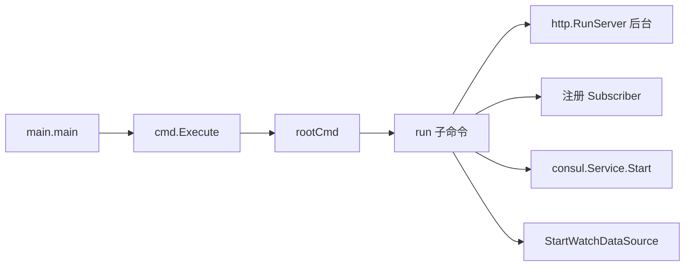
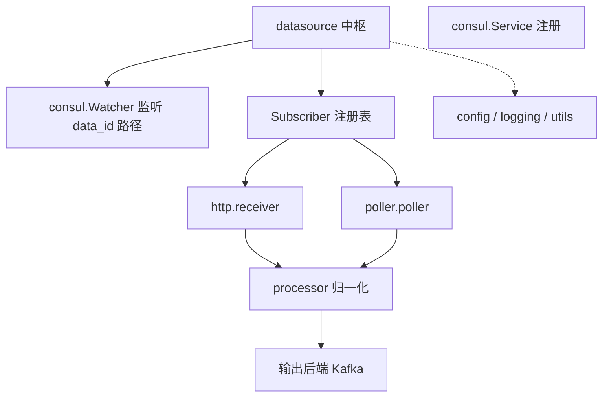
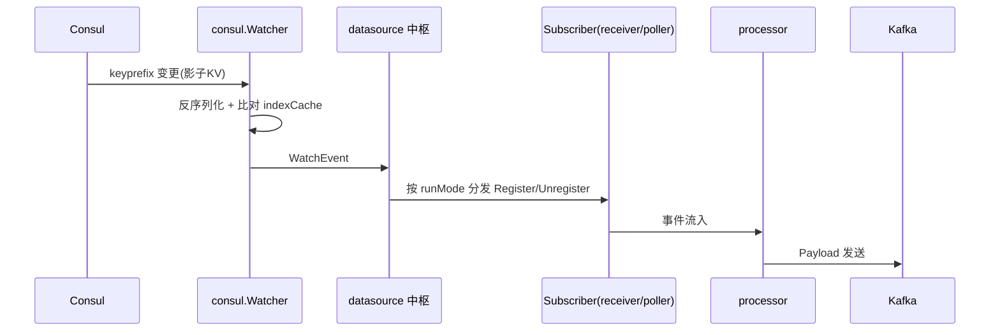

<!-- [待审核] AI 自动生成，请人工确认后移除此标记 -->
# ingester 模块概览与架构

<cite>
- [main.go](file://bkmonitor-datalink/pkg/ingester/main.go)
- [cmd/root.go](file://bkmonitor-datalink/pkg/ingester/cmd/root.go)
- [cmd/run.go](file://bkmonitor-datalink/pkg/ingester/cmd/run.go)
</cite>

## 目录
- [模块定位](#模块定位)
- [启动链路](#启动链路)
- [组件地图](#组件地图)
- [核心数据流](#核心数据流)
- [子包一览](#子包一览)
- [在 data-link 中的角色](#在-data-link-中的角色)

## 模块定位

`ingester` 是蓝鲸监控 **BkFtaSolution 事件接入服务**：从第三方系统**接收（push）**或**主动拉取（pull）**事件数据，归一化为统一的 `Payload` 后发送到 Kafka。其 `Short` 描述为 `BkFtaSolution Event Ingester`，`Long` 描述为 `Receive and pull event from 3rd system`。它支持以 `receiver` / `poller` / `all` 三种运行模式独立部署，依赖 Consul 做服务注册、DataID 配置下发与订阅协调。

**章节来源**
- [cmd/root.go](file://bkmonitor-datalink/pkg/ingester/cmd/root.go#L19-L23)

## 启动链路

程序从 `main()` 调用 `cmd.Execute()` 启动 cobra 命令树；根命令 `rootCmd` 注册 `-c/--config` 全局参数（默认 `ingester.yaml`）。`run` 子命令（`Use: run [all,receiver,poller]`）的 `Run` 直接 `go http.RunServer()` 并 `waitForSignal()`；`PersistentPreRun` 完成 `config.Init()` / `logging.Init()` / `ServiceID` 初始化；`PreRunE` 依据运行模式注册 `receiver`/`poller` 订阅者、将自身注册到 Consul 并 `StartWatchDataSource()`；`PostRunE` 停止监听并注销 Consul。

**图表来源**
- [main.go](file://bkmonitor-datalink/pkg/ingester/main.go#L17-L19)
- [cmd/run.go](file://bkmonitor-datalink/pkg/ingester/cmd/run.go#L32-L41)

**章节来源**
- [main.go](file://bkmonitor-datalink/pkg/ingester/main.go#L17-L19)
- [cmd/root.go](file://bkmonitor-datalink/pkg/ingester/cmd/root.go#L25-L35)
- [cmd/run.go](file://bkmonitor-datalink/pkg/ingester/cmd/run.go#L42-L90)

## 组件地图

`ingester` 以 `datasource` 包为中枢，对外通过 Consul（`consul` 包）完成服务注册与 DataID 配置下发，对内由 `http`（receiver 接收端）与 `poller`（主动拉取端）两个订阅者消费 DataID 事件，二者经 `processor` 归一化后由输出后端发往 Kafka；`define` / `config` / `logging` / `utils` 为基础设施层。

**图表来源**
- [datasource/datasource.go](file://bkmonitor-datalink/pkg/ingester/datasource/datasource.go#L20-L35)
- [cmd/run.go](file://bkmonitor-datalink/pkg/ingester/cmd/run.go#L61-L87)
- [consul/service.go](file://bkmonitor-datalink/pkg/ingester/consul/service.go#L46-L79)

**章节来源**
- [datasource/datasource.go](file://bkmonitor-datalink/pkg/ingester/datasource/datasource.go#L20-L35)
- [cmd/run.go](file://bkmonitor-datalink/pkg/ingester/cmd/run.go#L61-L87)
- [consul/service.go](file://bkmonitor-datalink/pkg/ingester/consul/service.go#L33-L79)

## 核心数据流

1. Consul 上由调度侧写入该实例专属的 `data_id/<ServiceID>` 影子目录（shadow KV），`Watcher` 以 `keyprefix` 监听变更；
2. `Watcher` 反序列化影子 KV 得到真实 DataSource，比对 `indexCache` 生成 `WatchEvent`（Added/Modified/Deleted）；
3. `datasource.StartWatchDataSource` 按 `PluginRunMode`（push/pull）过滤后分发给对应 `Subscriber`；
4. `receiver`/`poller` 据此 `RegisterFn`/`UnregisterFn` 建立或拆除采集任务，事件经 `processor` 归一化为 `Payload` 发往 Kafka。

**图表来源**
- [consul/watcher.go](file://bkmonitor-datalink/pkg/ingester/consul/watcher.go#L52-L123)
- [datasource/datasource.go](file://bkmonitor-datalink/pkg/ingester/datasource/datasource.go#L38-L80)
- [define/payload.go](file://bkmonitor-datalink/pkg/ingester/define/payload.go#L21-L39)

**章节来源**
- [consul/watcher.go](file://bkmonitor-datalink/pkg/ingester/consul/watcher.go#L27-L123)
- [datasource/datasource.go](file://bkmonitor-datalink/pkg/ingester/datasource/datasource.go#L38-L92)
- [define/payload.go](file://bkmonitor-datalink/pkg/ingester/define/payload.go#L21-L39)

## 子包一览

| 子包 | 职责 |
|------|------|
| `cmd` | cobra 命令树（`root`/`run`/`cluster`/`shadow`/`version`），启动与运行模式分发 |
| `config` | 全局配置（`Http`/`Logging`/`Consul`）加载、校验与路径解析 |
| `define` | 领域模型：`DataSource`/`Plugin`/`Payload`/`ServiceInfo`/`HttpResponse` 与工具 |
| `consul` | Consul 客户端、服务注册、DataID 影子 KV 监听与分发调度（`Dispatcher`） |
| `datasource` | 订阅者注册表与 `StartWatchDataSource` 事件分发中枢 |
| `http` | receiver HTTP 接收端（gin 路由、`receiver`、`routers`、`runner`） |
| `poller` | 主动拉取端（任务调度、分页、腾讯签名、时间生成） |
| `processor` | 事件归一化为 `Payload` 的处理链 |
| `logging` | 日志初始化 |
| `utils` | 哈希、路径解析、UUID、一致性哈希均衡等公共工具 |
| `monitor` | 指标/监控辅助 |

**章节来源**
- [cmd/root.go](file://bkmonitor-datalink/pkg/ingester/cmd/root.go#L18-L29)
- [config/config.go](file://bkmonitor-datalink/pkg/ingester/config/config.go#L22-L79)
- [define/datasource.go](file://bkmonitor-datalink/pkg/ingester/define/datasource.go#L29-L61)

## 在 data-link 中的角色

`ingester` 位于 data-link 体系的**事件接入层**：上接蓝鲸管控平台 / 第三方系统（BkFtaSolution）推送或拉取事件，下接 Kafka（`bk_fta_event` ETL 通道），为后端告警 / 故障自愈（Fta）提供归一化事件流。它与 `operator` 的关系是：`operator` 负责按监控 CRD 生成采集子配置下发给采集器集群，而 `ingester` 专注第三方事件接入，二者通过 Consul + DataID 元数据解耦协作。

**章节来源**
- [define/datasource.go](file://bkmonitor-datalink/pkg/ingester/define/datasource.go#L18-L36)
- [config/consul.go](file://bkmonitor-datalink/pkg/ingester/config/consul.go#L59-L60)
