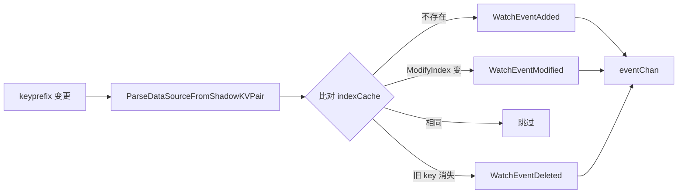
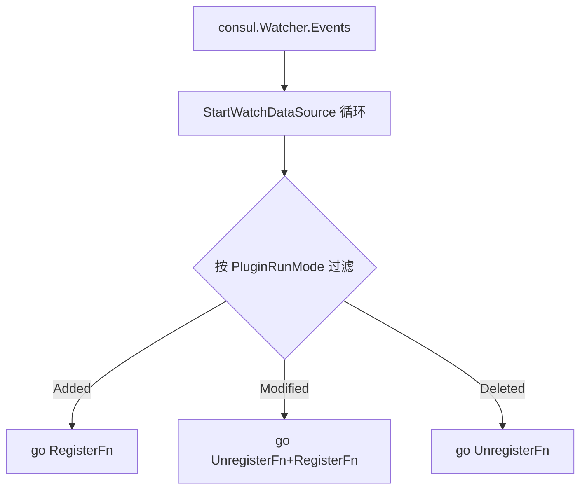
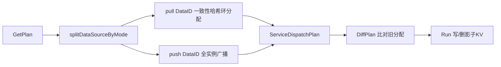

<!-- [待审核] AI 自动生成，请人工确认后移除此标记 -->
# ingester 数据源订阅与 Consul 协调

<cite>
- [consul/base.go](file://bkmonitor-datalink/pkg/ingester/consul/base.go)
- [consul/datasource.go](file://bkmonitor-datalink/pkg/ingester/consul/datasource.go)
- [consul/watcher.go](file://bkmonitor-datalink/pkg/ingester/consul/watcher.go)
- [consul/dispatcher.go](file://bkmonitor-datalink/pkg/ingester/consul/dispatcher.go)
- [consul/service.go](file://bkmonitor-datalink/pkg/ingester/consul/service.go)
- [datasource/datasource.go](file://bkmonitor-datalink/pkg/ingester/datasource/datasource.go)
</cite>

## 目录
- [模块定位](#模块定位)
- [Consul 客户端构建](#consul-客户端构建)
- [DataID 影子 KV 解析](#dataid-影子-kv-解析)
- [Watcher：keyprefix 监听与事件生成](#watcherkeyprefix-监听与事件生成)
- [datasource 中枢：订阅与分发](#datasource-中枢订阅与分发)
- [Dispatcher：DataID 一致性哈希分配](#dispatcherdataid-一致性哈希分配)
- [Service：服务注册与心跳](#service服务注册与心跳)

## 模块定位

本页聚焦 `ingester` 与 Consul 的协作：配置下发（DataID 影子 KV 监听）、事件分发（按 push/pull 模式注册订阅者）与实例协调（一致性哈希分配、服务注册）。核心由 `consul`（客户端 / Watcher / Dispatcher / Service）与 `datasource`（订阅中枢）两包完成。

**章节来源**
- [consul/watcher.go](file://bkmonitor-datalink/pkg/ingester/consul/watcher.go#L27-L32)
- [datasource/datasource.go](file://bkmonitor-datalink/pkg/ingester/datasource/datasource.go#L20-L35)

## Consul 客户端构建

`NewConfig()` 依据 `config.Configuration.Consul` 构建 `*consul.Config`：优先取 `HttpsPort`/`HttpPort`，否则 `Port`/`Scheme`；注入 `HttpAuth`（user/password）、`Token`（ACL）、`TLSConfig`（address/verify/key/cert/ca）。`NewClient()` 封装 `consul.NewClient` 供各子模块复用。

**章节来源**
- [consul/base.go](file://bkmonitor-datalink/pkg/ingester/consul/base.go#L20-L56)

## DataID 影子 KV 解析

Consul 上 DataID 以**影子 KV** 形式存储：value 是对原始 KVPair 的二次序列化。`ValidateDataSource` 解析 payload 并校验 `DataSource` 与 plugin 运行模式；`ListDataSources` 列出某前缀下全部 KV；`ConvertShadowKVPair` 对影子 value 再反序列化还原真实 KV；`ParseDataSourceFromKVPair` / `ParseDataSourceFromShadowKVPair` 产出 `DataSourceKVPair`；`GetServiceNameFromShadow` 从路径倒数第二段提取归属 service。

**章节来源**
- [consul/datasource.go](file://bkmonitor-datalink/pkg/ingester/consul/datasource.go#L23-L106)

## Watcher：keyprefix 监听与事件生成

`Watcher` 持 `watch.Plan`、`eventChan`（容量 = `Consul.EventBufferSize`）、`clientConfig` 与 `indexCache`。`NewConsulWatcher(prefix)` 以 `type=keyprefix` + `prefix` 构建 watch plan，其 `Handler` 遍历 KV：先 `ParseDataSourceFromShadowKVPair` 还原 DataSource，再比对 `indexCache` 的 `ModifyIndex` 判定 `WatchEventAdded`/`WatchEventModified`；未变则跳过；遍历结束后对 `indexCache` 中消失的 key 生成 `WatchEventDeleted`，并刷新 `indexCache`。`Start`/`Stop` 控制 plan 生命周期，`Events()` 暴露事件通道。

**图表来源**
- [consul/watcher.go](file://bkmonitor-datalink/pkg/ingester/consul/watcher.go#L52-L123)

**章节来源**
- [consul/watcher.go](file://bkmonitor-datalink/pkg/ingester/consul/watcher.go#L21-L123)

## datasource 中枢：订阅与分发

`datasource` 包维护全局 `subscribers` 映射（按 `receiver`/`poller` 命名）与 `watcher`。`RegisterDataSourceSubscriber(name, s)` 注册订阅者（`Subscriber` 含 `RegisterFn`/`UnregisterFn`/`ListDataSources`/`PluginRunMode`）。`StartWatchDataSource` 以 `ServicePath/data_id/<ServiceID>/` 为前缀建 `Watcher` 并后台 `Start`，循环从 `watcher.Events()` 取事件：按 `PluginRunMode` 过滤订阅者，对 Added/Modified/Deleted 分别 `RegisterFn` /（先 Unregister 再 Register）/ `UnregisterFn` 并 goroutine 派发。`StopWatchDataSource` 停止 watcher 并关闭通道。

**图表来源**
- [datasource/datasource.go](file://bkmonitor-datalink/pkg/ingester/datasource/datasource.go#L38-L92)

**章节来源**
- [datasource/datasource.go](file://bkmonitor-datalink/pkg/ingester/datasource/datasource.go#L20-L97)

## Dispatcher：DataID 一致性哈希分配

`Dispatcher`（持有 `DataSources`/`Services`/`DispatchedDataSources`/`client`）负责将 DataID 分配到各 ingester 实例。`splitDataSourceByMode` 按 `PluginRunMode` 分为 `receivers`(push) 与 `pollers`(pull)；`GetPlan` 仅对 **pull 类 DataID** 用一致性哈希环（`utils.Balance`）均分到各 service 节点，再为每个 service 追加全部 `receivers`（push 模式所有实例都接收）；`GetOldPlan` 从已下发影子路径还原旧分配；`DiffPlan` 比对新旧计划产出 `planToAdd`/`planToDelete`（含 `ModifyIndex` 不变则跳过）；`Run` 据此写入/清理影子 KV。

**图表来源**
- [consul/dispatcher.go](file://bkmonitor-datalink/pkg/ingester/consul/dispatcher.go#L25-L112)
- [consul/dispatcher.go](file://bkmonitor-datalink/pkg/ingester/consul/dispatcher.go#L129-L184)

**章节来源**
- [consul/dispatcher.go](file://bkmonitor-datalink/pkg/ingester/consul/dispatcher.go#L25-L184)

## Service：服务注册与心跳

`Service` 内嵌 `define.ServiceInfo`，含 `TTL`/`SessionBehavior`/`client`/`isLeader`/`heartbeatTicker`/`sessionID`/`check`。`NewService(tags)` 以 `ServiceID`/`Consul.ServiceName`/`Http.Host`/`Http.Port` 组装 `ServiceInfo`，tags 追加 `ingester-service`/`ingester`，Meta 写 `version`/`pid`/`service`/`module`，并建 TTL 存活检查。`Start` 顺序 `registerService` → `startHeartbeat`；`Stop` 顺序 `destroySession` → `stopHeartbeat` → `deregisterService`（会话行为 `Delete`，TTL 默认 `30s`）。leader 由 `MetaSessionLeaderKey="leader"` 标记。

**章节来源**
- [consul/service.go](file://bkmonitor-datalink/pkg/ingester/consul/service.go#L28-L119)
