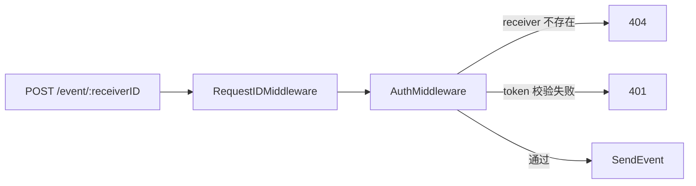
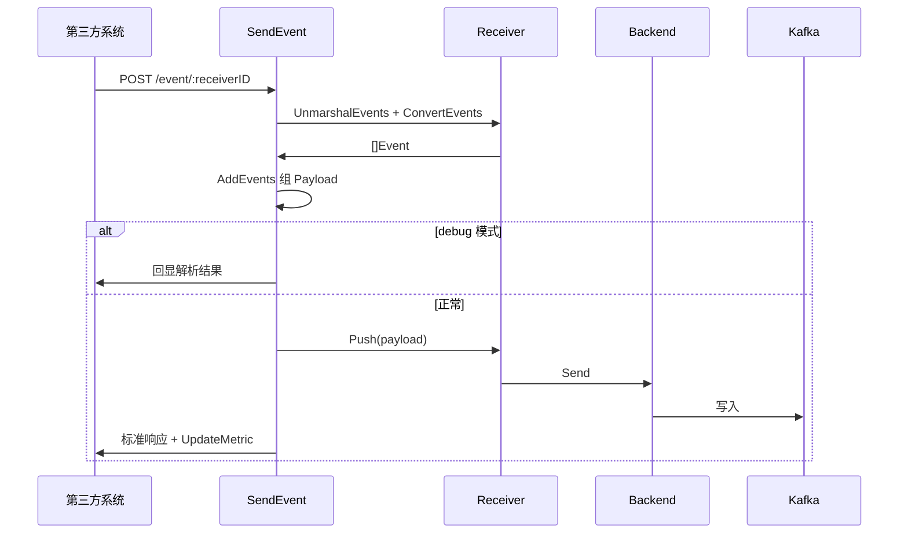

<!-- [待审核] AI 自动生成，请人工确认后移除此标记 -->
# ingester HTTP 接收端

<cite>
- [http/runner.go](file://bkmonitor-datalink/pkg/ingester/http/runner.go)
- [http/routers.go](file://bkmonitor-datalink/pkg/ingester/http/routers.go)
- [http/index.go](file://bkmonitor-datalink/pkg/ingester/http/index.go)
- [http/receiver.go](file://bkmonitor-datalink/pkg/ingester/http/receiver.go)
- [http/middlewares.go](file://bkmonitor-datalink/pkg/ingester/http/middlewares.go)
- [define/plugin_http_push.go](file://bkmonitor-datalink/pkg/ingester/define/plugin_http_push.go)
</cite>

## 目录
- [模块定位](#模块定位)
- [HTTP 服务启动](#http-服务启动)
- [路由与中间件](#路由与中间件)
- [Receiver：push 插件运行体](#receiverpush-插件运行体)
- [事件接收链路 SendEvent](#事件接收链路-sendevent)
- [Receiver 注册表与订阅者](#receiver-注册表与订阅者)
- [调试与自省接口](#调试与自省接口)

## 模块定位

`http` 包是 ingester 的 **receiver（push）接收端**：以 gin 提供 HTTP 服务，接收第三方系统主动推送的事件数据，经反序列化、JMESPath 提取、归一化为 `Payload` 后交由 `processor` 后端发往 Kafka。它以 `Subscriber`（`PluginRunMode = Push`）身份注册到 `datasource` 中枢，按 DataID 事件动态增删 `Receiver`。

**章节来源**
- [http/receiver.go](file://bkmonitor-datalink/pkg/ingester/http/receiver.go#L27-L47)
- [http/receiver.go](file://bkmonitor-datalink/pkg/ingester/http/receiver.go#L203-L208)

## HTTP 服务启动

`RunServer()` 由 `run` 子命令 `go http.RunServer()` 拉起：按 `Http.Debug` 设置 gin 模式，创建 `gin.Default()` engine，接入 `ginprometheus`（Prometheus 指标）与 `ginzap`（zap 日志 + panic 恢复）中间件，调用 `route(engine)` 注册路由后 `engine.Run(GetBindAddress())` 监听。

**章节来源**
- [http/runner.go](file://bkmonitor-datalink/pkg/ingester/http/runner.go#L24-L53)

## 路由与中间件

`route(engine)` 注册：`GET /ping`（存活）、`GET /plugin`（插件列表）、`GET /poller`（拉取任务列表）、`GET /receiver`（接收器列表）；`/event` 路由组挂载 `RequestIDMiddleware` + `AuthMiddleware`，暴露 `POST /event/:receiverID/`（含带/不带尾斜杠两种）投递事件。中间件：`AuthMiddleware` 依 `receiverID` 找 `Receiver` 并校验 `X-Bk-Fta-Token`（不存在返回 404，token 错误返回 401）；`RequestIDMiddleware` 注入请求 ID；`ErrorHandler` 兜底 panic 转 500。

**图表来源**
- [http/routers.go](file://bkmonitor-datalink/pkg/ingester/http/routers.go#L16-L28)
- [http/middlewares.go](file://bkmonitor-datalink/pkg/ingester/http/middlewares.go#L23-L45)

**章节来源**
- [http/routers.go](file://bkmonitor-datalink/pkg/ingester/http/routers.go#L16-L28)
- [http/middlewares.go](file://bkmonitor-datalink/pkg/ingester/http/middlewares.go#L23-L61)

## Receiver：push 插件运行体

`Receiver`（`DataSource` + `HttpPushPlugin` + `Backend` + `unmarshalFn` + `compiledEventsPath`）是单个 push 插件的运行体。`HttpPushPlugin` 继承 `Plugin`，增 `source_format`/`multiple_events`/`events_path`。`Init()` 编译 `EventsPath`（JMESPath）并按 `SourceFormat` 选择反序列化函数；`UnmarshalEvents` 反序列化原始字节；`ConvertEvents` 按 `EventsPath`/`MultipleEvents` 提取事件列表；`Push` 组装 `Payload`（补 PluginID/DataID）经 `Backend.Send` 发送；`CheckAuth` 比对 token；`UpdateMetric` 更新 `EventCounter`。

**章节来源**
- [http/receiver.go](file://bkmonitor-datalink/pkg/ingester/http/receiver.go#L27-L120)
- [define/plugin_http_push.go](file://bkmonitor-datalink/pkg/ingester/define/plugin_http_push.go#L16-L36)

## 事件接收链路 SendEvent

`SendEvent` 处理器：读取请求 body → `GetReceiver(receiverID)` → `UnmarshalEvents` 反序列化 → `ConvertEvents` 类型转换 → 组 `Payload`（`AddEvents` 注入事件 ID，`ignore_result` 决定异步）→ 若 `debug` 查询参数存在则仅回显解析结果，否则 `r.Push(payload)` 发送 → 按结果 `UpdateMetric` 并返回标准响应。各阶段失败均返回对应 HTTP 状态与失败响应。

**图表来源**
- [http/index.go](file://bkmonitor-datalink/pkg/ingester/http/index.go#L31-L88)

**章节来源**
- [http/index.go](file://bkmonitor-datalink/pkg/ingester/http/index.go#L31-L88)

## Receiver 注册表与订阅者

全局 `receiverRegistry`（带 `RWMutex`）以 `receiverID` 索引 `Receiver`。`GetReceiverID` 规则：`<plugin_id>_<data_id>`，全局插件（bk_biz_id=0）仅用 `plugin_id`。`RegisterReceiver` 校验运行模式为 push → 建 `Backend` → 组 `Receiver` 并 `Init` → 入表；`UnregisterReceiver` 关闭 backend 并从表删除；`ListDataSources` 汇总当前数据源。`Subscriber` 绑定 `RegisterReceiver`/`UnregisterReceiver`/`ListDataSources`，`PluginRunMode = Push`，由 `run` 子命令注册进 `datasource` 中枢。

**章节来源**
- [http/receiver.go](file://bkmonitor-datalink/pkg/ingester/http/receiver.go#L122-L208)

## 调试与自省接口

`Ping` 返回 `pong`；`Plugin` 遍历所有订阅者的数据源，输出 `bk_data_id`/`plugin_id`/`plugin_type`/`backend_type`；`PollerTask` 列出 `poller` 已注册任务；`ReceiverTask` 列出 `receiverRegistry` 中接收器。这些 GET 接口用于运行态自省与排障。

**章节来源**
- [http/index.go](file://bkmonitor-datalink/pkg/ingester/http/index.go#L24-L29)
- [http/index.go](file://bkmonitor-datalink/pkg/ingester/http/index.go#L90-L135)
