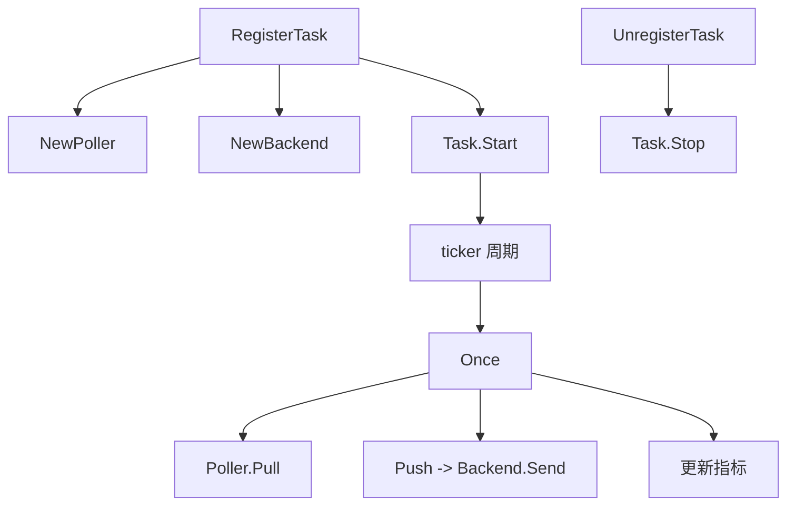
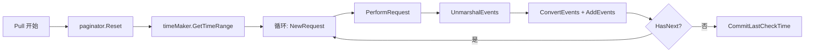

<!-- [待审核] AI 自动生成，请人工确认后移除此标记 -->
# ingester 主动轮询拉取端

<cite>
- [poller/poller.go](file://bkmonitor-datalink/pkg/ingester/poller/poller.go)
- [poller/task.go](file://bkmonitor-datalink/pkg/ingester/poller/task.go)
- [poller/poller_http.go](file://bkmonitor-datalink/pkg/ingester/poller/poller_http.go)
- [poller/paginator.go](file://bkmonitor-datalink/pkg/ingester/poller/paginator.go)
- [poller/context.go](file://bkmonitor-datalink/pkg/ingester/poller/context.go)
- [poller/time_maker.go](file://bkmonitor-datalink/pkg/ingester/poller/time_maker.go)
- [poller/tencent_signature.go](file://bkmonitor-datalink/pkg/ingester/poller/tencent_signature.go)
- [define/plugin_http_pull.go](file://bkmonitor-datalink/pkg/ingester/define/plugin_http_pull.go)
</cite>

## 目录
- [模块定位](#模块定位)
- [Poller 接口与注册表](#poller-接口与注册表)
- [Task：拉取任务生命周期](#task拉取任务生命周期)
- [HttpPoller：HTTP 拉取核心](#httppollerhttp-拉取核心)
- [请求构造与鉴权](#请求构造与鉴权)
- [分页器 Paginator](#分页器-paginator)
- [时间窗口 TimeMaker](#时间窗口-timemaker)
- [腾讯云 API 签名](#腾讯云-api-签名)

## 模块定位

`poller` 包是 ingester 的 **poller（pull）主动拉取端**：以定时任务周期性地向第三方 HTTP API 发起请求，翻页拉取事件，归一化为 `Payload` 发往 Kafka。它以 `Subscriber`（`PluginRunMode = Pull`）身份注册到 `datasource` 中枢，按 DataID 事件动态增删 `Task`。

**章节来源**
- [poller/task.go](file://bkmonitor-datalink/pkg/ingester/poller/task.go#L26-L33)
- [poller/task.go](file://bkmonitor-datalink/pkg/ingester/poller/task.go#L238-L243)

## Poller 接口与注册表

`Poller` 接口定义 `Pull() (Payload, error)` 与 `GetInterval() int`。`pollerRegistry` 以 `plugin_type` 索引 `NewPollerFn` 工厂；`NewPoller(d)` 依 DataSource 的 plugin 类型选工厂构建；`RegisterPoller(name, fn)` 注册。当前实现由 `poller_http.go` 的 `init()` 注册 `http_pull`。

**章节来源**
- [poller/poller.go](file://bkmonitor-datalink/pkg/ingester/poller/poller.go#L18-L41)
- [poller/poller_http.go](file://bkmonitor-datalink/pkg/ingester/poller/poller_http.go#L357-L359)

## Task：拉取任务生命周期

`Task`（`DataSource` + `Poller` + `Plugin` + `Backend` + `ticker` + `done`）封装单个拉取任务。`Start` 以 `Poller.GetInterval()` 秒建 ticker，goroutine 内先立即 `Once()` 再周期 `Once()`，`RecoverError` 兜底 panic；`Once` = `Poller.Pull()` → `Push()` → 更新 `EventCounter`/`PollerCounter` 指标；`Stop` 停 ticker、关 done、关 backend；`IsRunning` 以 ticker 非空判定。任务注册表 `taskRegistry`（`RWMutex`）以 `GetTaskID`（`<plugin_id>_<data_id>`，全局插件仅 plugin_id）索引；`RegisterTask`/`UnregisterTask` 与 `Subscriber`（`PluginRunMode = Pull`）对接 `datasource` 分发。

**图表来源**
- [poller/task.go](file://bkmonitor-datalink/pkg/ingester/poller/task.go#L73-L143)
- [poller/task.go](file://bkmonitor-datalink/pkg/ingester/poller/task.go#L173-L228)

**章节来源**
- [poller/task.go](file://bkmonitor-datalink/pkg/ingester/poller/task.go#L26-L243)

## HttpPoller：HTTP 拉取核心

`HttpPoller`（`DataSource` + `HttpPullPlugin` + `client` + `timeMaker` + `paginator` + `unmarshalFn` + 编译后的 JMESPath）实现 `Poller`。`Init` 建 `http.Client`（超时）、按 `Pagination.Type` 选分页器（limit_offset / page_number / nil）、建 `TimeMaker`、编译 `EventsPath`/`TotalPath`。`Pull` 主循环：重置分页器 → 取时间窗口 → 逐页 `NewRequest`→`PerformRequest`→`UnmarshalEvents`→`ConvertEvents`→`AddEvents`，按 `TotalPath` 设置总数（无则设为 MaxSize），直到 `!HasNext()`，最后 `CommitLastCheckTime` 落地拉取时间。

**图表来源**
- [poller/poller_http.go](file://bkmonitor-datalink/pkg/ingester/poller/poller_http.go#L45-L120)
- [poller/poller_http.go](file://bkmonitor-datalink/pkg/ingester/poller/poller_http.go#L127-L172)

**章节来源**
- [poller/poller_http.go](file://bkmonitor-datalink/pkg/ingester/poller/poller_http.go#L30-L172)

## 请求构造与鉴权

`HttpPullPlugin`（继承 `Plugin`）含事件解析（source_format/multiple_events/events_path）、请求内容（url/method/headers/query_params/body/authorize/pagination）与调度（interval/overlap/timeout/time_format），默认 interval=60、overlap=10、timeout=60、time_format=epoch_second。`NewRequest` 按 `Body.DataType` 构造 form_data（multipart）/ x_www_form_urlencoded / 其他（直接渲染 Content）请求体，注入 URL 参数、Content-Type、自定义请求头，并按 `Authorize.Type` 处理 basic_auth / bearer_token / tencent_auth 三类鉴权；所有值经 `Context.Render` 做 `{{var}}` 模板替换（时间、分页变量注入）。

**章节来源**
- [define/plugin_http_pull.go](file://bkmonitor-datalink/pkg/ingester/define/plugin_http_pull.go#L16-L127)
- [poller/poller_http.go](file://bkmonitor-datalink/pkg/ingester/poller/poller_http.go#L174-L279)
- [poller/context.go](file://bkmonitor-datalink/pkg/ingester/poller/context.go#L17-L32)

## 分页器 Paginator

`Paginator` 接口（`SetTotalToMax`/`SetTotal`/`GetAndNext`/`Reset`/`HasNext`）由 `BasePaginator` 提供公共状态（MaxSize/PageSize/total）。三种实现：`PageNumberPaginator` 产出 `page`/`page_size` 变量、按页码递进；`LimitOffsetPaginator` 产出 `offset`/`limit` 变量、按偏移递进；`NilPaginator` 不翻页（`HasNext` 恒 false）。`HasNext` 综合 total 与 MaxSize 上限判定是否继续。

**章节来源**
- [poller/paginator.go](file://bkmonitor-datalink/pkg/ingester/poller/paginator.go#L16-L112)

## 时间窗口 TimeMaker

`TimeMaker`（DataID/Interval/Format/Overlap + begin/end）负责生成拉取时间窗口并做断点续拉。`GetTimeRange` 以 `Interval` 对齐 endTime，`getBeginTime` 从 Consul 的 `GetDataIDContextPath(dataID)` 读上次 `last_check_time`：超过 `MaxIntervalMinutes`(30 分钟) 取最大窗口，否则取 lastCheckTime 与「一个周期+overlap」的较早者。`CommitLastCheckTime` 将 endTime 写回 Consul，实现进程重启后的续拉。时间格式由 `define.FormatTimeByLayout` 支持 epoch_* 与 rfc/date 等多种 layout。

**章节来源**
- [poller/time_maker.go](file://bkmonitor-datalink/pkg/ingester/poller/time_maker.go#L24-L131)
- [define/time.go](file://bkmonitor-datalink/pkg/ingester/define/time.go#L61-L92)

## 腾讯云 API 签名

`tencent_signature.go` 实现腾讯云 TC3-HMAC-SHA256 签名。`GenerateAuthorization` 四步：构造规范请求串 → 拼接待签名串（含 credentialScope）→ 逐级 HMAC 派生签名密钥并计算 signature → 组装 `Authorization` 头。`SetTencentAuth` 解析 endpoint host，生成时间戳与授权头，注入 `Host`/`X-TC-Timestamp`/`X-TC-Action`/`X-TC-Version`/`X-TC-Region`/`Authorization`，供 `NewRequest` 的 `tencent_auth` 分支调用。

**章节来源**
- [poller/tencent_signature.go](file://bkmonitor-datalink/pkg/ingester/poller/tencent_signature.go#L37-L128)
