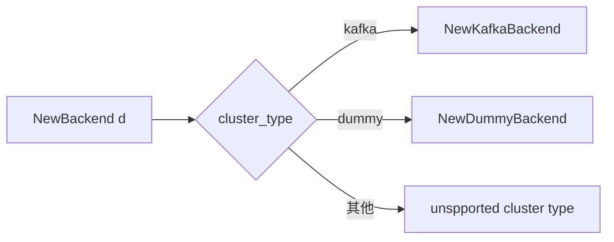
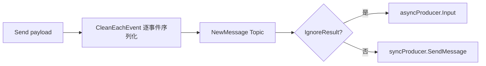

<!-- [待审核] AI 自动生成，请人工确认后移除此标记 -->
# ingester 输出后端

<cite>
- [processor/backend.go](file://bkmonitor-datalink/pkg/ingester/processor/backend.go)
- [processor/backend_kafka.go](file://bkmonitor-datalink/pkg/ingester/processor/backend_kafka.go)
- [processor/backend_dummy.go](file://bkmonitor-datalink/pkg/ingester/processor/backend_dummy.go)
- [define/datasource_kafka.go](file://bkmonitor-datalink/pkg/ingester/define/datasource_kafka.go)
- [define/payload.go](file://bkmonitor-datalink/pkg/ingester/define/payload.go)
</cite>

## 目录
- [模块定位](#模块定位)
- [IBackend 接口与注册表](#ibackend-接口与注册表)
- [Kafka 后端](#kafka-后端)
- [Kafka 数据源模型](#kafka-数据源模型)
- [Dummy 后端](#dummy-后端)
- [Payload 序列化衔接](#payload-序列化衔接)

## 模块定位

`processor` 包是 ingester 的**输出后端层**：定义统一的 `IBackend` 发送接口，通过注册表按数据源 `cluster_type` 动态选择后端实现（`kafka` / `dummy`），供 receiver 与 poller 两端复用，将归一化后的 `Payload` 投递到消息队列。

**章节来源**
- [processor/backend.go](file://bkmonitor-datalink/pkg/ingester/processor/backend.go#L18-L35)

## IBackend 接口与注册表

`IBackend` 接口定义 `Send(payload Payload) error` 与 `Close()`。`backendRegistry`（`map[string]NewBackendFn`）以 `cluster_type` 索引后端工厂；`NewBackend(d)` 依 `d.MQConfig.ClusterType` 选工厂，未注册类型返回 `unspported cluster type` 错误；`RegisterBackend(name, fn)` 由各后端 `init()` 自注册。

**图表来源**
- [processor/backend.go](file://bkmonitor-datalink/pkg/ingester/processor/backend.go#L18-L40)

**章节来源**
- [processor/backend.go](file://bkmonitor-datalink/pkg/ingester/processor/backend.go#L18-L40)

## Kafka 后端

`KafkaBackend`（`KafkaDataSource` + `syncProducer` + `asyncProducer` + logger）是生产环境后端，由 `init()` 注册为 `kafka`。`NewKafkaBackend` 从 DataSource 解析出 `KafkaDataSource`，用 `GetAddress()` 组装 broker 地址，`newProducerConfig` 设置 ClientID(=ProcessID) 与可选 SASL 认证，随后同时初始化同步与异步生产者。`Send` 先 `payload.CleanEachEvent()` 逐事件序列化，再 `NewMessage`（Topic 取自 StorageConfig）逐条发送：`IgnoreResult=true` 走异步 `asyncProducer.Input()`（忽略结果），否则走同步 `syncProducer.SendMessage`。`Close` 关闭两个 producer。

**图表来源**
- [processor/backend_kafka.go](file://bkmonitor-datalink/pkg/ingester/processor/backend_kafka.go#L27-L51)
- [processor/backend_kafka.go](file://bkmonitor-datalink/pkg/ingester/processor/backend_kafka.go#L53-L80)

**章节来源**
- [processor/backend_kafka.go](file://bkmonitor-datalink/pkg/ingester/processor/backend_kafka.go#L20-L149)

## Kafka 数据源模型

`define/datasource_kafka.go` 定义 Kafka 专属的强类型配置：`KafkaMetaClusterInfo`（cluster_type + `kafkaClusterConfig`(cluster_name/domain_name/port) + `kafkaStorageConfig`(topic/partition) + `kafkaAuthInfo`(username/password)）。`KafkaDataSource` 内嵌通用 `DataSource` 并以强类型 `MQConfig` 覆盖；`GetAddress()` 拼接 `domain_name:port`；`NewKafkaDataSource(d)` 经 `ConvertByJSON` 从通用 DataSource 转换而来。

**章节来源**
- [define/datasource_kafka.go](file://bkmonitor-datalink/pkg/ingester/define/datasource_kafka.go#L18-L54)

## Dummy 后端

`Dummy` 后端由 `init()` 注册为 `dummy`，用于调试：`Send` 仅 `payload.Clean()` 后把整包 JSON 打到 Info 日志，不实际投递；`Close` 空实现。适合本地验证 receiver/poller 的解析与归一化结果。

**章节来源**
- [processor/backend_dummy.go](file://bkmonitor-datalink/pkg/ingester/processor/backend_dummy.go#L17-L40)

## Payload 序列化衔接

后端发送依赖 `define.Payload` 的两种序列化：`Clean()` 将整批事件序列化为单条 `{bk_data_id,bk_plugin_id,bk_ingest_time,data}`（Dummy 用）；`CleanEachEvent()` 逐事件拆分序列化（Kafka 逐条投递用）。两者均在 payload 层统一注入 `bk_ingest_time`，保证下游 ETL（`bk_fta_event`）字段一致。

**章节来源**
- [define/payload.go](file://bkmonitor-datalink/pkg/ingester/define/payload.go#L28-L59)
