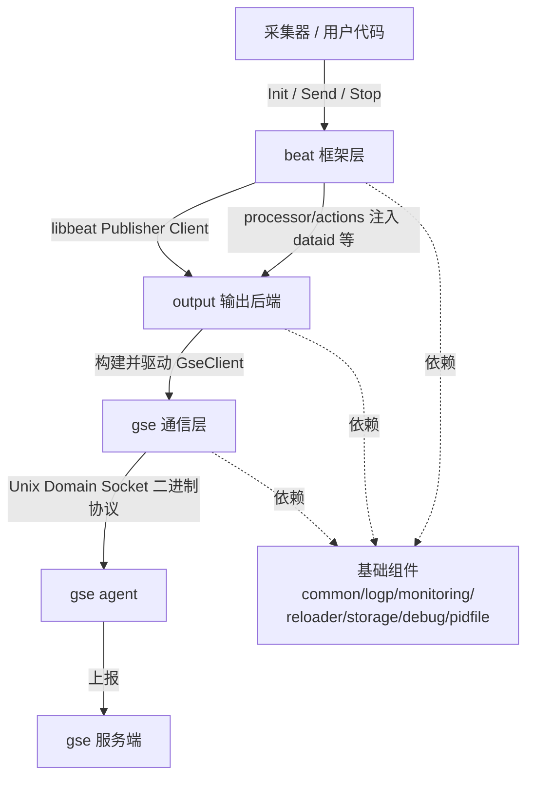
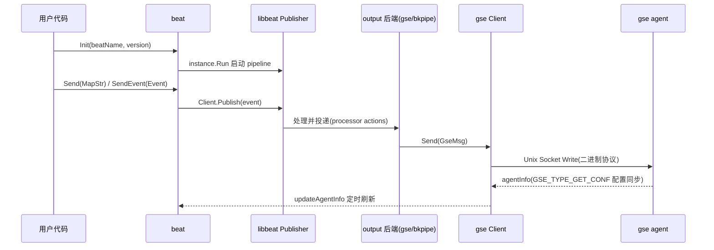

<!-- [待审核] AI 自动生成，请人工确认后移除此标记 -->
# libgse 概览与架构

<cite>
**本文引用的文件**
- [README](file://bkmonitor-datalink/pkg/libgse/README.md)
- [beat/beat.go](file://bkmonitor-datalink/pkg/libgse/beat/beat.go)
- [gse/client.go](file://bkmonitor-datalink/pkg/libgse/gse/client.go)
- [output/bkpipe/bkpipe.go](file://bkmonitor-datalink/pkg/libgse/output/bkpipe/bkpipe.go)
- [monitoring/bkmonitoring.go](file://bkmonitor-datalink/pkg/libgse/monitoring/bkmonitoring.go)
</cite>

## 目录
1. [简介](#简介)
2. [模块定位](#模块定位)
3. [包组织与职责地图](#包组织与职责地图)
4. [整体架构](#整体架构)
5. [数据上报主流程](#数据上报主流程)
6. [与 DataLink 其他模块的关系](#与-datalink-其他模块的关系)
7. [结论](#结论)

## 简介

libgse 是蓝鲸监控的底层通信组件（SDK），供采集器等底层模块将数据上报给 gse agent 使用。它基于 Elastic 官方的 `libbeat` 框架做了蓝鲸化的封装，对外暴露极简的 `Init / Send / Stop` 接口，对内屏蔽了 libbeat 的复杂装配、gse 进程间通信（Unix Domain Socket）、多种输出后端与指标上报等细节。

**章节来源**
- [README](file://bkmonitor-datalink/pkg/libgse/README.md#L1-L33)

## 模块定位

libgse 处在"数据采集器（如 bk-collector、各类 exporter）"与"gse agent"之间，是数据从采集侧流向 gse 服务端的唯一标准通道。它的核心职责：

- **统一入口**：通过 `beat` 包提供 `Init / Send / SendEvent / Stop` 一类同步入口，采集器无需关心 libbeat 的 pipeline 装配。
- **通信封装**：通过 `gse` 包维护与 gse agent 的长连接、二进制协议编解码、断线重连与 agentInfo 配置同步。
- **输出可插拔**：通过 `output` 包注册多种输出后端（`bkpipe`/`bkpipe_multi`/`bkpush`/`gse`/`otlp`），由 libbeat 的 `outputs.RegisterType` 机制动态装配。
- **基础能力下沉**：`common`/`logp`/`monitoring`/`reloader`/`storage`/`debug`/`pidfile` 提供集合、流控、日志、指标、热重启、落盘、调试等共性能力。

**章节来源**
- [README](file://bkmonitor-datalink/pkg/libgse/README.md#L9-L23)
- [beat/beat.go](file://bkmonitor-datalink/pkg/libgse/beat/beat.go#L268-L298)

## 包组织与职责地图

| 包 | 职责 |
|----|------|
| `beat` | 框架入口与生命周期：类型别名、Init/Send/Stop、配置加载、指标 Push 封装、资源限制 |
| `gse` | 核心通信：与 gse agent 的 Unix Socket 收发、二进制协议、MockAgent、SimpleClient |
| `output` | 输出后端构建：bkpipe/bkpipe_multi/bkpush/gse/otlp，向 libbeat 注册输出类型 |
| `processor` | 事件处理链（actions：check、set_dataid 等） |
| `common` | 公共接口：集合、流控、工具函数 |
| `logp` | 日志封装 |
| `monitoring` | Prometheus 指标注册（按 dataID 维度） |
| `reloader` | 配置热重启（监听 reload 信号） |
| `storage` | 磁盘存储（skv/diskv） |
| `debug` | 调试 HTTP / pprof |
| `pidfile` | 进程 PID 文件锁 |

**章节来源**
- [README](file://bkmonitor-datalink/pkg/libgse/README.md#L9-L23)
- [beat/beat.go](file://bkmonitor-datalink/pkg/libgse/beat/beat.go#L12-L26)

## 整体架构

**章节来源**
- [README](file://bkmonitor-datalink/pkg/libgse/README.md#L9-L23)
- [beat/beat.go](file://bkmonitor-datalink/pkg/libgse/beat/beat.go#L12-L26)

**图表来源**
- [README](file://bkmonitor-datalink/pkg/libgse/README.md#L9-L23)
- [beat/beat.go](file://bkmonitor-datalink/pkg/libgse/beat/beat.go#L12-L26)
- [output/bkpipe/bkpipe.go](file://bkmonitor-datalink/pkg/libgse/output/bkpipe/bkpipe.go#L20-L34)

## 数据上报主流程

**章节来源**
- [beat/beat.go](file://bkmonitor-datalink/pkg/libgse/beat/beat.go#L268-L298)
- [gse/client.go](file://bkmonitor-datalink/pkg/libgse/gse/client.go#L142-L203)

**图表来源**
- [beat/beat.go](file://bkmonitor-datalink/pkg/libgse/beat/beat.go#L268-L298)
- [gse/client.go](file://bkmonitor-datalink/pkg/libgse/gse/client.go#L142-L203)

## 与 DataLink 其他模块的关系

在 `bkmonitor-datalink` 仓库中，libgse 与另外两个已文档化的模块形成上下游：

- **ingester**：蓝鲸监控侧的事件接入服务（BkFtaSolution），消费来自 gse 服务端的数据；libgse 是数据进入 gse 的"出口 SDK"，二者通过 gse agent 间接衔接。
- **operator**：负责 data-link 相关资源的编排与协调；libgse 作为被采集侧内嵌的 SDK，不直接与 operator 交互，但共享 `bkmonitor-datalink` 的整体数据链路目标。

设计要点：libgse 刻意保持"无业务耦合"——它只负责把事件可靠地送到 gse agent，采集业务逻辑由调用方自己实现，这也是其可作为通用 SDK 被多个采集器复用的原因。

**章节来源**
- [beat/beat.go](file://bkmonitor-datalink/pkg/libgse/beat/beat.go#L10-L26)
- [monitoring/bkmonitoring.go](file://bkmonitor-datalink/pkg/libgse/monitoring/bkmonitoring.go#L19-L30)

## 结论

libgse 是蓝鲸监控数据链路的"采集侧出口 SDK"，以 libbeat 为底座、gse 通信层为核心、多输出后端为扩展点，并配齐日志/指标/存储/热重启等基础能力。后续页面将依次深入 `beat` 框架生命周期、`gse` 通信协议与重连、输出层与处理链、以及基础组件的实现细节。

**章节来源**
- [README](file://bkmonitor-datalink/pkg/libgse/README.md#L1-L33)
