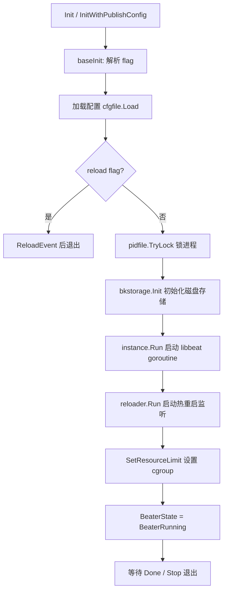

<!-- [待审核] AI 自动生成，请人工确认后移除此标记 -->
# beat 框架入口与生命周期

<cite>
**本文引用的文件**
- [beat/beat.go](file://bkmonitor-datalink/pkg/libgse/beat/beat.go)
- [beat/beater.go](file://bkmonitor-datalink/pkg/libgse/beat/beater.go)
- [beat/config.go](file://bkmonitor-datalink/pkg/libgse/beat/config.go)
- [beat/init.go](file://bkmonitor-datalink/pkg/libgse/beat/init.go)
- [beat/push.go](file://bkmonitor-datalink/pkg/libgse/beat/push.go)
- [beat/version.go](file://bkmonitor-datalink/pkg/libgse/beat/version.go)
- [beat/resource_limit_linux.go](file://bkmonitor-datalink/pkg/libgse/beat/resource_limit_linux.go)
</cite>

## 目录
1. [简介](#简介)
2. [核心类型与接口](#核心类型与接口)
3. [启动与生命周期](#启动与生命周期)
4. [配置加载](#配置加载)
5. [Push 指标上报封装](#push-指标上报封装)
6. [资源限制（Linux cgroup）](#资源限制linux-cgroup)
7. [版本信息](#版本信息)
8. [故障排查指南](#故障排查指南)
9. [结论](#结论)

## 简介

`beat` 包是 libgse 对 Elastic `libbeat` 的薄封装层，承担"框架入口 + 生命周期管理"职责。它对外暴露 `Init`/`InitWithPublishConfig`/`Send`/`SendEvent`/`Stop` 等同步函数，对内完成 libbeat 的 `instance.Run` 装配、配置解析、PID 锁、磁盘存储初始化、热重启监听与资源限制设置。`beat.go` 通过匿名导入各 `output`、`processor/actions` 包完成类型注册（见 `beat/beat.go#L19-L26`）。

**章节来源**
- [beat/beat.go](file://bkmonitor-datalink/pkg/libgse/beat/beat.go#L10-L26)

## 核心类型与接口

`beat.go` 把 libbeat 的关键类型以类型别名方式重新导出，降低调用方对 libbeat 的直接依赖：

- `MapStr = common.MapStr`、`Event = beat.Event`、`ClientEventer = beat.ClientEventer` 等（[beat/beat.go#L28-L52](file://bkmonitor-datalink/pkg/libgse/beat/beat.go#L28-L52)）。
- 发送保证级别常量：`DefaultGuarantees` / `GuaranteedSend` / `DropIfFull`（[beat/beat.go#L48-L52](file://bkmonitor-datalink/pkg/libgse/beat/beat.go#L48-L52)）。

运行态由包级单例 `commonBKBeat`（`BKBeat`）承载（[beat/beater.go#L30-L44](file://bkmonitor-datalink/pkg/libgse/beat/beater.go#L30-L44)），其状态用 `BeaterState` 枚举管理：`BeaterBeforeOpening` → `BeaterRunning` / `BeaterFailToOpen` → `BeaterStoped`（[beat/beater.go#L20-L28](file://bkmonitor-datalink/pkg/libgse/beat/beater.go#L20-L28)）。全局 flag 在包加载时定义：`--reload`、`-T`（测试模式）、`--gse-check`、`--container`（[beat/beat.go#L60-L65](file://bkmonitor-datalink/pkg/libgse/beat/beat.go#L60-L65)）。

**章节来源**
- [beat/beat.go](file://bkmonitor-datalink/pkg/libgse/beat/beat.go#L28-L65)
- [beat/beater.go](file://bkmonitor-datalink/pkg/libgse/beat/beater.go#L20-L44)

## 启动与生命周期

**章节来源**
- [beat/init.go](file://bkmonitor-datalink/pkg/libgse/beat/init.go#L57-L188)
- [beat/beater.go](file://bkmonitor-datalink/pkg/libgse/beat/beater.go#L63-L102)

启动核心在 `baseInit`：解析 flag → 加载配置 → （可选）reload 事件 → PID 锁 → 磁盘存储初始化 → 启动 libbeat goroutine → 启动 reloader → 设置资源限制 → 标记 `BeaterRunning`（[beat/init.go#L57-L188](file://bkmonitor-datalink/pkg/libgse/beat/init.go#L57-L188)）。

`BKBeat.Run` 在 libbeat 的 beater 回调中执行：建立 Publisher 连接、关闭 `errorMessageChan`、阻塞在 `Done` 通道直到 `Stop`（[beat/beater.go#L63-L88](file://bkmonitor-datalink/pkg/libgse/beat/beater.go#L63-L88)）。`Stop` 仅当处于 `BeaterRunning` 时关闭 Client、关闭 `Done`、释放资源（[beat/beater.go#L91-L102](file://bkmonitor-datalink/pkg/libgse/beat/beater.go#L91-L102)）。

对外 `Init` / `InitWithPublishConfig` 以互斥锁保证同一 beat 只创建一次（[beat/init.go#L225-L249](file://bkmonitor-datalink/pkg/libgse/beat/init.go#L225-L249)）；`Stop()` 在停止 beat 的同时停止 reloader、释放 PID 与存储（[beat/init.go#L301-L314](file://bkmonitor-datalink/pkg/libgse/beat/init.go#L301-L314)）。

**图表来源**
- [beat/init.go](file://bkmonitor-datalink/pkg/libgse/beat/init.go#L57-L188)
- [beat/beater.go](file://bkmonitor-datalink/pkg/libgse/beat/beater.go#L63-L102)

## 配置加载

`beat` 复用 libbeat 的 `common.Config` 作为配置类型，`LoadFile` 直接复用 `common.LoadFile`（[beat/config.go#L16-L21](file://bkmonitor-datalink/pkg/libgse/beat/config.go#L16-L21)）。`baseInit` 中解析 `path` 段（pid/data 路径，默认 `./data`）与 `resource_limit` 段：

- `pathConfig`：`pid` 与 `data` 字段（[beat/init.go#L35-L48](file://bkmonitor-datalink/pkg/libgse/beat/init.go#L35-L48)）。PID 文件路径通过 `bkcommon.MakePifFilePath` 生成。
- `resourceConfig`：`enabled` / `cpu`（核）/ `mem`（MB），由 `getResourceLimit` 解包（[beat/init.go#L190-L213](file://bkmonitor-datalink/pkg/libgse/beat/init.go#L190-L213)）。

**章节来源**
- [beat/config.go](file://bkmonitor-datalink/pkg/libgse/beat/config.go#L16-L21)
- [beat/init.go](file://bkmonitor-datalink/pkg/libgse/beat/init.go#L35-L48)
- [beat/init.go](file://bkmonitor-datalink/pkg/libgse/beat/init.go#L190-L213)

## Push 指标上报封装

`push.go` 提供 `Pusher` 接口与 `gsePusher` 实现，用于将 Prometheus 指标按固定 DataID 批量上报给 gse。`Pusher` 接口支持链式配置：`Gatherer` / `Collector` / `Client` / `ConstLabels` / `Disabled`（[beat/push.go#L41-L52](file://bkmonitor-datalink/pkg/libgse/beat/push.go#L41-L52)）。

关键设计：

- **构造与默认值**：`NewGsePusher` 对 `BatchSize`(1024)、`Period`(1m)、`Labels`、`TimeOffset`(2 年) 做零值兜底（[beat/push.go#L93-L115](file://bkmonitor-datalink/pkg/libgse/beat/push.go#L93-L115)）。
- **采集与发送**：`GatherEvents` 通过 `prometheus.Gatherers.Gather()` 拉取指标家族，起 goroutine 转换为事件（[beat/push.go#L245-L257](file://bkmonitor-datalink/pkg/libgse/beat/push.go#L245-L257)）；`metricFamiliesToEvents` 将每个指标族展开为 `dimension`/`metrics`/`timestamp` 结构，按 `BatchSize` 切分并通过 `wrapEvent` 包装（[beat/push.go#L346-L531](file://bkmonitor-datalink/pkg/libgse/beat/push.go#L346-L531)）。
- **错误处理**：`getValueFromMetric` 对 `NaN`/`Inf` 返回错误并跳过；`handleTimestampMs` 对超过 `TimeOffset` 的历史时间戳回退为当前时间，避免脏时间写入（[beat/push.go#L259-L284](file://bkmonitor-datalink/pkg/libgse/beat/push.go#L259-L284)）。
- **远程标签**：`getRemoteLabels` 从 `RemoteLabelsURL` 拉取额外维度注入（[beat/push.go#L568-L589](file://bkmonitor-datalink/pkg/libgse/beat/push.go#L568-L589)）。

**章节来源**
- [beat/push.go](file://bkmonitor-datalink/pkg/libgse/beat/push.go#L41-L115)
- [beat/push.go](file://bkmonitor-datalink/pkg/libgse/beat/push.go#L245-L284)
- [beat/push.go](file://bkmonitor-datalink/pkg/libgse/beat/push.go#L346-L531)
- [beat/push.go](file://bkmonitor-datalink/pkg/libgse/beat/push.go#L568-L589)

## 资源限制（Linux cgroup）

`SetResourceLimit` 在启动末期按 `resource_limit` 配置把进程纳入 cgroup 限制（[beat/resource_limit_linux.go#L23-L35](file://bkmonitor-datalink/pkg/libgse/beat/resource_limit_linux.go#L23-L35)）。它先尝试设置 cgroup，失败则回退到 `runtime.GOMAXPROCS(ceil(cpu))` 限制并行度；若 cgroup 设置成功则放开到全部核心（`GOMAXPROCS(0)`）。

实现按 cgroup 模式分派：`Legacy`/`Hybrid` 走 v1（`setLinuxCgroupsV1`，`/collector-<name>` 静态路径，先 Load 再 Update，失败则 New），`Unified` 走 v2（`setLinuxCgroupsV2`，`cgroup2.NewManager`）。CPU 配额 `cpu * 100000`，内存上限 `mem * 1024 * 1024`，≤0 表示不限制（[beat/resource_limit_linux.go#L37-L143](file://bkmonitor-datalink/pkg/libgse/beat/resource_limit_linux.go#L37-L143)）。

**章节来源**
- [beat/resource_limit_linux.go](file://bkmonitor-datalink/pkg/libgse/beat/resource_limit_linux.go#L23-L143)

## 版本信息

`version.go` 仅维护一个包级 `sdkVersion` 变量，在 `init()` 中固定为 `"Master"`（[beat/version.go#L12-L16](file://bkmonitor-datalink/pkg/libgse/beat/version.go#L12-L16)）。运行时版本由调用方在 `Init(beatName, version)` 传入并打印（[beat/init.go#L73-L78](file://bkmonitor-datalink/pkg/libgse/beat/init.go#L73-L78)）。

**章节来源**
- [beat/version.go](file://bkmonitor-datalink/pkg/libgse/beat/version.go#L12-L16)
- [beat/init.go](file://bkmonitor-datalink/pkg/libgse/beat/init.go#L73-L78)

## 故障排查指南

| 现象 | 可能原因 | 排查路径 |
|------|----------|----------|
| `failed to initialize libbeat` | libbeat 装配失败（配置/插件注册） | 检查 `instance.Run` 返回错误；确认各 output/processor 匿名导入已执行（[beat/beat.go#L19-L26](file://bkmonitor-datalink/pkg/libgse/beat/beat.go#L19-L26)） |
| PID 文件加锁失败 | 进程已运行或权限不足 | 检查 `pidfile.TryLock` 错误（[beat/init.go#L121-L125](file://bkmonitor-datalink/pkg/libgse/beat/init.go#L121-L125)），确认无残留进程 |
| 存储初始化失败 | data 目录不可写 | 检查 `bkstorage.Init` 错误中的 `dbFilePath`（[beat/init.go#L134-L139](file://bkmonitor-datalink/pkg/libgse/beat/init.go#L134-L139)） |
| `--gse-check` 启动即退出 | gse socket 不可达 | 该模式会 Dial+写+读 agentInfo 并 `os.Exit(0)`，见 `connect` 内的 GseCheck 分支（[gse/client.go#L268-L324](file://bkmonitor-datalink/pkg/libgse/gse/client.go#L268-L324)） |
| 资源限制不生效 | cgroup 模式不支持 | 查看 `setLinuxCgroups` 返回的 `no support cgroup mode`（[beat/resource_limit_linux.go#L37-L49](file://bkmonitor-datalink/pkg/libgse/beat/resource_limit_linux.go#L37-L49)） |

**章节来源**
- [beat/init.go](file://bkmonitor-datalink/pkg/libgse/beat/init.go#L57-L188)
- [beat/resource_limit_linux.go](file://bkmonitor-datalink/pkg/libgse/beat/resource_limit_linux.go#L37-L49)

## 结论

`beat` 包以单例 `commonBKBeat` 承载运行态，用 `BeaterState` 枚举严格控制生命周期，在 `baseInit` 中顺序完成配置、PID 锁、存储、libbeat、reloader、资源限制六步装配。其上层的 `Send`/`SendEvent` 将事件投递给 libbeat Publisher，由 output 后端驱动 gse 通信层；`push.go` 另提供独立的 Prometheus 指标批量上报能力。

**章节来源**
- [beat/beater.go](file://bkmonitor-datalink/pkg/libgse/beat/beater.go#L30-L44)
- [beat/init.go](file://bkmonitor-datalink/pkg/libgse/beat/init.go#L57-L314)
