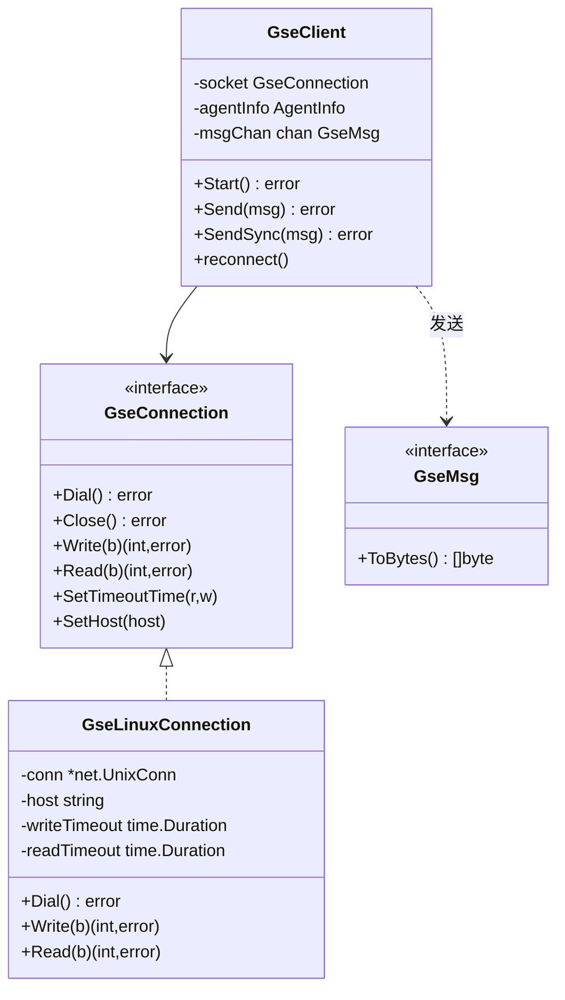
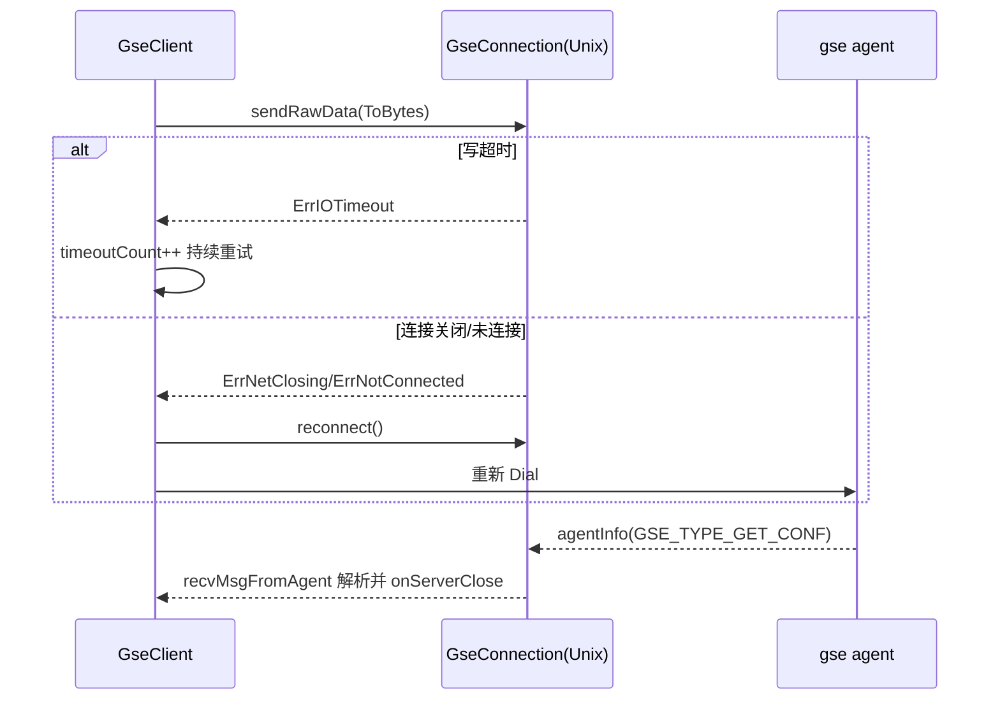

<!-- [待审核] AI 自动生成，请人工确认后移除此标记 -->
# GSE-SDK 通信层

<cite>
**本文引用的文件**
- [gse/client.go](file://bkmonitor-datalink/pkg/libgse/gse/client.go)
- [gse/gsesocket_unix.go](file://bkmonitor-datalink/pkg/libgse/gse/gsesocket_unix.go)
- [gse/gsetype.go](file://bkmonitor-datalink/pkg/libgse/gse/gsetype.go)
- [gse/mockagent.go](file://bkmonitor-datalink/pkg/libgse/gse/mockagent.go)
- [gse/simple_client.go](file://bkmonitor-datalink/pkg/libgse/gse/simple_client.go)
</cite>

## 目录
1. [简介](#简介)
2. [Client 接口与连接模型](#client-接口与连接模型)
3. [Unix Domain Socket 通信](#unix-domain-socket-通信)
4. [消息协议类型](#消息协议类型)
5. [MockAgent 与 SimpleClient](#mockagent-与-simpleclient)
6. [错误处理与重连](#错误处理与重连)
7. [故障排查指南](#故障排查指南)
8. [结论](#结论)

## 简介

`gse` 包是 libgse 的核心通信层，负责与本地 gse agent 通过 **Unix Domain Socket** 进行二进制协议收发。`GseClient` 维护长连接、消息队列、心跳式 agentInfo 同步与断线重连；`GseConnection` 接口抽象了底层 socket 操作（Linux 下为 `GseLinuxConnection`）。`gsetype.go` 定义协议头与各类消息体（Common/Dynamic/Op/RequestConf/LocalCommand），`mockagent`/`simple_client` 提供测试与简化客户端。

**章节来源**
- [gse/client.go](file://bkmonitor-datalink/pkg/libgse/gse/client.go#L80-L93)
- [gse/gsetype.go](file://bkmonitor-datalink/pkg/libgse/gse/gsetype.go#L36-L44)

## Client 接口与连接模型

**章节来源**
- [gse/client.go](file://bkmonitor-datalink/pkg/libgse/gse/client.go#L80-L93)
- [gse/gsetype.go](file://bkmonitor-datalink/pkg/libgse/gse/gsetype.go#L36-L44)

`GseClient` 结构包含：`socket GseConnection`（底层连接）、`agentInfo AgentInfo`、`msgChan chan GseMsg`（发送队列）、`connectTimes`（重连计数）、`timeoutCount`（连续超时计数，阈值 `maxTimeoutCount=128`）等（[gse/client.go#L80-L95](file://bkmonitor-datalink/pkg/libgse/gse/client.go#L80-L95)）。

启动 `Start` 建立连接后，并发拉起三个 goroutine：`recvMsgFromAgent`（收）、`updateAgentInfo(time.Second*31)`（每 31s 同步配置）、`msgSender`（从队列发）（[gse/client.go#L142-L157](file://bkmonitor-datalink/pkg/libgse/gse/client.go#L142-L157)）。发送分三种语义：

- `Send`：入队 `msgChan`，队满阻塞（[gse/client.go#L199-L203](file://bkmonitor-datalink/pkg/libgse/gse/client.go#L199-L203)）。
- `SendSync`：直接 `sendRawData`，同步等待（[gse/client.go#L206-L215](file://bkmonitor-datalink/pkg/libgse/gse/client.go#L206-L215)）。
- `SendWithNewConnection`：每次新建连接发送，带 3 次重试（[gse/client.go#L217-L243](file://bkmonitor-datalink/pkg/libgse/gse/client.go#L217-L243)）。

`GseConnection` 接口与 `GseMsg` 接口是协议抽象的核心（[gse/gsetype.go#L36-L44](file://bkmonitor-datalink/pkg/libgse/gse/gsetype.go#L36-L44)）。

**图表来源**
- [gse/gsetype.go](file://bkmonitor-datalink/pkg/libgse/gse/gsetype.go#L36-L44)
- [gse/gsesocket_unix.go](file://bkmonitor-datalink/pkg/libgse/gse/gsesocket_unix.go#L27-L98)
- [gse/client.go](file://bkmonitor-datalink/pkg/libgse/gse/client.go#L80-L93)

## Unix Domain Socket 通信

`GseLinuxConnection` 是 `GseConnection` 在类 Unix 系统下的实现，默认连接 `defaultGSEPath = /usr/local/gse/gseagent/ipc.state.report`，网络类型为 `unix`（[gse/gsesocket_unix.go#L20-L24](file://bkmonitor-datalink/pkg/libgse/gse/gsesocket_unix.go#L20-L24)）。

- `Dial`：构造 `net.UnixAddr` 并通过 `net.DialUnix` 建连（[gse/gsesocket_unix.go#L47-L54](file://bkmonitor-datalink/pkg/libgse/gse/gsesocket_unix.go#L47-L54)）。
- `Write/Read`：若 `conn==nil` 返回 `errNoConnection`；当超时配置 >0 时通过 `SetWriteDeadline`/`SetReadDeadline` 施加写/读超时（[gse/gsesocket_unix.go#L69-L93](file://bkmonitor-datalink/pkg/libgse/gse/gsesocket_unix.go#L69-L93)）。
- `SetHost`：允许覆盖默认 agent socket 路径（[gse/gsesocket_unix.go#L95-L98](file://bkmonitor-datalink/pkg/libgse/gse/gsesocket_unix.go#L95-L98)）。

设计要点：socket 本身只暴露字节读写，超时由 `WriteTimeout`(默认 5s)/`ReadTimeout`(默认 60s) 控制，连接地址可被 `Endpoint` 配置或 `SetHost` 覆盖，从而支持容器/测试环境指向自定义路径。

**章节来源**
- [gse/gsesocket_unix.go](file://bkmonitor-datalink/pkg/libgse/gse/gsesocket_unix.go#L20-L98)

## 消息协议类型

`gsetype.go` 定义了 gse 协议常量与消息体：

- **协议类型**：`GSE_TYPE_COMMON`(3073, 数据上报)、`GSE_TYPE_GET_CONF`(0x0A, 配置同步)、`GSE_TYPE_DYNAMIC`(0x09)、`GSE_TYPE_OP`(3084, ops 上报)、`GSE_TYPE_TLOGC`(0x02)（[gse/gsetype.go#L22-L29](file://bkmonitor-datalink/pkg/libgse/gse/gsetype.go#L22-L29)）。
- **AgentInfo**：从 agent 同步的元数据（bizid / bk_biz_id / cloudid / ip / bk_agent_id / bk_tenant_id / static_dataid 等），`IsEmpty` 用 ip 与 bk_agent_id 同时为空判断（[gse/gsetype.go#L48-L71](file://bkmonitor-datalink/pkg/libgse/gse/gsetype.go#L48-L71)）。
- **Common 消息**：`GseCommonMsgHead`（msgtype/dataid/utctime/bodylen/resv），头用大端、body 用小端序列化（[gse/gsetype.go#L80-L114](file://bkmonitor-datalink/pkg/libgse/gse/gsetype.go#L80-L114)）。
- **Dynamic 消息**：在 Common 头上扩展 `index/flags/metaLen/metaMaxLen/metaCount`，支持 `AddMeta` 注入元数据，meta 区固定 `408B` 预留（[gse/gsetype.go#L118-L211](file://bkmonitor-datalink/pkg/libgse/gse/gsetype.go#L118-L211)）。
- **LocalCommand 消息**：agent 下行配置同步的 8 字节头（MsgType/BodyLen），接收侧据此读取（[gse/gsetype.go#L258-L262](file://bkmonitor-datalink/pkg/libgse/gse/gsetype.go#L258-L262)）。

**章节来源**
- [gse/gsetype.go](file://bkmonitor-datalink/pkg/libgse/gse/gsetype.go#L22-L71)
- [gse/gsetype.go](file://bkmonitor-datalink/pkg/libgse/gse/gsetype.go#L78-L262)

## MockAgent 与 SimpleClient

- **MockAgent**：`StartMockAgent` 通过 `sync.Once` 保证只起一个 mock gse agent（`/tmp/ipc.state.report`），`handleConnection` 按 24 字节 Common 头读取，对 `msgType==10`（即 `GSE_TYPE_GET_CONF`）回写预设 agentInfo（[gse/mockagent.go#L128-L167](file://bkmonitor-datalink/pkg/libgse/gse/mockagent.go#L128-L167)，[gse/mockagent_unix.go#L15-L18](file://bkmonitor-datalink/pkg/libgse/gse/mockagent_unix.go#L15-L18)）。用于集成测试时替代真实 gse agent。
- **SimpleClient**：`GseSimpleClient` 是精简客户端——`Start` 仅 Dial，`Send` 直接写 socket，`SyncGetAgentInfo` 发送配置同步请求并同步读取 agentInfo（[gse/simple_client.go#L18-L121](file://bkmonitor-datalink/pkg/libgse/gse/simple_client.go#L18-L121)）。适合不需要队列/重连的轻量场景。

**章节来源**
- [gse/mockagent.go](file://bkmonitor-datalink/pkg/libgse/gse/mockagent.go#L128-L167)
- [gse/mockagent_unix.go](file://bkmonitor-datalink/pkg/libgse/gse/mockagent_unix.go#L15-L18)
- [gse/simple_client.go](file://bkmonitor-datalink/pkg/libgse/gse/simple_client.go#L18-L121)

## 错误处理与重连

**章节来源**
- [gse/client.go](file://bkmonitor-datalink/pkg/libgse/gse/client.go#L416-L511)

发送核心 `sendRawData` 按 `RetryTimes` 循环写，失败时用 `getOpErrno` 把错误归类为 `EINVAL`/`ErrNetClosing`/`ErrIOTimeout`/`EPIPE`/`ErrNotConnected`，再经 `isReconnectable` 判断是否重连（[gse/client.go#L416-L473](file://bkmonitor-datalink/pkg/libgse/gse/client.go#L416-L473)）：

- **写超时**（`ErrIOTimeout`）：不重连，仅 `timeoutCount++` 并持续写入，避免数据丢失；当 `timeoutCount >= maxTimeoutCount(128)` 时触发重连（[gse/client.go#L478-L482](file://bkmonitor-datalink/pkg/libgse/gse/client.go#L478-L482)、[gse/client.go#L95](file://bkmonitor-datalink/pkg/libgse/gse/client.go#L95)）。
- **连接关闭/未连接**（`ErrNetClosing`/`ErrNotConnected`）：立即重连（[gse/client.go#L484-L487](file://bkmonitor-datalink/pkg/libgse/gse/client.go#L484-L487)）。
- **重连次数控制**：`connectTimes` 记录重连成功次数；当 `ReconnectTimes >= connectTimes` 时用原 socket 通讯，避免无限重连（[gse/client.go#L489-L491](file://bkmonitor-datalink/pkg/libgse/gse/client.go#L489-L491)）。
- **计数维护**：`onServerClose` 在 agent 主动关闭时重置 `connectTimes`；`onReconnectSuccess` 累加；`onWriteSuccess` 在成功写入后递减（[gse/client.go#L493-L511](file://bkmonitor-datalink/pkg/libgse/gse/client.go#L493-L511)）。

`recvMsgFromAgent` 在收到 `io.EOF`（agent 关闭）时自增 `gse_client_server_close` 并 `reconnect` + `onServerClose`；读错误则睡眠 1s 后继续（[gse/client.go#L533-L600](file://bkmonitor-datalink/pkg/libgse/gse/client.go#L533-L600)）。

**图表来源**
- [gse/client.go](file://bkmonitor-datalink/pkg/libgse/gse/client.go#L416-L511)
- [gse/client.go](file://bkmonitor-datalink/pkg/libgse/gse/client.go#L533-L600)

## 故障排查指南

| 现象 | 可能原因 | 排查路径 |
|------|----------|----------|
| 容器模式启动即退出 | socket 文件不存在（`no such file or directory` 且 `IsContainerMode`） | 见 `connect` 内的容器退出分支（[gse/client.go#L336-L340](file://bkmonitor-datalink/pkg/libgse/gse/client.go#L336-L340)），确认 agent socket 已挂载 |
| 连接反复失败 | gse agent 未启动 | 查看 `metricGseClientConnectFailed`；检查 `RetryTimes`/`RetryInterval`（[gse/client.go#L51-L59](file://bkmonitor-datalink/pkg/libgse/gse/client.go#L51-L59)） |
| 发送卡住/数据不丢 | 写超时持续重试 | 观察 `gse_client_send_timeout`；`timeoutCount` 达 128 才重连（[gse/client.go#L478-L482](file://bkmonitor-datalink/pkg/libgse/gse/client.go#L478-L482)） |
| agentInfo 为空 | 配置同步未收到 | `--gse-check` 模式会校验并退出（[gse/client.go#L268-L324](file://bkmonitor-datalink/pkg/libgse/gse/client.go#L268-L324)）；检查 `updateAgentInfo` 定时（[gse/client.go#L368-L390](file://bkmonitor-datalink/pkg/libgse/gse/client.go#L368-L390)） |
| 本地联调 | 无真实 agent | 调用 `mockagent.StartMockAgent()` 启动 mock（[gse/mockagent.go#L131-L133](file://bkmonitor-datalink/pkg/libgse/gse/mockagent.go#L131-L133)） |

**章节来源**
- [gse/client.go](file://bkmonitor-datalink/pkg/libgse/gse/client.go#L51-L59)
- [gse/client.go](file://bkmonitor-datalink/pkg/libgse/gse/client.go#L268-L340)
- [gse/client.go](file://bkmonitor-datalink/pkg/libgse/gse/client.go#L368-L390)

## 结论

`gse` 包以 `GseConnection` 接口屏蔽平台差异，用 `GseClient` 维护"队列发送 + 心跳同步 + 智能重连"的长连接模型；协议层通过头大端/体小端的二进制编解码支持 Common/Dynamic/Op/Conf 多类型消息。`getOpErrno`/`isReconnectable` 的精细错误分类与 `timeoutCount`/`connectTimes` 双重计数，使重连既及时又避免过度震荡，是 libgse 可靠性的关键。

**章节来源**
- [gse/client.go](file://bkmonitor-datalink/pkg/libgse/gse/client.go#L80-L511)
- [gse/gsetype.go](file://bkmonitor-datalink/pkg/libgse/gse/gsetype.go#L22-L262)
