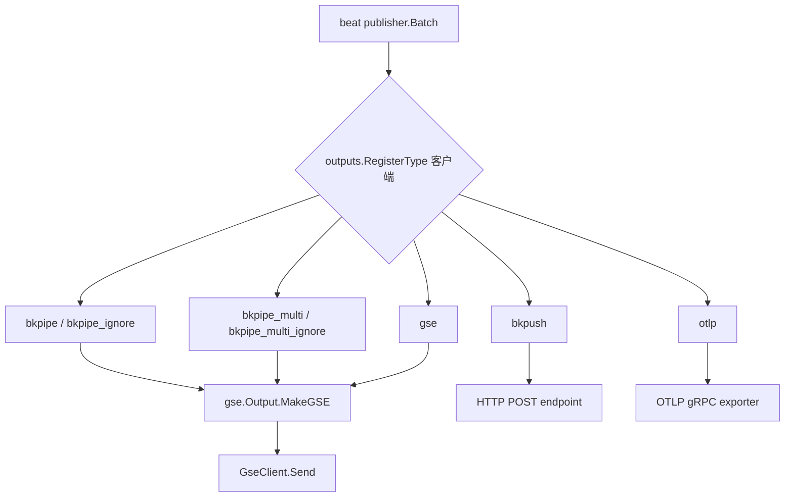
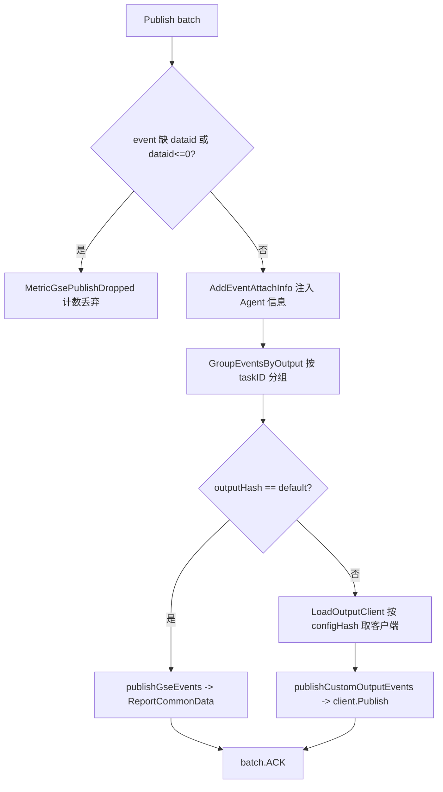

<!-- [待审核] AI 自动生成，请人工确认后移除此标记 -->
# 输出层与处理链

> 模块：`bkmonitor-datalink/pkg/libgse/output/`、`pkg/libgse/processor/`
> 阅读对象：需要理解数据如何从 beat pipeline 落到 GSE/HTTP/OTLP 的开发者
> 生成时间：2026-07-16

<cite>
**本文引用的文件**
- [output/bkpipe/bkpipe.go](file://bkmonitor-datalink/pkg/libgse/output/bkpipe/bkpipe.go)
- [output/bkpipe_multi/bkpipe_multi.go](file://bkmonitor-datalink/pkg/libgse/output/bkpipe_multi/bkpipe_multi.go)
- [output/bkpipe_multi/clients.go](file://bkmonitor-datalink/pkg/libgse/output/bkpipe_multi/clients.go)
- [output/bkpipe_multi/hash.go](file://bkmonitor-datalink/pkg/libgse/output/bkpipe_multi/hash.go)
- [output/bkpush/bkpush.go](file://bkmonitor-datalink/pkg/libgse/output/bkpush/bkpush.go)
- [output/gse/gse.go](file://bkmonitor-datalink/pkg/libgse/output/gse/gse.go)
- [output/gse/config.go](file://bkmonitor-datalink/pkg/libgse/output/gse/config.go)
- [output/otlp/otlp.go](file://bkmonitor-datalink/pkg/libgse/output/otlp/otlp.go)
- [processor/actions/check.go](file://bkmonitor-datalink/pkg/libgse/processor/actions/check.go)
- [processor/actions/set_dataid.go](file://bkmonitor-datalink/pkg/libgse/processor/actions/set_dataid.go)
</cite>

## 简介

libgse 实现了多个 libbeat `outputs` 后端，统一承接 beat pipeline 吐出的 `publisher.Batch`，并在发送前完成 dataid 校验、Agent 信息注入、按任务路由等工作。处理链路分为两层：

1. **输出后端（output/）**：注册为 libbeat `outputs.RegisterType`，实现 `Publish(batch)` 接口。
2. **处理链（processor/actions/）**：在 pipeline 前置阶段对事件做校验/字段填充，例如给事件补 `dataid`。

**章节来源**
- [output/bkpipe/bkpipe.go](file://bkmonitor-datalink/pkg/libgse/output/bkpipe/bkpipe.go#L20-L34)
- [output/bkpipe_multi/bkpipe_multi.go](file://bkmonitor-datalink/pkg/libgse/output/bkpipe_multi/bkpipe_multi.go#L31-L34)
- [output/bkpush/bkpush.go](file://bkmonitor-datalink/pkg/libgse/output/bkpush/bkpush.go#L37-L39)
- [output/gse/gse.go](file://bkmonitor-datalink/pkg/libgse/output/gse/gse.go#L55-L57)
- [output/otlp/otlp.go](file://bkmonitor-datalink/pkg/libgse/output/otlp/otlp.go#L40-L42)

## 输出后端总览

所有后端都在各自 `init()` 中通过 `outputs.RegisterType` 注册，名称与含义如下：

| 注册名 | 后端 | 说明 |
|--------|------|------|
| `gse` | `output/gse` | 主后端，直连 GSE Agent Unix Socket |
| `bkpipe` / `bkpipe_ignore` | `output/bkpipe` | 兼容旧配置，转发到 `gse.MakeGSE` |
| `bkpipe_multi` / `bkpipe_multi_ignore` | `output/bkpipe_multi` | 多管道按任务路由，内嵌 `gse.Output` |
| `bkpush` | `output/bkpush` | 通过 HTTP POST 推送到指定 endpoint |
| `otlp` | `output/otlp` | OTLP 轨迹经 gRPC exporter 上报 |

**章节来源**
- [output/gse/gse.go](file://bkmonitor-datalink/pkg/libgse/output/gse/gse.go#L55-L57)
- [output/bkpipe/bkpipe.go](file://bkmonitor-datalink/pkg/libgse/output/bkpipe/bkpipe.go#L20-L23)
- [output/bkpipe_multi/bkpipe_multi.go](file://bkmonitor-datalink/pkg/libgse/output/bkpipe_multi/bkpipe_multi.go#L31-L33)
- [output/bkpush/bkpush.go](file://bkmonitor-datalink/pkg/libgse/output/bkpush/bkpush.go#L37-L38)
- [output/otlp/otlp.go](file://bkmonitor-datalink/pkg/libgse/output/otlp/otlp.go#L40-L41)

**图表来源**
- [output/gse/gse.go](file://bkmonitor-datalink/pkg/libgse/output/gse/gse.go#L56-L57)
- [output/bkpipe/bkpipe.go](file://bkmonitor-datalink/pkg/libgse/output/bkpipe/bkpipe.go#L20-L23)
- [output/bkpipe_multi/bkpipe_multi.go](file://bkmonitor-datalink/pkg/libgse/output/bkpipe_multi/bkpipe_multi.go#L31-L33)

## bkpipe 单管道

`output/bkpipe` 是兼容层：它把 `MakeBKPipe` / `MakeBKPipeWithoutCheckConn` 直接转发给 `gse.MakeGSE` / `gse.MakeGSEWithoutCheckConn`，用于兼容历史配置中写 `bkpipe` 而非 `gse` 的场景。

**章节来源**
- [output/bkpipe/bkpipe.go](file://bkmonitor-datalink/pkg/libgse/output/bkpipe/bkpipe.go#L20-L34)

## bkpipe_multi 多管道与一致性哈希

`bkpipe_multi` 在 `gse.Output` 基础上扩展出「按任务路由到不同发送端」的能力，是数据链路里最复杂的一个后端。

核心数据结构（`clients.go`）：
- `taskRegistry`：`taskID -> 配置哈希`，记录某个任务用哪套发送配置。
- `outputRegistry`：`配置哈希 -> *output`，保存具体配置与已初始化的客户端。
- 常量 `GseOutputGroupName = "default"`：无任务 ID 的事件走默认 GSE 上报。
- 常量 `EventTaskIDMetaFieldName = "bk_task_id"`：事件 Meta 中携带的任务 ID 字段名。

关键流程：
1. `RegisterTaskOutput(taskID, config)`：按配置内容算出哈希（`HashRawConfig` 用 MD5），写入两个 registry；首次注册会初始化指数退避对象（初始 1s、倍率 2、最大 60s、一直重试）。
2. `LoadOutputClient(configHash, ...)`：按哈希取出客户端；未初始化时通过 `outputs.Load` 构造并 `Connect()`（网络客户端带 30s 连接超时）；指数退避避免短时间重试风暴；成功后 `Reset()` 退避计数。
3. `DeregisterTaskOutput(taskID)`：反注册任务，若没有任何任务再引用该配置哈希则关闭并删除对应客户端。
4. `SetEventTaskID(event, taskID)` / `GroupEventsByOutput(events)`：给事件注入任务 ID，再按任务 ID 映射到配置哈希分组（用完即删除 Meta 中的任务 ID，避免上报上去）。哈希计算见 `hash.go` 的 `HashRawConfig`（JSON 序列化后 MD5）。

`bkpipe_multi.go` 的 `Publish` 负责消费：
- 逐事件校验 `dataid`（`GetDataID`）；缺失/非正则 `MetricGsePublishDropped` 计数丢弃。
- `AddEventAttachInfo` 注入 Agent 信息。
- `GroupEventsByOutput` 分组后：哈希为 `default` 走 `publishGseEvents`（`ReportCommonData`）；否则 `LoadOutputClient` 取客户端后 `publishCustomOutputEvents`。
- 最终 `batch.ACK()`。

**章节来源**
- [output/bkpipe_multi/bkpipe_multi.go](file://bkmonitor-datalink/pkg/libgse/output/bkpipe_multi/bkpipe_multi.go#L24-L29)
- [output/bkpipe_multi/bkpipe_multi.go](file://bkmonitor-datalink/pkg/libgse/output/bkpipe_multi/bkpipe_multi.go#L73-L138)
- [output/bkpipe_multi/bkpipe_multi.go](file://bkmonitor-datalink/pkg/libgse/output/bkpipe_multi/bkpipe_multi.go#L151-L172)
- [output/bkpipe_multi/clients.go](file://bkmonitor-datalink/pkg/libgse/output/bkpipe_multi/clients.go#L23-L40)
- [output/bkpipe_multi/clients.go](file://bkmonitor-datalink/pkg/libgse/output/bkpipe_multi/clients.go#L44-L103)
- [output/bkpipe_multi/clients.go](file://bkmonitor-datalink/pkg/libgse/output/bkpipe_multi/clients.go#L106-L214)
- [output/bkpipe_multi/hash.go](file://bkmonitor-datalink/pkg/libgse/output/bkpipe_multi/hash.go#L20-L41)

**图表来源**
- [output/bkpipe_multi/bkpipe_multi.go](file://bkmonitor-datalink/pkg/libgse/output/bkpipe_multi/bkpipe_multi.go#L73-L138)
- [output/bkpipe_multi/clients.go](file://bkmonitor-datalink/pkg/libgse/output/bkpipe_multi/clients.go#L183-L214)

## bkpush

`bkpush` 是一个独立的 HTTP 推送后端，将事件通过 POST 发送到配置中的 `endpoint`。

- `Config`：`Endpoint`、`Timeout`(默认 1min)、`Concurrency`(默认 1)、`EventBufferMax`(默认 128)、`RetryTimes`/`RetryInterval`、`FlowLimit`(字节/秒，>0 生效)、连接池参数。
- `New`：构造 `http.Client`、`FlowLimiter`（若配置了 `FlowLimit`），按 `Concurrency` 起 `loopHandle` 协程消费 `ch` 通道，并 `bkpipe.InitSender` 初始化指标发送器。
- `publish`：取 `dataid`（缺失/非正丢弃），若无 `gseindex` 则 `gse.GetGseIndex` 补序号，投递到 `ch`。
- `doRequest`：`gse.MarshalFunc` 序列化，`FlowLimiter.Consume` 限流，POST 时带 `X-BK-DATA-ID` 头。
- `loopHandle`：每个记录重试 `RetryTimes+1` 次，失败间隔 `RetryInterval`。

**章节来源**
- [output/bkpush/bkpush.go](file://bkmonitor-datalink/pkg/libgse/output/bkpush/bkpush.go#L32-L74)
- [output/bkpush/bkpush.go](file://bkmonitor-datalink/pkg/libgse/output/bkpush/bkpush.go#L81-L135)
- [output/bkpush/bkpush.go](file://bkmonitor-datalink/pkg/libgse/output/bkpush/bkpush.go#L142-L249)

## gse 输出

`output/gse` 是核心后端，封装 `gse.GseClient` 完成实际发送，并负责 Agent 信息获取与事件附着。

- `Output` 结构：`cli`(GseClient)、`aif`(AgentInfoFetcher)、`fl`(FlowLimiter)、`fastMode`、`concurrency`。
- `MakeGSE`：解配置 → `NewGseClient` → `NewAgentInfoFetcher` → `Start()` → 轮询 `GetAgentInfo`（最多 10s） → `bkpipe.InitSender`；flowlimit>0 时启用限流。
- `MakeGSEWithoutCheckConn`：不阻塞校验连接，连接与取 AgentInfo 放在后台 goroutine。
- `Publish`：按 `fastMode` 分流 `fastPublish`/`slowPublish`；fast 模式用 `concurrency`(默认 4) 个 worker 并发 `PublishEvent`。
- `PublishEvent`：取 `dataid` → `AddEventAttachInfo`（注入 bizid/cloudid/ip/hostname/bk_agent_id/bk_host_id 等，标准格式用 `bk_biz_id`，旧格式用 `_bizid_` 等）→ `ReportCommonData`。
- `ReportCommonData`：JSON 序列化，`sendHook` 可拦截（返回 false 丢弃），`FlowLimiter.Consume` 限流，构造 `NewGseDynamicMsg` 后经 `cli.Send` 串行发送（保证不串流），并累加 `MetricGseSendTotal` 与按 dataid 的 `MetricGseTaskPublishTotal`。
- `ReportRaw`：构造 `NewGseOpMsg` 并经 `SendWithNewConnection` 发送（OP 数据每次新建连接）。
- `GetGseIndex`：基于 `storage` 的 `gseindex_<dataid>` 键做自增序号，用于事件排序。
- `AgentInfoFetcher`（`config.go`）：优先以配置文件 `cloudid`/`hostip`/`hostid` 覆盖；若注册了 `globalHostWatcher` 则进一步用主机身份（HostId/BizId/CloudId/IP/TenantID/StaticDataID）；`bk_addressing=dynamic` 时清空 IP。

**章节来源**
- [output/gse/gse.go](file://bkmonitor-datalink/pkg/libgse/output/gse/gse.go#L34-L68)
- [output/gse/gse.go](file://bkmonitor-datalink/pkg/libgse/output/gse/gse.go#L97-L203)
- [output/gse/gse.go](file://bkmonitor-datalink/pkg/libgse/output/gse/gse.go#L205-L312)
- [output/gse/gse.go](file://bkmonitor-datalink/pkg/libgse/output/gse/gse.go#L316-L459)
- [output/gse/gse.go](file://bkmonitor-datalink/pkg/libgse/output/gse/gse.go#L461-L501)
- [output/gse/config.go](file://bkmonitor-datalink/pkg/libgse/output/gse/config.go#L22-L137)

## otlp 输出

`otlp` 后端将日志类轨迹转成 OTLP Span，经 gRPC exporter 上报。

- `Config` 含 `GrpcHost`、`BkDataToken`、`DataType`(默认 `log_v2`)、`OutputType`(默认 `otlp_trace`)。
- `Publish`：仅当 `dataType==log_v2 && outputType==otlp_trace` 时解析轨迹（`parseTraceData`），其余直接 ACK 丢弃。
- `parseTraceData`：从事件 `items[].data` 取字符串，JSON 反序列化为 `TraceData`，写入 `bk.data.token`，再经 `SpanStubs.Snapshots()` 转 `ReadOnlySpan`。
- `pushData`：`exporter.ExportSpans` 发送。
- `NewExporter`：用 `otlptracegrpc` 不安全连接，`WithReconnectionPeriod(50ms)`。

**章节来源**
- [output/otlp/otlp.go](file://bkmonitor-datalink/pkg/libgse/output/otlp/otlp.go#L27-L56)
- [output/otlp/otlp.go](file://bkmonitor-datalink/pkg/libgse/output/otlp/otlp.go#L58-L112)
- [output/otlp/otlp.go](file://bkmonitor-datalink/pkg/libgse/output/otlp/otlp.go#L114-L155)

## processor actions 处理链

`processor/actions/` 提供 pipeline 前置的校验与字段处理器，均以 libbeat `processors.RegisterPlugin` 注册。

- `check.go`：通用校验包装。
  - `configChecked(constr, checks...)`：构造处理器前先跑 `checkAll` 校验，失败则报 `path` 上下文错误。
  - `requireFields(...)`：配置必须包含指定字段。
  - `allowedFields(...)`：配置只能包含允许字段，否则报 `unexpected option`。
- `set_dataid.go`：注册 `set_dataid` 处理器，校验仅允许 `dataid` 与 `when` 字段。
  - `Run`：若事件无 `dataid` 则补入配置中的 `dataid`（`dataidConfig.DataID`）。

**章节来源**
- [processor/actions/check.go](file://bkmonitor-datalink/pkg/libgse/processor/actions/check.go#L19-L73)
- [processor/actions/set_dataid.go](file://bkmonitor-datalink/pkg/libgse/processor/actions/set_dataid.go#L21-L57)

## 故障排查

| 现象 | 可能原因 | 排查点 |
|------|----------|--------|
| 事件被丢弃，`gse_publish_dropped` 上升 | 事件缺 `dataid` 或 `dataid<=0` | `PublishEvent`/`Publish`（`output/gse/gse.go`、`output/bkpipe_multi/bkpipe_multi.go`） |
| `gse_agent_info_failed` 上升 | AgentInfo 为空，采集器未就绪 | `AgentInfoFetcher.Fetch`（`output/gse/config.go`），确认 `globalHostWatcher` 已注册 |
| 多管道客户端连接超时 | 自定义 output 后端不可达 | `LoadOutputClient` 30s 超时（`clients.go`），检查 `RegisterTaskOutput` 配置哈希 |
| 数据限流明显 | `FlowLimit` 过小 | `FlowLimiter.Consume`（`common/flowlimiter.go`） |
| OTlp 数据不上报 | `DataType`/`OutputType` 不匹配 `log_v2`/`otlp_trace` | `otlp.Output.Publish`（`output/otlp/otlp.go`） |

**章节来源**
- [output/gse/gse.go](file://bkmonitor-datalink/pkg/libgse/output/gse/gse.go#L280-L305)
- [output/bkpipe_multi/bkpipe_multi.go](file://bkmonitor-datalink/pkg/libgse/output/bkpipe_multi/bkpipe_multi.go#L73-L98)
- [output/gse/config.go](file://bkmonitor-datalink/pkg/libgse/output/gse/config.go#L90-L137)
- [output/bkpipe_multi/clients.go](file://bkmonitor-datalink/pkg/libgse/output/bkpipe_multi/clients.go#L106-L168)
- [common/flowlimiter.go](file://bkmonitor-datalink/pkg/libgse/common/flowlimiter.go#L43-L54)
- [output/otlp/otlp.go](file://bkmonitor-datalink/pkg/libgse/output/otlp/otlp.go#L58-L70)
