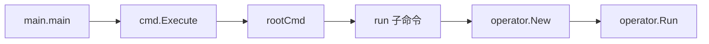
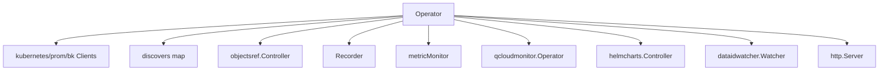
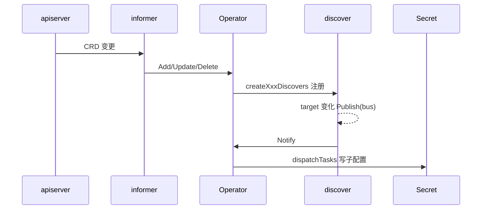

<!-- [待审核] AI 自动生成，请人工确认后移除此标记 -->
# operator 模块概览与架构

<cite>
- [main.go](file://bkmonitor-datalink/pkg/operator/main.go)
- [cmd/root.go](file://bkmonitor-datalink/pkg/operator/cmd/root.go)
- [operator/operator.go](file://bkmonitor-datalink/pkg/operator/operator/operator.go)
</cite>

## 目录
- [模块定位](#模块定位)
- [启动链路](#启动链路)
- [组件地图](#组件地图)
- [核心数据流](#核心数据流)
- [子包一览](#子包一览)
- [在 data-link 中的角色](#在-data-link-中的角色)

## 模块定位

`operator` 是蓝鲸监控的 Kubernetes Operator，负责将集群内的监控 CRD（ServiceMonitor / PodMonitor / PromSD / QCloudMonitor / DataID）与集群资源（Node / Pod / Secret / EndpointSlice）转换为 bkmonitorbeat 的采集子配置（`ChildConfig`），并写入集群内的 **Secret** 作为采集配置下发载体。它基于 prometheus-operator 的 informer + 事件总线 + 自建调度循环实现，而非 controller-runtime 的 Reconcile 风格。

**章节来源**
- [operator/operator.go](file://bkmonitor-datalink/pkg/operator/operator/operator.go#L59-L99)

## 启动链路

程序从 `main()` 调用 `cmd.Execute()` 启动 cobra 命令树；根命令 `rootCmd` 注册 `-c/--config` 全局参数后，由 `run` 子命令拉起 `operator.New` 与 `operator.Run`。

**图表来源**
- [main.go](file://bkmonitor-datalink/pkg/operator/main.go#L19-L23)
- [cmd/root.go](file://bkmonitor-datalink/pkg/operator/cmd/root.go#L23-L34)

**章节来源**
- [main.go](file://bkmonitor-datalink/pkg/operator/main.go#L19-L23)
- [cmd/root.go](file://bkmonitor-datalink/pkg/operator/cmd/root.go#L23-L34)
- [operator/operator.go](file://bkmonitor-datalink/pkg/operator/operator/operator.go#L101-L228)

## 组件地图

`Operator` 主结构持有四类客户端（kubernetes / metadata / prometheus-operator / bk client）、`discovers` 注册表、`objectsref` 控制器、`Recorder`、`metricMonitor`，以及 QCloudMonitor 子 Operator、helmcharts 控制器、dataidwatcher 等协作者。

**图表来源**
- [operator/operator.go](file://bkmonitor-datalink/pkg/operator/operator/operator.go#L59-L99)

**章节来源**
- [operator/operator.go](file://bkmonitor-datalink/pkg/operator/operator/operator.go#L59-L99)

## 核心数据流

`Run` 启动后：informer 监听 CRD 变更 → 事件 handler 构建 discover 并注册到 `discovers` 表 → discover 内部检测到 target 变化后通过事件总线 `bus` 发布通知 → `handleDiscoverNotify` 收敛信号后调用 `dispatchTasks` 汇总子配置并写入 Secret（DaemonSet 按 node、StatefulSet 按 hash 分配）。另有定时 ticker 与 DataID watcher 作为补偿。

**图表来源**
- [operator/operator.go](file://bkmonitor-datalink/pkg/operator/operator/operator.go#L350-L441)

**章节来源**
- [operator/operator.go](file://bkmonitor-datalink/pkg/operator/operator/operator.go#L350-L441)

## 子包一览

| 子包 | 职责 |
|------|------|
| `operator/` | 核心控制器：主循环、监控资源控制器、子配置下发、扩缩容 |
| `apis/` | CRD 类型定义与 Scheme 注册（monitoring/v1beta1、logging/v1alpha1） |
| `client/` | code-generator 生成的 Clientset / typed / informer / lister |
| `common/` | 公共工具：k8s 客户端构造、define、feature、notifier、tasks、action |
| `cmd/` | cobra 命令树（root/run/cluster/shadow） |
| `reloader/` | 基于信号的配置热重载 |
| `configs/` | 全局配置加载 |
| `main.go` | 程序入口 |

**章节来源**
- [operator/operator.go](file://bkmonitor-datalink/pkg/operator/operator/operator.go#L59-L99)

## 在 data-link 中的角色

operator 是采集配置的下发中枢：它把"要采集什么"的声明式 CRD 转换为 bkmonitorbeat（采集器）可读的子配置，并以 Secret 形式下发到对应节点 / Worker Pod。采集器读取这些配置后，把监控数据经 transfer / collector 送入蓝鲸监控主链路。详见后续页面对核心控制器（`04`）、监控资源控制器（`05`）、子配置下发（`04`）的拆解。

**章节来源**
- [operator/operator.go](file://bkmonitor-datalink/pkg/operator/operator/operator.go#L59-L99)
