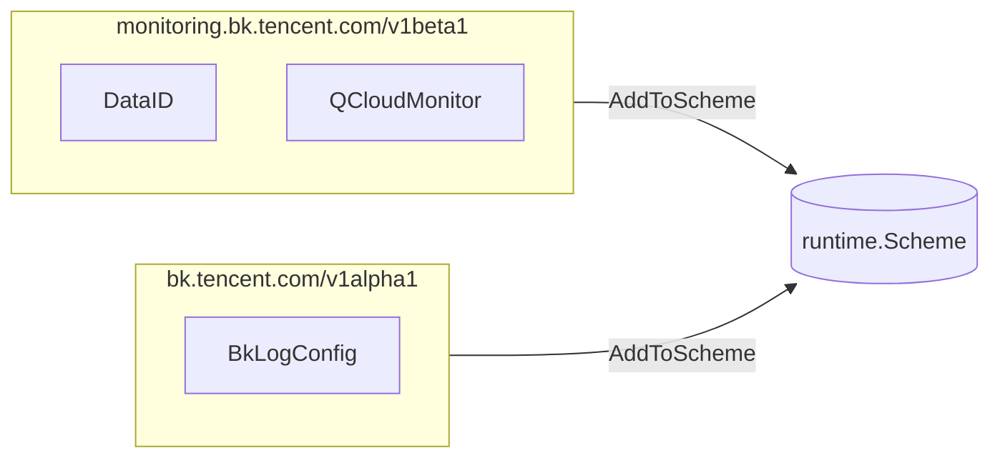

<!-- [待审核] AI 自动生成，请人工确认后移除此标记 -->
# operator CRD 类型定义（apis）

<cite>
- [apis/monitoring/v1beta1/types.go](file://bkmonitor-datalink/pkg/operator/apis/monitoring/v1beta1/types.go)
- [apis/monitoring/v1beta1/register.go](file://bkmonitor-datalink/pkg/operator/apis/monitoring/v1beta1/register.go)
- [apis/logging/v1alpha1/types.go](file://bkmonitor-datalink/pkg/operator/apis/logging/v1alpha1/types.go)
- [apis/logging/v1alpha1/register.go](file://bkmonitor-datalink/pkg/operator/apis/logging/v1alpha1/register.go)
</cite>

## 目录
- [模块定位](#模块定位)
- [两个 API Group 与 Scheme 注册](#两个-api-group-与-scheme-注册)
- [monitoring/v1beta1：DataID 与 QCloudMonitor](#monitoringv1beta1dataid-与-qcloudmonitor)
- [logging/v1alpha1：BkLogConfig](#loggingv1alpha1bklogconfig)
- [CRD 与 operator 的协作](#crd-与-operator-的协作)

## 模块定位

`apis/` 包定义 operator 自定义资源（CRD）的 Go 类型、Group/Version/Kind 与 Scheme 注册，是 `client/`、`operator/`、`reloader/` 共享的数据契约。包含两个 API Group：`monitoring.bk.tencent.com/v1beta1`（监控数据源与云监控）与 `bk.tencent.com/v1alpha1`（日志采集配置）。

**章节来源**
- [apis/monitoring/v1beta1/register.go](file://bkmonitor-datalink/pkg/operator/apis/monitoring/v1beta1/register.go#L18-L41)
- [apis/logging/v1alpha1/register.go](file://bkmonitor-datalink/pkg/operator/apis/logging/v1alpha1/register.go#L18-L39)

## 两个 API Group 与 Scheme 注册

两个 Group 各自通过 `SchemeGroupVersion` 声明组与版本，并通过 `AddToScheme`（`SchemeBuilder.AddToScheme`）将类型注册进运行时 Scheme；`addKnownTypes` 列出该 Group 下所有 Kind。

**图表来源**
- [apis/monitoring/v1beta1/register.go](file://bkmonitor-datalink/pkg/operator/apis/monitoring/v1beta1/register.go#L18-L41)
- [apis/logging/v1alpha1/register.go](file://bkmonitor-datalink/pkg/operator/apis/logging/v1alpha1/register.go#L18-L39)

**章节来源**
- [apis/monitoring/v1beta1/register.go](file://bkmonitor-datalink/pkg/operator/apis/monitoring/v1beta1/register.go#L18-L41)
- [apis/logging/v1alpha1/register.go](file://bkmonitor-datalink/pkg/operator/apis/logging/v1alpha1/register.go#L18-L39)

## monitoring/v1beta1：DataID 与 QCloudMonitor

### DataID

`DataID` 是监控数据源声明，核心字段在 `DataIDSpec`：`DataID`（整数 ID）、`MonitorResource`（关联哪些监控资源）、`Labels`。`MonitorResource` 提供 `MatchSplitNamespace / MatchSplitKind / MatchSplitName` 三个匹配方法，支持以 `|` 分割的多值匹配，供 operator 把 DataID 关联到具体 ServiceMonitor/PodMonitor 等。

### QCloudMonitor

`QCloudMonitor` 是腾讯云监控 exporter 声明（Kind=QCloudMonitor），其 `Spec`（`QCloudMonitorSpec`）包含 `RelabelConfig`、`QCloudMonitorConfig` 等云监控抓取配置。

**章节来源**
- [apis/monitoring/v1beta1/types.go](file://bkmonitor-datalink/pkg/operator/apis/monitoring/v1beta1/types.go#L27-L83)
- [apis/monitoring/v1beta1/types.go](file://bkmonitor-datalink/pkg/operator/apis/monitoring/v1beta1/types.go#L116-L120)

## logging/v1alpha1：BkLogConfig

`BkLogConfig` 是日志采集配置声明（Kind=BkLogConfig），期望状态由 `BkLogConfigSpec` 描述：采集输入（`Input`/`Path`/`Encoding`/`Multiline`）、过滤规则（`Filters`/`Condition`）、命名空间与工作负载选择器（`NamespaceSelector`/`LabelSelector`/`WorkloadType`）、以及渲染进子配置文件的 `ExtOptions`。`BkLogConfigList` 为其列表类型。

**章节来源**
- [apis/logging/v1alpha1/types.go](file://bkmonitor-datalink/pkg/operator/apis/logging/v1alpha1/types.go#L26-L72)
- [apis/logging/v1alpha1/types.go](file://bkmonitor-datalink/pkg/operator/apis/logging/v1alpha1/types.go#L111-L124)

## CRD 与 operator 的协作

operator 控制器通过 `client/` 包的 typed client 读写上述 CRD，并以 `DataID.MonitorResource` 的匹配方法确定"哪个 DataID 服务于哪些监控资源"。`BkLogConfig` 主要服务于日志采集侧（bklogbeat），与监控侧 `DataID` 共同构成蓝鲸监控的 CRD 数据契约。具体控制器逻辑见 `05-监控资源控制器`、`04-核心控制器与子配置下发`。

**章节来源**
- [apis/monitoring/v1beta1/types.go](file://bkmonitor-datalink/pkg/operator/apis/monitoring/v1beta1/types.go#L35-L83)
- [apis/logging/v1alpha1/types.go](file://bkmonitor-datalink/pkg/operator/apis/logging/v1alpha1/types.go#L26-L72)
