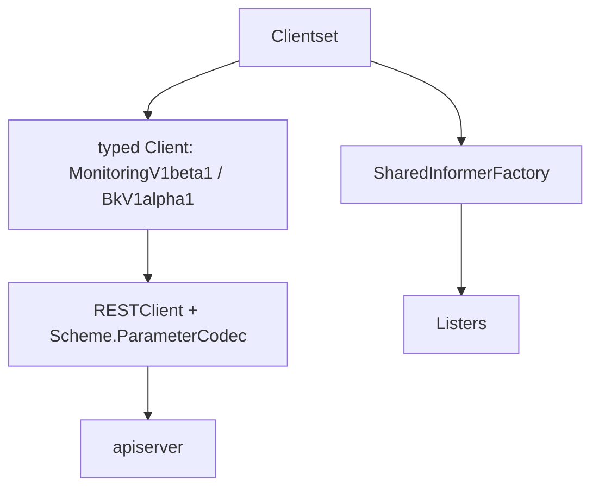

<!-- [待审核] AI 自动生成，请人工确认后移除此标记 -->
# operator Client 与 Informer 封装

<cite>
- [client/clientset/versioned/clientset.go](file://bkmonitor-datalink/pkg/operator/client/clientset/versioned/clientset.go)
- [client/clientset/versioned/scheme/register.go](file://bkmonitor-datalink/pkg/operator/client/clientset/versioned/scheme/register.go)
- [client/clientset/versioned/typed/monitoring/v1beta1/monitoring_client.go](file://bkmonitor-datalink/pkg/operator/client/clientset/versioned/typed/monitoring/v1beta1/monitoring_client.go)
- [client/clientset/versioned/typed/monitoring/v1beta1/dataid.go](file://bkmonitor-datalink/pkg/operator/client/clientset/versioned/typed/monitoring/v1beta1/dataid.go)
- [client/clientset/versioned/typed/logging/v1alpha1/bklogconfig.go](file://bkmonitor-datalink/pkg/operator/client/clientset/versioned/typed/logging/v1alpha1/bklogconfig.go)
- [client/informers/externalversions/factory.go](file://bkmonitor-datalink/pkg/operator/client/informers/externalversions/factory.go)
</cite>

## 目录
- [模块定位](#模块定位)
- [整体分层](#整体分层)
- [Clientset 顶层接口与构造](#clientset-顶层接口与构造)
- [Scheme 注册枢纽](#scheme-注册枢纽)
- [typed REST client](#typed-rest-client)
- [SharedInformerFactory](#sharedinformerfactory)
- [与 operator 的衔接](#与-operator-的衔接)

## 模块定位

`client/` 包是由 `code-generator` 生成的、面向本 operator 自定义资源的 Clientset、typed REST client、informer 与 lister 集合，是控制器与 apiserver 通信、监听 CRD 变更的封装层。本页聚焦其分层结构与关键入口，生成代码遵循 Kubernetes client-go 约定。

**章节来源**
- [client/clientset/versioned/clientset.go](file://bkmonitor-datalink/pkg/operator/client/clientset/versioned/clientset.go#L25-L54)
- [client/clientset/versioned/scheme/register.go](file://bkmonitor-datalink/pkg/operator/client/clientset/versioned/scheme/register.go#L24-L51)

## 整体分层

**图表来源**
- [client/clientset/versioned/clientset.go](file://bkmonitor-datalink/pkg/operator/client/clientset/versioned/clientset.go#L25-L54)
- [client/informers/externalversions/factory.go](file://bkmonitor-datalink/pkg/operator/client/informers/externalversions/factory.go#L32-L89)

**章节来源**
- [client/clientset/versioned/clientset.go](file://bkmonitor-datalink/pkg/operator/client/clientset/versioned/clientset.go#L25-L54)
- [client/informers/externalversions/factory.go](file://bkmonitor-datalink/pkg/operator/client/informers/externalversions/factory.go#L32-L89)

## Clientset 顶层接口与构造

`Interface` 聚合了 `Discovery()`、`BkV1alpha1()`、`MonitoringV1beta1()` 三个子客户端；`Clientset` 结构体持有对应的子客户端与 `DiscoveryClient`。`NewForConfig` / `NewForConfigAndClient` 负责基于 `*rest.Config` 构造共享 transport 的 Clientset（由 `k8sutils.NewBKClient` 在 operator 启动时调用）。

**章节来源**
- [client/clientset/versioned/clientset.go](file://bkmonitor-datalink/pkg/operator/client/clientset/versioned/clientset.go#L25-L36)
- [client/clientset/versioned/clientset.go](file://bkmonitor-datalink/pkg/operator/client/clientset/versioned/clientset.go#L61-L106)

## Scheme 注册枢纽

`scheme/register.go` 是所有 apis 类型的注册枢纽：定义全局 `Scheme` / `Codecs` / `ParameterCodec`，并通过 `localSchemeBuilder`（`bkv1alpha1.AddToScheme` + `monitoringv1beta1.AddToScheme`）把两个 API Group 的类型注入运行时 Scheme；`init()` 中调用 `utilruntime.Must(AddToScheme(Scheme))` 完成注册。typed client 正是通过该 Scheme 进行对象编解码。

**章节来源**
- [client/clientset/versioned/scheme/register.go](file://bkmonitor-datalink/pkg/operator/client/clientset/versioned/scheme/register.go#L24-L51)

## typed REST client

各 Group 的 typed client 提供面向具体 Kind 的 CRUD/Watch 接口，例如：

- `MonitoringV1beta1Interface`（`DataIDsGetter` + `QCloudMonitorsGetter`），由 `NewForConfig` / `NewForConfigAndClient` 构造。
- `DataIDInterface` 定义 `DataID` 资源的 `Create/Update/Delete/Get/List/Watch/Patch` 等动作；`newDataIDs` 内部委托 `gentype.NewClientWithList` 实现。
- `BkLogConfigInterface` 定义 `BkLogConfig` 资源的同类动作（含 `UpdateStatus`），同样通过 `gentype` 实现。

这些接口是 operator 中对 CRD 做读写、以及 informer 做监听的底层通道。

**章节来源**
- [client/clientset/versioned/typed/monitoring/v1beta1/monitoring_client.go](file://bkmonitor-datalink/pkg/operator/client/clientset/versioned/typed/monitoring/v1beta1/monitoring_client.go#L22-L52)
- [client/clientset/versioned/typed/monitoring/v1beta1/dataid.go](file://bkmonitor-datalink/pkg/operator/client/clientset/versioned/typed/monitoring/v1beta1/dataid.go#L32-L61)
- [client/clientset/versioned/typed/logging/v1alpha1/bklogconfig.go](file://bkmonitor-datalink/pkg/operator/client/clientset/versioned/typed/logging/v1alpha1/bklogconfig.go#L32-L63)

## SharedInformerFactory

`externalversions` 包提供 `SharedInformerFactory`，`sharedInformerFactory` 结构体持有 `client`（即上面的 Clientset）、命名空间、resync 周期、transform 与已启动 informer 跟踪。`NewSharedInformerFactory` 为全部命名空间构造工厂。operator 中监控资源的监听（ServiceMonitor/PodMonitor）即基于此工厂封装（`prominfs.NewInformersForResource` 内部使用）。

**章节来源**
- [client/informers/externalversions/factory.go](file://bkmonitor-datalink/pkg/operator/client/informers/externalversions/factory.go#L32-L89)

## 与 operator 的衔接

在 `operator.New` 中，`Operator.bkCli` 字段即为 `bkcli.Interface`（本 Clientset），由 `k8sutils.NewBKClient` 构造；同时 `promCli`（`promcli.Interface`）由 `k8sutils.NewPromClient` 构造，供 prometheus-operator 的 informer 使用。两者配合，使 operator 既能监听本 operator 的 CRD，也能监听 prometheus-operator 的 ServiceMonitor/PodMonitor。

**章节来源**
- [operator/operator.go](file://bkmonitor-datalink/pkg/operator/operator/operator.go#L114-L132)
