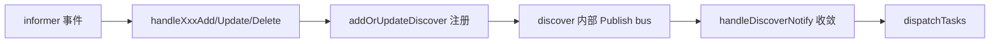
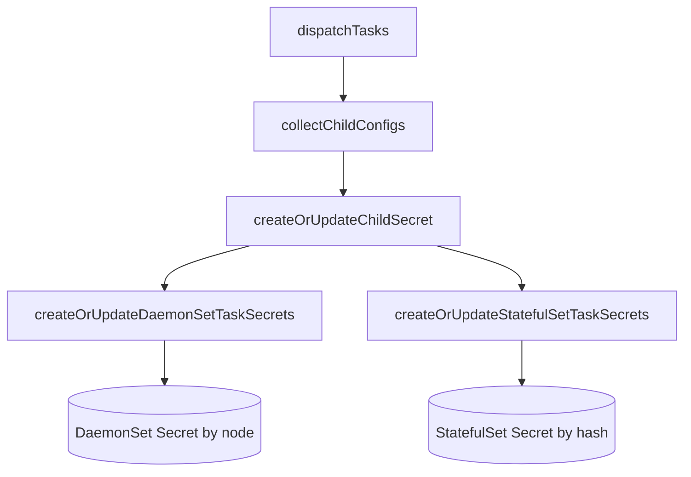

<!-- [待审核] AI 自动生成，请人工确认后移除此标记 -->
# operator 核心控制器与子配置下发

<cite>
- [operator/operator.go](file://bkmonitor-datalink/pkg/operator/operator/operator.go)
- [operator/discover/discover.go](file://bkmonitor-datalink/pkg/operator/operator/discover/discover.go)
- [operator/discover/base.go](file://bkmonitor-datalink/pkg/operator/operator/discover/base.go)
- [operator/secret.go](file://bkmonitor-datalink/pkg/operator/operator/secret.go)
- [operator/objectsref/controller.go](file://bkmonitor-datalink/pkg/operator/operator/objectsref/controller.go)
</cite>

## 目录
- [模块定位](#模块定位)
- [主循环与事件驱动](#主循环与事件驱动)
- [Discover 接口与子配置模型](#discover-接口与子配置模型)
- [子配置下发 dispatch](#子配置下发-dispatch)
- [子资源 Secret 生命周期](#子资源-secret-生命周期)
- [与 objectsref 协作](#与-objectsref-协作)

## 模块定位

本页聚焦 `operator` 包的核心控制器：主循环如何驱动各监控资源的 watch 与调度，监控目标如何被抽象为 `Discover` 接口与 `ChildConfig` 子配置，以及子配置如何经 `dispatchTasks` 写入集群 Secret。这是 operator "把 CRD 变为采集配置"的中枢。

**章节来源**
- [operator/operator.go](file://bkmonitor-datalink/pkg/operator/operator/operator.go#L59-L99)

## 主循环与事件驱动

`Run` 启动后拉起 HTTP 服务、指标上报、dataidwatcher；随后为 ServiceMonitor/PodMonitor 注册 informer 事件 handler 并启动 watch，等待缓存同步后启动 StatefulSet Worker、kubelet、PromSD 等子循环。`go handleDiscoverNotify()` 与 `go handleDataIDNotify()` 订阅 discover 事件总线，作为下发的触发源。

**图表来源**
- [operator/operator.go](file://bkmonitor-datalink/pkg/operator/operator/operator.go#L350-L441)
- [operator/discover/discover.go](file://bkmonitor-datalink/pkg/operator/operator/discover/discover.go#L18-L28)

**章节来源**
- [operator/operator.go](file://bkmonitor-datalink/pkg/operator/operator/operator.go#L350-L441)
- [operator/discover/discover.go](file://bkmonitor-datalink/pkg/operator/operator/discover/discover.go#L18-L28)

## Discover 接口与子配置模型

`Discover` 是监控资源监视器的统一接口：`Name/UK/Type` 标识、`Start/Stop/Reload` 生命周期、`MonitorMeta/DataID` 元数据，以及 `DaemonSetChildConfigs`/`StatefulSetChildConfigs` 导出子配置。`BaseDiscover` 提供通用实现，`CommonOptions` 承载 relabel、节点匹配、DataID 等选项。所有监控资源最终都生成实现该接口的实例。

**章节来源**
- [operator/discover/discover.go](file://bkmonitor-datalink/pkg/operator/operator/discover/discover.go#L32-L68)
- [operator/discover/base.go](file://bkmonitor-datalink/pkg/operator/operator/discover/base.go#L52-L79)
- [operator/discover/base.go](file://bkmonitor-datalink/pkg/operator/operator/discover/base.go#L81-L96)

## 子配置下发 dispatch

`dispatchTasks` 是调度入口（DryRun 模式跳过），它调用 `collectChildConfigs` 遍历 `discovers` 汇总 DaemonSet/StatefulSet 两类子配置，再交给 `createOrUpdateChildSecret` 分发。`createOrUpdateChildSecret` 依据 `EnableDaemonSetWorker` 与 `StatefulSetMatchRules` 决定两类任务如何分配，并调用对应的 Secret 写入与清理逻辑。

**图表来源**
- [operator/secret.go](file://bkmonitor-datalink/pkg/operator/operator/secret.go#L532-L552)
- [operator/secret.go](file://bkmonitor-datalink/pkg/operator/operator/secret.go#L577-L585)

**章节来源**
- [operator/secret.go](file://bkmonitor-datalink/pkg/operator/operator/secret.go#L532-L585)
- [operator/secret.go](file://bkmonitor-datalink/pkg/operator/operator/secret.go#L77-L123)

## 子资源 Secret 生命周期

子配置载体是 **Secret**（gzip 压缩后写入 `Data[fileName]`），标签 `createdBy=bkmonitor-operator` + `taskType`。

- DaemonSet 模式：`createOrUpdateDaemonSetTaskSecrets` 按 **node** 分组写 Secret（`GetDaemonSetTaskSecretName`）；`cleanupDaemonSetChildSecret` 对比当前节点与期望状态做删除。
- StatefulSet 模式：`createOrUpdateStatefulSetTaskSecrets` 按 **hash/roundrobin** 分配到 worker 索引（`GetStatefulSetTaskSecretName`）；支持反亲和规则避让，并触发扩缩容；`cleanupStatefulSetChildSecret` 清理多余 Secret。
- `newSecret` 统一构造带标签的 Secret 对象。

**章节来源**
- [operator/secret.go](file://bkmonitor-datalink/pkg/operator/operator/secret.go#L206-L275)
- [operator/secret.go](file://bkmonitor-datalink/pkg/operator/operator/secret.go#L355-L489)
- [operator/secret.go](file://bkmonitor-datalink/pkg/operator/operator/secret.go#L587-L600)

## 与 objectsref 协作

`objectsref.Controller` 维护集群内 workload / 节点 / Secret 的对象引用（`Object`/`ObjectID`/`OwnerRef`），为 operator 提供 `NodeNames`/`NodeObjs`/`SecretObjs`/`GetPods` 等查询，用于 DaemonSet 按节点分组、StatefulSet 按 Pod 索引分配，以及 Secret 清理时的归属判断。

**章节来源**
- [operator/objectsref/controller.go](file://bkmonitor-datalink/pkg/operator/operator/objectsref/controller.go#L44-L130)
