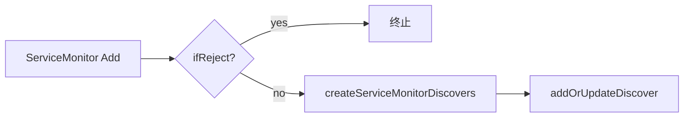

<!-- [待审核] AI 自动生成，请人工确认后移除此标记 -->
# operator 监控资源控制器

<cite>
- [operator/servicemonitor.go](file://bkmonitor-datalink/pkg/operator/operator/servicemonitor.go)
- [operator/podmonitor.go](file://bkmonitor-datalink/pkg/operator/operator/podmonitor.go)
- [operator/promsd.go](file://bkmonitor-datalink/pkg/operator/operator/promsd.go)
- [operator/kubelet.go](file://bkmonitor-datalink/pkg/operator/operator/kubelet.go)
- [operator/dataid_reconcile.go](file://bkmonitor-datalink/pkg/operator/operator/dataid_reconcile.go)
- [operator/objectsref/controller.go](file://bkmonitor-datalink/pkg/operator/operator/objectsref/controller.go)
</cite>

## 目录
- [模块定位](#模块定位)
- [ServiceMonitor 控制器](#servicemonitor-控制器)
- [PodMonitor 控制器](#podmonitor-控制器)
- [PromSD 对账](#promsd-对账)
- [kubelet 端点同步](#kubelet-端点同步)
- [DataID 补偿恢复](#dataid-补偿恢复)

## 模块定位

本页拆解 operator 针对各类监控资源的控制器逻辑：ServiceMonitor / PodMonitor 通过 prometheus-operator informer 监听并构建 discover；PromSD 通过读取 Secret 周期性对账；kubelet 端点由周期任务直接同步；DataID watcher 变更则触发 discover 重新加载（补偿）。

**章节来源**
- [operator/servicemonitor.go](file://bkmonitor-datalink/pkg/operator/operator/servicemonitor.go#L31-L53)

## ServiceMonitor 控制器

informer 事件 handler（`handleServiceMonitorAdd/Update/Delete`）在加锁后做黑名单校验，命中则终止或移除；否则调用 `createServiceMonitorDiscovers` 把每个 Endpoint 构建为 `kubernetesd` discover 并 `addOrUpdateDiscover` 注册。`getServiceMonitorDiscoversName` 按 Endpoint 索引生成 discover 名称。

**图表来源**
- [operator/servicemonitor.go](file://bkmonitor-datalink/pkg/operator/operator/servicemonitor.go#L31-L107)

**章节来源**
- [operator/servicemonitor.go](file://bkmonitor-datalink/pkg/operator/operator/servicemonitor.go#L31-L107)
- [operator/servicemonitor.go](file://bkmonitor-datalink/pkg/operator/operator/servicemonitor.go#L123-L224)

## PodMonitor 控制器

结构与 ServiceMonitor 对称：`handlePodMonitorAdd/Update/Delete` 同样做黑名单校验与 discover 注册/移除。`pickMonitorDataID` 决定每个 PodMonitor 关联的 DataID：优先使用注解中的 `scheduled` DataID，否则按 `MonitorResource` 匹配规则选择系统/常规 DataID；缺失则返回错误使 discover 构建跳过。

**章节来源**
- [operator/podmonitor.go](file://bkmonitor-datalink/pkg/operator/operator/podmonitor.go#L32-L108)
- [operator/podmonitor.go](file://bkmonitor-datalink/pkg/operator/operator/podmonitor.go#L124-L158)
- [operator/podmonitor.go](file://bkmonitor-datalink/pkg/operator/operator/podmonitor.go#L160-L267)

## PromSD 对账

`loopHandlePromSdConfigs` 每分钟（及启动时）调用 `reloadPromScrapeConfigDiscovers`：从配置的 PromSD Secret 读取 scrape 配置（`getPromResourceScrapeConfigs`），由 `reconcilePromScrapeConfigs` 与上一轮对比得到增/删/改集合，再 `createPromScrapeConfigDiscovers` 按 SD 类型（http/polaris/etcd/kubernetes）构建对应 discover 并注册/移除。

**章节来源**
- [operator/promsd.go](file://bkmonitor-datalink/pkg/operator/operator/promsd.go#L41-L79)
- [operator/promsd.go](file://bkmonitor-datalink/pkg/operator/operator/promsd.go#L352-L402)
- [operator/promsd.go](file://bkmonitor-datalink/pkg/operator/operator/promsd.go#L415-L471)
- [operator/promsd.go](file://bkmonitor-datalink/pkg/operator/operator/promsd.go#L489-L504)

## kubelet 端点同步

`reconcileNodeEndpoints` 在后台 goroutine 每 3 分钟（及启动时）调用 `syncNodeEndpoints`：清理弃用 Service，创建/更新 Headless `kubelet` Service（端口 10250/10255/4194），再按 `useEndpointslice` 标志选择创建 **EndpointSlice**（支持超 1000 节点拆分）或传统 **Endpoints**（向后兼容）。这是 kubelet 指标被采集的服务发现基础。

**章节来源**
- [operator/kubelet.go](file://bkmonitor-datalink/pkg/operator/operator/kubelet.go#L118-L140)
- [operator/kubelet.go](file://bkmonitor-datalink/pkg/operator/operator/kubelet.go#L156-L272)

## DataID 补偿恢复

`dataidwatcher` 监听到 DataID 资源变化时，`recoverMonitorDiscovers` 对 informer 全量 List 并通过 `builder` 重建 discover（对应 controller-runtime 的 resync 语义），弥补 informer 事件可能遗漏的场景。各监控资源（ServiceMonitor/PodMonitor/PromSD/DataID 依赖）均有对应的 `recover*Discovers` 实现。

**章节来源**
- [operator/dataid_reconcile.go](file://bkmonitor-datalink/pkg/operator/operator/dataid_reconcile.go#L27-L46)
- [operator/dataid_reconcile.go](file://bkmonitor-datalink/pkg/operator/operator/dataid_reconcile.go#L60-L110)
