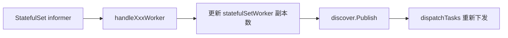
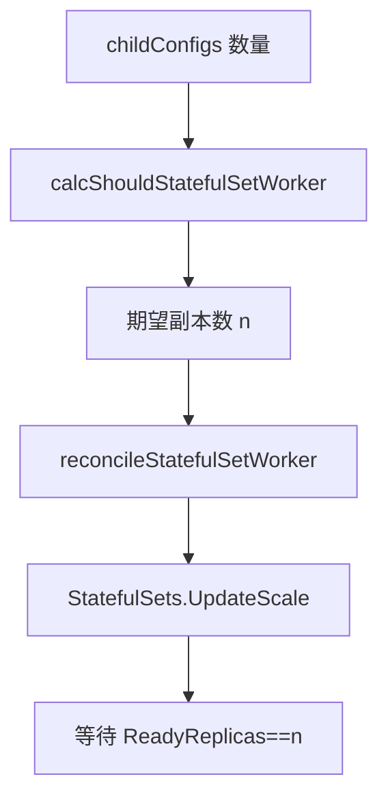

<!-- [待审核] AI 自动生成，请人工确认后移除此标记 -->
# operator StatefulSet Worker 与扩缩容

<cite>
- [operator/statefulset.go](file://bkmonitor-datalink/pkg/operator/operator/statefulset.go)
- [operator/dataid_reconcile.go](file://bkmonitor-datalink/pkg/operator/operator/dataid_reconcile.go)
</cite>

## 目录
- [模块定位](#模块定位)
- [watch StatefulSet Worker](#watch-statefulset-worker)
- [扩缩容算法](#扩缩容算法)
- [DataID 补偿恢复（整体机制）](#dataid-补偿恢复整体机制)

## 模块定位

本页聚焦 StatefulSet Worker 的监听与自动扩缩容：operator 把 external 类型（StatefulSet 模式）采集任务按 hash 分配到 `bkm-statefulset-worker` 各副本，并依据采集任务数量自动调整其副本数，以匹配负载。同时说明 DataID 变更触发的整体补偿恢复机制。

**章节来源**
- [operator/statefulset.go](file://bkmonitor-datalink/pkg/operator/operator/statefulset.go#L31-L37)

## watch StatefulSet Worker

`listWatchStatefulSetWorker` 用 label selector（`app.kubernetes.io/component=bkmonitorbeat-statefulset`）创建 StatefulSet informer 并注册 `handleStatefulSetWorkerAdd/Update/Delete`，更新 `c.statefulSetWorker`（副本数）后调用 `discover.Publish()` 触发重新下发；`listWatchStatefulSetSecrets` 监听 `taskType=statefulset` 的 Secret 变化。`statefulSetWorkerName` 固定为 `bkm-statefulset-worker`。

**图表来源**
- [operator/statefulset.go](file://bkmonitor-datalink/pkg/operator/operator/statefulset.go#L39-L69)
- [operator/statefulset.go](file://bkmonitor-datalink/pkg/operator/operator/statefulset.go#L71-L117)

**章节来源**
- [operator/statefulset.go](file://bkmonitor-datalink/pkg/operator/operator/statefulset.go#L39-L117)
- [operator/statefulset.go](file://bkmonitor-datalink/pkg/operator/operator/statefulset.go#L119-L173)

## 扩缩容算法

`createOrUpdateStatefulSetTaskSecrets` 在写 Secret 前调用 `reconcileStatefulSetWorker(len(childConfigs))`：`calcShouldStatefulSetWorker` 依据 HPA 开关、`StatefulSetReplicas`(最小)、`StatefulSetMaxReplicas`(最大)、`StatefulSetWorkerFactor`(每 worker 任务数) 计算期望副本数（任务数/因子，四舍五入，受上下限约束）。`reconcileStatefulSetWorker` 限流（2 分钟内最多 1 次）后通过 `UpdateScale` 调整 `bkm-statefulset-worker` 副本，并尽力等待扩容完成再继续调度。

**图表来源**
- [operator/statefulset.go](file://bkmonitor-datalink/pkg/operator/operator/statefulset.go#L179-L237)
- [operator/statefulset.go](file://bkmonitor-datalink/pkg/operator/operator/statefulset.go#L245-L279)

**章节来源**
- [operator/statefulset.go](file://bkmonitor-datalink/pkg/operator/operator/statefulset.go#L179-L279)

## DataID 补偿恢复（整体机制）

`dataidwatcher` 监听 DataID 资源；变更时 `recoverMonitorDiscovers` 对各类监控资源的 informer 全量 List 并重建 discover（`recoverServiceMonitorDiscovers`/`recoverPodMonitorDiscovers` 等），对应 controller-runtime 的 resync 补偿语义，确保事件遗漏时采集配置仍最终一致。

**章节来源**
- [operator/dataid_reconcile.go](file://bkmonitor-datalink/pkg/operator/operator/dataid_reconcile.go#L27-L46)
- [operator/dataid_reconcile.go](file://bkmonitor-datalink/pkg/operator/operator/dataid_reconcile.go#L60-L110)
